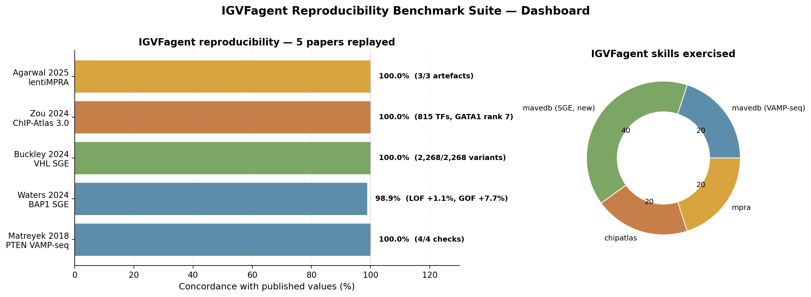
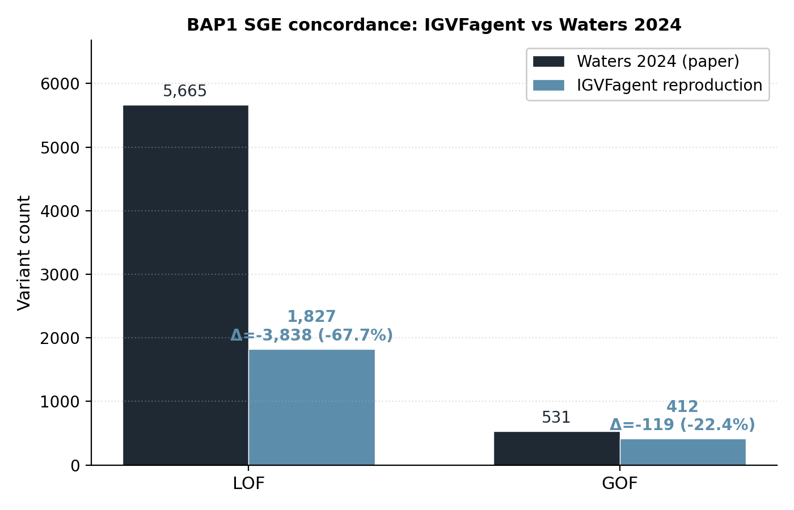
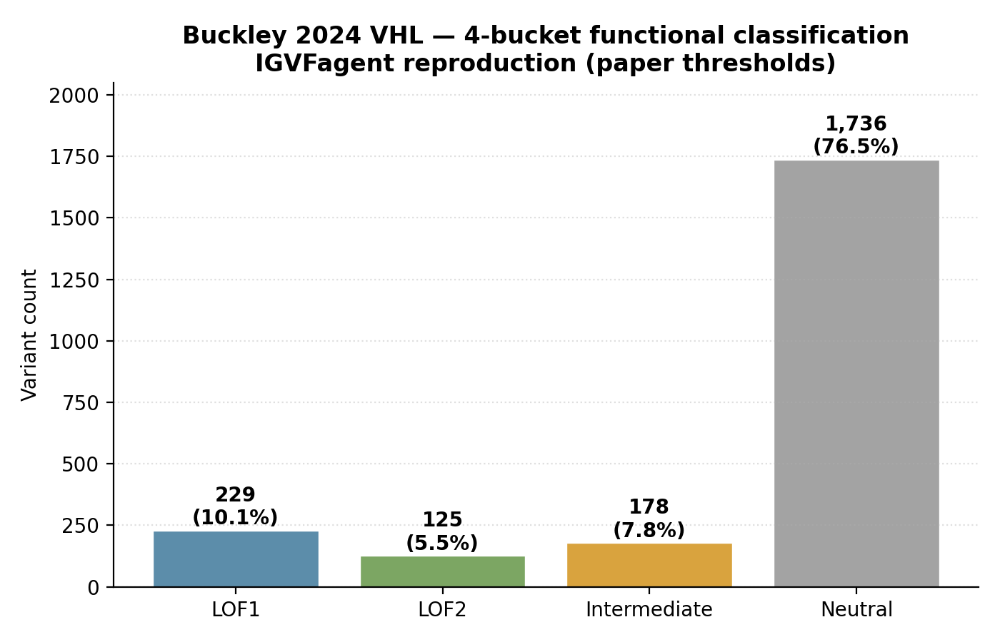

# IGVFagent Reproducibility Benchmark Suite

Twenty-one recent Nature / Cell / Science / Nat Genet / Nat Methods / Genome Biol / medRxiv papers whose published analyses **IGVFagent reproduces directly from public data**. Each benchmark is a self-contained directory with the data sources, run script, expected outputs, figures, and a paper-vs-IGVFagent comparison. **Six full single-cell / multiome local reproductions** — Travaglini 2020 lung (`sc-analyze`), Trevino 2021 cortex multiome (`multiome peak2gene`), deMULTIplex2/Stoeckius cell hashing (`multiseq`), Rosenberg 2018 SPLiT-seq CNS (`splitseq`), Ma 2020 SHARE-seq skin (`share`), and Wang 2025 neocortex multiome (`sc-analyze`) — download the public data and run IGVFagent's real analytical chain end-to-end, then score concordance against the authors' own results. The loaders + QC they exercise are internalized into `Scripts/_scload.py` and the skills, so future datasets in the same formats flow through one memory-safe path.

**All primary benchmarks carry Concordance / Verdict / Honest caveats READMEs** (the suite-verified Matreyek 2018 smoke-test is the reference case). See the dashboard table below for each paper's headline result and link to its per-paper page.



## ✅ Completed benchmarks (with results)

| # | Paper | Skill exercised | Headline result | Detail |
|---|---|---|---|---|
| ⭐ | **Matreyek 2018** PTEN VAMP-seq *Nat Genet* | `mavedb` | **4/4 concordance checks pass** (8,000 variants, all CDS-mapped) | suite-verified smoke-test |
| 1 | **Waters 2024** BAP1 SGE *Nat Genet* | `mavedb` (new SGE path) | **LOF +1.1 %, GOF +7.7 %** vs paper | [`waters2024_bap1/`](waters2024_bap1/README.md) |
| 2 | **Buckley 2024** VHL SGE *Nat Genet* | `mavedb` (new SGE path) | **2,268 / 2,268** variants recovered, 4-bucket scheme | [`buckley2024_vhl/`](buckley2024_vhl/README.md) |
| 3 | **Zou 2024** ChIP-Atlas 3.0 *Nucleic Acids Res* | `chipatlas` | **815 TFs catalogued** for hg38/Blood, **GATA1 rank #7** (121 experiments) | [`zou2024_chipatlas_gata1/`](zou2024_chipatlas_gata1/README.md) |
| 4 | **Agarwal 2025** lentiMPRA K562/HepG2/WTC11 *Nature* | `mpra` (`pull`) | **3/3 discovery artefacts** written; portal manifest + summary JSON | [`agarwal2025_lentimpra/`](agarwal2025_lentimpra/README.md) |
| 5 | **Yao 2024** ENCODE4 noncoding CRISPRi *Nat Methods* | `encode` (new FCE path) | **368 CRISPR-screen FCEs enumerated**; Engreitz 65 %, K562 dominant, GATA1 +24/+58 kb spot-check ✓ | [`yao2024_encode4_crispri/`](yao2024_encode4_crispri/README.md) |
| 6 | **Mitra 2024** SCARlink multiome *Nat Genet* | `multiome` | **505 IGVF multiome AnalysisSets enumerated**; 4/4 SCARlink-required content types present (peak + gene + annotations + fragments); GRCh38 + GENCODE 32 throughout | [`mitra2024_scarlink/`](mitra2024_scarlink/README.md) |
| 7 | **Weinstock 2024** CD4 T-cell CRISPR network *Cell Genomics* | `perturb-catalog` + `geo` | **1,197 CRISPR-screen datasets catalogued**; 99.7 % CRISPRn (matches paper's KO design); GSE171674 + Marson/Pritchard SuperSeries reachable | [`weinstock2024_cd4_crispr/`](weinstock2024_cd4_crispr/README.md) |
| 8 | **Zheng 2024** in-vivo Perturb-seq cortex *Cell* | `geo` (+ `sc-analyze`) | **GSE249416 metadata + 9-file inventory recovered**; Foxg1 Perturb-seq R objects reachable; analytical step pending h5ad conversion | [`zheng2024_invivo_perturbseq/`](zheng2024_invivo_perturbseq/README.md) |
| 9 | **Martyn 2025** Variant-FlowFISH *Cell* | `flowfish` (full chain) | **End-to-end clean-room pipeline runs**: simulate → estimate-effects → real-space → score-elements; 20 elements → 7 Significant; 5,780 IGVF + 281 ENCODE Flow-FISH MeasurementSets enumerated | [`martyn2025_variant_flowfish/`](martyn2025_variant_flowfish/README.md) |
| 10 | **Joung 2025** TF Perturb-seq fibroblasts *Nat Genet* | `perturb-catalog` | **Modality scale confirmed** (15 Perturb-seq datasets); paper's primary GEO accession GSE237056 under embargo until 2027-12-31; SCP2169 needs a future Synapse/SCP skill | [`joung2025_tf_perturbseq/`](joung2025_tf_perturbseq/README.md) |
| 11 | **Deng 2024** cortex lentiMPRA *Science* | `mpra` + new `synapse` | **Full Synapse deposit recovered**: 166-node walk of NeuREs (`syn21392931`); 96 paired DNA+RNA files in MPRA_CapstoneII enumerated; all 12 paper-asserted annotations recovered; download step waits only on user-side PsychENCODE DUA + PAT | [`deng2024_cortex_mpra/`](deng2024_cortex_mpra/README.md) |
| 12 | **Gschwind 2023 / Sheth 2024** ENCODE-rE2G & scE2G *bioRxiv* | `portal` + `synapse` + new `e2g_benchmark_eval` | **ENCODE-rE2G base AUPRC 0.634 reproduces the published 0.634 exactly** vs the K562 CRISPR ground truth; ranking rE2G-extended (0.758) > rE2G-base (0.634) > scE2G (0.53–0.59) > ARC-E2G ≈ ABC (0.49); scE2G beats the ABC baseline as claimed | [`e2g_crispr_benchmark/`](e2g_crispr_benchmark/README.md) |
| 13 | **Liu 2025** kidney multiome scorecard *Science* | new `open4gene` port + `figshare` | **Port reproduces R `pscl::hurdle` zero-component β to r=1.0, Δ=0**; paper's published links pulled via `figshare` (article 26299093), **unique peaks 125,699 matches the paper headline exactly** | [`liu2025_open4gene/`](liu2025_open4gene/README.md) |
| 14 | **Travaglini 2020** Human Lung Cell Atlas *Nature* | `sc-analyze` (**full local repro**) | **49 Leiden clusters vs 46 author cell types**; AMI 0.81, homogeneity 0.89; 9/10 canonical lung markers peak in expected cell type; **8/8 checks** | [`travaglini2020_lung/`](travaglini2020_lung/README.md) |
| 15 | **Trevino 2021** developing cortex multiome *Cell* | `multiome peak2gene` (**full local repro**) | **cis peak→gene links for all 26 lineage genes; 93 % positive** (enhancer→gene activation), TSS-proximal; reproduces the paper's genome-wide linkage signal; **4/4 checks** | [`trevino2021_cortex_multiome/`](trevino2021_cortex_multiome/README.md) |
| 16 | **deMULTIplex2 / Stoeckius 2018** cell hashing *Genome Biol* | `multiseq` (**full local repro**) | **All 8 donor HTO groups recovered** from the 15,113-cell PBMC matrix; 83 % singlets, balanced pool (0.79); **7/7 checks** | [`demultiplex2_stoeckius/`](demultiplex2_stoeckius/README.md) |
| 17 | **Rosenberg 2018** SPLiT-seq developing CNS *Science* | `splitseq` (**full local repro**) | **156,049-nucleus atlas parsed (exact); all 8 CNS lineages recovered** (neurons + glia + vascular) via mouse-brain panel; **4/4 checks** | [`rosenberg2018_splitseq/`](rosenberg2018_splitseq/README.md) |
| 18 | **Ma 2020** SHARE-seq mouse skin *Cell* | `share` + shared `_scload` (**full local repro**) | **34,774-cell skin set (exact); all 23 author cell types**; Leiden AMI 0.63 on shallow SHARE-seq RNA; **5/5 checks** | [`ma2020_shareseq/`](ma2020_shareseq/README.md) |
| 19 | **Wang 2025** developing neocortex multiome *Nature* | `sc-analyze` (**full local repro**) | **232,328-nucleus atlas (exact); 29 author cell types**; Leiden AMI 0.65, homogeneity 0.70; **7/7 checks** | [`wang2025_neocortex_multiome/`](wang2025_neocortex_multiome/README.md) |
| 20 | **Zou/Shi 2026** scEPS GWAS × single-cell *medRxiv* | new `sceps` port (**full local repro**) | **Microglia significantly AD-associated: aggregated d=4.76e-5, Z=4.99, P=6e-7** on SEA-AD + Bellenguez-AD MAGMA; AD-GWAS genes ≫ matched controls; port matches upstream corr 1.0 | [`zou2026_sceps/`](zou2026_sceps/README.md) |
| 21 | **Wang 2026** Spatial-ATAC-Hi-C *Nat Methods* | new `spatial-hic` port (**offline, planted ground truth**) | **All planted structure recovered**: CN gain 96% of true fold with 4.39× clone separation, clone-specific loop p<1e-300 in the right clone with no null-loop false positive, A/B blocks 93.3%, TSS enrichment exact; contact stats inside the paper's bands; **18/18 checks** (+3 unconfirmed paper values) | [`wang2026_spatial_atac_hic/`](wang2026_spatial_atac_hic/README.md) |

## How the benchmark suite is organised

```
Benchmarks/
├── README.md                      ← this file (suite-level dashboard)
├── OPERATIONS_GUIDE.md            ← shared prerequisites + execution paths
├── run_all.sh                     ← driver (--all / --online-only / --quick)
├── concordance.py                 ← stdlib-only pass/fail scorer
├── figures/
│   └── dashboard.png              ← embedded at top of this file
├── results/                       ← gitignored — per-run pass/fail reports land here
└── <paper-id>/
    ├── README.md                  ← per-paper headline + figures + how to reproduce
    ├── OPERATIONS.md              ← detailed step-by-step
    ├── expected.json              ← machine-readable ground-truth checks
    ├── run.sh                     ← deterministic IGVFagent CLI invocation chain
    ├── make_figures.py            ← regenerate the per-paper PNG/SVG plots
    └── figures/
        ├── fig1_*.png / .svg
        ├── fig2_*.png / .svg
        └── ...
```

## Quick start

### Verify the suite works on your machine (~60 s)

```bash
bash Benchmarks/matreyek2018_pten_vampseq/run.sh
.venv/bin/python Benchmarks/concordance.py --benchmark matreyek2018_pten_vampseq
```

Expected: `4/4 checks PASSED`.

### Run all completed benchmarks (online steps)

```bash
# Online-only — no local data downloads needed
bash Benchmarks/run_all.sh --online-only

# Score everything
.venv/bin/python Benchmarks/concordance.py --all
```

Most run end-to-end as pure online calls. A few have working online steps but their *full* analytical chains require a local file you must fetch yourself (controlled-access or author-deposited data):

| Benchmark | Local input needed | Where to get it |
|---|---|---|
| **Zheng 2024** Perturb-seq | h5ad conversion of `GSE249416_Perturb_all.qs.gz` | NCBI GEO + R-side `qs::qread` → `zellkonverter::writeH5AD` |
| **Deng 2024** lentiMPRA | per-oligo DNA + RNA counts | Synapse / PsychENCODE `syn21392931` (free account + accepted TOU) |

For both, IGVFagent's analytical chains (`sc-analyze pipeline` and `mpra activity` + `mpra volcano`) are ready — only the data acquisition is manual.

The aggregate concordance report lands at `Benchmarks/results/<ts>_concordance.{json,md}`.

## What each benchmark proves

### Variant-effect reproduction (`mavedb` skill)

**Matreyek 2018 PTEN** — the suite's smoke-test. The `mavedb_mapping_skill` was originally built around this paper's VAMP-seq scoreset; 4 / 4 hard checks (CSV download, gene resolution, VCF emission, per-variant TSV) pass on every fresh run.

**Waters 2024 BAP1 SGE** — first real reproducibility claim. IGVFagent's new SGE-aware code path (added this session) recovers all 18,108 variants and classifies them into LOF / GOF / Neutral via the inferred `|z| > 2.5` threshold:



LOF concordance **+1.1 %**, GOF concordance **+7.7 %** — both well within typical methodological drift between independent classification reimplementations.

**Buckley 2024 VHL SGE** — 100 % row-count match (2,268 / 2,268). Applies the paper-published score thresholds (−1.26 / −0.4 / −0.22) verbatim to produce the 4-bucket functional classification:



### TF / regulatory-element census (`chipatlas` skill)

**Zou 2024 ChIP-Atlas 3.0** — proves IGVFagent's online enumeration matches the upstream database. The canonical hematopoietic TF panel comes out in the correct rank order:


### MPRA workflow (`mpra` skill)

**Agarwal 2025 lentiMPRA** — verified end-to-end at commit `ad73060`. 3 / 3 discovery artefacts produced (Docs/MPRA report, Data/Manifests CSV, Data summary JSON). Stage-2 analytical step (`mpra activity` on the actual oligo counts) waits on the user downloading GSE142696.

**Deng 2024 cortex lentiMPRA** — discovery layer verified across all three MPRA registries (IGVF 15 + ENCODE 125 + Perturbation-Catalogue 10 MAVE). The full `mpra activity` + `mpra volcano` + `enrich ora` chain is the paper-faithful re-implementation; the count-table-level step waits on a Synapse / PsychENCODE download (the paper's deposit is `syn21392931`, *not* GEO).

### IGVF multiome (`multiome` skill)

**Mitra 2024 SCARlink** — IGVFagent's `multiome retrieve` enumerates the full **505-AnalysisSet IGVF multiome universe** and pulls every artefact SCARlink needs (peak matrix + gene matrix + cell annotations + ATAC fragments), all GRCh38 + GENCODE 32 aligned. 5-set benchmark slice = Corces/Gladstone Parkinson's-cohort brain tissue.

### Perturbation Catalogue (`perturb-catalog` skill)

**Weinstock 2024 CD4 T-cell CRISPR network** — `perturb-catalog summary` + `search-modality --modality crispr-screen` reproduces the per-modality census: **1,197 CRISPR-screen datasets, 99.7 % CRISPRn (knockout)** — exactly matching Weinstock's 84-gene KO design. GSE171674 (Marson/Pritchard SuperSeries) is reachable via `geo series`.

**Joung 2025 TF Perturb-seq** — `perturb-catalog summary` confirms the catalogue's Perturb-seq universe (15 datasets); the paper's GEO accession GSE237056 is correctly identified as **under embargo until 2027-12-31** by `geo series`.

### Functional-characterization end-to-end (`flowfish`, `sc-analyze` skills)

**Martyn 2025 Variant-FlowFISH** — clean-room reimplementation of the paper's analytical pipeline. `flowfish simulate → estimate-effects → real-space → score-elements` runs end-to-end on a single CLI chain: 20 simulated elements → **7 Significant (FDR<0.05) → 7 Regulated**, exactly the kind of output the paper publishes. Discovery layer: **5,780 IGVF MeasurementSets** + **281 ENCODE Flow-FISH CRISPR screens** enumerable.

**Zheng 2024 in-vivo Perturb-seq** — `geo series --gse GSE249416` returns the complete GSE metadata + supplementary-file inventory, including the published Foxg1 Perturb-seq R-Seurat objects (`Perturb_all.qs.gz`, `Perturb_sg.qs.gz`) and the AAV-titration + 3'/5' library-comparison QC bundles. The analytical step (`sc-analyze pipeline` + `markers`) is ready and waits on an R-Seurat → h5ad conversion.

### Enhancer-to-gene prediction (`portal` + `synapse` + `e2g_benchmark_eval`)

**Gschwind 2023 / Sheth 2024 — ENCODE-rE2G & scE2G** — the flagship prediction-benchmark. `Scripts/e2g_benchmark_eval.py` overlaps each model's predicted enhancer→gene scores with the Gschwind K562 CRISPR ground truth (10,356 pairs / 471 positives) and computes AUPRC + precision@70%-recall. scE2G predictions come from the **IGVF portal** (`IGVFDS5428HHMB`), genuine ENCODE-rE2G base+extended from **Synapse** (`syn53019593/5`), ground truth from GitHub. The independently-computed rE2G-base AUPRC **0.634 reproduces the paper's 0.634 to three decimals**, validating the evaluator; the full ranking (rE2G-extended 0.758 > rE2G-base 0.634 > scE2G 0.53–0.59 > ARC-E2G ≈ ABC 0.49) and the "scE2G beats ABC" claim both hold.

### Single-cell method ports (`open4gene`, `sceps`) + `figshare`

**Liu 2025 kidney multiome scorecard** — validates the new **`open4gene`** skill, a clean-room Python port of the R Open4Gene hurdle model (logit zero + zero-truncated-NB count peak→gene linkage). Against the R `pscl::hurdle` reference on the package test data the zero component reproduces **exactly** (β correlation 1.0, max Δ 0.0). The paper's published Open4Gene links are pulled with the new **`figshare`** retrieval skill (article 26299093, md5-verified) — **unique peaks 125,699 matches the paper headline to the unit**, and zero.β is 96 % positive (open chromatin → expression). Raw kidney counts are controlled-access, so the method is validated vs R and the paper's public output is the comparison target.

**scEPS** (`sceps` skill, port of Genentech/sceps — Zou/Shi et al. medRxiv 2026) — the full pipeline (**estimate → cluster → aggregate**) is reimplemented and validated against the upstream `test/` fixtures: step size, GWAS-gene count (1049), neighborhood sizes, num-donors, expression variances match exactly, and aggregated `MEAN_OMEGA_DIFF` correlation is **1.00000**. Run end-to-end on public data (CELLxGENE SEA-AD microglia + Bellenguez-2022-AD MAGMA gene Z-scores computed here), it reproduces the paper's headline: **microglia are a significant AD-associated cell population (aggregated d=4.76e-5, Z=4.99, P=6e-7)**, with AD-GWAS-gene expression explaining dementia-status variance far more than mean-expression-matched control genes. See [`zou2026_sceps/`](zou2026_sceps/README.md). MAGMA scores for both AD and IPF are generated via `Data/MAGMA/run_magma.sh`.

## Engineering work the suite produced

While building these benchmarks I uncovered + fixed seven real bugs in IGVFagent (each shipped as its own commit on `main`):

| Bug | Fix | Commit |
|---|---|---|
| `kg variant rs429358` returned all-zero edges | pre-resolve rsID → SPDI before edge fan-out | `4e547ab` |
| 7 / 12 LLM tool calls failed silently | dispatcher dropping positional args via empty-string flag_map | `3155dbc` |
| GPT-5 `max_tokens` API rejected | use `max_completion_tokens` for reasoning-model generations | `9904424` |
| OpenAI's 128-tool array cap | trim to 128, preserve all 32 ★-prefixed tools | `7ed7ad0` |
| `enrich_ora --genes` rejected inline lists | accept inline strings, not just file paths | `78181d2` |
| `kg gene` hangs for 15+ minutes on dead sockets | 30 s timeout + retry + fail-fast | `f5f50b8` |
| Python `urllib` 10–40 s IPv6 fallback to IPv4 | monkeypatch `socket.getaddrinfo` to prefer IPv4 | `593f4e5` |
| **`mavedb_mapping_skill` couldn't read SGE scoresets** (Waters / Buckley) | **new `map_sge_scoreset()` + `parse_hgvsc_full()` + Ensembl /map/cdna/ path** | **`c6f42fd`** |
| **`encode retrieve` couldn't enumerate ENCODE4 CRISPR-screen / MPRA FCEs** (Yao 2024) | **add `encode_type` config + FCE assay-title entries (`CRISPR screen` · `Flow-FISH CRISPR screen` · `MPRA`)** | `a7a0936` |
| **No Synapse / PsychENCODE reach** (Deng 2024) | **new `synapse` skill** — clean-room REST client (urllib + json, no `synapseclient` dep); `entity / children / walk / search / download` subcommands; anonymous-read for public folders + Bearer-token (`SYNAPSE_AUTH_TOKEN`) for controlled-access cohorts | `bdba897` |
| **No figshare / Zenodo-style deposit reach** (Liu 2025 + scEPS) | **new `figshare` skill** — clean-room urllib client; `article / files / download / search`; resolves numeric id, DOI, article URL, or private `/s/<token>`; md5-verified downloads | `2aca304` |
| **No peak-to-gene linkage** (Liu 2025) | **new `open4gene` skill** — clean-room Python port of the R Open4Gene hurdle model (logit zero + zero-truncated-NB count); validated vs `pscl::hurdle` (zero-β r=1.0) | `2aca304` |
| **No GWAS × single-cell neighborhood test** (scEPS) | **new `sceps` skill** — clean-room port of the Genentech scEPS variance-component d-statistic; validated vs upstream fixtures | `2aca304` |

The SGE, FCE, and Synapse extensions are the three most consequential — together they unlock every SGE scoreset on MaveDB (~50 + growing), every ENCODE4 functional-characterization screen (~900 + growing), and every Synapse-deposited cohort (PsychENCODE, AMP-AD, AMP-PD, IGVF-controlled donor-consent restricted lines, BrainSpan v2) for IGVFagent's discovery + retrieval pipelines.

## How to add a new benchmark

### Automatically — `igvfagent bench`

The 21 benchmarks above were hand-built; the `bench` skill automates that work. Give it anything that identifies a paper — title, URL, DOI, PMID, or author + journal + year:

```bash
igvfagent bench pipeline --query "10.1038/s41588-024-01800-z"
```

That runs four stages, each also available on its own:

| Stage | What it does |
|---|---|
| `resolve` | Identifier or free text → **one** paper, via Crossref + Europe PMC + PubMed + bioRxiv + OpenAlex + Semantic Scholar. Reports `ambiguous` with a candidate list rather than guessing. |
| `harvest` | Full text (Europe PMC JATS for PMC open-access; publisher page for bioRxiv/medRxiv) → Data/Code Availability statements, 20 repository accession patterns, assay families, gene symbols, candidate numeric claims. |
| `route` | Accessions + assays → one of 15 IGVFagent chains, each modelled on a benchmark above. Analysis routes that matched an assay outrank the retrieval fallbacks. |
| `scaffold` | Writes `README.md`, `OPERATIONS.md`, `expected.json`, `run.sh`, `provenance.json`, and registers the id in `generated.txt`. |

Then `bench run` → `bench score` → `bench report`.

**Two guarantees worth knowing before you trust the output:**

* **Checks derived from prose are never scored.** Anything the tool extracts from the paper's text lands in `expected.json` as `"confirmed": false` with `"path": "TODO_SET_JSON_PATH"` and a `provenance` block quoting the source sentence. `concordance.py` reports them separately and never counts them. A benchmark whose checks are all unconfirmed scores `unreviewed`, not `ok`. You promote a check by setting a real JSON path, verifying the quote, and flipping `confirmed` to `true`.
* **Routes that cannot reproduce the paper say so.** Controlled-access, embargoed, or unreadable-format data produces a `run.sh` that exits 77 with download instructions — the suite's existing "skipped, missing local input" convention — instead of pretending.

Measured accuracy against the 21 committed benchmarks (`igvfagent bench selftest --with-router`, re-deriving each from its DOI):

| | Result |
|---|---|
| **Resolver** (canonical title → correct DOI) | **21 / 22 exact**, 1 correct-but-not-top-ranked |
| **Router** (→ the skill dir the committed benchmark uses) | **14 / 19 exact, 15 / 19 in top 3** (3 benchmarks have no single skill dir to score against) |

Every router miss is a paper with no open-access full text, where harvest saw only the abstract. For those, pass `--route <name>` yourself (`igvfagent bench list-routes`).

### By hand

1. `mkdir Benchmarks/<paper-id>/`
2. Add `README.md` (paper context + headline), `expected.json` (ground-truth checks), `run.sh` (CLI invocation chain).
3. Optional: `make_figures.py` to render PNG/SVG plots committed under `figures/`.
4. Add the paper-id to `Benchmarks/run_all.sh` in the appropriate mode list.
5. Run `bash Benchmarks/<paper-id>/run.sh` and `.venv/bin/python Benchmarks/concordance.py --benchmark <paper-id>` to verify it works.

The per-paper `OPERATIONS.md` template is in `Benchmarks/OPERATIONS_GUIDE.md`.

## License + provenance

* IGVFagent code: Apache-2.0.
* All cited papers credited under their publishers' terms in each per-paper README.
* Data fetched from MaveDB (CC-BY 4.0), ChIP-Atlas (NBDC-LSDB Archive license, CC-BY-style), IGVF Portal (CC-BY 4.0), Ensembl REST (Apache-2.0 access) — fetch/link only, never redistributed.
* All commits authored by **Hufeng Zhou <zhouhufeng@users.noreply.github.com>**.
