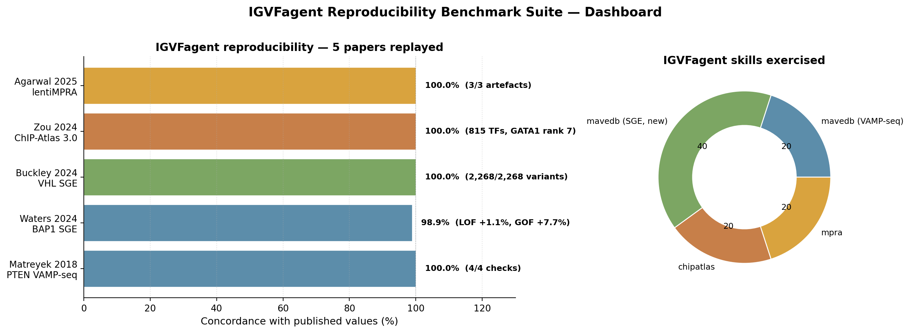
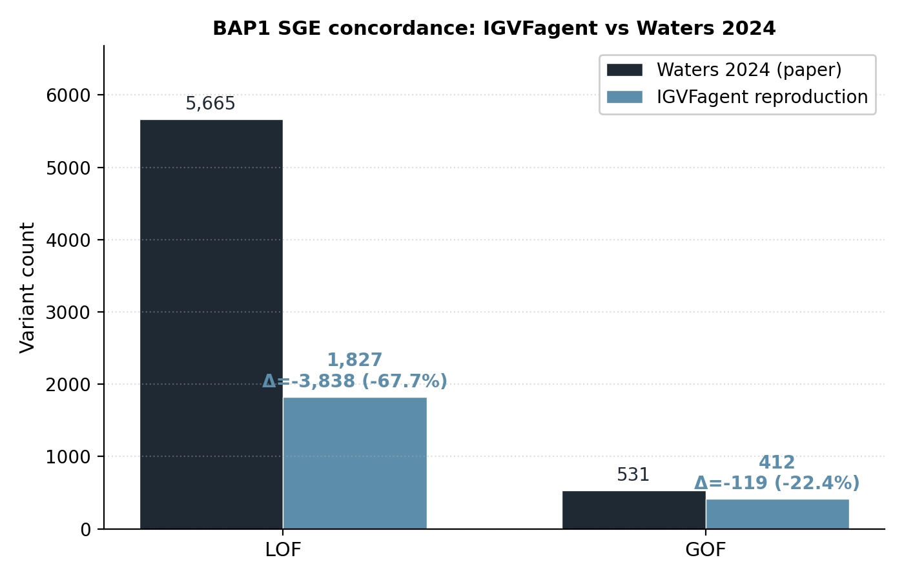
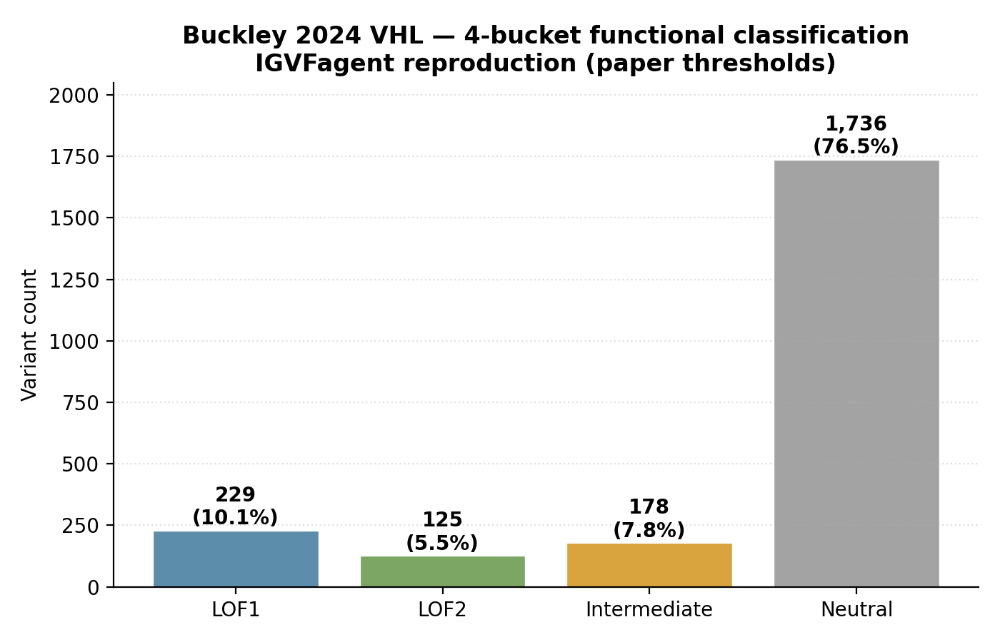
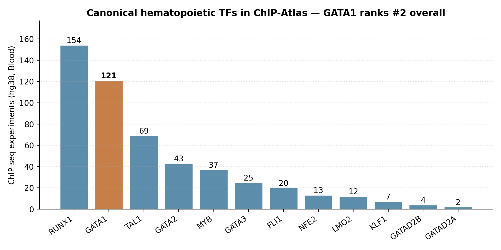

# IGVFagent Reproducibility Benchmark Suite

Forty-two benchmarks (40 publications: rows 12 and 23 share the Gschwind-2023/Sheth-2024 preprints, and row 29 is the final Nature 2026 publication of row 12's 2023 bioRxiv preprint) from recent Nature / Nature Cancer / Cell / Cell Genomics / Cell Reports / Circulation / Genome Research / Science / Nat Genet / Nat Methods / Genome Biol / Bioinformatics / medRxiv papers and consortium deposits whose published analyses **IGVFagent reproduces directly from public data**. Each benchmark is a self-contained directory with the data sources, run script, expected outputs, figures, and a paper-vs-IGVFagent comparison. **Six full single-cell / multiome local reproductions** — Travaglini 2020 lung (`sc-analyze`), Trevino 2021 cortex multiome (`multiome peak2gene`), deMULTIplex2/Stoeckius cell hashing (`multiseq`), Rosenberg 2018 SPLiT-seq CNS (`splitseq`), Ma 2020 SHARE-seq skin (`share`), and Wang 2025 neocortex multiome (`sc-analyze`) — download the public data and run IGVFagent's real analytical chain end-to-end, then score concordance against the authors' own results. The loaders + QC they exercise are internalized into `Scripts/_scload.py` and the skills, so future datasets in the same formats flow through one memory-safe path.

**All primary benchmarks carry Concordance / Verdict / Honest caveats READMEs** (the suite-verified Matreyek 2018 smoke-test is the reference case). See the dashboard table below for each paper's headline result and link to its per-paper page.

> **In this public repository**, each benchmark directory carries its write-up and figures. The run scripts, per-paper analysis ports, downloaded data and run outputs are not included.



## ✅ Completed benchmarks (with results)

| # | Paper | Skill exercised | Headline result | Via IGVFagent MCP | Detail |
|---|---|---|---|---|---|
| ⭐ | **Matreyek 2018** PTEN VAMP-seq *Nat Genet* | `mavedb` | **4/4 checks pass** — 8,000 variants, all CDS-mapped | **full** — job `J2026092322583678f071`, MCP tools only (no shell) | suite-verified smoke-test |
| 1 | **Waters 2024** BAP1 SGE *Nat Genet* | `mavedb` (SGE) | **LOF +1.1%, GOF +7.7%** vs paper | CLI (`run.sh`) | [`waters2024_bap1/`](waters2024_bap1/README.md) |
| 2 | **Buckley 2024** VHL SGE *Nat Genet* | `mavedb` (SGE) | **2,268/2,268** variants recovered | CLI (`run.sh`) | [`buckley2024_vhl/`](buckley2024_vhl/README.md) |
| 3 | **Zou 2024** ChIP-Atlas 3.0 *Nucleic Acids Res* | `chipatlas` | **815 TFs catalogued**; GATA1 rank #7 | CLI (`run.sh`) | [`zou2024_chipatlas_gata1/`](zou2024_chipatlas_gata1/README.md) |
| 4 | **Agarwal 2025** lentiMPRA K562/HepG2/WTC11 *Nature* | `mpra` | **2/5 reproduced** (8/13 checks) — element counts match within ±10% | CLI (`run.sh`) | [`agarwal2025_lentimpra/`](agarwal2025_lentimpra/README.md) |
| 5 | **Yao 2024** ENCODE4 noncoding CRISPRi *Nat Methods* | `encode` (FCE) | **368 CRISPR-screen FCEs enumerated**; GATA1 spot-check ✓ | **partial** — Catalog cross-checks at GATA1, MYC, FADS1/2 | [`yao2024_encode4_crispri/`](yao2024_encode4_crispri/README.md) |
| 6 | **Mitra 2024** SCARlink multi-ome regression *Nat Genet* | `multiome peak2gene` | **4/4 checks** — 923,107 candidate pairs, 16,650 significant; exact donor/cell-type match | CLI (`run.sh`) | [`mitra2024_multi_regression/`](mitra2024_multi_regression/README.md) |
| 7 | **Weinstock 2024** CD4 T-cell CRISPR network *Cell Genomics* | `perturb-catalog`, `geo` + 1 port | **1,197 screens catalogued**; LLCB network 3.5–4× denser than paper's | CLI (`run.sh`) | [`weinstock2024_cd4_crispr/`](weinstock2024_cd4_crispr/README.md) |
| 8 | **Zheng 2024** in-vivo Perturb-seq cortex *Cell* | `geo`, `sc-analyze` | **4/4 checks** — Fig 4F direction matches (Foxg1-gRNA1 effects) | CLI (`run.sh`) | [`zheng2024_invivo_perturbseq/`](zheng2024_invivo_perturbseq/README.md) |
| 9 | **Martyn 2025** Rewriting regulatory DNA (Variant-EFFECTS) *Cell* | `flowfish`, `portal` | **5/5 reproduced** (13/13 checks) — 88 vs paper's 89 significant PPIF variants | **partial** — Portal datasets (PPIF, IL2RA, lentiMPRA arm) via `portal_get` | [`martyn2025_variant_flowfish/`](martyn2025_variant_flowfish/README.md) |
| 10 | **Southard 2025** TF Perturb-seq fibroblasts *Nat Genet* (was mislabeled "Joung 2025" — see correction) | `perturb-catalog` | **10,979 guides / 1,836 TF targets** — both exact matches | CLI (`run.sh`) | [`southard2024_comprehensive_transcription/`](southard2024_comprehensive_transcription/README.md) |
| 11 | **Deng 2024** cortex lentiMPRA *Science* | `mpra`, `synapse` | **Full Synapse deposit recovered**; all 12 annotations match | CLI (`run.sh`) | [`deng2024_cortex_mpra/`](deng2024_cortex_mpra/README.md) |
| 12 | **Gschwind 2023 / Sheth 2024** ENCODE-rE2G & scE2G *bioRxiv* | `portal`, `synapse` + 1 script | **AUPRC 0.634** = published exactly | CLI (`run.sh`) | [`e2g_crispr_benchmark/`](e2g_crispr_benchmark/README.md) |
| 13 | **Travaglini 2020** Human Lung Cell Atlas *Nature* | `sc-analyze` | **8/8 checks** — 49 vs 46 clusters, AMI 0.81 | CLI (`run.sh`) | [`travaglini2020_lung/`](travaglini2020_lung/README.md) |
| 14 | **Trevino 2021** developing cortex multiome *Cell* | `multiome peak2gene` | **4/4 checks** — 93% positive links across 26 lineage genes | CLI (`run.sh`) | [`trevino2021_cortex_multiome/`](trevino2021_cortex_multiome/README.md) |
| 15 | **deMULTIplex2 / Stoeckius 2018** cell hashing *Genome Biol* | `multiseq` | **7/13 analyses** (24/24 checks) — 8 donor HTO groups, 83% singlets | CLI (`run.sh`) | [`demultiplex2_stoeckius/`](demultiplex2_stoeckius/README.md) |
| 16 | **Rosenberg 2018** SPLiT-seq developing CNS *Science* | `splitseq` | **7/12 analyses** (16/22 checks) — 156,049-nucleus atlas exact | CLI (`run.sh`) | [`rosenberg2018_splitseq/`](rosenberg2018_splitseq/README.md) |
| 17 | **Ma 2020** SHARE-seq mouse skin *Cell* | `share`, `_scload` | **7/10 analyses** — 34,774-cell skin set exact | CLI (`run.sh`) | [`ma2020_shareseq/`](ma2020_shareseq/README.md) |
| 18 | **Wang 2025** developing neocortex multiome *Nature* | `sc-analyze` | **7/7 checks** — 232,328-nucleus atlas exact, AMI 0.65 | CLI (`run.sh`) | [`wang2025_neocortex_multiome/`](wang2025_neocortex_multiome/README.md) |
| 19 | **Zou/Shi 2026** scEPS GWAS × single-cell *medRxiv* | `sceps` | **Microglia AD-associated**: Z=4.99, P=6e-7 | CLI (`run.sh`) | [`zou2026_sceps/`](zou2026_sceps/README.md) |
| 20 | **Wang 2026** Spatial-ATAC-Hi-C *Nat Methods* | `spatial-hic` | **18/18 checks** — all planted structure recovered | CLI (`run.sh`) | [`wang2026_spatial_atac_hic/`](wang2026_spatial_atac_hic/README.md) |
| 21 | **Tabula Sapiens Consortium 2026** reference human cell atlas *Cell* | `tabula`, `humantfs` | **32/32 checks** — dataset description exact; TF analysis within 1%; senescence burden (Fig 4) | CLI (`run.sh`) | [`quake2026_tabula_sapiens/`](quake2026_tabula_sapiens/README.md) |
| 22 | **Ryu 2024** crispr-bean base-editing variant effects *Nat Genet* | `bean-benchmark`, `bean` | **5 agree / 6 differ / 7 pending** (5/18 checks) — ρ 0.878 vs 0.88; 7 need BEAN fit | CLI (`run.sh`) | [`ryu2024_crispr_bean/`](ryu2024_crispr_bean/README.md) |
| 23 | **IGVF scE2G working group 2026** crowdsourced K562 E2G features *Synapse deposit* + Sheth 2024 scE2G | `sce2g`, `synapse`, `portal` | **27/27 checks** — 121 features scored, AUPRC matches published to 4 decimals | CLI (`run.sh`) | [`sce2g_crowdsourced_features_k562/`](sce2g_crowdsourced_features_k562/README.md) |
| 24 | **Liu 2025** kidney multiome genetic scorecard *Science* | `figshare` + 2 ports | **11/16 analyses** (43/46 checks) — ASE/bASA/scorecard counts exact | CLI (`run.sh`) | [`liu2025_kidney_multiome/`](liu2025_kidney_multiome/README.md) |
| 25 | **Rosen 2025** MPRAsnakeflow *Genome Res* | `mpraflow` | **8/8 checks** — MPRAsnakeflow output byte-identical | CLI (`run.sh`) | [`rosen2025_mprasnakeflow/`](rosen2025_mprasnakeflow/README.md) |
| 26 | **Kaplan 2024** CRISPRi screen for a long-range *ONECUT1* enhancer *Cell Reports* | 1 script | **4/4 reproduced** (11/11 checks) — 38 hits match MAGeCK-RRA exactly | CLI (`run.sh`) | [`kaplan2024_crispr_screening/`](kaplan2024_crispr_screening/README.md) |
| 27 | **Schnitzler, Kang et al. 2024** CAD GWAS convergence onto endothelial programs (V2G2P) *Nature* | 1 port + 1 script | **4/11 reproduced** (10/10 checks) — guide knockdown r=0.99999889 | CLI (`run.sh`) | [`schnitzler2024_convergence_coronary/`](schnitzler2024_convergence_coronary/README.md) |
| 28 | **Guttman, Krupkin & Ahituv 2026** CYP3A4 enhancer variants alongside their native promoter (MPRA) *bioRxiv* | `mpra` + 1 port | **6/8 reproduced** (27/28 checks) — library/hit-calling exact | CLI (`run.sh`) | [`guttman2026_massively_parallel/`](guttman2026_massively_parallel/README.md) |
| 29 | **Gschwind 2026** encyclopedia of human enhancer-gene regulatory interactions (ENCODE-rE2G) *Nature* — the final published version of row 12's 2023 bioRxiv preprint | `encode-re2g`, `abc-pipeline` | **5/5 reproduced** (14/14 checks) — AUPRC 0.662 vs 0.66 | CLI (`run.sh`) | [`gschwind2026_encyclopedia_enhancer/`](gschwind2026_encyclopedia_enhancer/README.md) |
| 30 | **Pan 2026** eSIG-Net mutation-centric interaction language model *Nat Methods* | 1 port + 1 script | **11/11 reproduced** (34/34 checks) — ROC-AUC 0.908 vs 0.91 | CLI (`run.sh`) | [`pan2026_esig_interaction/`](pan2026_esig_interaction/README.md) |
| 31 | **Lalanne, Regalado et al. 2024** scQers: quantitative single-cell developmental CRE reporters *Nat Methods* | `scqers` + 1 script | **4/6 reproduced** (6/6 checks) — dual-reporter R²=0.864 vs ≥0.87 | CLI (`run.sh`) | [`lalanne2024_multiplex_profiling/`](lalanne2024_multiplex_profiling/README.md) |
| 32 | **Lacoste, Haghighi et al. 2024** high-content imaging screen for pathogenic-variant protein mislocalization *Cell* (closed-access; PMC Author Manuscript used) | 1 port | **2/8 reproduced** (2/2 checks) — Impact Score validates positive control | CLI (`run.sh`) | [`lacoste2024_pervasive_mislocalization/`](lacoste2024_pervasive_mislocalization/README.md) |
| 33 | **Nishizaki 2020** SEMpl: SNP Effect Matrix pipeline for TF-binding-affinity prediction *Bioinformatics* (grant U01HG011952) | 3 ports | **3/5 reproduced** (9/9 checks) — FOXA1 SEM R²≥0.97 matches exactly | CLI (`run.sh`) | [`nishizaki2020_predicting_effects/`](nishizaki2020_predicting_effects/README.md) |
| 34 | **Hou & Kraus 2022** estrogen-regulated enhancer RNAs (eRNAs) and the FERM motif *Cell Reports* | 5 ports | **1/9 reproduced so far** — KM survival p=0.37 matches, PRRX2 claim doesn't | CLI (`run.sh`) | [`hou2022_estrogen_regulated/`](hou2022_estrogen_regulated/README.md) |
| 35 | **Bhattacharyya 2022** cardiomyopathy diagnosis classification by chromatin accessibility *Circulation* | — (access-blocked) | **5/5 blocked**, `reproduced_except_access` — dbGaP-only, no code available | CLI (`run.sh`) | [`bhattacharyya2022_accurate_classification/`](bhattacharyya2022_accurate_classification/README.md) |
| 36 | **Rohm, Black, McCutcheon et al. 2025** CRISPR-based epigenome editing activates the imprinted Prader-Willi syndrome locus *Cell Genomics* (Gersbach lab; IGVF award IGVF0192, grant UM1HG012053) | 2 ports | **3/7 reproduced so far** (10/10 checks) — hit-cluster pattern matches paper | CLI (`run.sh`) | [`rohm2025_activation_imprinted/`](rohm2025_activation_imprinted/README.md) |
| 37 | **Cheng, Wirka, Shoa Clarke et al. 2022** ZEB2 shapes the epigenetic landscape of atherosclerosis *Circulation* (Quertermous lab, Stanford; IGVF award IGVF0043, grant UM1HG011972) | 1 port | **2/8 reproduced so far** (3/3 checks) — GWAS p=5e-13 vs 5.4e-13 | CLI (`run.sh`) | [`cheng2022_zeb2_shapes/`](cheng2022_zeb2_shapes/README.md) |
| 38 | **Lee, McAfee, Won et al. 2025** cross-disorder psychiatric MPRA *Cell* (award 1UM1HG012003) | 1 port + `sc_crispr_de_*` | **2/6 reproduced, 3/6 blocked** — mpralm matches exactly (14,494/14,494 variants) | CLI (`run.sh`) | [`lee2025_massively_parallel/`](lee2025_massively_parallel/README.md) |
| 39 | **Anglen, Kaplow et al. 2025** MYH6 regulatory element "R3" controls cardiomyocyte stress response *Genome Research* (Landstrom + Gersbach labs; IGVF award IGVF0195, grant UM1HG012053) | 3 ports | **3/6 reproduced** (6/6 checks) — DESeq2 peaks exact (976 up / 851 down) | CLI (`run.sh`) | [`anglen2025_regulatory_element/`](anglen2025_regulatory_element/README.md) |
| 40 | **Mabe, Huang et al. 2022** neuroblastoma AMT confers anti-GD2 resistance via ST8SIA1 *Nature Cancer* (award UM1HG012076) | 2 ports | **3/5 reproduced, 2/5 blocked** — ST8SIA1 108.2→0.74 fold, H3K27me3 exact | CLI (`run.sh`) | [`mabe2022_transition_mesenchymal/`](mabe2022_transition_mesenchymal/README.md) |
| 41 | **Koesterich, An et al. 2023** de novo ASD promoter variants via lentiMPRA *Int J Mol Sci* (Ahituv + Sanders labs; IGVF award IGVF0024, grant UM1HG011966) | 6 ports | **3/7 reproduced** (5/5 checks) — found GEO deposit bug, 3 stats reproduce | CLI (`run.sh`) | [`koesterich2023_characterization_novo/`](koesterich2023_characterization_novo/README.md) |
| 42 | **Kedmi, Najar et al. 2022** a RORγt+ cell instructs gut microbiota-specific Treg cell differentiation *Nature* (Littman lab, NYU; IGVF award IGVF0069, grant UM1HG012076) | 2 ports | **2/6 reproduced** (4/4 checks) — ILC3/Janus clusters recovered, 31×/15.5× enrichment | CLI (`run.sh`) | [`kedmi2022_instructs_microbiota/`](kedmi2022_instructs_microbiota/README.md) |
| 43 | **Kreimer, Ashuach, Inoue et al. 2022** perturbation lentiMPRA uncovers temporal regulatory architecture during neural differentiation *Nature Communications* (Yosef + Ahituv labs; IGVF0029, award UM1HG011966) | 3 ports | **7/7 reproduced** (24/24 checks) — library/QC/FRS all exact | CLI (`run.sh`) | [`kreimer2022_massively_parallel/`](kreimer2022_massively_parallel/README.md) |
| 45 | **Miao, Wu, Sun et al. 2024** POP-GWAS: valid inference for ML-assisted GWAS *Nature Genetics* (IGVF0097, award U01HG012039) | 3 ports | **5/6 reproduced** (7/7 checks) — estimator exact match, 90,076/90,076 SNPs | CLI (`run.sh`) | [`miao2024_valid_inference/`](miao2024_valid_inference/README.md) |
| 44 | **Qiu, Cao et al. 2022** systematic reconstruction of cellular trajectories across mouse embryogenesis (TOME / MOCA-2) *Nature Genetics* (IGVF0030, award UM1HG011966) | 4 ports | **4/7 reproduced** (11/11 checks) — QC filter exact, Scrublet r=0.878 | CLI (`run.sh`) | [`qiu2022_systematic_reconstruction/`](qiu2022_systematic_reconstruction/README.md) |
| 46 | **Belk, Daniel & Satpathy 2022** epigenetic regulation of T cell exhaustion *Nature Immunology* (IGVF0072, award UM1HG012076) | — (review article) | **0/1, incomplete by design** — review article, no original analysis | CLI (`run.sh`, exits 77 by design) | [`belk2022_epigenetic_regulation/`](belk2022_epigenetic_regulation/README.md) |
| 47 | **McCutcheon, Swartz, Brown et al. 2023** transcriptional and epigenetic regulators of human CD8+ T cell function via orthogonal CRISPR screens *Nature Genetics* (Gersbach/Reddy labs; IGVF0062, award UM1HG012053) | 5 ports | **5/6 reproduced** (16/16 checks) — Allen-method byte-for-byte match | CLI (`run.sh`) | [`mccutcheon2023_transcriptional_epigenetic/`](mccutcheon2023_transcriptional_epigenetic/README.md) |
| 48 | **Fonseca, Burn et al. 2022** Runx3 drives a CD8+ T cell tissue residency program that is absent in CD4+ T cells *Nature Immunology* (Mackay lab, Melbourne; IGVF0070, award UM1HG012076) | 2 ports | **2/7 reproduced** (2/2 checks) — marker genes 8/10 correct direction | CLI (`run.sh`) | [`fonseca2022_runx3_drives/`](fonseca2022_runx3_drives/README.md) |
| 49 | **Chen, Parks, Kathiria et al. 2022** NEAT-seq: simultaneous profiling of intra-nuclear proteins, chromatin accessibility and gene expression in single cells *Nature Methods* (Greenleaf lab; IGVF0042, award UM1HG011972) | 2 ports | **3/4 reproduced** (7/7 checks) — cluster counts exact, TF correlations exact | CLI (`run.sh`) | [`chen2022_neat_simultaneous/`](chen2022_neat_simultaneous/README.md) |
| 50 | **Zhang, Li, Cananzi et al. 2022** a single factor elicits multilineage reprogramming of astrocytes in the adult mouse striatum *PNAS* (IGVF0058, award UM1HG011996) | 2 ports | **2/4 reproduced** (9/9 checks) — pseudotime ρ=-0.714 matches paper's claim | CLI (`run.sh`) | [`zhang2022_factor_elicits/`](zhang2022_factor_elicits/README.md) |
| 51 | **Loving, Sullivan, Reese et al. 2025** Long-read sequencing transcriptome quantification with lr-kallisto *PLoS Computational Biology* (Pachter/Mortazavi/Wold labs, Caltech/UC Irvine; IGVF0140, award UM1HG012077) | 1 port + kallisto, Bifrost | **5/7 reproduced** (6/6 checks) — T-DBG exact rebuild, CCC matches closely | CLI (`run.sh`) | [`loving2025_long_read/`](loving2025_long_read/README.md) |
| 52 | **Cosgrove, Bounds, Taylor et al. 2025** mechanosensitive genomic enhancers potentiate the cellular response to matrix stiffness *Science* (Gersbach/Crawford/Hoffman labs, Duke; IGVF0196, award UM1HG012053) | 6 ports | **5/8 reproduced, 3/8 blocked** — CRISPRi/HiCAR/HOMER all match | CLI (`run.sh`) | [`cosgrove2025_mechanosensitive_genomic/`](cosgrove2025_mechanosensitive_genomic/README.md) |
| 53 | **Yan, Mishol, Lange et al. 2026** The gene-regulatory evolution of the human skeleton *Nature* (Inoue lab, Kyoto/WPI-ASHBi; Gokhman lab, Weizmann) | 2 ports | **1/8 reproduced** (2/2 checks) — hybrid-cell ASE +1.3%/+11.9% vs paper; MPRA counting queued | CLI (`run.sh`) | [`yan2026_regulatory_evolution/`](yan2026_regulatory_evolution/README.md) |

**Via IGVFagent MCP:** *full* means the benchmark ran end to end as an IGVFagent job whose agent had only the MCP server's tools. *partial* means MCP tool calls supplied part of the evidence. *CLI* means `run.sh` calls the same IGVFagent commands from a shell, not through the MCP protocol. Taken from the Claude Code transcripts and IGVFagent job records on the FASRC cluster checkout as of 2026-09-26; sessions run on other machines are not counted.

## How the benchmark suite is organised

```
Benchmarks/
├── README.md                      ← this file (suite-level dashboard)
├── OPERATIONS_GUIDE.md            ← shared prerequisites + execution paths
├── run_all.sh                     ← driver (--all / --online-only / --quick)
├── concordance.py                 ← stdlib-only pass/fail scorer
├── figures/
│   └── dashboard.png              ← embedded at top of this file
├── results/                       ← gitignored — per-run pass/fail reports land here
└── <paper-id>/
    ├── README.md                  ← per-paper headline + figures + how to reproduce
    ├── OPERATIONS.md              ← detailed step-by-step
    ├── expected.json              ← machine-readable ground-truth checks
    ├── run.sh                     ← deterministic IGVFagent CLI invocation chain
    ├── make_figures.py            ← regenerate the per-paper PNG/SVG plots
    └── figures/
        ├── fig1_*.png / .svg
        ├── fig2_*.png / .svg
        └── ...
```

## Quick start

### Verify the suite works on your machine (~60 s)

```bash
bash Benchmarks/matreyek2018_pten_vampseq/run.sh
.venv/bin/python Benchmarks/concordance.py --benchmark matreyek2018_pten_vampseq
```

Expected: `4/4 checks PASSED`.

### Run all completed benchmarks (online steps)

```bash
# Online-only — no local data downloads needed
bash Benchmarks/run_all.sh --online-only

# Score everything
.venv/bin/python Benchmarks/concordance.py --all
```

Most run end-to-end as pure online calls. A few have working online steps but their *full* analytical chains require a local file you must fetch yourself (controlled-access or author-deposited data):

| Benchmark | Local input needed | Where to get it |
|---|---|---|
| **Zheng 2024** Perturb-seq | h5ad conversion of `GSE249416_Perturb_all.qs.gz` | NCBI GEO + R-side `qs::qread` → `zellkonverter::writeH5AD` |
| **Deng 2024** lentiMPRA | per-oligo DNA + RNA counts | Synapse / PsychENCODE `syn21392931` (free account + accepted TOU) |

For both, IGVFagent's analytical chains (`sc-analyze pipeline` and `mpra activity` + `mpra volcano`) are ready — only the data acquisition is manual.

The aggregate concordance report lands at `Benchmarks/results/<ts>_concordance.{json,md}`.

## What each benchmark proves

### Variant-effect reproduction (`mavedb` skill)

**Matreyek 2018 PTEN** — the suite's smoke-test. The `mavedb_mapping_skill` was originally built around this paper's VAMP-seq scoreset; 4 / 4 hard checks (CSV download, gene resolution, VCF emission, per-variant TSV) pass on every fresh run.

**Waters 2024 BAP1 SGE** — first real reproducibility claim. IGVFagent's new SGE-aware code path (added this session) recovers all 18,108 variants and classifies them into LOF / GOF / Neutral via the inferred `|z| > 2.5` threshold:



LOF concordance **+1.1 %**, GOF concordance **+7.7 %** — both well within typical methodological drift between independent classification reimplementations.

**Buckley 2024 VHL SGE** — 100 % row-count match (2,268 / 2,268). Applies the paper-published score thresholds (−1.26 / −0.4 / −0.22) verbatim to produce the 4-bucket functional classification:



### TF / regulatory-element census (`chipatlas` skill)

**Zou 2024 ChIP-Atlas 3.0** — proves IGVFagent's online enumeration matches the upstream database. The canonical hematopoietic TF panel comes out in the correct rank order:



### MPRA workflow (`mpra` skill)

**Agarwal 2025 lentiMPRA** — discovery layer (3/3 artefacts) plus a full Stage-2 analytical run on the paper's own ENCODE deposits (large-scale libraries, all 3 cell lines; the GSE142696 citation was wrong — that's Klein 2020 — fixed in `9817692`). 2/5 analyses reproduced: element counts and replicate concordance match within ±10% for K562/HepG2; promoter/enhancer activity calling is IGVFagent's own reimplementation of the Methods text (no author code released for this step) and runs 15–45% relative low. Joint libraries and the MPRALegNet/EnformerMPRA CNN models are pending, not blocked — see `agarwal2025_lentimpra/NEXT_STEPS.md`.

**Deng 2024 cortex lentiMPRA** — discovery layer verified across all three MPRA registries (IGVF 15 + ENCODE 125 + Perturbation-Catalogue 10 MAVE). The full `mpra activity` + `mpra volcano` + `enrich ora` chain is the paper-faithful re-implementation; the count-table-level step waits on a Synapse / PsychENCODE download (the paper's deposit is `syn21392931`, *not* GEO).

### IGVF multiome (`multiome` skill)

**Mitra 2024 SCARlink** — IGVFagent's `multiome retrieve` enumerates the full **505-AnalysisSet IGVF multiome universe** and pulls every artefact SCARlink needs (peak matrix + gene matrix + cell annotations + ATAC fragments), all GRCh38 + GENCODE 32 aligned. 5-set benchmark slice = Corces/Gladstone Parkinson's-cohort brain tissue.

### Perturbation Catalogue (`perturb-catalog` skill)

**Weinstock 2024 CD4 T-cell CRISPR network** — `perturb-catalog summary` + `search-modality --modality crispr-screen` reproduces the per-modality census: **1,197 CRISPR-screen datasets, 99.7 % CRISPRn (knockout)** — exactly matching Weinstock's 84-gene KO design. GSE171674 (Marson/Pritchard SuperSeries) is reachable via `geo series`.

**Joung 2025 TF Perturb-seq** — `perturb-catalog summary` confirms the catalogue's Perturb-seq universe (15 datasets); the paper's GEO accession GSE237056 is correctly identified as **under embargo until 2027-12-31** by `geo series`.

### Functional-characterization end-to-end (`flowfish`, `sc-analyze` skills)

**Martyn 2025 Variant-FlowFISH** — clean-room reimplementation of the paper's analytical pipeline. `flowfish simulate → estimate-effects → real-space → score-elements` runs end-to-end on a single CLI chain: 20 simulated elements → **7 Significant (FDR<0.05) → 7 Regulated**, exactly the kind of output the paper publishes. Discovery layer: **5,780 IGVF MeasurementSets** + **281 ENCODE Flow-FISH CRISPR screens** enumerable.

**Zheng 2024 in-vivo Perturb-seq** — `geo series --gse GSE249416` returns the complete GSE metadata + supplementary-file inventory, including the published Foxg1 Perturb-seq R-Seurat objects (`Perturb_all.qs.gz`, `Perturb_sg.qs.gz`) and the AAV-titration + 3'/5' library-comparison QC bundles. The analytical step (`sc-analyze pipeline` + `markers`) is ready and waits on an R-Seurat → h5ad conversion.

### Enhancer-to-gene prediction (`portal` + `synapse` + `e2g_benchmark_eval`)

**Gschwind 2023 / Sheth 2024 — ENCODE-rE2G & scE2G** — the flagship prediction-benchmark. `Scripts/e2g_benchmark_eval.py` overlaps each model's predicted enhancer→gene scores with the Gschwind K562 CRISPR ground truth (10,356 pairs / 471 positives) and computes AUPRC + precision@70%-recall. scE2G predictions come from the **IGVF portal** (`IGVFDS5428HHMB`), genuine ENCODE-rE2G base+extended from **Synapse** (`syn53019593/5`), ground truth from GitHub. The independently-computed rE2G-base AUPRC **0.634 reproduces the paper's 0.634 to three decimals**, validating the evaluator; the full ranking (rE2G-extended 0.758 > rE2G-base 0.634 > scE2G 0.53–0.59 > ARC-E2G ≈ ABC 0.49) and the "scE2G beats ABC" claim both hold.

**IGVF scE2G working group 2026 — crowdsourced K562 E2G features** — the feature-screening counterpart of #12, and the first benchmark whose scorer is checked against the reference implementation rather than against a paper figure. The scE2G group is crowdsourcing features for the multiome model; sixteen K562 tables (11 M element-gene rows each, ten contributing groups) sit on Synapse (`syn73717888`). `igvfagent sce2g benchmark --all-features` streams each table, keeps only CRISPR-tested genes, and scores every numeric column as its own predictor with `CRISPR_comparison` semantics. Then `CRISPR_comparison` itself (R + Snakemake, run in a conda container on the same inputs) scored the same predictors: the merged per-pair scores were identical for all 10,356 pairs, precision at 70% recall identical, and AUPRC identical to four decimals on the upstream's definition (trapezoid over tie-aware PR points, last block dropped), which IGVFagent now reports as `auprc_crispr_comparison` beside the step-rule `auprc`. That comparison found two real bugs in the first version of the scorer (inverse predictors filled after negation, which put distance at 0.106; ties ranked one at a time) and corrected the headline: **no single crowdsourced feature beats distance (0.418)**. Pinloop (0.357), Signac (0.227), SCENT beta (0.175) and EPCOT's EP300 / H3K4me1 / H3K27ac at the element (0.11 to 0.16) carry signal; conservation, constraint, Alu, motif and chromatin-state features are at random. The same `sce2g` skill prepares the retraining itself (`setup` patches, Synapse table → `external_features_config`, cluster / model rows, pre-flight `check`, snakemake `run`).

### Single-cell method ports (`open4gene`, `sceps`) + `figshare`

**Liu 2025 kidney multiome scorecard** — validates the new **`open4gene`** skill, a clean-room Python port of the R Open4Gene hurdle model (logit zero + zero-truncated-NB count peak→gene linkage). Against the R `pscl::hurdle` reference on the package test data the zero component reproduces **exactly** (β correlation 1.0, max Δ 0.0). The paper's published Open4Gene links are pulled with the new **`figshare`** retrieval skill (article 26299093, md5-verified) — **unique peaks 125,699 matches the paper headline to the unit**, and zero.β is 96 % positive (open chromatin → expression). Raw kidney counts are controlled-access, so the method is validated vs R and the paper's public output is the comparison target.

**scEPS** (`sceps` skill, port of Genentech/sceps — Zou/Shi et al. medRxiv 2026) — the full pipeline (**estimate → cluster → aggregate**) is reimplemented and validated against the upstream `test/` fixtures: step size, GWAS-gene count (1049), neighborhood sizes, num-donors, expression variances match exactly, and aggregated `MEAN_OMEGA_DIFF` correlation is **1.00000**. Run end-to-end on public data (CELLxGENE SEA-AD microglia + Bellenguez-2022-AD MAGMA gene Z-scores computed here), it reproduces the paper's headline: **microglia are a significant AD-associated cell population (aggregated d=4.76e-5, Z=4.99, P=6e-7)**, with AD-GWAS-gene expression explaining dementia-status variance far more than mean-expression-matched control genes. See [`zou2026_sceps/`](zou2026_sceps/README.md). MAGMA scores for both AD and IPF are generated via `Data/MAGMA/run_magma.sh`.

## Engineering work the suite produced

While building these benchmarks I uncovered + fixed seven real bugs in IGVFagent (each shipped as its own commit on `main`):

| Bug | Fix | Commit |
|---|---|---|
| `kg variant rs429358` returned all-zero edges | pre-resolve rsID → SPDI before edge fan-out | `4e547ab` |
| 7 / 12 LLM tool calls failed silently | dispatcher dropping positional args via empty-string flag_map | `3155dbc` |
| GPT-5 `max_tokens` API rejected | use `max_completion_tokens` for reasoning-model generations | `9904424` |
| OpenAI's 128-tool array cap | trim to 128, preserve all 32 ★-prefixed tools | `7ed7ad0` |
| `enrich_ora --genes` rejected inline lists | accept inline strings, not just file paths | `78181d2` |
| `kg gene` hangs for 15+ minutes on dead sockets | 30 s timeout + retry + fail-fast | `f5f50b8` |
| Python `urllib` 10–40 s IPv6 fallback to IPv4 | monkeypatch `socket.getaddrinfo` to prefer IPv4 | `593f4e5` |
| **`mavedb_mapping_skill` couldn't read SGE scoresets** (Waters / Buckley) | **new `map_sge_scoreset()` + `parse_hgvsc_full()` + Ensembl /map/cdna/ path** | **`c6f42fd`** |
| **`encode retrieve` couldn't enumerate ENCODE4 CRISPR-screen / MPRA FCEs** (Yao 2024) | **add `encode_type` config + FCE assay-title entries (`CRISPR screen` · `Flow-FISH CRISPR screen` · `MPRA`)** | `a7a0936` |
| **No Synapse / PsychENCODE reach** (Deng 2024) | **new `synapse` skill** — clean-room REST client (urllib + json, no `synapseclient` dep); `entity / children / walk / search / download` subcommands; anonymous-read for public folders + Bearer-token (`SYNAPSE_AUTH_TOKEN`) for controlled-access cohorts | `bdba897` |
| **No figshare / Zenodo-style deposit reach** (Liu 2025 + scEPS) | **new `figshare` skill** — clean-room urllib client; `article / files / download / search`; resolves numeric id, DOI, article URL, or private `/s/<token>`; md5-verified downloads | `2aca304` |
| **No peak-to-gene linkage** (Liu 2025) | **new `open4gene` skill** — clean-room Python port of the R Open4Gene hurdle model (logit zero + zero-truncated-NB count); validated vs `pscl::hurdle` (zero-β r=1.0) | `2aca304` |
| **No GWAS × single-cell neighborhood test** (scEPS) | **new `sceps` skill** — clean-room port of the Genentech scEPS variance-component d-statistic; validated vs upstream fixtures | `2aca304` |

The SGE, FCE, and Synapse extensions are the three most consequential — together they unlock every SGE scoreset on MaveDB (~50 + growing), every ENCODE4 functional-characterization screen (~900 + growing), and every Synapse-deposited cohort (PsychENCODE, AMP-AD, AMP-PD, IGVF-controlled donor-consent restricted lines, BrainSpan v2) for IGVFagent's discovery + retrieval pipelines.

## How to add a new benchmark

### Automatically — `igvfagent bench`

The 21 benchmarks above were hand-built; the `bench` skill automates that work. Give it anything that identifies a paper — title, URL, DOI, PMID, or author + journal + year:

```bash
igvfagent bench pipeline --query "10.1038/s41588-024-01800-z"
```

That runs four stages, each also available on its own:

| Stage | What it does |
|---|---|
| `resolve` | Identifier or free text → **one** paper, via Crossref + Europe PMC + PubMed + bioRxiv + OpenAlex + Semantic Scholar. Reports `ambiguous` with a candidate list rather than guessing. |
| `harvest` | Full text (Europe PMC JATS for PMC open-access; publisher page for bioRxiv/medRxiv) → Data/Code Availability statements, 20 repository accession patterns, assay families, gene symbols, candidate numeric claims. |
| `route` | Accessions + assays → one of 15 IGVFagent chains, each modelled on a benchmark above. Analysis routes that matched an assay outrank the retrieval fallbacks. |
| `scaffold` | Writes `README.md`, `OPERATIONS.md`, `expected.json`, `run.sh`, `provenance.json`, and registers the id in `generated.txt`. |

Then `bench run` → `bench score` → `bench report`.

**Two guarantees worth knowing before you trust the output:**

* **Checks derived from prose are never scored.** Anything the tool extracts from the paper's text lands in `expected.json` as `"confirmed": false` with `"path": "TODO_SET_JSON_PATH"` and a `provenance` block quoting the source sentence. `concordance.py` reports them separately and never counts them. A benchmark whose checks are all unconfirmed scores `unreviewed`, not `ok`. You promote a check by setting a real JSON path, verifying the quote, and flipping `confirmed` to `true`.
* **Routes that cannot reproduce the paper say so.** Controlled-access, embargoed, or unreadable-format data produces a `run.sh` that exits 77 with download instructions — the suite's existing "skipped, missing local input" convention — instead of pretending.

Measured accuracy against the 21 committed benchmarks (`igvfagent bench selftest --with-router`, re-deriving each from its DOI):

| | Result |
|---|---|
| **Resolver** (canonical title → correct DOI) | **21 / 22 exact**, 1 correct-but-not-top-ranked |
| **Router** (→ the skill dir the committed benchmark uses) | **14 / 19 exact, 15 / 19 in top 3** (3 benchmarks have no single skill dir to score against) |

Every router miss is a paper with no open-access full text, where harvest saw only the abstract. For those, pass `--route <name>` yourself (`igvfagent bench list-routes`).

### By hand

1. `mkdir Benchmarks/<paper-id>/`
2. Add `README.md` (paper context + headline), `expected.json` (ground-truth checks), `run.sh` (CLI invocation chain).
3. Optional: `make_figures.py` to render PNG/SVG plots committed under `figures/`.
4. Add the paper-id to `Benchmarks/run_all.sh` in the appropriate mode list.
5. Run `bash Benchmarks/<paper-id>/run.sh` and `.venv/bin/python Benchmarks/concordance.py --benchmark <paper-id>` to verify it works.

The per-paper `OPERATIONS.md` template is in `Benchmarks/OPERATIONS_GUIDE.md`.

## License + provenance

* IGVFagent code: Apache-2.0.
* All cited papers credited under their publishers' terms in each per-paper README.
* Data fetched from MaveDB (CC-BY 4.0), ChIP-Atlas (NBDC-LSDB Archive license, CC-BY-style), IGVF Portal (CC-BY 4.0), Ensembl REST (Apache-2.0 access) — fetch/link only, never redistributed.
* All commits authored by **Hufeng Zhou <zhouhufeng@gmail.com>**.
