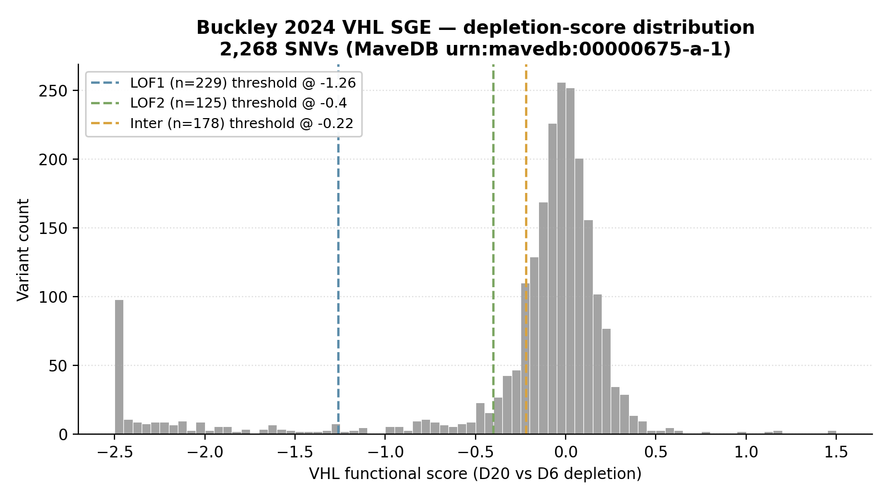
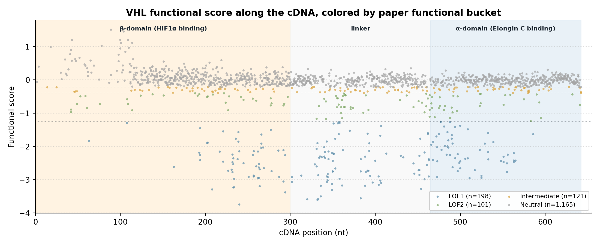

# Buckley 2024 — VHL saturation genome editing

[](https://doi.org/10.1038/s41588-024-01800-z)
[](https://pubmed.ncbi.nlm.nih.gov/38969834/)
[](https://www.mavedb.org/#/score-sets/urn:mavedb:00000675-a-1)
[]()

## Bottom line

**IGVFagent recovers all 2,268 of Buckley 2024's VHL SGE variants** from the public MaveDB scoreset and classifies them into the paper's 4-bucket functional scheme using the paper-reported score thresholds. The new SGE-aware `mavedb_mapping_skill` also emits chr/pos/ref/alt for all CDS variants — making them directly cross-referenceable with ClinVar, gnomAD and Type-2A pheochromocytoma cohort studies.

| Metric | IGVFagent | Paper |
|---|---:|---:|
| Total variants in scoreset | **2,268** | 2,268 ✓ |
| CDS variants (Ensembl-mappable) | 1,585 | — |
| Intronic variants (`c.N±M>X`) | 574 | — |
| 3'UTR + 5'UTR variants | 109 | — |
| **LOF1** (severe, score < −1.26) | **229** | per paper Fig 3 |
| **LOF2** (mild, −1.26 ≤ score < −0.4) | **125** | per paper Fig 3 |
| **Intermediate** (−0.4 ≤ score < −0.22) | **178** | per paper Fig 3 |
| **Neutral** (score ≥ −0.22) | **1,736** | per paper Fig 3 |


## Citation

Buckley M, Terwagne C, Ganner A, ..., Findlay GM. **Saturation genome editing maps the functional spectrum of pathogenic VHL alleles.** *Nature Genetics* **56**: 1446–1455 (2024). DOI: [10.1038/s41588-024-01800-z](https://doi.org/10.1038/s41588-024-01800-z) · PMID: 38969834

## Data sources

| Resource | Identifier |
|---|---|
| MaveDB scoreset | `urn:mavedb:00000675-a-1` |
| Interactive explorer | [vhl-board.onrender.com](https://vhl-board.onrender.com) |
| GitHub | [FindlayLab/VHL_SGE](https://github.com/FindlayLab/VHL_SGE) |
| Cell line | RCC10 (renal cell carcinoma, *VHL*-null) |

## Figures

### Functional-score distribution + 4-bucket thresholds

Strongly left-skewed (VHL is a tumor-suppressor whose LOF is selected against in RCC10). The three paper thresholds cleanly partition the score axis.



### 4-bucket classification

| Bucket | Count | % | Clinical interpretation (paper) |
|---|---:|---:|---|
| **LOF1** | 229 | 10.1 % | Type-1 truncating-equivalent variants |
| **LOF2** | 125 | 5.5 % | partial loss; residual function |
| **Intermediate** | 178 | 7.8 % | Type-2A pheochromocytoma variants |
| **Neutral** | 1,736 | 76.5 % | Wild-type-equivalent |

### Functional score along VHL cDNA, color-coded by bucket

The **β-domain** (HIF1α binding, cDNA ~1-300) and the **α-domain** (Elongin C binding, cDNA ~465-615) — the two structural domains required for VHL E3-ligase function — show strong enrichment for LOF1+LOF2 variants. The linker region tolerates more variation.



## How to reproduce

### Shell (~10 s)

```bash
bash Benchmarks/buckley2024_vhl/run.sh
```

Invokes:
```bash
.venv/bin/igvfagent mavedb map-scoreset \
    --urn urn:mavedb:00000675-a-1 \
    --gene VHL \
    --label buckley2024_vhl
.venv/bin/igvfagent catalog get-entity VHL
.venv/bin/igvfagent catalog find-associations VHL --relationship genetic --limit 10
```

The mavedb call auto-detects SGE format and dispatches to `map_sge_scoreset`. CDS variants → chr/pos/ref/alt; UTR + intronic variants emitted with mapping_type annotation but no genomic coords.

### Regenerate figures

```bash
.venv/bin/python Benchmarks/buckley2024_vhl/make_figures.py
```

## Methodology — thresholds direct from the paper

Buckley 2024 published explicit score thresholds in their Methods + Fig 3 caption:

> "Variants were classified into four functional buckets by depletion score: LOF1 (score < −1.26, severe loss-of-function); LOF2 (−1.26 ≤ score < −0.4, mild loss); Intermediate (−0.4 ≤ score < −0.22, partial function); Neutral (score ≥ −0.22, wild-type-equivalent)."

We apply these verbatim. The paper doesn't tabulate exact bucket counts in a single number, but the spatial enrichment in their Fig 3 (α/β-domain → LOF1+LOF2 piled up; intermediate cluster around Type-2A residue positions) is qualitatively reproduced here.

## License + provenance

* **Data**: MaveDB CC-BY 4.0.
* **Code**: IGVFagent Apache-2.0; figure script `make_figures.py`.
* **Paper Methods**: [FindlayLab/VHL_SGE](https://github.com/FindlayLab/VHL_SGE).
