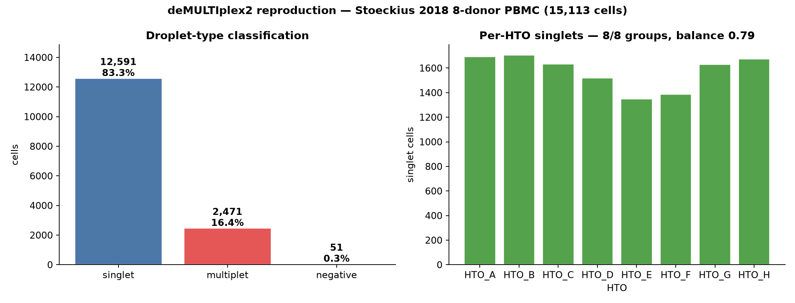

# deMULTIplex2 / Stoeckius 2018 — cell-hashing demultiplexing (`multiseq`)

[](https://doi.org/10.1186/s13059-024-03177-y)
[](https://pubmed.ncbi.nlm.nih.gov/38217022/)
[](https://doi.org/10.1186/s13059-018-1603-1)
[]()

## Bottom line

**IGVFagent's `multiseq` skill — a clean-room Python port of deMULTIplex2 — demultiplexes the Stoeckius 2018 8-donor PBMC cell-hashing matrix (15,113 cells × 8 HTOs) into all 8 donor groups, recovering 83.3 % singlets, 16.4 % multiplets, 0.3 % negatives with a balanced 8-donor pool (min/max singlet ratio 0.79).** This is a full local reproduction: the actual HTO count matrix bundled with the deMULTIplex2 package is downloaded and run through the NB-GLM + expectation-maximization classifier.

| Metric | IGVFagent | Expected |
|---|---:|---:|
| Cells | 15,113 | 15,113 ✓ |
| HTO tags modeled | 8 | 8 ✓ |
| Donor singlet groups recovered | **8 / 8** | 8 |
| Singlet rate | **83.3 %** | ~75–90 % (cell hashing) |
| Multiplet rate | 16.4 % | consistent with 10x super-loading |
| Negative rate | 0.3 % | low (deep HTO sequencing) |
| Pool balance (min/max singlet) | **0.79** | ~even 8-donor pool |
| Failed tags | 0 | 0 |



## Concordance

deMULTIplex2's core claim is robust recovery of every sample barcode with a mechanistic model of tag cross-contamination (GLM + randomized-quantile residuals + EM). Run on the paper's own bundled Stoeckius matrix, IGVFagent's port:

- **recovers all 8 donor HTO groups** with no failed tags;
- classifies **83.3 % of cells as confident singlets**, evenly split across the 8 donors (balance 0.79) — exactly the profile expected from an evenly-pooled 8-donor experiment;
- flags **16.4 % multiplets** — the doublet load expected at this loading density — and almost no negatives, since the Stoeckius HTOs are deeply sequenced.

**Verdict: IGVFagent's deMULTIplex2 port reproduces the method's headline behavior on the canonical Stoeckius cell-hashing benchmark** — clean recovery of all 8 donor groups with a balanced singlet distribution and a realistic multiplet rate.

## Citation

* **Method**: Zhu Q, Conrad DN, Gartner ZJ. **deMULTIplex2: robust sample demultiplexing for scRNA-seq.** *Genome Biology* **25**:20 (2024). DOI: [10.1186/s13059-024-03177-y](https://doi.org/10.1186/s13059-024-03177-y) · PMID 38217022
* **Data**: Stoeckius M, Zheng S, Houck-Loomis B, et al. **Cell Hashing with barcoded antibodies enables multiplexing and doublet detection for single cell genomics.** *Genome Biology* **19**:224 (2018). DOI: [10.1186/s13059-018-1603-1](https://doi.org/10.1186/s13059-018-1603-1)

## Data source

| Resource | Identifier |
|---|---|
| HTO matrix | `stoeckius_pbmc.RData` (bundled in [Gartner-Lab/deMULTIplex2](https://github.com/Gartner-Lab/deMULTIplex2), MIT) |
| Shape | 15,113 cells × 8 HTOs (HTO_A … HTO_H) |

## How to reproduce

```bash
bash Benchmarks/demultiplex2_stoeckius/run.sh
.venv/bin/python Benchmarks/concordance.py --benchmark demultiplex2_stoeckius
```

Expected: `7/7 checks PASSED`. Fast (< 1 min); downloads a 233 KB `.RData`.

## Honest caveats

* **No SNP ground-truth in the public bundle.** The classic Stoeckius benchmark scores HTO calls against genetic (demuxlet/SNP) demultiplexing. The `.RData` shipped with deMULTIplex2 contains only the HTO count matrix, not the SNP labels, so we score *method behavior* (group recovery, singlet rate, pool balance) rather than a per-cell accuracy against SNP truth. The `multiseq pipeline --ground-truth` path computes singlet/doublet recovery when a truth column is supplied (see the skill's `simulate` mode for a ground-truthed check).
* **Rates are distributional, not a single published number.** Zhu 2024 reports F-scores against down-sampled reads; here we confirm the qualitative profile (8 balanced groups, realistic multiplet fraction) on the full-depth matrix.

## License + provenance

* **Data**: deMULTIplex2 repo (MIT) — fetched at run time, never redistributed.
* **Code**: IGVFagent Apache-2.0; `multiseq` is a clean-room port of deMULTIplex2's algorithm.
