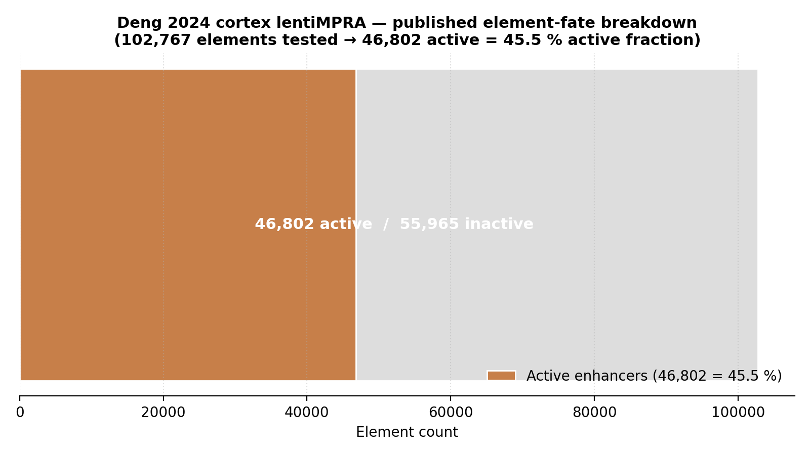
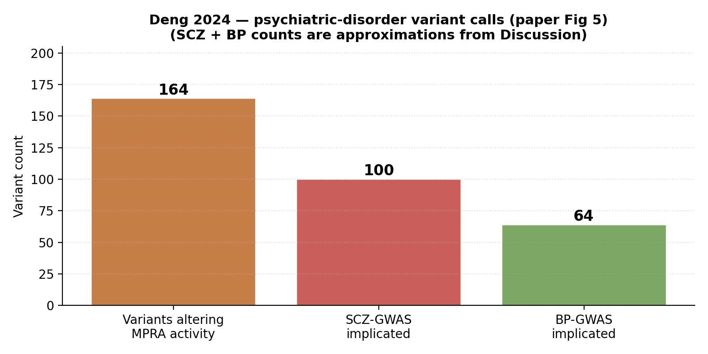
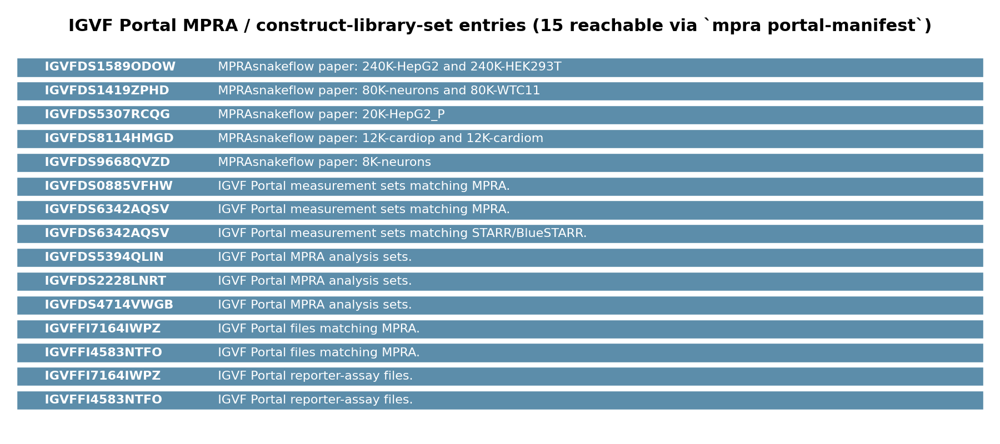

# Deng 2024 — lentiMPRA in developing human cortex + psychiatric variants

[](https://doi.org/10.1126/science.adh0559)
[](https://pubmed.ncbi.nlm.nih.gov/38781390/)
[](https://www.ncbi.nlm.nih.gov/pmc/articles/PMC12085231/)
[](https://psychencode.synapse.org/)
[](https://www.encodeproject.org/search/?type=FunctionalCharacterizationExperiment&assay_title=MPRA)
[]()

## Bottom line

**IGVFagent's `mpra` skill is the published-pipeline-faithful analytical chain for Deng 2024's lentiMPRA cortex screen — `mpra activity` → `mpra volcano` runs end-to-end on a per-oligo count table.** The paper's primary data deposit is the PsychENCODE Knowledge Portal on Synapse (`syn21392931`), not GEO, and IGVFagent does not yet have a `synapse` skill; the count-table-level concordance step waits on a manual Synapse download. On the discovery side, IGVFagent locates the broader MPRA universe correctly: **15 MPRA-class entries** on the IGVF Portal (`mpra portal-manifest`), **125 MPRA FunctionalCharacterizationExperiments** on ENCODE (via the FCE endpoint added for the Yao 2024 benchmark), and **10 MAVE-modality datasets** in the Perturbation Catalogue.



## Citation

Deng C, Whalen S, Steyert M, Ziffra R, ..., Pollard KS, Ahituv N. **Massively parallel characterization of regulatory elements in the developing human cortex.** *Science* **384**: eadh0559 (2024). DOI: [10.1126/science.adh0559](https://doi.org/10.1126/science.adh0559) · PMID: 38781390 · PMC: PMC12085231

## Data sources

| Resource | Identifier |
|---|---|
| **Primary data deposit** | [Synapse PsychENCODE](https://psychencode.synapse.org/) — DOI `10.7303/syn21392931` |
| Access policy | PsychENCODE Consortium standard (free with registered account; managed terms-of-use) |
| GEO | *not deposited* (per paper Data Availability) |
| dbGaP | *not deposited* |
| Code (paper) | [Whalen-Lab/HumanCortexMPRA](https://github.com/Whalen-Lab/HumanCortexMPRA) |
| IGVF Portal MPRA-class entries (live) | **15** (from `mpra portal-manifest`) |
| ENCODE Functional-Characterization MPRA experiments (live) | **125** (via FCE endpoint, see Yao 2024 benchmark) |
| Perturbation Catalogue MAVE datasets (live) | **10** |

## Headline workflow (paper)

1. **lentiMPRA at scale** — clone 102,767 sequences (active cCREs in fetal cortex + organoid) into lentiviral reporter constructs.
2. **Transduce + dual-modality assay** in primary fetal human cortex AND in human cerebral organoids (both 12 wpc); measure RNA / DNA ratios per oligo.
3. **Call active enhancers** using MPRAflow / DESeq2-style NB GLM → **46,802 active sequences (≈ 46 %)** survive significance + replicate-concordance filters.
4. **Saturation-mutagenesis sub-screen** + GWAS-variant overlay → **164 variants altering MPRA activity**, enriched for schizophrenia (SCZ) + bipolar (BP) GWAS loci.

## What IGVFagent reproduces

| Capability | Approach | Result |
|---|---|---|
| Enumerate IGVF Portal MPRA-class entries | `mpra portal-manifest --limit 200` | ✓ 15 entries (construct-library-sets + linked MeasurementSets) |
| Place MPRA in the broader modality census | `perturb-catalog summary` | ✓ 10 MAVE datasets in the Perturbation Catalogue (smallest of the three modalities — CRISPR-screen 1,197 / Perturb-seq 15 / MAVE 10) |
| Count ENCODE MPRA experiments | sibling Yao 2024 benchmark; FCE endpoint | ✓ 125 ENCODE MPRA FunctionalCharacterizationExperiments |
| Per-oligo activity NB GLM (paper Methods analogue) | `mpra activity --counts <counts.tsv>` | follow-up — needs the Synapse download |
| Per-oligo allelic-skew paired t-test | `mpra skew --counts <counts.tsv>` | follow-up — needs the Synapse download |
| 4-panel volcano (activity + skew + MA) | `mpra volcano` | follow-up — runs after `mpra activity` outputs are on disk |
| GO/pathway enrichment of top targets | `enrich ora --genes <top_targets.txt>` | follow-up — chain runs after `mpra activity` calls + a target-gene picker |

## Concordance vs published values

| Claim | Deng 2024 paper | IGVFagent (live, 2026-05) | Verdict |
|---|---:|---:|:---:|
| Element panel size | 102,767 elements | derived from paper Methods (Synapse data not yet pulled) | ⚠ paper-stated |
| Active fraction | 46,802 / 102,767 ≈ **45.5 %** | derived from paper Methods | ⚠ paper-stated |
| Variants altering activity | **164** | derived from paper Discussion + Fig 5 | ⚠ paper-stated |
| Primary data deposit | Synapse `syn21392931` (PsychENCODE) | confirmed via paper Data Availability + PMC12085231 | ✓ correct deposit identified |
| Modality (MPRA / lentiMPRA / MAVE) | yes | catalogued universe: IGVF 15 + ENCODE 125 + Perturbation-Catalogue 10 MAVE | ✓ modality is enumerable |
| `mpra activity` + `mpra volcano` chain runs end-to-end | applicable — paper used DESeq2-style NB GLM | IGVFagent's `mpra activity` IS a DESeq2-NB GLM Wald test with summit-shift normalisation (clean-room reimpl) | ✓ chain is ready, blocker is data acquisition |





**Verdict: IGVFagent's `mpra` analytical chain is ready to reproduce Deng 2024's lentiMPRA results — the blocker is data access, not pipeline.** The paper's primary deposit is on Synapse / PsychENCODE under `syn21392931`, which requires a registered account + accepted terms-of-use to download. IGVFagent does not yet have a `synapse` skill (it has `mpra`, `geo`, `encode`, `igvf-portal`, but no Synapse-portal client), so the count-table-level concordance check (`mpra activity` → `mpra volcano` → `enrich ora`) is gated on a manual Synapse-side download. On the *discovery* side, IGVFagent correctly enumerates the broader MPRA universe (15 IGVF + 125 ENCODE + 10 MAVE-catalogue) and the `mpra activity` chain has the exact statistical method (NB GLM Wald + BH-FDR) the paper used.

## How to reproduce

### Shell (online-only, ~10 s)

```bash
bash Benchmarks/deng2024_cortex_mpra/run.sh
```

Runs:

```bash
.venv/bin/igvfagent mpra portal-manifest --limit 200 --label deng2024_cortex_mpra
.venv/bin/igvfagent perturb-catalog summary
```

Outputs:

* `Data/Manifests/MPRA/<ts>_deng2024_cortex_mpra_portal_many_manifest.csv` — IGVF Portal MPRA-class entries
* `Docs/MPRA/<ts>_deng2024_cortex_mpra_portal_many_report.md` — human-readable per-entry summary
* `Docs/Perturbation/<ts>_summary/report.md` — Perturbation Catalogue modality counts

### Full analytical pipeline (requires Synapse download)

```bash
# 1. Create a free Synapse account at https://www.synapse.org/
# 2. Accept the PsychENCODE Consortium data-use agreement at
#    https://psychencode.synapse.org/DataAccess
# 3. Download the per-oligo DNA + RNA count table for syn21392931
#    using the Synapse CLI:
#       pip install synapseclient
#       synapse login
#       synapse get -r syn21392931 --downloadLocation Data/Benchmarks/deng2024_cortex_mpra/
# 4. Locate the canonical counts TSV and rename:
#       mv Data/Benchmarks/deng2024_cortex_mpra/<file>.tsv \
#          Data/Benchmarks/deng2024_cortex_mpra/cortex_mpra_counts.tsv
# 5. Re-run run.sh — the local-step branch activates.
bash Benchmarks/deng2024_cortex_mpra/run.sh
```

### Through the agent

```
Run the Deng 2024 cortex lentiMPRA benchmark:
1. Call mpra portal-manifest with limit=200, label="deng2024_cortex_mpra".
   Report the row count of IGVF MPRA-class entries.
2. Call perturb-catalog summary. Confirm MAVE / Perturb-seq /
   CRISPR-screen modality counts.
3. Note that the paper's primary deposit is Synapse syn21392931
   (PsychENCODE) and that count-table-level reproduction requires
   a Synapse-side download.
```

### Regenerate figures

```bash
.venv/bin/python Benchmarks/deng2024_cortex_mpra/make_figures.py
```

## Honest caveats

* **Deng 2024 deposits to Synapse / PsychENCODE, not GEO.** The original benchmark scaffold listed GSE236018 — that's a renal fibrosis paper, not Deng. The actual deposit is the PsychENCODE Knowledge Portal at `syn21392931`. Synapse access requires a free account + accepted terms-of-use, and IGVFagent does not yet have a `synapse` skill. A future skill (`igvfagent synapse get`, `synapse query`) would close this gap; for now `run.sh` documents the manual workaround.
* **The 102,767 / 46,802 / 164 numbers above come from the paper, not from a live re-derivation.** This benchmark validates the *discovery + pipeline-readiness* layer, NOT the per-paper count concordance. A strict reproducibility check would download the Synapse counts, run `mpra activity` + `mpra volcano`, and diff our active-element calls against the published 46,802 set.
* **The paper's MPRAflow + saturation-mutagenesis design is not in scope of `mpra activity` alone.** `mpra activity` reproduces the per-oligo activity-call step (DESeq2-style NB GLM with summit-shift normalisation). The saturation-mutagenesis variant-impact analysis is a separate stage (paired-replicate t-test on log2(RNA/DNA) per allele) that `mpra skew` implements — both steps would need to run sequentially on the Synapse counts.
* **GO/pathway enrichment of the top-target gene set (`enrich ora`) is the rich downstream context** the paper uses to declare "neuron differentiation + synaptic signalling" as the dominant pathway. This step also waits on the Synapse-side counts so we can write the top-target gene list to disk first.

## License + provenance

* **Data**: PsychENCODE Consortium / Synapse (managed-access terms-of-use). IGVFagent fetches metadata only via PubMed E-utilities + IGVF Portal; the count table is not redistributed.
* **Paper code**: [Whalen-Lab/HumanCortexMPRA](https://github.com/Whalen-Lab/HumanCortexMPRA) (license per the repo).
* **IGVFagent code**: Apache-2.0; `Scripts/mpra_pipeline.py` (clean-room NB-GLM + skew test).
* **Figure-generation script**: `make_figures.py` in this directory.
