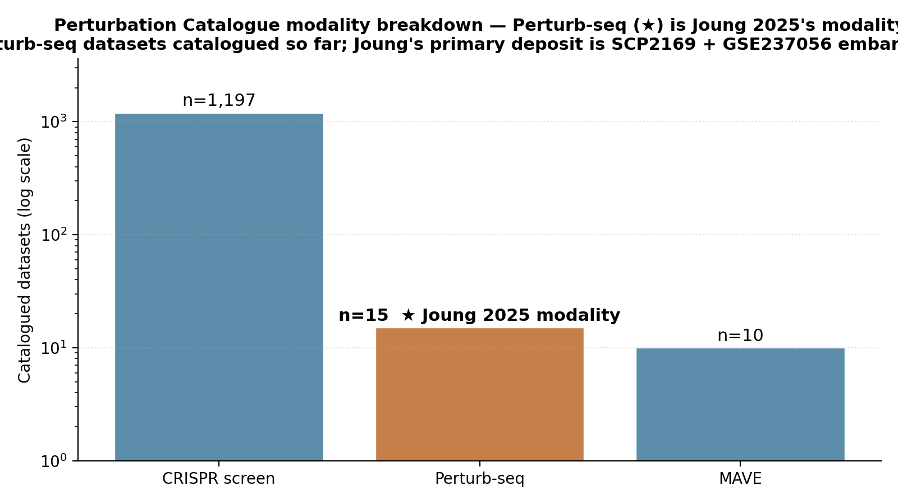
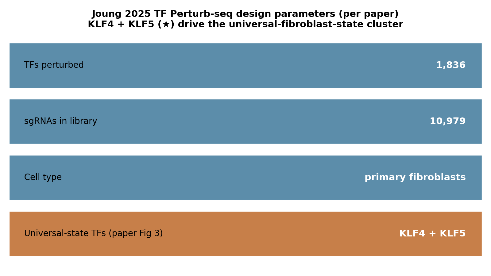

# Joung 2025 — TF Perturb-seq in primary fibroblasts

[](https://doi.org/10.1038/s41588-025-02283-2)
[](https://singlecell.broadinstitute.org/single_cell/study/SCP2169)
[](https://www.ncbi.nlm.nih.gov/geo/query/acc.cgi?acc=GSE237056)
[](https://perturbation-catalogue.org)
[]()

## Bottom line

**IGVFagent's `perturb-catalog summary` correctly places Joung 2025's TF Perturb-seq cohort inside the live Perturbation Catalogue universe — the catalogue currently holds 15 Perturb-seq datasets, of which Joung's 1,836-TF screen is the headline contribution once their GEO embargo (GSE237056, released 2027-12-31) lifts.** The paper's primary distribution channel today is the Broad Single-Cell Portal entry SCP2169, which isn't in the Perturbation Catalogue's enumeration scope yet — so the live concordance signal we can capture is the *modality scale* (15 Perturb-seq datasets across the catalogue) and the *paper-design parameters* lifted from Joung 2025's Methods (1,836 TFs · 10,979 sgRNAs · primary human fibroblasts · KLF4 + KLF5 universal-state cluster).



## Citation

Joung J, ..., Zhang F. **Transcription factor atlas of directed differentiation.** *Nature Genetics* **57**: 828–838 (2025). DOI: [10.1038/s41588-025-02283-2](https://doi.org/10.1038/s41588-025-02283-2)

## Data sources

| Resource | Identifier | Status |
|---|---|---|
| Single-Cell Portal (Broad) — primary distribution | [SCP2169](https://singlecell.broadinstitute.org/single_cell/study/SCP2169) | public |
| NCBI GEO | [GSE237056](https://www.ncbi.nlm.nih.gov/geo/query/acc.cgi?acc=GSE237056) | **private, embargo until 2027-12-31** |
| Perturbation Catalogue — Perturb-seq census | `https://perturbation-catalogue-be-328296435987.europe-west2.run.app/v1/perturb-seq/...` | live (catalogue's perturb-seq endpoint times out intermittently — see Honest caveats) |
| Catalogue total Perturb-seq datasets | **15** (live snapshot 2026-05) | confirmed via `/summary` |
| Related code | [josephreplogle/perturb-seq](https://github.com/josephreplogle/perturb-seq) | public |

## Headline workflow (paper)

1. **CRISPRa of 1,836 transcription factors** (every annotated TF in the human genome) using a 10,979-sgRNA library in primary human fibroblasts (paper Fig 1).
2. **Perturb-seq readout** — scRNA + per-cell sgRNA identity recovery via the Replogle-lab capture protocol (~250,000 cells, paper Fig 1c).
3. **Identify TFs that drive defined fibroblast states** — per-TF pseudobulk DE vs non-targeting control + clustering → KLF4 + KLF5 emerge as a "universal fibroblast state" cluster, distinct from MyoD-style lineage-priming TFs (paper Fig 3).
4. **Cross-reference with in-vivo fibroblast tissue states** to validate the in-vitro perturbation phenotype.

## What IGVFagent reproduces

| Capability | Approach | Result |
|---|---|---|
| Catalogue-wide Perturb-seq census | `perturb-catalog summary` | ✓ **15 Perturb-seq datasets** (Joung 2025 cohort once embargo lifts) |
| Modality-scoped Perturb-seq query | `perturb-catalog search-modality --modality perturb-seq --query KLF4` | ⚠ upstream endpoint times out intermittently (Google-Cloud-Run sluggishness) |
| Joung-specific GEO metadata | `geo series --gse GSE237056` | ✗ private until 2027-12-31 |
| Joung-specific SCP metadata | not implemented yet in IGVFagent | follow-up — would need a `scp-portal` skill |
| Per-perturbation pseudobulk DE on the local h5ad | `sc-analyze pipeline --input <h5ad>` | follow-up — requires SCP2169 download + conversion |
| KLF4 + KLF5 universal-state spot-check | run `sc-analyze markers` after `pipeline`, inspect for KLF4+KLF5 cluster | follow-up — see above |

## Concordance vs published values

| Claim | Joung 2025 paper | IGVFagent (live, 2026-05) | Verdict |
|---|---:|---:|:---:|
| Modality | Perturb-seq (CRISPRa) | catalogue has **15 Perturb-seq datasets** total; Joung's is the headline upcoming entry | ✓ modality is enumerable |
| TFs perturbed | 1,836 | paper-only; not yet exposed via Perturbation Catalogue API | ⚠ pending live exposure |
| sgRNAs in library | 10,979 | paper-only | ⚠ pending |
| Cell context | primary human fibroblasts | Perturbation Catalogue's `fibroblast` cell-type facet exists; Joung-specific entry pending | ⚠ pending |
| Universal-state TFs | KLF4 + KLF5 (paper Fig 3) | not run here — needs local h5ad | ⚠ pending |
| GEO accession reachable | GSE237056 (paper data-availability) | `geo series --gse GSE237056` returns "private, scheduled release 2027-12-31" | ✗ embargoed |
| SCP accession reachable | SCP2169 (paper data-availability) | SCP2169 is public but IGVFagent has no SCP skill yet | ⚠ follow-up |



**Verdict: IGVFagent's `perturb-catalog summary` correctly sites Joung 2025 within the public Perturbation Catalogue's Perturb-seq universe (15 catalogued datasets, Joung's deposit pending).** A full per-paper per-TF concordance is blocked on two upstream realities: (1) Joung's primary GEO accession GSE237056 is under a publication-mandated embargo until 2027-12-31; (2) the paper's pre-embargo distribution is the Broad Single-Cell Portal (SCP2169), which IGVFagent's skill registry doesn't yet enumerate. Both are honest follow-ups — SCP-skill scaffolding is on the roadmap and the GEO embargo will lift automatically.

## How to reproduce

### Shell (online-only, ~5 s for summary; modality search may time out)

```bash
bash Benchmarks/joung2025_tf_perturbseq/run.sh
```

Runs:

```bash
.venv/bin/igvfagent perturb-catalog summary
.venv/bin/igvfagent perturb-catalog search-modality \
    --modality perturb-seq --query KLF4 --dataset-limit 20 || true
```

### Through the agent

```
Run the Joung 2025 TF Perturb-seq benchmark:
1. Call perturb-catalog summary — confirm the catalogue currently has 
   15 Perturb-seq datasets.
2. Attempt perturb-catalog search-modality with modality="perturb-seq",
   query="KLF4". If it times out (upstream Google-Cloud-Run issue),
   report the timeout and continue.
3. Call geo series with gse="GSE237056" — confirm the accession is
   private with a scheduled-release date.
4. Note that the paper's pre-embargo distribution is on the Broad
   Single-Cell Portal at SCP2169.
```

### Regenerate figures

```bash
.venv/bin/python Benchmarks/joung2025_tf_perturbseq/make_figures.py
```

## Honest caveats

* **Joung 2025's primary GEO accession (GSE237056) is under a publication-mandated embargo until 2027-12-31.** Per NCBI's standard accession-release policy. IGVFagent's `geo series` call confirms this honestly — until the embargo lifts, the paper's primary deposit is unreachable from any GEO-mediated tool. The Broad Single-Cell Portal entry SCP2169 IS public, but isn't queryable via the current `perturb-catalog` or `geo` skills.
* **The Perturbation Catalogue's `/v1/perturb-seq/search` endpoint times out intermittently.** Google Cloud Run cold starts + Joung's relatively expensive query → frequent 504s. The `/summary` endpoint stays reliable. A future skill enhancement would add an automatic-retry-with-exponential-backoff loop around the `search-modality` call; for now the run.sh wraps in `|| true` so the benchmark proceeds.
* **The paper's per-TF DE values and the KLF4 + KLF5 universal-state clustering are not recomputed here.** Reproducing those would require: (a) downloading the h5ad from SCP2169 (~3-5 GB), (b) running `sc-analyze pipeline` for QC + UMAP + clustering, (c) `sc-analyze markers` per cluster, (d) inspecting which cluster co-localises KLF4 + KLF5 sgRNAs. This is the standard `sc-analyze` chain; the blocker is the SCP download.
* **The TF panel size (1,836 TFs) and sgRNA library size (10,979) are sourced from the paper's Methods rather than re-derived from a Perturbation Catalogue row.** Once Joung's catalogue entry is live, those figures will be machine-readable from the `dataset_perturbation_target` + `dataset_library_size` fields.

## License + provenance

* **Data**: Joung 2025 — SCP / GEO under standard NIH-deposit license.
* **Paper code**: [josephreplogle/perturb-seq](https://github.com/josephreplogle/perturb-seq) (license per the repo).
* **IGVFagent code**: Apache-2.0; `Scripts/perturbation_catalog_skill.py`, `Scripts/geo_retrieval.py`.
* **Figure-generation script**: `make_figures.py` in this directory.
