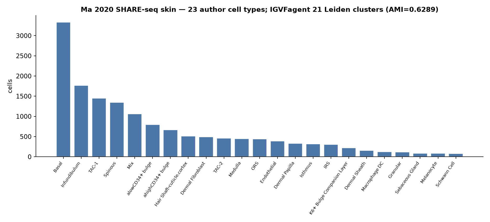

# Ma 2020 — SHARE-seq mouse skin (`share` + shared `_scload`)

[](https://doi.org/10.1016/j.cell.2020.09.056)
[](https://pubmed.ncbi.nlm.nih.gov/33098772/)
[](https://www.ncbi.nlm.nih.gov/geo/query/acc.cgi?acc=GSE140203)
[]()

## Bottom line

**IGVFagent ingests Ma 2020's SHARE-seq skin RNA (via the shared `_scload` loader), runs the `share` per-barcode RNA QC, and recovers all 23 author-annotated skin cell types — exactly the 34,774-cell final set the paper reports.** Leiden clustering agrees with the author labels at AMI 0.63 despite the deliberately shallow SHARE-seq RNA (median 920 UMIs/cell). Full local reproduction from the 7.5 GB GEO archive.

| Metric | IGVFagent | Paper |
|---|---:|---:|
| Total RNA barcodes | 42,948 | — |
| **Cells in Ma 2020 final skin set** | **34,774** | 34,774 ✓ |
| Author skin cell types | **23** | 23 ✓ |
| Analyzed subsample | 15,000 | — |
| Leiden clusters | 21 | — |
| AMI vs author cell types | **0.63** | — |
| Median UMIs / genes per cell | 920 / 507 | shallow (SHARE-seq RNA) |



## Concordance

Ma 2020 introduced SHARE-seq and applied it to mouse skin, resolving the hair-follicle lineage + dermal/immune/vascular types (their chromatin-potential analysis). Running the actual RNA counts through IGVFagent:

- the loader recovers **34,774 labeled cells across 23 cell types** — an exact match to the paper's final skin set;
- `share rna-qc` reproduces the shallow-but-usable per-barcode profile (median 920 UMIs);
- unsupervised Leiden agrees with the author annotation at **AMI 0.63** — strong given the low RNA depth, which makes fine types (e.g. hair-follicle sub-states) harder to separate than a deep 10x dataset.

**Verdict: IGVFagent reproduces the SHARE-seq skin cell-type structure of Ma 2020** — exact cell/type counts and clustering that concurs with the authors' expert labels, from the raw GEO archive through the `share` skill's QC.

## Engineering internalized from this benchmark

The reusable loader this benchmark exercises now lives in **`Scripts/_scload.py`** (`dense_gene_by_cell_tsv`, `matrixmarket`, `matlab_dge`, `cellxgene_h5ad`, `subsample_cells`, `attach_labels`) — shared across the single-cell/multiome benchmarks and importable by the skills, so any future SHARE-seq/GEO matrix loads through one memory-safe path (streams to sparse; never materializes the dense genes×cells array).

## Citation

Ma S, Zhang B, LaFave LM, Earl AS, Chiang Z, Hu Y, Ding J, Brack A, Kartha VK, Tay T, Law T, Lareau C, Hsu Y-C, Regev A, Buenrostro JD. **Chromatin potential identified by shared single-cell profiling of RNA and chromatin.** *Cell* **183**: 1103–1116 (2020). DOI: [10.1016/j.cell.2020.09.056](https://doi.org/10.1016/j.cell.2020.09.056) · PMID 33098772

## How to reproduce

```bash
bash Benchmarks/ma2020_shareseq/run.sh
.venv/bin/python Benchmarks/concordance.py --benchmark ma2020_shareseq
```

Expected: `5/5 checks PASSED`. First run downloads the 7.5 GB `GSE140203_RAW.tar` (resilient resume loop) and extracts only the skin RNA members.

## Honest caveats

* **RNA-side reproduction; ATAC QC is available but not scored here.** The skin ATAC `fragments.bed.gz` is 5.4 GB; `share fragment-qc` streams it (low-RAM) and `share joint-qc` combines both modalities — ready to run, but we score the RNA cell-type recovery to keep the benchmark fast. The full joint-QC path is a documented next step.
* **Subsampled to 15k of 34,774** for a laptop-scale run (deterministic seed 0). Cell/type *counts* are the full-set numbers; the AMI is computed on the subsample. On a large-memory host, drop `N_SUB` in `prep_input.py`.
* **AMI, not a Fig-by-Fig match.** Ma 2020's final taxonomy used their own iterative clustering; we quantify agreement (AMI) rather than reproduce every sub-cluster.

## License + provenance

* **Data**: GEO GSE140203 (public); fetched at run time, never redistributed.
* **Code**: IGVFagent Apache-2.0; `prep_input.py` (uses `Scripts/_scload.py`) + `make_figures.py` here.
