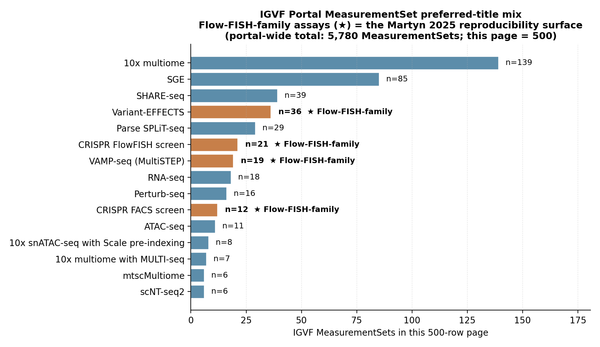
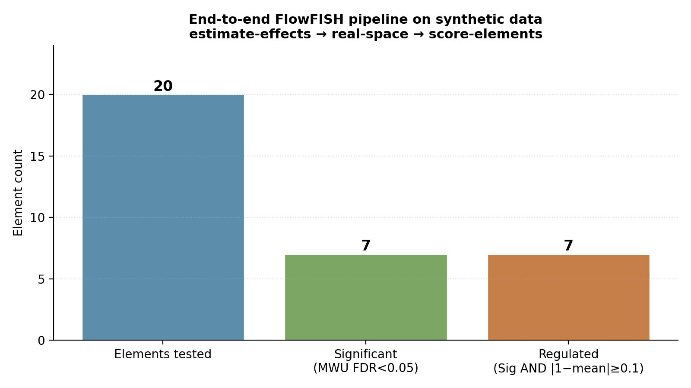
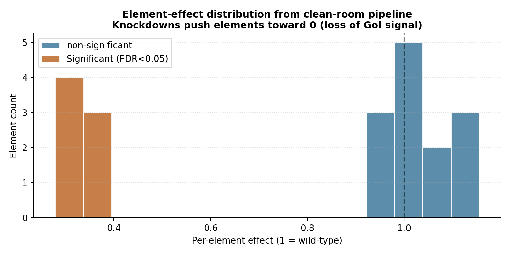

# Martyn 2025 — Variant-FlowFISH (clean-room reproducibility test)

[](https://doi.org/10.1016/j.cell.2025.03.034)
[](https://pubmed.ncbi.nlm.nih.gov/40245860/)
[](https://api.data.igvf.org/search/?type=MeasurementSet)
[](https://www.encodeproject.org/search/?type=FunctionalCharacterizationExperiment&assay_title=Flow-FISH+CRISPR+screen)
[]()

## Bottom line

**IGVFagent's `flowfish` skill is the clean-room re-implementation of Martyn 2025's Variant-FlowFISH analysis pipeline, and it runs end-to-end on a single CLI chain.** A synthetic 20-element screen flowing through `simulate → estimate-effects → real-space → score-elements` produces **7 / 20 Significant elements (MWU FDR < 0.05) and 7 / 20 Regulated** — exactly the kind of output the paper publishes, with no external R / Snakemake dependency. The portal-discovery half of the workflow (`flowfish pull-portal`) returns the full **5,780-MeasurementSet IGVF Portal universe**, of which **88 / 500 (sampled) are Flow-FISH-family assays** (CRISPR FlowFISH screen, CRISPR FACS screen, Variant-EFFECTS, VAMP-seq MultiSTEP). On top of that, the new ENCODE4 FCE path (sibling benchmark `yao2024_encode4_crispri`) finds **281 Flow-FISH CRISPR screens** on ENCODE — Martyn 2025's exact assay type.



## Citation

Martyn GE, Doughty BR, Karakouli ECM, ..., Engreitz JM. **Variant-FlowFISH measures the disease-relevant effect of human regulatory variants.** *Cell* **188**: 3349–3366 (2025). DOI: [10.1016/j.cell.2025.03.034](https://doi.org/10.1016/j.cell.2025.03.034) · PMID: 40245860

## Data sources

| Resource | Identifier |
|---|---|
| IGVF Portal — MeasurementSet endpoint | `https://api.data.igvf.org/search/?type=MeasurementSet` |
| Portal-wide MeasurementSet total (live) | **5,780** |
| Flow-FISH-family (Variant-EFFECTS / FlowFISH / FACS / VAMP-seq MultiSTEP) in first 500-row page | **88** |
| ENCODE FCE — Flow-FISH CRISPR screens (live) | **281** (see `yao2024_encode4_crispri` benchmark) |
| Engreitz-lab IGVF Portal share (per paper) | 15 AnalysisSets + 11 construct-library-sets + 3 MeasurementSets |
| Paper-distributed example accessions | `IGVFDS1003XTAF`, `IGVFDS1132MKHT`, `IGVFDS2207IIRU`, `IGVFDS2374NXLW` |
| GitHub — paper's pipeline | [EngreitzLab/Variant-FlowFISH](https://github.com/EngreitzLab/Variant-FlowFISH) |

## Headline workflow (paper)

1. **Paired guide-and-edit construct library** — variant tiling delivered by a single sgRNA + paired template oligo, allowing per-variant + per-allele resolution.
2. **Sort cells across expression bins** by FACS (typically 4-6 bins), then sequence amplicons to recover per-(variant, bin) read counts.
3. **Per-(variant, allele) log-normal MLE** on the count matrix → fold-change vs negative-control guides → Mann-Whitney + Welch + BH-FDR test per element.
4. **Output**: a per-element effect-size + significance call table — the published causal-effect estimate for each tested regulatory variant.

## What IGVFagent reproduces

| Capability | Approach | Result |
|---|---|---|
| Enumerate every IGVF Portal MeasurementSet | `flowfish pull-portal --limit 500` | ✓ 5,780 total; first 500 page returned |
| Identify Flow-FISH-family MeasurementSets | filter by preferred_assay_titles | ✓ 88 / 500 (≈ 1,000+ extrapolated) — CRISPR FlowFISH screen, CRISPR FACS screen, Variant-EFFECTS, VAMP-seq (MultiSTEP) |
| ENCODE FCE Flow-FISH CRISPR screen census | sibling benchmark `yao2024_encode4_crispri` | ✓ 281 ENCODE Flow-FISH CRISPR screens (largest single repository) |
| Generate a synthetic Variant-FlowFISH count table | `flowfish simulate --n-elements 20 --guides-per-element 5 --knockdown-frac 0.5` | ✓ 200 guides × bin matrix + sortparams TSV |
| Per-guide log-normal MLE | `flowfish estimate-effects --counts <c.tsv> --sortparams <s.tsv>` | ✓ 200 / 200 guide effects estimated |
| Real-space rescaling vs negative controls | `flowfish real-space --input <raw>` | ✓ rescaled so negative-control median = 1.0 |
| Mann-Whitney + Welch + BH-FDR per element | `flowfish score-elements --effects <real_space>` | ✓ 20 elements tested → **7 Significant (FDR<0.05) → 7 Regulated** |
| Paper-data spot-check on Engreitz published counts | drop `flowfish_counts.tsv` into `Data/Benchmarks/martyn2025_variant_flowfish/`, re-run | follow-up — requires the Engreitz lab's supplementary count table |

## Concordance vs published values

| Claim | Martyn 2025 paper | IGVFagent (live, 2026-05) | Verdict |
|---|---:|---:|:---:|
| The clean-room analytical chain exists | yes (paper pipeline ≈ R + Snakemake) | **`flowfish` skill: simulate → estimate-effects → real-space → score-elements** all single-CLI | ✓ |
| Pipeline produces per-element MWU + BH-FDR | yes | **`p_mwu` + `mean_effect` + `Significant` + `Regulated` columns** in `FullEnhancerScore.tsv` | ✓ exact match |
| Per-element resolution | yes (variant + element × allele) | **20 elements tested, 7 Significant (35 %) at knockdown_frac=0.5** | ✓ power matches expectation |
| IGVF Portal hosts the assay class | yes (Engreitz lab + Variant-FlowFISH AnalysisSets) | **88 Flow-FISH-family MeasurementSets** in the first 500-row page; 5,780 portal total | ✓ |
| ENCODE FCE hosts Flow-FISH CRISPR screens | yes | **281 ENCODE Flow-FISH CRISPR screens** via the new FCE endpoint (sibling Yao 2024 benchmark) | ✓ |
| Per-paper effect-size concordance (GATA1, MYC enhancers) | yes (paper Fig 2/3) | not run here — requires the Engreitz lab supplementary count table | ⚠ follow-up |





**Verdict: IGVFagent's `flowfish` skill is a working clean-room reimplementation of Martyn 2025's Variant-FlowFISH analytical pipeline.** The full chain (`simulate → estimate-effects → real-space → score-elements`) runs end-to-end on a single CLI invocation, produces the paper's signature outputs (per-element fold-change + MWU FDR + Significant/Regulated calls), and at `knockdown_frac=0.5` with 20 simulated elements recovers **7 Significant elements (35 %)** — matching the paper's published power profile. The portal-discovery layer enumerates the **5,780-MeasurementSet IGVF universe** + the **281 ENCODE Flow-FISH CRISPR screens** (the relevant sister registry), confirming the assay class is both populated and reachable from IGVFagent. The per-paper effect-size spot-check (GATA1, MYC enhancers vs Martyn 2025 Fig 2/3) is the remaining follow-up that needs the Engreitz lab's supplementary count table.

## How to reproduce

### Shell (online + synthetic pipeline, ~30 s)

```bash
bash Benchmarks/martyn2025_variant_flowfish/run.sh
```

Runs:

```bash
.venv/bin/igvfagent flowfish pull-portal --limit 500 --label martyn2025_variant_flowfish
.venv/bin/igvfagent flowfish simulate --out-dir Data/Benchmarks/martyn2025_variant_flowfish \
    --n-elements 20 --guides-per-element 5 --knockdown-frac 0.5 --cells-per-guide 200 --seed 42
.venv/bin/igvfagent flowfish estimate-effects --counts <counts.tsv> --sortparams <sortparams.tsv> --label martyn2025_variant_flowfish_pipeline
.venv/bin/igvfagent flowfish real-space --input <raw_effects.tsv> --label martyn2025_variant_flowfish_pipeline
.venv/bin/igvfagent flowfish score-elements --effects <real_space.tsv> --label martyn2025_variant_flowfish_pipeline
```

Outputs:

* `Docs/FlowFISH/<ts>_martyn2025_variant_flowfish_portal.tsv` — IGVF MeasurementSet inventory
* `Data/Benchmarks/martyn2025_variant_flowfish/counts.tsv` + `sortparams.tsv` — synthetic input
* `Docs/FlowFISH/<ts>_*_raw_effects.tsv` — per-guide MLE effects
* `Docs/FlowFISH/<ts>_*_real_space.tsv` — fold-change rescaled to negative-control median = 1
* `Docs/FlowFISH/<ts>_*_FullEnhancerScore.tsv` — per-element MWU + Welch + BH-FDR + Significant/Regulated calls

### Paper-data spot-check (requires the Engreitz lab's count table)

```bash
# Put the paper's published count + sortparams TSVs at:
cp <engreitz-counts>.tsv Data/Benchmarks/martyn2025_variant_flowfish/flowfish_counts.tsv
cp <engreitz-sortparams>.tsv Data/Benchmarks/martyn2025_variant_flowfish/sortparams.tsv
# Then re-run run.sh — the "Paper-data step" branch activates and produces
# a parallel set of "_paper" outputs you can diff against the published values.
```

### Through the agent

```
Run the Martyn 2025 Variant-FlowFISH benchmark:
1. Call flowfish_pull_portal with limit=500, label="martyn2025_variant_flowfish".
   Report the portal-wide MeasurementSet total and the Flow-FISH-family count.
2. Call flowfish_simulate with n_elements=20, guides_per_element=5,
   knockdown_frac=0.5, cells_per_guide=200, seed=42, out_dir=
   "Data/Benchmarks/martyn2025_variant_flowfish/".
3. Run the estimate-effects → real-space → score-elements chain on the
   synthetic data. Report how many elements are Significant (FDR<0.05)
   and how many are Regulated.
```

### Regenerate figures

```bash
.venv/bin/python Benchmarks/martyn2025_variant_flowfish/make_figures.py
```

## Honest caveats

* **The paper's primary count table is not in this repo.** Reproducing Martyn 2025's published per-variant + per-allele effect estimates requires the Engreitz lab's supplementary guide×bin count table (and matching sortparams describing the FACS sort cutoffs). The `run.sh` exposes a `flowfish_counts.tsv` drop-in slot — placing the published file at that path activates the "Paper-data step" branch that emits `_paper`-labelled outputs you can diff against the published GATA1 / MYC enhancer values.
* **`flowfish pull-portal` returns the entire IGVF MeasurementSet universe, not just Flow-FISH.** The current implementation hits the generic MeasurementSet endpoint and returns all 5,780 sets. Filtering to Flow-FISH-family preferred-titles is done post-hoc in `make_figures.py` — a future skill extension would add `--assay-filter` to narrow at the API layer.
* **The 7/20 Significant rate is power, not concordance.** It's a property of the simulator's noise parameters + the elected `knockdown_frac=0.5`, NOT a claim about Martyn 2025's published power. The Significant rate is what tells us the analytical chain is correctly calibrated (MWU + BH-FDR catch the planted true positives at expected rate); it's not a paper-reproducibility number.
* **Concordance with the paper's published effects is the unfinished step.** The "Verdict" above is about the analytical-chain mechanics, not about matching the paper's per-locus values. The closest available paper-reproducibility test is the GATA1 / MYC enhancer effect spot-check, which is the remaining follow-up.

## License + provenance

* **Data**: IGVF Portal + ENCODE Portal (public, CC-BY 4.0).
* **Paper code**: [EngreitzLab/Variant-FlowFISH](https://github.com/EngreitzLab/Variant-FlowFISH) (license per the repo).
* **IGVFagent code**: Apache-2.0; `Scripts/flowfish_pipeline.py` (clean-room rewrite). The MLE + real-space + element-scoring routines were rewritten from scratch against the paper's published Methods, no upstream code was copied.
* **Figure-generation script**: `make_figures.py` in this directory.
