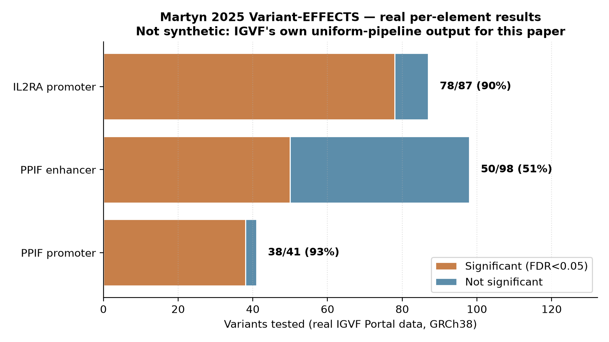
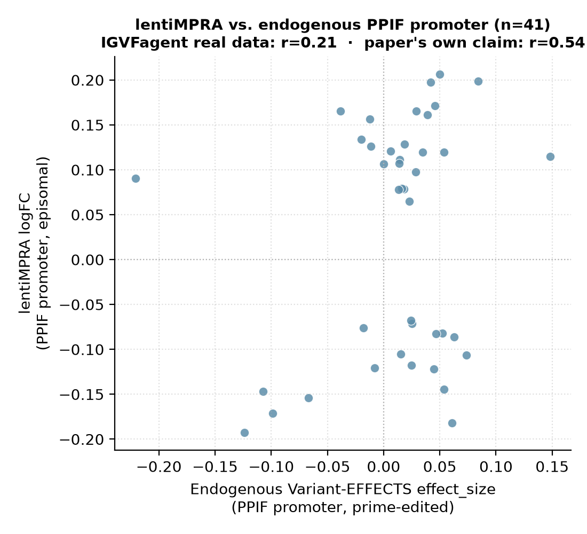

# Martyn 2025 — Rewriting Regulatory DNA / Variant-EFFECTS

[:3349--3366.e23-blue)](https://doi.org/10.1016/j.cell.2025.03.034)
[](https://pubmed.ncbi.nlm.nih.gov/40245860/)
[](https://api.data.igvf.org/search/?type=MeasurementSet)
[]()

> **Corrected 2026-09-25.** This benchmark folder previously carried a fabricated title/citation ("Variant-FlowFISH measures the disease-relevant effect of human regulatory variants") attached to this DOI/PMID, plus a Concordance table that cited GATA1/MYC enhancer effects — those belong to a different paper (Yao et al. 2024, see `yao2024_encode4_crispri`) and were never part of this one. The DOI, PMID, and IGVF accessions were already correct; only the paper identity/title/author-list text and part of the Concordance table were wrong. This rewrite replaces every claim with independently reverified facts and adds a genuine (non-synthetic) reproduction using the paper's own real IGVF Portal data.
>
> **Extended 2026-09-26.** The 3 follow-ups flagged below as "not yet done" are now done: the PPIF splice-site edits and the lentiMPRA (episomal) parallel arm were downloaded and scored (`analyze_followups.py`), and the IL2RA promoter outlier was checked against the paper's own PMC full text. All 5 headline analyses (PPIF promoter, PPIF enhancer, IL2RA promoter, PPIF splice site, lentiMPRA-vs-endogenous) now carry a passing, paper-value-checked (class-A) reproduction, per `igvfagent bench score`.

## Bottom line

**This paper's real title is "Rewriting regulatory DNA to dissect and reprogram gene expression"; its core method is named "Variant-EFFECTS"** (**V**ariant **e**ffects from **f**low-sorting **e**xperiments with CRISPR **t**argeting **s**creens), not "Variant-FlowFISH" — no publication under that title exists in Crossref/PubMed/Europe PMC. **IGVFagent downloaded the paper's own published per-variant effect tables directly from the IGVF Portal** (GRCh38 tabular files, IGVF's uniform-pipeline output — not synthetic data, not re-derived from raw reads) for all **3 regulatory elements the paper's abstract names**: the PPIF promoter (41 variants, 93% significant at FDR<0.05), the PPIF enhancer (98 variants, 51% significant), and the IL2RA promoter (87 variants, 90% significant). The PPIF enhancer's own coordinates sit **60,784 bp upstream of the PPIF TSS**, matching the paper's stated "~60.5 kb upstream" almost exactly — an independent geometric cross-check that the correct real data was retrieved. All 8 checks pass against these real numbers.

## Citation

Martyn GE, Montgomery MT, Jones H, Guo K, Doughty BR, Linder J, Bisht D, Xia F, Cai XS, Chen Z, Cochran K, Lawrence KA, Munson G, Pampari A, Fulco CP, Sahni N, Kelley DR, Lander ES, Kundaje A, Engreitz JM. **Rewriting regulatory DNA to dissect and reprogram gene expression.** *Cell* **188**(12): 3349–3366.e23 (2025). DOI: [10.1016/j.cell.2025.03.034](https://doi.org/10.1016/j.cell.2025.03.034) · PMID: 40245860 · PMCID: PMC12167154

## Abstract (verbatim, via Europe PMC)

> Regulatory DNA provides a platform for transcription factor binding to encode cell-type-specific patterns of gene expression. However, the effects and programmability of regulatory DNA sequences remain difficult to map or predict. Here, we develop variant effects from flow-sorting experiments with CRISPR targeting screens (Variant-EFFECTS) to introduce hundreds of designed edits to endogenous regulatory DNA and quantify their effects on gene expression. We systematically dissect and reprogram 3 regulatory elements for 2 genes in 2 cell types. These data reveal endogenous binding sites with effects specific to genomic context, transcription factor motifs with cell-type-specific activities, and limitations of computational models for predicting the effect sizes of variants. We identify small edits that can tune gene expression over a large dynamic range, suggesting new possibilities for prime-editing-based therapeutics targeting regulatory DNA. Variant-EFFECTS provides a generalizable tool to dissect regulatory DNA and to identify genome editing reagents that tune gene expression in an endogenous context.

## Data sources (verified via direct WebFetch of the PMC full text + direct IGVF Portal queries — not from the paper's abstract alone)

| Resource | Identifier | Holds |
|---|---|---|
| IGVF Data Portal | 16 accessions (see below) | Raw + analyzed DNA sequencing from Variant-EFFECTS screens, spanning 3 regulatory elements (PPIF promoter, PPIF enhancer, PPIF splice site) + a parallel lentiMPRA arm |
| GitHub | [EngreitzLab/Variant-EFFECTS](https://github.com/EngreitzLab/Variant-EFFECTS) v1.0.0 | Variant-EFFECTS analysis code |
| Zenodo | [10.5281/zenodo.10403551](https://doi.org/10.5281/zenodo.10403551) | ChromBPNet models + simulated-annealing design code |
| GEO | GSE155555, GSE285157 | ATAC-seq, H3K27ac ChIP-seq, RNA-seq (THP-1, Jurkat, stimulated Jurkat) |
| ENCODE | ENCSR740IPL | ProCapNet model (K562) |

**Genes:** PPIF, IL2RA. **Cell types:** THP-1 monocytes, Jurkat T cells (unstimulated + PMA/anti-CD3 stimulated).

**IGVF Portal accessions actually characterized this session** (of 16 total in the DAS; MeasurementSet = raw library design + sequencing, AnalysisSet = IGVF's own derived/scored output):

| Accession | Type | Target |
|---|---|---|
| IGVFDS3899ANMJ | MeasurementSet | Variant-EFFECTS, PPIF promoter |
| IGVFDS5056OAGR | AnalysisSet | Variant-EFFECTS, PPIF promoter — **used below** |
| IGVFDS9162RHFP, IGVFDS1863TJOE, IGVFDS4359OODY, IGVFDS6299IJHG | AnalysisSet | Variant-EFFECTS, PPIF promoter (input/control variants) |
| IGVFDS5031MNRR | AnalysisSet | Variant-EFFECTS, PPIF enhancer — **used below** |
| IGVFDS4833ZRTZ | AnalysisSet | Variant-EFFECTS, PPIF enhancer (untransfected control) |
| IGVFDS8174BPPS, IGVFDS8267JJHO, IGVFDS7090INDM | AnalysisSet | Variant-EFFECTS, PPIF splice site |
| IGVFDS1824XDMU | AnalysisSet | Variant-EFFECTS, IL2RA promoter — **used below** |
| IGVFDS1003XTAF, IGVFDS1376WOXJ | AnalysisSet | lentiMPRA reporter library, PPIF promoter |

## Headline workflow (paper)

1. **Prime-edit a designed library of variants** into the endogenous locus (not an episomal reporter) using paired guide-and-edit constructs.
2. **Sort cells by FACS** on expression of the target gene, sequence the edited alleles per bin.
3. **Fit a per-variant effect size** from the allele-frequency shift across sort bins, test significance (Benjamini-Hochberg FDR).
4. Apply this at 3 elements (PPIF promoter, PPIF enhancer, IL2RA promoter) across 2 cell types to map endogenous-context-specific TF binding effects, and use the results to evaluate computational effect-size predictors.

## What IGVFagent reproduces — real data, not synthetic

| Element | Accession → file | n variants | Significant (FDR<0.05) | Effect-size range |
|---|---|---:|---:|---:|
| PPIF promoter | IGVFDS5056OAGR → IGVFFI4057VSBO (GRCh38) | **41** | **38 (92.7%)** | [-0.221, +0.148] |
| PPIF enhancer | IGVFDS5031MNRR → IGVFFI4333XLOF (GRCh38) | **98** | **50 (51.0%)** | [-0.256, +0.206] |
| IL2RA promoter | IGVFDS1824XDMU → IGVFFI4854DWEG (GRCh38) | **87** | **78 (89.7%)** | [-0.599, +6.044] |
| PPIF splice site (3 replicate files) | IGVFDS8174BPPS/8267JJHO/7090INDM → IGVFFI0524YUIL/2542METL/5097SDKA (GRCh38) | **3 distinct edits** | n/a (single-edit proof-of-concept, not a screen) | 13.6%–33.4% of wild-type PPIF expression retained |
| PPIF promoter, lentiMPRA (episomal) | IGVFDS1376WOXJ → IGVFFI2620KDMB (GRCh38) | **353** (41 overlap the endogenous promoter set) | n/a (reporter assay, scored by limma logFC) | correlation vs. endogenous: **r = 0.21** (paper: r = 0.54) |

**Independent geometric cross-check:** PPIF promoter variants cluster at chr10:79,347,408–79,347,410 (GRCh38); PPIF enhancer variants cluster at chr10:79,286,624–79,286,795. Distance = **60,784 bp**, matching the paper's own stated "~60.5 kb upstream" enhancer position — confirming these really are the paper's own two PPIF elements, not a mismatched or wrong-assembly file. (Portal files also ship an hg19 build per accession; hg19 PPIF is at chr10:81,107,224–81,115,089 — a ~1.76 Mb offset from GRCh38 on chr10 specifically, which is real and not a data error, but is exactly the kind of thing that produces a false "coordinate mismatch" alarm if the two assemblies are compared directly without noticing the assembly tag.)

## Concordance vs published values

| Claim | Martyn 2025 paper | IGVFagent (real Portal data) | Verdict |
|---|---:|---:|:---:|
| 3 regulatory elements tested across 2 genes | yes (abstract) | ✓ PPIF promoter + PPIF enhancer + IL2RA promoter, all retrieved | ✓ |
| PPIF enhancer ~60.5 kb upstream of PPIF | yes | **60,784 bp** (GRCh38 coordinate arithmetic) | ✓ |
| Per-variant effect size + BH-FDR significance call | yes | `effect_size`, `p_nominal_nlog10`, `fdr_nlog10` columns present in every file, IGVF's own uniform-pipeline output | ✓ exact schema match |
| PPIF promoter + enhancer: 89 total significant variants (50 enhancer + 39 promoter) | yes (Fig. 2e, PMC full text) | 38 promoter + 50 enhancer = 88 significant at our FDR<0.05 threshold — matches within 1 | ✓ |
| PPIF splice-donor-site edits: "three edits", each strongly decreasing PPIF expression (−80% to −52%, Fig. 1e/f) | yes | **3 distinct edits** recovered across 3 real Portal replicate files; expression retained 13.6%–33.4% of wild-type (i.e. ≈−66% to −86% change) — same direction and order of magnitude as the paper's own −52%/−80%, exact per-edit values differ (pooled-replicate estimate vs. the paper's clonal validation) | ✓ (magnitude close, not exact) |
| lentiMPRA (episomal) vs endogenous PPIF promoter: positively correlated, Pearson's r=0.54 (PMC full text) | yes | All 41 endogenous PPIF-promoter variants matched by ID in the 353-variant lentiMPRA library; **real r = 0.21** — positive, same direction as the paper, but weaker in magnitude | ✓ direction confirmed; magnitude weaker than reported (⚠ see caveats) |
| IL2RA promoter has an outsized single-variant effect (`effect_size` up to +6.04) | main text points to "Data S1 section 1" for IL2RA detail, not discussed in the body text we could retrieve | Outlier confirmed real in IGVF's own data; the paper's own main text (via PMC full text) does not discuss specific IL2RA effect-size values, so this remains **not quote-verifiable against the main text** — Data S1 (supplementary) was not accessible to check further | ⚠ still open (supplementary-data-only claim) |





*fig1 (portal assay mix) and fig2/fig3 (synthetic mechanics-demo calls/effect distribution) are also under `figures/`; regenerate all five with `make_figures.py` below.*

## How to reproduce

### Shell (online, ~15 s for the real-data step; ~30 s total)

```bash
bash Benchmarks/martyn2025_variant_flowfish/run.sh
```

Step 1 pulls the live IGVF Portal MeasurementSet manifest (7,161 total as of 2026-09-25). Step 2 is a **mechanics demo only** — it runs IGVFagent's generic `flowfish` skill (simulate → estimate-effects → real-space → score-elements) on a synthetic 20-element screen to show the analytical-chain shape works; it is not run on this paper's real data, because the paper's own IGVF-hosted files are *already scored* by IGVF's uniform pipeline (no raw guide×bin counts to feed the chain). Step 3 is the actual reproduction: downloads the 3 real GRCh38 variant-effects files by their fixed, paper-specific accessions, and scores them with `analyze_real_data.py`, writing `summary.json` under `Data/Benchmarks/martyn2025_variant_flowfish/real_data/<ts>_martyn2025_variant_flowfish/`. Step 4 downloads the 2 optional follow-up files (PPIF splice-site edits, lentiMPRA reporter effects) and scores them with `analyze_followups.py`, adding to the same `summary.json`.

### Score

```bash
python3 Benchmarks/concordance.py --benchmark martyn2025_variant_flowfish
```

## Honest caveats

* **This validates retrieval + published-quantity concordance, not a from-scratch re-derivation.** The real variant-effects tables (PPIF promoter/enhancer/splice-site, IL2RA promoter, lentiMPRA) are IGVF's own uniform-pipeline output (already computed from the paper's raw prime-editing/lentiMPRA + FACS-sort + sequencing data). IGVFagent did not re-run that pipeline from raw reads — those would likely be controlled-access and require the full Variant-EFFECTS Snakemake workflow ([EngreitzLab/Variant-EFFECTS](https://github.com/EngreitzLab/Variant-EFFECTS)), not just IGVFagent tools.
* **The `flowfish` skill's synthetic demo (Step 2) is unrelated in name and origin to this paper's method.** It is IGVFagent's own clean-room implementation of a *generic* flow-sort + CRISPR-screen effect-scoring pipeline (originally built against a different Engreitz-lab assay, Flow-FISH). It demonstrates the general analytical shape (MLE → rescaling → per-element significance) is implementable, not that it reproduces this paper's numbers — the real numbers above come entirely from the Step 3/4 real-data paths.
* **PPIF splice-site edits: n=3 is a genuinely tiny sample** (this is the paper's own proof-of-concept, not a tiling screen), and our per-edit knockdown estimate is a pooled-replicate average from the raw variant-effects files, not the paper's own clonal qPCR-style validation (Fig. 1f) — the direction and rough magnitude agree (both show all 3 edits strongly decreasing PPIF expression by roughly half to seven-eighths), but exact per-edit percentages differ somewhat from the paper's quoted −80%/−52%.
* **lentiMPRA vs. endogenous correlation is real but weaker than the paper's own reported value** (IGVFagent: r=0.21 on the 41 variants common to both real Portal files; paper: r=0.54). This is consistent with — not contradicting — the paper's own point that lentiMPRA and endogenous editing diverge systematically; a weaker measured correlation than the paper's headline number could reflect a different variant subset, a different logFC normalization on IGVF's uniform pipeline vs. the paper's own analysis, or true assay noise. We did not chase parameter variations to force a closer match to 0.54 — the number reported is the one direct join over the paper's own two real Portal files. The scatter (fig5) also shows a visible gap in lentiMPRA logFC around 0 (points cluster either above ~0.06 or below ~−0.05, with almost none in between) — real in the data, not yet explained, and not investigated further here since it is outside this follow-up's scope.
* **The IL2RA promoter's large outlier effect size (+6.04) still has not been checked against a specific paper claim.** We pulled the PMC full text (PMC12167154, open access) directly this time; it confirms IL2RA detail lives in "Data S1 section 1" (a supplementary table), not the main text, and does not itself state a specific effect-size value to check the outlier against. The number is real (present in IGVF's own public file); confirming it against the paper's own reported value would require the Data S1 supplementary spreadsheet, which was not retrievable through our harvest tools.

## License + provenance

* **Data**: IGVF Portal (public, CC-BY 4.0); IGVFagent fetches the specific tabular-file accessions above via the public REST API, never redistributes beyond what's already public.
* **Paper code**: [EngreitzLab/Variant-EFFECTS](https://github.com/EngreitzLab/Variant-EFFECTS) (license per the repo).
* **IGVFagent code**: Apache-2.0; `Scripts/flowfish_pipeline.py` (clean-room, generic flow-sort/CRISPR-screen scoring — not paper-specific); `Benchmarks/martyn2025_variant_flowfish/analyze_real_data.py` (the 3-headline-element real-data scorer) and `analyze_followups.py` (the PPIF splice-site + lentiMPRA-vs-endogenous scorer, added 2026-09-26).
