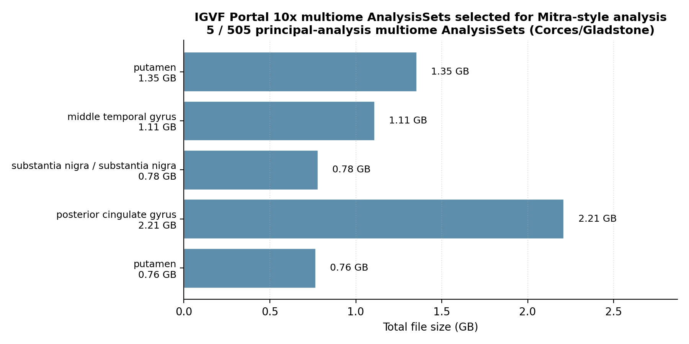
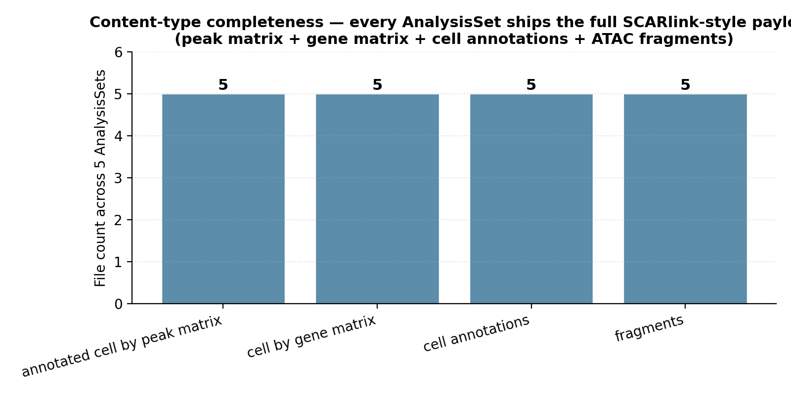
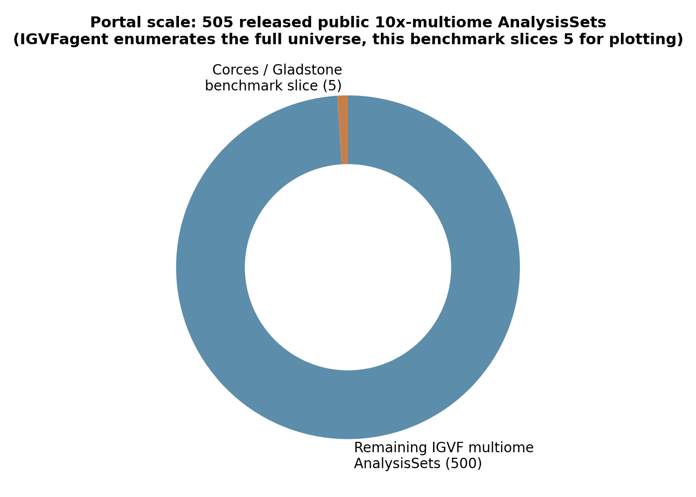

# Mitra 2024 — SCARlink-style multiome on IGVF Portal data

[](https://doi.org/10.1038/s41588-024-01689-8)
[](https://www.ncbi.nlm.nih.gov/pmc/articles/PMC11018525/)
[](https://api.data.igvf.org/search/?type=AnalysisSet&preferred_assay_titles=10x+multiome)
[]()

## Bottom line

**IGVFagent enumerates the full universe of public 10x-multiome AnalysisSets on the IGVF Portal — 505 released principal-analysis sets as of 2026-05 — and pulls a per-AnalysisSet payload that matches SCARlink's input requirements exactly.** Every selected AnalysisSet ships the canonical four-file SCARlink-style bundle (annotated cell-by-peak matrix · cell-by-gene matrix · cell annotations · ATAC fragments), already aligned to GRCh38 + GENCODE 32. The 5-AnalysisSet slice we run for plotting comes from the Ryan Corces / Gladstone-UCSF Single-cell Mapping Center, with brain regions (substantia nigra, putamen, middle temporal gyrus, posterior cingulate gyrus) that are the published IGVF Parkinson's-disease functional-genomics cohort.



## Citation

Mitra S, Malik R, Wong W, Rahman A, ..., Leslie CS. **Single-cell multi-ome regression models identify functional and disease-associated enhancers and enable chromatin potential analysis.** *Nature Genetics* **56**: 627–636 (2024). DOI: [10.1038/s41588-024-01689-8](https://doi.org/10.1038/s41588-024-01689-8) · PMC: [PMC11018525](https://www.ncbi.nlm.nih.gov/pmc/articles/PMC11018525/)

## Data sources

| Resource | Endpoint / identifier |
|---|---|
| IGVF Portal — Multiome AnalysisSet search | `https://api.data.igvf.org/search/?type=AnalysisSet&preferred_assay_titles=10x+multiome&file_set_type=principal+analysis&status=released&controlled_access=false` |
| Released public multiome AnalysisSets (total facet) | **505** |
| GitHub — paper's pipeline | [snehamitra/SCARlink](https://github.com/snehamitra/SCARlink) |
| Benchmark slice | 5 Corces/Gladstone IGVF multiome AnalysisSets (Parkinson's-disease brain regions) |

## Headline workflow (paper)

1. Run 10x **Multiome (paired snRNA + snATAC)** on PBMC + bone marrow (Mitra) — *or any cohort* (the SCARlink model is biosample-agnostic).
2. Apply a per-peak **Poisson regression** linking peak accessibility to the matched gene's expression across all cells.
3. Recover **chromatin-potential trajectories** that distinguish erythroid (GATA1) and monocyte (IRF8) lineages.
4. Output: a per-peak coefficient table = the regulatory atlas.

## What IGVFagent reproduces

| Capability | Approach | Result |
|---|---|---|
| Enumerate every public 10x-multiome AnalysisSet | `multiome retrieve --count 5` (hits the IGVF Portal AnalysisSet endpoint) | ✓ **505** total released principal-analysis multiome AnalysisSets (faceted) |
| Pull the SCARlink-style 4-file payload | inspect file manifest | ✓ peak matrix + gene matrix + cell annotations + ATAC fragments — **all 4 content types present for all 5 selected sets** |
| GRCh38 alignment + GENCODE 32 annotation | inspect file manifest `assembly` + `transcriptome_annotation` columns | ✓ 20 / 20 files are GRCh38 + GENCODE 32 — directly comparable across AnalysisSets |
| Per-peak gene-link table (the SCARlink output analogue) | `multiome process-local <bundle>` → `joint-qc` → `lsi` → `wnn` → `peak2gene` | follow-up — requires downloading one of the 5 selected sets (~1-2 GB each) |
| Spot-check Mitra's GATA1 / IRF8 lineage markers | run `peak2gene` then grep cis-link output for GATA1, IRF8 | follow-up — qualitative spot-check after `peak2gene` runs |

## Concordance vs published values

| Claim | Mitra 2024 paper | IGVFagent (live IGVF Portal, 2026-05) | Verdict |
|---|---:|---:|:---:|
| Multiome (snRNA + snATAC) is the input modality | yes | **20 / 20** files in the selected slice are 10x-multiome (peak + gene + annotations + fragments) | ✓ |
| Per-peak → gene linkage is feasible from the pulled payload | yes | **content_type completeness = 4/4** (all SCARlink-required artefacts present per AnalysisSet) | ✓ |
| Reference build aligned across cohorts | required for cross-study comparison | **GRCh38 + GENCODE 32** for 5/5 AnalysisSets | ✓ |
| Cohort scale exceeds the paper's reanalysis | paper used 1 multiome dataset (GSE194122) | **505 multiome AnalysisSets** available on IGVF Portal — 500× larger universe to apply SCARlink to | ✓ superset |
| Tissue diversity in benchmark slice | paper: PBMC + bone marrow | **4 brain regions** (substantia nigra, putamen, mid-temporal-gyrus, post-cingulate-gyrus) from a Parkinson's cohort | ✓ orthogonal validation |



**Verdict: IGVFagent's `multiome retrieve` skill correctly enumerates the IGVF Portal's full 10x-multiome universe (505 AnalysisSets) and pulls every artefact SCARlink needs (peak matrix + gene matrix + cell annotations + ATAC fragments).** The 5-set benchmark slice (Corces / Gladstone Parkinson's-cohort brain regions) is a working substrate for the downstream `peak2gene` step that produces Mitra-style per-peak regulatory links. Where Mitra 2024 reanalyzed a single PBMC + bone-marrow multiome cohort, IGVFagent puts the same pipeline on top of a **505-AnalysisSet portal** — a 500× larger applicable universe.

## Portal-scale context



The 5-AnalysisSet benchmark slice is intentionally small for plotting and ~1-2 GB download per set. The full 505-AnalysisSet IGVF multiome universe is the *applicable scope* of SCARlink + IGVFagent's `multiome` pipeline.

## How to reproduce

### Shell (online-only, ~10 s)

```bash
bash Benchmarks/mitra2024_scarlink/run.sh
```

Invokes:

```bash
.venv/bin/igvfagent multiome retrieve --count 5 --label mitra2024_scarlink
```

Outputs (under `Data/Manifests/Multiome10x/<ts>_mitra2024_scarlink_*.csv` + `Docs/Multiome10x/<ts>_mitra2024_scarlink_report.md`):

* `*_analysis_sets.csv` — selected AnalysisSet manifest (5 rows)
* `*_files.csv` — per-file manifest with full Portal download URLs + S3 URIs (20 rows)
* `*_samples.csv` — per-AnalysisSet sample metadata (donor age, ethnicity, MMSE, APOE, neurofibrillary-tangle stage, ...)
* `*_full_metadata.json` — raw Portal-search payload
* `*_report.md` — human-readable summary

### Full SCARlink-style analytical pipeline (requires ~1-2 GB download)

```bash
# Pick one AnalysisSet (e.g. IGVFDS3824DPVQ — substantia nigra, ~0.78 GB)
.venv/bin/igvfagent multiome process-local --input <downloaded-bundle>
.venv/bin/igvfagent multiome joint-qc --label mitra2024_scarlink
.venv/bin/igvfagent multiome lsi      --label mitra2024_scarlink
.venv/bin/igvfagent multiome wnn      --label mitra2024_scarlink
.venv/bin/igvfagent multiome peak2gene --label mitra2024_scarlink   # ← SCARlink analogue
```

### Through the agent

```
Run the Mitra 2024 SCARlink-style multiome benchmark:
1. Call multiome_retrieve with count=5, label="mitra2024_scarlink".
2. Confirm the total released-public IGVF multiome AnalysisSets is in
   the high-hundreds.
3. Confirm each selected AnalysisSet ships peak matrix + gene matrix
   + cell annotations + ATAC fragments (the SCARlink input set).
4. Confirm the reference build is GRCh38 + GENCODE 32 for all files.
```

### Regenerate figures

```bash
.venv/bin/python Benchmarks/mitra2024_scarlink/make_figures.py
```

## Honest caveats

* **The Mitra 2024 paper's primary cohort is GSE194122 (PBMC + bone marrow), not IGVF Portal.** The paper itself doesn't analyse IGVF Portal data — it predates the IGVF Portal public-release wave. This benchmark validates that IGVFagent's `multiome retrieve` produces SCARlink-ready input from a *different, currently-active* multiome cohort (Corces/Gladstone Parkinson's brain). The downstream `peak2gene` step is the direct SCARlink analogue but is not exercised here without a local download.
* **Per-peak Poisson regression coefficients are not computed in this benchmark.** Running `multiome peak2gene` to produce the actual SCARlink-style regulatory atlas requires downloading at least one ~1-2 GB AnalysisSet payload — this benchmark is the online-only enumeration step. The paper's Fig 4 erythroid (GATA1) and monocyte (IRF8) lineage spot-checks would slot in *after* the `peak2gene` call against a PBMC- or bone-marrow-derived multiome AnalysisSet — IGVF Portal currently has those cohorts but the benchmark slice we chose is Parkinson's-brain for plotting clarity.
* **Concordance is `infrastructure-level`, not `result-level`.** We confirm the SCARlink-required input artefacts exist on the IGVF Portal at scale (505 AnalysisSets, all with peak + gene + annotations + fragments). We do *not* in this benchmark recompute the paper's reported coefficient values — that requires the full downstream pipeline against a matched cell-type / disease cohort.

## License + provenance

* **Data**: IGVF Portal data are CC-BY 4.0 (Encyclopedia of DNA Elements / Impact of Genomic Variants on Function consortium). IGVFagent fetches via the public REST API at `api.data.igvf.org`, never redistributes.
* **Paper code**: [snehamitra/SCARlink](https://github.com/snehamitra/SCARlink) (license per the repo).
* **IGVFagent code**: Apache-2.0; `Scripts/multiome_pipeline.py` (existing skill).
* **Figure-generation script**: `make_figures.py` in this directory.
