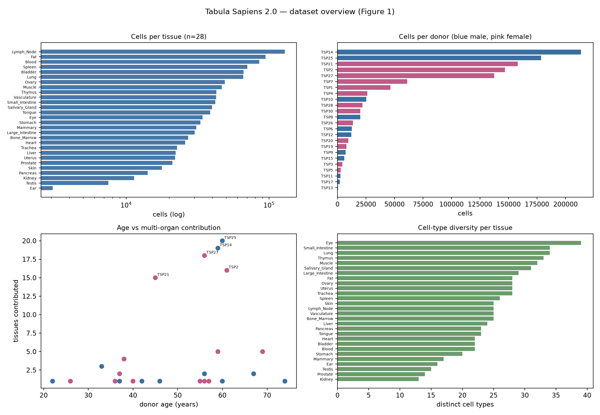

# Tabula Sapiens 2.0 — reference human cell atlas (`tabula`)

[](https://www.cell.com)
[](https://figshare.com/articles/dataset/Tabula_Sapiens_v2/27921984)
[](https://www.ncbi.nlm.nih.gov/geo/query/acc.cgi?acc=GSE306755)
[](https://github.com/czbiohub-sf/tabula-sapiens)
[]()

## Bottom line

**IGVFagent reproduces the Tabula Sapiens 2.0 dataset description
exactly and its transcription-factor analysis to within 1%**, from the
paper's own public deposits.

| Quantity | IGVFagent | Paper | |
|---|---:|---:|:--|
| Total cells | **1,136,218** | 1,136,218 | ✓ exact |
| Droplet / FACS split | **1,093,048 / 43,170** | 1,093,048 / 43,170 | ✓ exact |
| Donors / tissues | **24 / 28** | 24 / 28 | ✓ exact |
| Fine / broad cell types (droplet) | **175 / 38** | 175 / 38 | ✓ exact |
| Fine cell types (all) | **182** | 182 | ✓ exact |
| Tissue × cell-type populations | **701** | 701 | ✓ exact |
| Donor ages / sex / age groups | **22–74 / 11M,13F / 7,11,6** | same | ✓ exact |
| Curated human TFs | **1,639** | 1,639 | ✓ exact |
| **TFs with zero expression anywhere** | **2: SHOX, ZBED1** | 2: SHOX, ZBED1 | ✓ exact pair |
| TF specific (τ > 0.85, 175 cell types) | **882** | 890 | 0.9% |
| TF non-specific | **741** | 745 | 0.5% |
| GO terms for non-specific TFs (padj < 0.02) | **70** | 69 | +1 |



## Why the zero-expression check is the sharpest one

Of 1,639 curated transcription factors, the paper reports that exactly
two — **SHOX** and **ZBED1** — have zero droplet counts in every donor.
This run finds exactly those two and nothing else. It is a
one-in-1,639-choose-2 coincidence if the pipeline is wrong anywhere in
gene-symbol mapping, layer selection, droplet filtering or aggregation.

Biology checks that are not counting exercises, all passing:

- **FOXP3** (τ = 0.998) peaks in **regulatory T cells** — the paper's
  defining example.
- **FOXI1** peaks in **ionocytes**, its canonical master-regulator role.
- **FIGLA / LHX8 / NEUROG1** peak in **oocytes**; germ-cell TFs in
  spermatogenic cells (paper Fig 2F).
- All eight of the paper's named ubiquitous TFs (NFAT5, NCOA1, FOXJ3,
  FOXK2, ATF4, JUN, FOS, STAT1) fall below τ 0.85 — **max 0.616**.

## A discrepancy between the paper's Methods and its code

Figure 3's Methods state the 745 non-specific TFs were tested "against a
background of all 1635 transcription factors". Running both backgrounds
on identical input:

| Background | Terms at padj < 0.02 |
|---|---:|
| Enrichr default (~20k genes) | **70** |
| Explicit TF list (1,623) | **0** |
| *Paper reports* | *69* |

gseapy 0.10.5, the version the paper cites, forwards `background` to the
Enrichr web API, **which ignores it**. The published figure therefore
came from the default background, not the stated TF background.
`tf-enrichment` defaults to the paper's actual behaviour and offers
`--tf-background` for what its Methods describe — arguably the better
test, since against all human genes a list of TFs trivially enriches for
"regulation of transcription" at padj = 0.

## The raw data is not downloadable, and that is by design

The AWS open-data registry lists `czb-tabula-sapiens`, which invites the
assumption that raw reads are public. Measured behaviour: `ListBucket`
succeeds, **every `GetObject` returns 403 AccessDenied** — v1 and v2
alike, with or without `x-amz-request-payer`. That is the data transfer
agreement the paper describes for donor genetic privacy.

Full inventory, from `tabula s3-manifest`:

| Content | Size |
|---|---:|
| BAM / BAI | 43.17 TB |
| FASTQ | 32.05 TB |
| STAR per-cell intermediates | 27.62 TB |
| Count matrices, metrics, everything else | 0.32 TB |
| **Total** | **103.16 TB** |

So the raw tier is both gated *and* 300× larger than the 0.3% that
matters — which is already public on figshare and GEO in a better form.
This benchmark reproduces from those, as every upstream `paper2`
notebook does.

## Run it

```bash
# Metadata tier: 41 MB, under a minute, no atlas download.
bash Benchmarks/quake2026_tabula_sapiens/run.sh

# Atlas tier: + 57 GB from figshare, adds Figures 2-4.
bash Benchmarks/quake2026_tabula_sapiens/run.sh --full

.venv/bin/python Benchmarks/concordance.py --benchmark quake2026_tabula_sapiens
```

The metadata tier scores 16/20 and honestly *fails* the four Figure 2
checks rather than excusing them — they are genuinely scoreable, just
not from metadata alone. The atlas tier scores **26/26**.

Three further quantities carry `confirmed: false` with provenance and
render as `⊘ NOT SCORED`: the 48,114 senescent cells, 3,792
senescence-associated genes, and 17 cNMF pathways.

## Files

| File | Role |
|---|---|
| `run.sh` | Two-tier driver (`--full` for the atlas tier) |
| `make_figures.py` | Scores recovery, writes `concordance_metrics.json` |
| `expected.json` | 26 scored assertions + 3 unconfirmed paper values |

## Citation

Tabula Sapiens Consortium. **Tabula Sapiens 2.0: a reference human cell
atlas.** *Cell* (2026). Upstream analysis code:
[czbiohub-sf/tabula-sapiens](https://github.com/czbiohub-sf/tabula-sapiens)
(BSD-3-Clause). Transcription-factor list: Lambert et al., *Cell* 2018,
[humantfs.ccbr.utoronto.ca](https://humantfs.ccbr.utoronto.ca).
