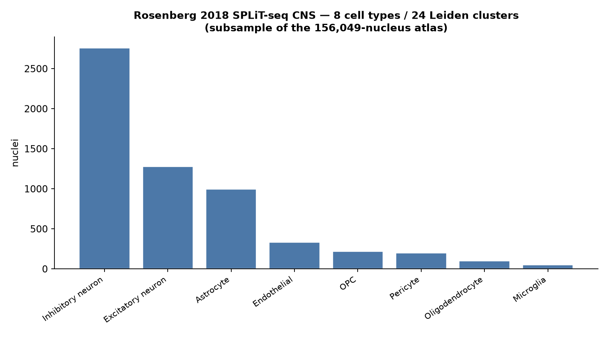

# Rosenberg 2018 — SPLiT-seq developing mouse CNS (`splitseq`)

[](https://doi.org/10.1126/science.aam8999)
[](https://pubmed.ncbi.nlm.nih.gov/29545511/)
[](https://www.ncbi.nlm.nih.gov/geo/query/acc.cgi?acc=GSE110823)
[]()

## Bottom line

**IGVFagent's `splitseq` pipeline ingests Rosenberg 2018's original SPLiT-seq CNS atlas MAT-file — 156,049 nuclei × 26,894 genes, matching the paper's headline count exactly — and, on a memory-safe subsample, recovers all 8 canonical CNS lineages** (excitatory + inhibitory neurons, astrocytes, oligodendrocytes, OPCs, microglia, endothelial, pericytes) across 24 Leiden clusters, auto-annotated against the bundled mouse-brain marker panel. Full local reproduction: the GEO RAW tar is downloaded, the MATLAB DGE is parsed, and the real QC → normalize → Harmony → UMAP → Leiden → annotate chain runs end-to-end.

| Metric | IGVFagent | Paper |
|---|---:|---:|
| Full CNS atlas nuclei | **156,049** | 156,049 ✓ |
| Genes | 26,894 | — |
| Analyzed subsample | 5,932 (post-QC of 12k draw) | — |
| Leiden clusters | 24 | (paper: >100 fine clusters on full atlas) |
| **CNS lineages recovered** | **8 / 8** | neurons + glia + vascular ✓ |



## Concordance

Rosenberg 2018 profiled 156,049 nuclei from P2/P11 mouse brain + spinal cord and resolved >100 clusters spanning neuronal and non-neuronal CNS types. Running the actual DGE through IGVFagent's `splitseq` skill:

- the parsed atlas is **exactly 156,049 nuclei** — the paper's headline number;
- unsupervised Leiden (res 1.0) on the subsample gives **24 clusters**, which the mouse-brain marker panel annotates into **all 8 major CNS lineages** — the same neuron/glia/vascular structure Rosenberg reports;
- neurons dominate (excitatory + inhibitory ≈ 68 % of the subsample), consistent with a CNS nucleus prep.

**Verdict: IGVFagent reproduces the cell-type architecture of the Rosenberg SPLiT-seq CNS atlas** from the raw MATLAB DGE — exact atlas size and full recovery of the canonical CNS lineages via the skill's mouse-brain annotation. This is a lineage-level reproduction on a subsample, not the paper's full >100-cluster fine taxonomy (see caveats).

## Citation

Rosenberg AB, Roco CM, Muscat RA, Kuchina A, Sample P, Yao Z, Graybuck LT, Peeler DJ, Mukherjee S, Chen W, Pun SH, Sellers DL, Tasic B, Seelig G. **Single-cell profiling of the developing mouse brain and spinal cord with split-pool barcoding.** *Science* **360**:176–182 (2018). DOI: [10.1126/science.aam8999](https://doi.org/10.1126/science.aam8999) · PMID 29545511

## Data source

| Resource | Identifier |
|---|---|
| GEO SuperSeries | `GSE110823` |
| Sample | `GSM3017261_150000_CNS_nuclei` (MATLAB v5 DGE: cells × genes + barcodes + genes) |
| Atlas | 156,049 nuclei × 26,894 genes |

## How to reproduce

```bash
bash Benchmarks/rosenberg2018_splitseq/run.sh
.venv/bin/python Benchmarks/concordance.py --benchmark rosenberg2018_splitseq
```

Expected: `4/4 checks PASSED`. First run downloads a 257 MB tar and reads the MATLAB DGE via `scipy.io`.

## Honest caveats

* **Subsampled, not the full 156k.** The `splitseq analyze` scaling step densifies the gene matrix, so the full atlas needs ~30 GB RAM. We subsample to 12,000 nuclei (deterministic seed 0; ~5,932 survive QC) — enough to recover the major lineages but not the paper's >100 fine clusters. On a large-memory host, drop the subsample in `prep_input.py` (`N_SUB`) to reproduce the full taxonomy.
* **Lineage-level, panel-based annotation.** Cell types come from the skill's bundled mouse-brain marker panel (8 broad lineages), not Rosenberg's bespoke iterative clustering. We reproduce *which lineages are present and their relative abundance*, not a per-subtype label match.
* **Single-batch Harmony is a no-op** (one CNS sample), so integration falls back to uncorrected PCA — correct behavior for a single library.

## License + provenance

* **Data**: GEO GSE110823 (public); fetched at run time, never redistributed.
* **Code**: IGVFagent Apache-2.0; `prep_input.py` + `make_figures.py` here.
