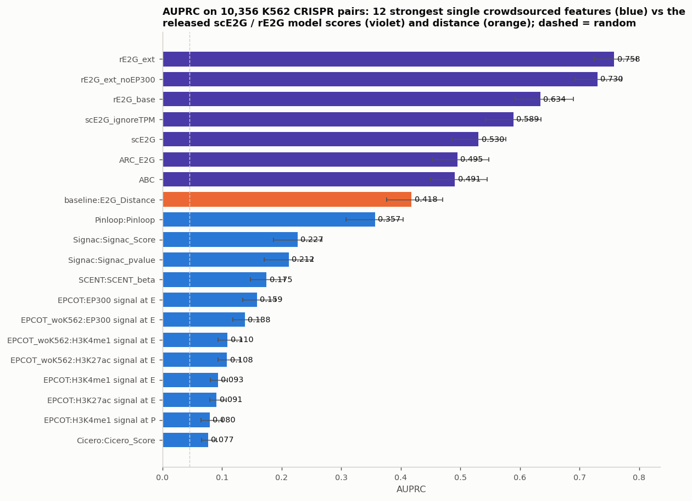
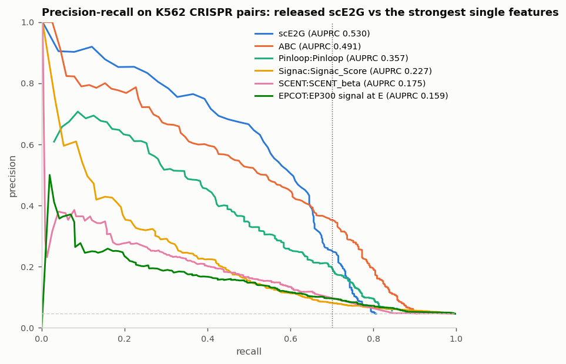
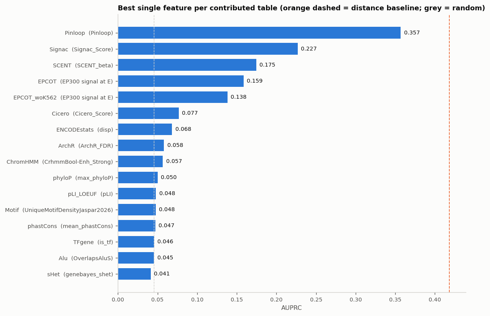

# scE2G crowdsourced-feature benchmark — 121 candidate features vs K562 CRISPR ground truth, checked against the upstream pipeline

**Question.** The IGVF scE2G working group is crowdsourcing new element-gene
features to add to the scE2G multiome model (the "Quick Start on Building New
E2G Models" walkthrough). Sixteen K562 feature tables are on Synapse. Before
anyone spends a day of Slurm time retraining, which of these features carry
signal about CRISPR-validated enhancer-gene regulation on their own, how do they
compare with distance and with the released scE2G model, and does IGVFagent's
scoring agree with the group's own benchmarking pipeline?

**Papers and resources.**
- Sheth, Qiu et al. *Mapping enhancer-gene regulatory interactions from single-cell
  data.* bioRxiv 2024, [10.1101/2024.11.23.624931](https://doi.org/10.1101/2024.11.23.624931) (scE2G).
- Gschwind et al. *An encyclopedia of enhancer-gene regulatory interactions in the
  human genome.* bioRxiv 2023, [10.1101/2023.11.09.563812](https://doi.org/10.1101/2023.11.09.563812)
  (the CRISPR benchmark and its evaluation).
- [EngreitzLab/scE2G](https://github.com/EngreitzLab/scE2G) and
  [EngreitzLab/CRISPR_comparison](https://github.com/EngreitzLab/CRISPR_comparison) @ `5058742`, both MIT.

## Data (all fetched with IGVFagent)

| Role | Source | Accession / path |
|---|---|---|
| 16 crowdsourced K562 E2G feature tables, 11,029,156 element-gene rows each, ~5.7 GB | Synapse folder (access-controlled, PAT) | `syn73717888` → `Data/scE2G/Synapse/syn73717888/` |
| Released scE2G v1.2 K562 predictions, all 11.5 M pairs with Score / ABC / ARC-E2G | IGVF Portal `PredictionSet` | `IGVFDS5428HHMB` → `IGVFFI1706PNVV.tsv.gz` |
| ENCODE-rE2G cross-validated K562 predictions (published anchor: AUPRC 0.634) | Synapse (PAT) | `syn53019593`, `syn53019595` |
| CRISPR ground truth, K562 (10,356 pairs / 471 regulated) | scE2G repository resources | `EPCrisprBenchmark_ensemble_data_GRCh38.intGENCODEv43.tsv.gz` |
| Gold standard: the upstream pipeline's own results on the same inputs | `run_upstream.sh` (Docker + conda, on the IGVFagent VM) | `results/upstream/*/performance_summary.txt` |

The tables come from ten contributing groups: ChromHMM state overlaps (15 booleans),
single-cell co-accessibility / linkage scores from ArchR, Cicero, SCENT and Signac,
EPCOT-predicted epigenomic signals (41 tracks each, with and without K562 in
training), Pinloop loop calls, sequence conservation (phastCons, phyloP), gene
constraint (pLI, LOEUF, s_het), ENCODE expression statistics, TF-gene flags, Alu
overlaps and JASPAR motif density. Fourteen share one element-gene universe; the
Alu and pLI/LOEUF tables use a different row set (see `inventory` output).

## Method

`igvfagent sce2g benchmark --all-features` treats every numeric feature column of
every table as its own predictor and scores it the way `CRISPR_comparison` does:
each CRISPR-tested element-gene pair receives the maximum of the feature over the
predicted elements that overlap the tested element for the same gene, `0` when
none overlaps; p-value / FDR / distance style columns are negated before
aggregation so that higher means more likely and an unmatched pair gets the worst
score. Precision-recall is tie-aware (one threshold per distinct score). Two
AUPRCs are reported: `auprc`, the step rule scikit-learn and benchmark #12 use,
and `auprc_crispr_comparison`, the upstream's exact definition (trapezoid over the
tie-aware points with the recall-0 row and the last threshold row dropped). A
bootstrap 95% interval (200 resamples of the pairs) and precision at 70% recall
complete each row. Tables are streamed and restricted to CRISPR-tested genes, so no
11-million-row table is loaded whole.

The upstream pipeline was then run on the same inputs (`run_upstream.sh`: clone at
`5058742`, build its R environment with conda under `condaforge/miniforge3`, five
comparisons through Snakemake) and `compare_upstream.py` places its
`performance_summary.txt` next to IGVFagent's numbers.

```bash
bash Benchmarks/sce2g_crowdsourced_features_k562/run.sh
.venv/bin/python Benchmarks/concordance.py --benchmark sce2g_crowdsourced_features_k562
bash Benchmarks/sce2g_crowdsourced_features_k562/run_upstream.sh /path/to/workdir   # optional, needs Docker
```

## Gold-standard concordance (IGVFagent vs CRISPR_comparison, same inputs)

| Predictor | upstream AUPRC | IGVFagent `auprc_crispr_comparison` | upstream precision at 70% recall | IGVFagent |
|---|---|---|---|---|
| ENCODE-rE2G extended | 0.7558 | **0.7558** | 0.6992 | **0.6992** |
| ENCODE-rE2G extended, no EP300 | 0.7279 | **0.7279** | 0.6721 | **0.6721** |
| ENCODE-rE2G base | 0.6326 | **0.6326** | 0.5428 | **0.5428** |
| scE2G Score.ignoreTPM | 0.5822 | **0.5822** | 0.4729 | **0.4729** |
| scE2G Score | 0.5190 | **0.5190** | 0.2537 | **0.2537** |
| ARC-E2G | 0.4881 | **0.4881** | 0.3357 | **0.3357** |
| ABC | 0.4839 | **0.4839** | 0.3518 | **0.3518** |
| Pinloop | 0.3311 | **0.3311** | 0.1969 | **0.1969** |
| Signac score | 0.2242 | **0.2242** | 0.0813 | **0.0813** |
| SCENT beta | 0.1773 | 0.1772 | 0.0471 | 0.0470 |

Upstream rows are its runs without the optional TSS filter; the full side-by-side,
including its default runs with the filter on, is `results/upstream_vs_igvfagent.tsv`.
The per-pair merged scores were also compared directly: **0 of 10,356 pairs differ**
between IGVFagent's `scored_pairs_*.tsv` and the upstream `expt_pred_merged_annot`
table for the scE2G score. With the upstream's default `filter_pred_tss: True`, which
removes predictions whose element overlaps a gene TSS (1,533,004 of the 11.5 M
scE2G rows), its AUPRCs move by at most 0.005 (ABC 0.4845, Pinloop 0.3340, Signac
0.2287, SCENT 0.1803); IGVFagent does not implement that filter.

## Results (K562, vs CRISPR ground truth; random-baseline precision 0.0455)

| Predictor | AUPRC (step) | AUPRC (upstream definition) | 95% CI (step) | Precision at 70% recall | Role |
|---|---|---|---|---|---|
| ENCODE-rE2G extended (cross-validated) | 0.758 | 0.756 | 0.725 to 0.796 | 0.699 | published anchor |
| ENCODE-rE2G base (cross-validated) | 0.634 | 0.633 | 0.592 to 0.689 | 0.543 | **published anchor: paper reports 0.634 / 0.543** |
| scE2G Score.ignoreTPM | 0.589 | 0.582 | 0.542 to 0.635 | 0.473 | reference (matches benchmark #12) |
| scE2G Score | 0.530 | 0.519 | 0.486 to 0.577 | 0.254 | reference (matches benchmark #12) |
| ARC-E2G | 0.495 | 0.488 | 0.454 to 0.548 | 0.336 | reference |
| ABC | 0.491 | 0.484 | 0.450 to 0.545 | 0.352 | reference |
| **Distance** (E2G_Distance, inverted) | **0.418** | **0.412** | 0.376 to 0.470 | 0.273 | **baseline** (upstream's own distToTSS baseline: 0.436) |
| Pinloop | 0.357 | 0.331 | 0.308 to 0.404 | 0.197 | best single crowdsourced feature |
| Signac score | 0.227 | 0.224 | 0.187 to 0.267 | 0.081 | single-cell co-accessibility |
| Signac p-value (inverted) | 0.212 | 0.204 | 0.171 to 0.252 | 0.069 | |
| SCENT beta | 0.175 | 0.177 | 0.148 to 0.205 | 0.047 | single-cell linkage |
| EPCOT EP300 signal at E | 0.159 | 0.157 | 0.135 to 0.190 | 0.096 | best predicted epigenomic signal |
| EPCOT (no K562) EP300 signal at E | 0.138 | 0.137 | 0.118 to 0.166 | 0.086 | same, model trained without K562 |
| EPCOT (no K562) H3K4me1 / H3K27ac at E | 0.110 / 0.108 | 0.108 / 0.108 | | 0.087 | |
| Cicero score | 0.077 | 0.081 | 0.066 to 0.090 | 0.046 | |
| ArchR score | 0.055 | 0.055 | 0.047 to 0.068 | 0.045 | |
| ChromHMM strong-enhancer state (binary) | 0.057 | n/a | 0.052 to 0.068 | 0.046 | best chromatin-state boolean |
| conservation, constraint, s_het, motif density, Alu, TF flag, expression stats | 0.041 to 0.068 | | | | at random |

121 single features + 4 scE2G references + 3 rE2G anchors + the distance baseline in
`Docs/scE2G/<ts>_k562_crowdsourced_feature_benchmark/benchmark_summary.tsv`;
89 of the 121 features have AUPRC at or below 0.06, i.e. within 0.015 of random.





## Verdict

**Reproduced against the pipeline the field uses.** IGVFagent's scorer and
`CRISPR_comparison` produce identical per-pair scores for every one of the 10,356
K562 CRISPR pairs, identical precision at 70% recall, and identical AUPRC to four
decimals once the same AUPRC definition is used. The published ENCODE-rE2G base
number (0.634 / 0.543) comes back exactly. On that footing the feature screen says:

1. **No single crowdsourced feature beats distance.** Distance alone scores 0.418
   (upstream's own distance-to-TSS baseline: 0.436); the best feature, Pinloop,
   scores 0.357. The earlier reading of this benchmark had distance at 0.106,
   which was a bug in how inverse predictors were filled; the gold-standard run
   is what exposed it.
2. **Pinloop, Signac and SCENT beta carry real signal** (0.357 / 0.227 / 0.175,
   4 to 8 times random), followed by EPCOT's EP300, H3K4me1 and H3K27ac at the
   element (0.11 to 0.16). Whether any of it is complementary to distance and
   ATAC is exactly what retraining scE2G with them (`igvfagent sce2g features /
   configure / run`) will answer; a standalone screen cannot.
3. **The EPCOT model trained without K562 is about as informative as the one
   trained with it** for EP300 (0.138 vs 0.159) and slightly stronger for the
   enhancer marks, so the signal is not K562 memorisation.
4. **Sequence conservation, gene constraint, Alu content, motif density, ChromHMM
   state and expression statistics carry no standalone signal** on this benchmark.
5. **No single feature approaches the trained model** (0.357 vs 0.530), the
   expected result and the reason features are added to scE2G rather than
   replacing it.

## Honest caveats

- **Two AUPRC definitions.** The step rule (`auprc`) is what benchmark #12,
  scikit-learn and most Python code compute; the upstream pipeline drops the last
  threshold block and integrates by trapezoids, which reads lower for tables
  where many pairs sit at the fill value (Pinloop 0.357 vs 0.331). Both are in
  every table; the gold-standard column is `auprc_crispr_comparison`. For a binary
  feature the upstream definition has nothing to integrate and is reported as
  n/a; upstream excludes boolean predictors from its summary for the same reason.
- **The TSS filter is not implemented.** Upstream's default removes predictions
  overlapping a gene TSS; the effect on these predictors is at most 0.005 AUPRC.
- **Single-feature AUPRCs are not feature importance inside scE2G.** A feature at
  random here can still help a model that conditions on distance and ATAC; the
  definitive test is the retrained model, which needs the Synapse K562 RNA and
  ATAC inputs (`syn72418482`) plus snakemake and R on a cluster.
- **Overlap coverage is 0.80 to 0.89, not 1.0.** CRISPR pairs whose gene has no
  element in a table score as the fill value and count against the predictor,
  exactly as upstream does with `include_missing_predictions`. ArchR, Cicero and
  SCENT leave many pairs unscored (0.45 to 0.60 covered), which depresses their
  AUPRC relative to features defined on every pair.
- **Direction is assigned by name.** Columns matching p-value / FDR / distance /
  LOEUF / rank are inverted; every other column is taken as "higher = more
  likely". The `auprc_negated` column shows the other orientation.
- **`--gene-universe-filter`** reproduces upstream's `filterExptGeneUniverse`;
  with the CollapsedGeneBounds universe it drops nothing here (all CRISPR genes are
  present), and with a table's own gene set it drops 76 pairs and raises scE2G to
  0.551. The benchmark keeps the default.
- **Bootstrap intervals** resample CRISPR pairs, not loci; nearby pairs sharing an
  element are treated as independent, so the intervals are somewhat narrow.
- **Running the upstream pipeline** needed two departures from its README, both
  recorded in `run_upstream.sh`: its R environment was created once with strict
  channel priority (Snakemake's own `--use-conda` failed under the default
  priority), and the `conda:` directives were removed from the rules because
  Snakemake 7 cannot `conda env export` a path-based environment. The R code
  itself is unmodified.
