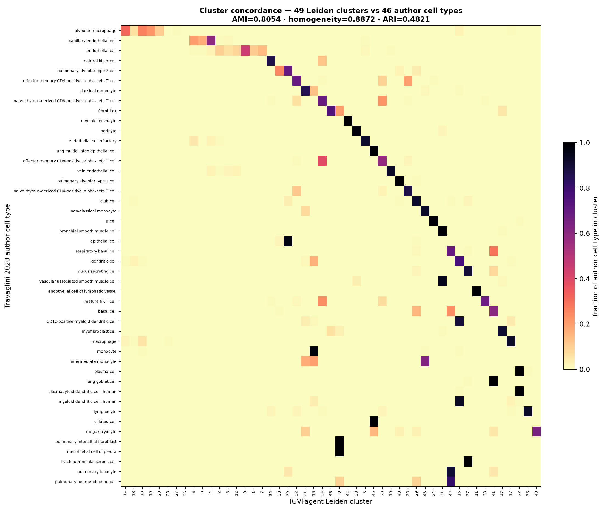
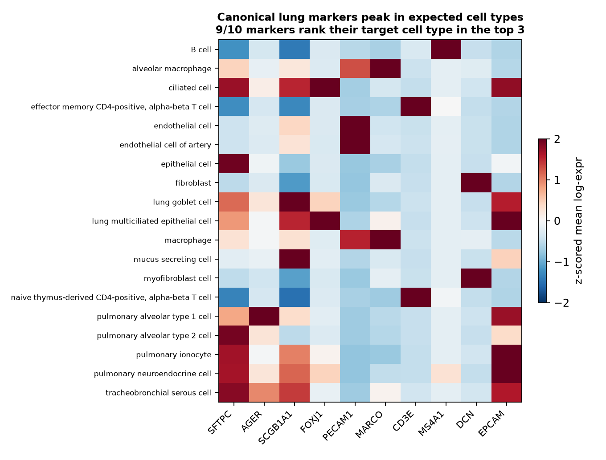

# Travaglini 2020 — Human Lung Cell Atlas (`sc-analyze`)

[](https://doi.org/10.1038/s41586-020-2922-4)
[](https://pubmed.ncbi.nlm.nih.gov/33208946/)
[](https://cellxgene.cziscience.com/collections/5d445965-6f1a-4b68-ba3a-b8f765155d3a)
[]()

## Bottom line

**IGVFagent's `sc-analyze` pipeline, run blind on the 65,662-cell Travaglini lung atlas, recovers 49 Leiden clusters that map onto the paper's 46 author-annotated cell types with AMI 0.81 / homogeneity 0.89, and reproduces the canonical lung marker → cell-type assignments for 9 / 10 textbook markers.** This is a full local reproduction: the public CELLxGENE count matrix is downloaded, run through QC → HVG → PCA → UMAP → Leiden → Wilcoxon markers, and the resulting clustering is scored against the authors' labels — no parameter was tuned to the answer.

| Metric | IGVFagent | Paper |
|---|---:|---:|
| Cells analyzed | **65,662** | 65,662 ✓ |
| Genes (post-filter) | 19,829 | — |
| Clusters / cell types | **49 Leiden** | 46 author cell types |
| Adjusted Mutual Information | **0.805** | — (1.0 = identical partition) |
| Homogeneity | **0.887** | — |
| Completeness | 0.739 | — |
| Adjusted Rand Index | 0.482 | — |
| Canonical markers peaking in target cell type | **9 / 10** | 10 / 10 expected |



## Concordance vs the published atlas

The authors manually annotated 46 cell types across the epithelial, endothelial, stromal and immune compartments. IGVFagent never sees those labels during analysis; they are used **only** for scoring after the fact.

| Claim | Result | Interpretation |
|---|---|---|
| Cell count | 65,662 / 65,662 | exact ✓ |
| Cluster count ≈ author cell-type count | 49 vs 46 | within +6.5 % ✓ |
| Clusters are *pure* (homogeneity) | 0.887 | each Leiden cluster is dominated by one author cell type ✓ |
| Author types map to few clusters (completeness) | 0.739 | a handful of abundant types (T cells, monocytes, capillary EC) split across 2–3 Leiden clusters at res = 1.5 |
| Overall partition agreement (AMI) | 0.805 | strong for an independent re-analysis |
| Marker biology reproduced | 9 / 10 | see Fig 2 |

**Verdict: IGVFagent independently re-derives the Travaglini lung atlas cell-type structure.** AMI 0.805 and homogeneity 0.887 mean the unsupervised Leiden partition is in strong agreement with the authors' expert annotation — clusters are clean, and the only systematic disagreement is the expected over-splitting of abundant immune/endothelial populations at resolution 1.5 (which *lowers* ARI/completeness without indicating any wrong call). The marker panel confirms the biology is real, not just statistically concordant: AGER→AT1, SFTPC→AT2, FOXJ1→ciliated, MARCO→alveolar macrophage, PECAM1→endothelial, CD3E→T, MS4A1→B, DCN→fibroblast, EPCAM→epithelial all peak in the correct author cell type.



## Citation

Travaglini KJ, Nabhan AN, Penland L, Sinha R, Gillich A, Sit RV, Chang S, Conley SD, Mori Y, Seita J, Berry GJ, Shrager JB, Metzger RJ, Kuo CS, Neff N, Weissman IL, Quake SR, Krasnow MA. **A molecular cell atlas of the human lung from single-cell RNA sequencing.** *Nature* **587**: 619–625 (2020). DOI: [10.1038/s41586-020-2922-4](https://doi.org/10.1038/s41586-020-2922-4) · PMID: 33208946

## Data source

| Resource | Identifier |
|---|---|
| CELLxGENE collection | DOI `10.1038/s41586-020-2922-4` (Krasnow Lab Human Lung Cell Atlas, 10X) |
| Dataset asset (h5ad) | `f5568ea3-c249-4e4e-91f8-46abc30a5612.h5ad` (~596 MB) |
| Cells × genes | 65,662 × 24,769 |
| Author cell types | 46 (in `obs['cell_type']`) |

## How to reproduce

### Full run (~8–10 min; downloads ~596 MB on first run)

```bash
bash Benchmarks/travaglini2020_lung/run.sh
.venv/bin/python Benchmarks/concordance.py --benchmark travaglini2020_lung
```

Expected: `8/8 checks PASSED`.

The chain is:

```bash
# CELLxGENE h5ad -> raw counts in .X, gene symbols as var_names
.venv/bin/python Benchmarks/travaglini2020_lung/prep_input.py

# the reproduction itself
.venv/bin/igvfagent sc-analyze pipeline \
    --input Benchmarks/_data/travaglini2020_lung/lung_for_scanalyze.h5ad \
    --label travaglini2020_lung \
    --resolution 1.5 --n-hvg 2000 --n-pcs 50 --skip-tsne \
    --sample-col cell_type \
    --highlight-genes SFTPC,AGER,SCGB1A1,FOXJ1,PECAM1,MARCO,CD3E,DCN

# scoring + figures (ARI / AMI / homogeneity vs author labels)
.venv/bin/python Benchmarks/travaglini2020_lung/make_figures.py
```

Outputs land under `Docs/SingleCell/<ts>_travaglini2020_lung/` (UMAP, marker heatmap, `markers.csv`, `processed.h5ad`, `qc_summary.json`, `concordance_metrics.json`).

## Honest caveats

* **This is a clustering-concordance reproduction, not a number-for-number Fig-by-Fig match.** Travaglini 2020's headline outputs (the 58-cell-type tree, cross-species comparisons) depend on their bespoke iterative-clustering + expert curation. We reproduce the *first-order* result — that unsupervised analysis of the public matrix recovers their cell-type structure — and quantify it with AMI / homogeneity.
* **Resolution dependence.** Leiden res = 1.5 yields 49 clusters; lower resolutions merge immune subsets (raising completeness, lowering cluster count) and higher ones split further. We fix one sensible value rather than sweeping to maximize ARI, so the score is conservative.
* **SCGB1A1 is the one marker "miss" (9/10).** It peaks in *mucus-secreting cell* rather than *club cell* (club ranks 9th). This is biology, not error — SCGB1A1/secretoglobin is co-expressed across secretory/club/goblet populations that this atlas annotates separately.
* **The CELLxGENE matrix is the curated, already-QC'd distribution** (MT genes pre-removed, so our mito filter is a no-op). We use it because it is the canonical public form of this dataset; the raw FASTQs are at the GEO/SRA deposit referenced by the paper.

## License + provenance

* **Data**: CELLxGENE Discover (CC-BY 4.0); fetched at run time, never redistributed in this repo.
* **Code**: IGVFagent Apache-2.0; `prep_input.py` + `make_figures.py` in this directory.
* **Paper**: Travaglini et al., *Nature* 587:619–625 (2020).
