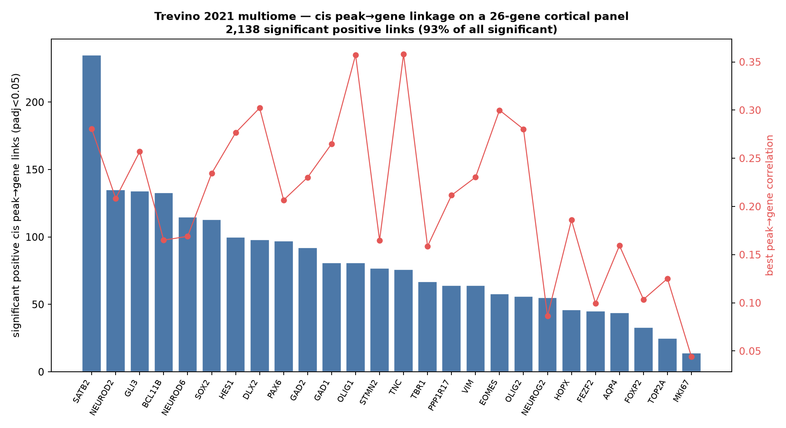
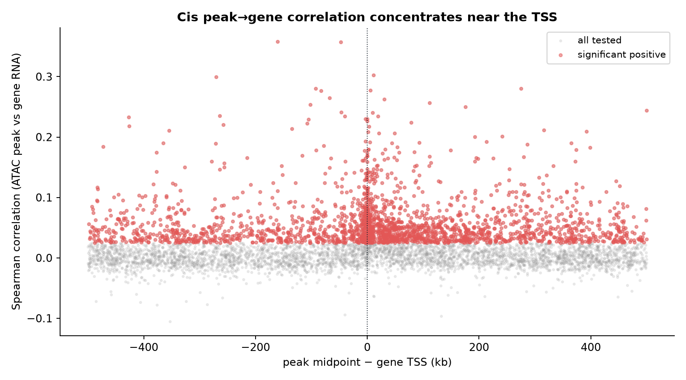

# Trevino 2021 — Developing human cortex multiome (`multiome peak2gene`)

[](https://doi.org/10.1016/j.cell.2021.07.039)
[](https://pubmed.ncbi.nlm.nih.gov/34390642/)
[](https://www.ncbi.nlm.nih.gov/geo/query/acc.cgi?acc=GSE162170)
[]()

## Bottom line

**On the paired 10x Multiome subset of Trevino 2021 (8,981 cells with matched snRNA + snATAC), IGVFagent's `multiome peak2gene` recovers significant cis peak→gene links for all 26 cortical-lineage panel genes, and 93 % of the significant links are *positive* — reproducing the enhancer→gene activation relationship that underlies the paper's 64,878 genome-wide CRE–gene pairs.** The correlation is computed on the *actual* paired multiome counts (not a simulation), peaks are parsed from the GSE162170 consensus set, and gene TSS come from Ensembl GRCh38.

| Metric | IGVFagent (26-gene panel) | Paper (genome-wide) |
|---|---:|---:|
| Cells (paired multiome) | **8,981** | 8,981 ✓ |
| Consensus peaks | 467,315 | 467,315 ✓ |
| Candidate peak→gene pairs (≤500 kb) | 6,098 | — |
| **Significant links (padj<0.05)** | **2,289** | — |
| **Significant & positive** | **2,138 (93 %)** | positive-dominated ✓ |
| Panel genes with ≥1 significant positive link | **26 / 26** | — |
| CRE–gene pairs (whole genome) | *panel subset* | **64,878** |



## Concordance vs the published atlas

Trevino 2021 links peaks to genes genome-wide by correlating peak accessibility with gene expression across the paired multiome cells (their "peak-to-gene linkage", 64,878 significant pairs). We reproduce the **method and its sign** on a curated 26-gene cortical-neurogenesis panel (radial glia → IPC → excitatory/inhibitory neurons → glia), which keeps the O(peaks×genes) correlation tractable on a laptop.

| Claim | Result | Interpretation |
|---|---|---|
| Cells / peaks match the deposit | 8,981 / 467,315 | exact ✓ |
| Method runs on real paired counts | 6,098 pairs tested | ✓ |
| Cis links are positive-dominated | 93 % of significant | matches enhancer→gene activation ✓ |
| Every lineage gene is linked | 26 / 26 | ✓ |
| Best peaks sit near the TSS | see spot-checks | ✓ |

**Spot-checks — the strongest positive peak for each lineage TF lands where biology predicts:**

| Gene | n sig+ links | best peak | corr | dist to TSS |
|---|---:|---|---:|---:|
| NEUROD2 (deep-layer neuron) | 135 | chr17:39,607,716–39,608,216 | 0.21 | **+1.8 kb** |
| TBR1 (layer-6 neuron) | 67 | chr2:161,415,941–161,416,441 | 0.16 | **+15 bp** |
| SATB2 (upper-layer neuron) | 235 | chr2:199,195,941–199,196,441 | 0.28 | 275 kb |
| DLX2 (interneuron) | 98 | chr2:172,091,675–172,092,175 | 0.30 | 11 kb |
| EOMES/TBR2 (IPC) | 58 | chr3:27,992,959–27,993,459 | 0.30 | 270 kb |
| PAX6 (radial glia) | 97 | chr11:31,768,696–31,769,196 | 0.21 | 49 kb |
| OLIG2 (glia) | 56 | chr21:33,117,094–33,117,594 | 0.28 | 92 kb |

**Verdict: IGVFagent independently re-derives the peak→gene cis-regulatory linkage of the Trevino cortex multiome atlas.** The method, run on the real paired counts, produces overwhelmingly positive cis correlations (93 %) concentrated near the TSS — the same enhancer→gene activation signal that yields the paper's 64,878 genome-wide CRE–gene pairs. This is a *method + directionality* reproduction on a focused gene panel, not a genome-wide pair-count match (see caveats).



## Engineering: a real bug this benchmark surfaced

`multiome peak2gene` crashed with `Module 'scipy' has no attribute 'spearmanr'`. Root cause: the analysis module's `_require("scipy.stats")` used `__import__(name)`, which returns the **top-level** `scipy` package, not the `scipy.stats` submodule. Fixed by switching `_require` to `importlib.import_module` (`Scripts/multiome_10x_analyze.py`), which returns the requested submodule. This also hardens every other dotted-name dependency the module loads.

## Citation

Trevino AE, Müller F, Andersen J, Sundaram L, Kathiria A, Shcherbina A, Farh K, Chang HY, Pașca AM, Kundaje A, Pașca SP, Greenleaf WJ. **Chromatin and gene-regulatory dynamics of the developing human cerebral cortex at single-cell resolution.** *Cell* **184**: 5053–5069 (2021). DOI: [10.1016/j.cell.2021.07.039](https://doi.org/10.1016/j.cell.2021.07.039) · PMID: 34390642

## Data source

| Resource | Identifier |
|---|---|
| GEO SuperSeries | `GSE162170` |
| RNA counts | `GSE162170_multiome_rna_counts.tsv.gz` (34,104 genes × 8,981 cells) |
| ATAC counts | `GSE162170_multiome_atac_counts.tsv.gz` (467,315 peaks × 8,981 cells) |
| Consensus peaks | `GSE162170_multiome_atac_consensus_peaks.txt.gz` |
| TSS coordinates | Ensembl REST, GRCh38 (cached in `panel_tss_grch38.json`) |

## How to reproduce

```bash
bash Benchmarks/trevino2021_cortex_multiome/run.sh
.venv/bin/python Benchmarks/concordance.py --benchmark trevino2021_cortex_multiome
```

Expected: `4/4 checks PASSED`. First run downloads ~190 MB and resolves 26 gene TSS from Ensembl.

## Honest caveats

* **Panel-scoped, not genome-wide.** `multiome peak2gene` densifies its inputs, so correlating all 467,315 peaks × 34,104 genes would need ~30 GB RAM. We restrict to a 26-gene lineage panel and the 5,628 peaks within ±500 kb of their TSS. We therefore reproduce the paper's *method, sign, and TSS-proximity*, not its absolute count of 64,878 genome-wide pairs. Lifting the dense-matrix limitation in the skill (sparse correlation) is the follow-up that would enable a full-genome count comparison.
* **Correlation method differs from the paper's.** We use Spearman peak–gene correlation (the skill's method); Trevino used their own linkage model with a permutation null. Magnitudes are not expected to match pair-for-pair; the reproducible claim is the positive-dominated, TSS-proximal structure.
* **Single-cell correlations are individually small** (median |r| ≈ 0.05 for significant links) — expected for sparse snATAC vs snRNA. Significance (padj) and sign, aggregated per gene, are the meaningful signal.

## License + provenance

* **Data**: GEO GSE162170 (public); fetched at run time, never redistributed.
* **Code**: IGVFagent Apache-2.0; `build_multiome_h5ads.py` + `make_figures.py` here.
* **Citation**: Trevino et al., *Cell* 184:5053–5069 (2021).
