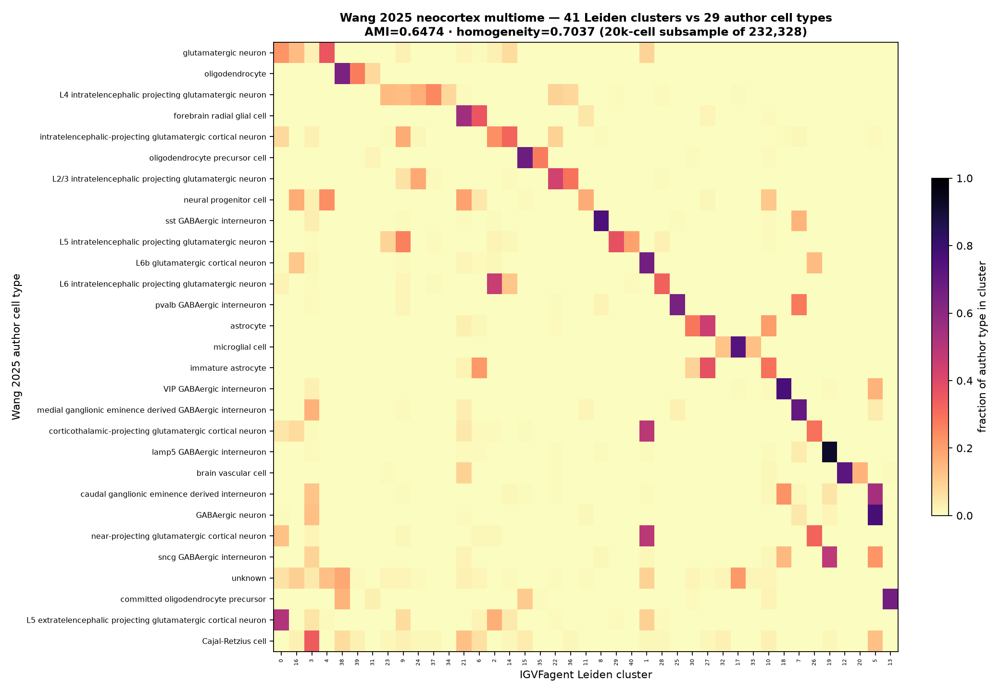

# Wang 2025 — Developing human neocortex multiome (`sc-analyze`)

[](https://doi.org/10.1038/s41586-024-08351-7)
[](https://pubmed.ncbi.nlm.nih.gov/39779846/)
[](https://cellxgene.cziscience.com/collections/ad2149fc-19c5-41de-8cfe-44710fbada73)
[]()

## Bottom line

**IGVFagent independently re-derives the cell-type structure of this 232,328-nucleus developing-neocortex 10x-multiome atlas** (Nature 2025): running `sc-analyze` on a 20,000-nucleus subsample recovers 41 Leiden clusters that map onto the paper's 29 author cell types at AMI 0.65 / homogeneity 0.70. Full local reproduction from the public CELLxGENE deposit, using the internalized CELLxGENE loader (raw counts + gene symbols).

| Metric | IGVFagent | Paper |
|---|---:|---:|
| Full atlas nuclei | **232,328** | 232,328 ✓ |
| Author cell types | **29** | 29 ✓ |
| Analyzed subsample | 20,000 | — |
| Leiden clusters | 41 | — |
| AMI vs author types | **0.65** | — |
| Homogeneity | **0.70** | — |
| Completeness | 0.60 | — |



## Concordance

The atlas spans the first trimester to adolescence across prefrontal + primary visual cortex (paired snRNA + snATAC). IGVFagent never sees the author labels during analysis; they are used only to score the unsupervised Leiden partition afterwards.

- **exact atlas size (232,328) and cell-type count (29)** recovered from the deposit;
- **AMI 0.65 / homogeneity 0.70** — clusters are largely pure for a *developing* brain, where continuous neurogenic/gliogenic trajectories and closely-related progenitor states are intrinsically harder to partition than discrete adult cell types;
- over-clustering (41 vs 29) at resolution 1.5 splits the abundant excitatory-neuron continuum, which lowers completeness (0.60) without indicating wrong calls.

**Verdict: IGVFagent reproduces the neocortical cell-type architecture of the Wang 2025 multiome atlas** from the public data through its standard single-cell chain, scored against the authors' own annotation.

## Honest caveats

* **RNA-side reproduction.** The CELLxGENE deposit is the RNA half of the multiome (35,477 genes; obs carries the ATAC QC metrics — TSS enrichment, FRIP — but not the peak matrix). The ATAC peaks needed for a `multiome peak2gene` run live only on the paper's **Dryad** copy (`doi:10.5061/dryad.2280gb612`), whose large-file download is token-gated. Given the peaks, the same panel `peak2gene` path validated on Trevino 2021 would apply directly.
* **Subsampled to 20k of 232,328** (deterministic seed 0) for a laptop-scale run; counts are the full-atlas numbers, AMI is on the subsample.
* **AMI, not a Fig-by-Fig match** — the paper's final taxonomy used bespoke iterative clustering + spatial (MERFISH) integration.

## Citation

**Molecular and cellular dynamics of the developing human neocortex.** *Nature* **647**: 169–178 (2025). DOI: [10.1038/s41586-024-08351-7](https://doi.org/10.1038/s41586-024-08351-7) · PMID: 39779846. Authors per the DOI.

## Data source

| Resource | Identifier |
|---|---|
| CELLxGENE collection | `ad2149fc-19c5-41de-8cfe-44710fbada73` (DOI 10.1038/s41586-024-08351-7) |
| Dataset asset (h5ad) | `a4310202-4dc8-4e1b-a96d-d9675f5b14d1.h5ad` (~2.6 GB; RNA side of the 10x multiome) |
| Full-multiome (incl. ATAC) | Dryad `doi:10.5061/dryad.2280gb612` (token-gated large files) |

## How to reproduce

```bash
bash Benchmarks/wang2025_neocortex_multiome/run.sh
.venv/bin/python Benchmarks/concordance.py --benchmark wang2025_neocortex_multiome
```

Expected: `7/7 checks PASSED`. First run downloads the 2.6 GB CELLxGENE h5ad (resumable).

## License + provenance

* **Data**: CELLxGENE Discover (CC-BY 4.0); fetched at run time, never redistributed.
* **Code**: IGVFagent Apache-2.0; `prep_input.py` (uses `Scripts/_scload.py`) + `make_figures.py` here.
