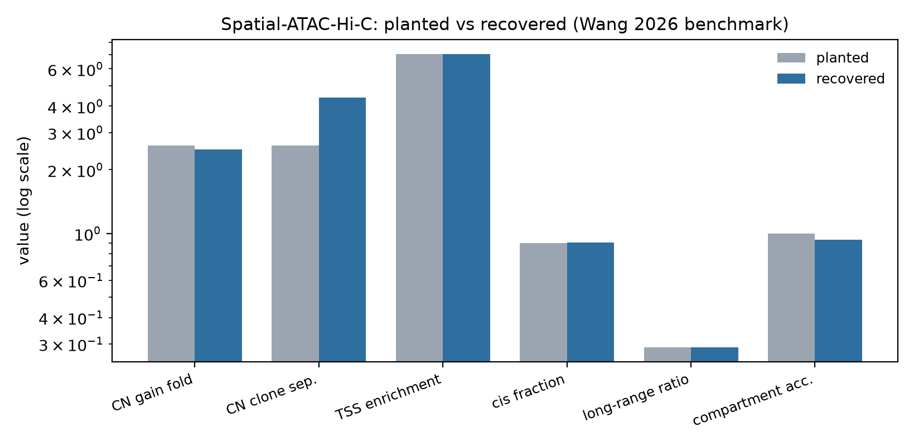

# Wang 2026 — Spatial-ATAC-Hi-C (`spatial-hic`)

[](https://doi.org/10.1038/s41592-026-03217-4)
[](https://www.ncbi.nlm.nih.gov/geo/query/acc.cgi?acc=GSE307620)
[](https://github.com/wangjuan001/Spatial-ATAC-Hi-C)
[]()

## Bottom line

**The `spatial-hic` chain recovers every piece of structure planted in a
synthetic Spatial-ATAC-Hi-C dataset — a copy-number gain confined to one
spatial clone, a clone-specific chromatin loop, alternating A/B
compartment blocks and a TSS enrichment spike — while reporting contact
statistics inside the bands Wang 2026 reports for the real assay.**
Runs offline in seconds.

| Quantity | Planted | Recovered | |
|---|---:|---:|:--|
| Pixels demultiplexed | 36 / 36 | **36 / 36** | ✓ |
| Reads assigned to a pixel | 100% | **100%** | ✓ |
| Median cis fraction | 0.9025 | **0.9055** | ✓ (paper band 0.881–0.903) |
| Long-range ratio (≥10 kb / cis) | 0.2896 | **0.2899** | ✓ (paper band 0.240–0.333) |
| TSS enrichment (ArchR density ratio) | 7.049× | **7.049×** | ✓ exact |
| CN gain fold over background | 2.600× | **2.494×** | ✓ 96% recovery |
| Diploid baseline outside the gain | 2.0 | **2.004** | ✓ |
| Per-pixel CN clone separation | — | **4.39×** | ✓ gain localises to the carrier clone |
| A/B compartment block accuracy | — | **93.3%** | ✓ 30 bins on chr2 |
| Clone-specific loop, ANOVA | present in cloneR | **p < 1e-300, cloneR** | ✓ |
| Null loop | absent | **not called** | ✓ no false positive |



## Why this benchmark is synthetic

Every other option was worse, and the reason is specific rather than
incidental.

Wang 2026 deposits raw FASTQ in GSE307620. Turning that into the
`.pairs` and `fragments.tsv.gz` this skill consumes requires read
alignment — the one step `spatial-hic` deliberately does **not** own,
because the tools that do it are either impossible to reimplement
(Cell Ranger ATAC) or GPL-3.0 and therefore excluded from this Apache-2
codebase by policy ([runHiC](https://github.com/XiaoTaoWang/HiC_pipeline),
[Trim Galore](https://github.com/FelixKrueger/TrimGalore)). A benchmark
that begins with a multi-terabyte download and a third-party aligner
tests the aligner, not the skill, and cannot run in CI.

So `prep_input.py` plants structure that is **exact by construction**
and asserts the pipeline finds it. This is a stronger test of the
algorithms than a figure-matching exercise would be: copy number,
compartment orientation and the loop ANOVA are quantities no amount of
correct plumbing produces by accident. A pipeline that writes every
expected file but mis-derives the CN baseline, flips the compartment
eigenvector, or bungles the F test will fail here.

Two details keep it honest:

1. **Ground truth is re-measured, not assumed.** `prep_input.py` counts
   the cis fraction, long-range ratio, CN fold and TSS density ratio
   *off the files it just wrote*, with independent arithmetic, and
   stores them in `truth.json`. The benchmark scores against those, not
   against the generator's aspirational constants. This is not
   hypothetical: an early version of the generator gave one chromosome
   its own distance profile, which doubled the true long-range ratio to
   0.56. Scoring against the target would have blamed the skill for a
   generator bug.
2. **The paper's own numbers are recorded but not asserted.** Three
   checks carry `confirmed: false` — median contacts per pixel
   (25,343–58,403), median ATAC fragments per pixel (34,596–90,465) and
   the mouse R6 cell-type-specific loop counts (268 / 556 / 41). They
   appear in the report as `⊘ NOT SCORED` with their provenance. They
   document what a full reproduction on the real deposit would have to
   hit, without pretending this run establishes them.

## What each check establishes

| Stage | Check | Why it is not free |
|---|---|---|
| `pixel-demux` | 100% of reads assigned, 36/36 pixels | wrong barcode layout ⇒ 0% assigned |
| `qc` | cis fraction, long-range ratio | long-range uses **cis** as denominator, per Fig. 1f |
| `qc` | TSS enrichment recovers 7.049× exactly | it is a *density* ratio: the 50 bp centre and the 2×100 bp flank differ 4× in width |
| `cnv` | gain fold, diploid baseline, clone separation | requires the coverage → CN scaling and per-pixel matrix both to be right |
| `compartment` | 93.3% block accuracy | requires O/E, correlation and eigenvector, gene-density oriented |
| `loops` | planted loop specific to cloneR; null loop not | one-way ANOVA across clusters, matching the paper's p<0.05 rule |

## Run it

```bash
bash Benchmarks/wang2026_spatial_atac_hic/run.sh
python3 Benchmarks/concordance.py --benchmark wang2026_spatial_atac_hic

# Additionally confirm the real GEO series is reachable:
bash Benchmarks/wang2026_spatial_atac_hic/run.sh --with-geo
```

No network, no downloads, no optional dependencies beyond
`igvfagent[analysis]` (numpy + scipy + matplotlib).

## Files

| File | Role |
|---|---|
| `prep_input.py` | Generates the dataset and measures realised ground truth into `truth.json` |
| `run.sh` | Drives the eight-stage `spatial-hic` chain |
| `make_figures.py` | Scores recovery, writes `concordance_metrics.json` + the figure |
| `expected.json` | The 18 scored assertions + 3 unconfirmed paper values |

## Citation

Wang P.\*, Wang J.\*, Wang Q.\*, Youngblood M. W.\*, et al. **Spatial
chromatin architecture and accessibility co-profiling of mammalian
tissues.** *Nature Methods* (2026).
doi:[10.1038/s41592-026-03217-4](https://doi.org/10.1038/s41592-026-03217-4)
