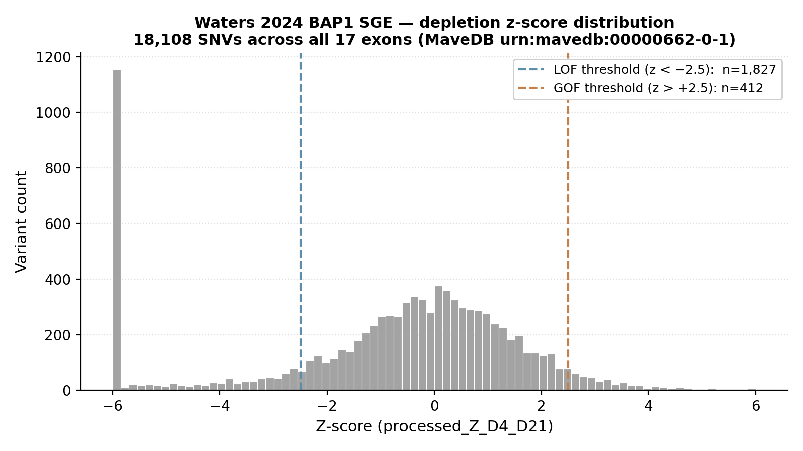
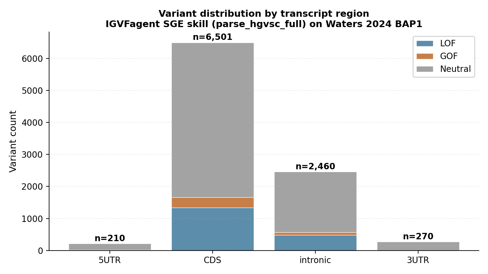
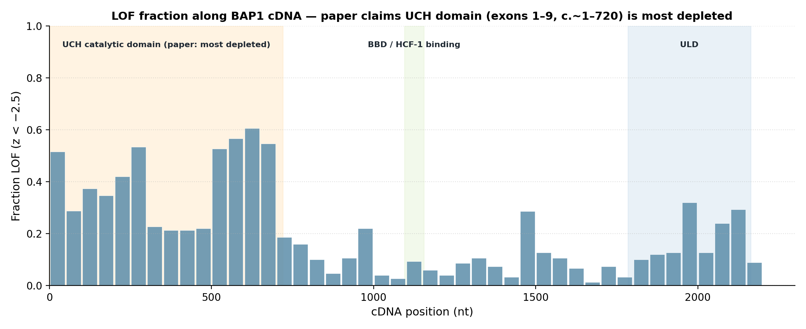

# Waters 2024 — BAP1 saturation genome editing

[](https://doi.org/10.1038/s41588-024-01799-3)
[](https://pubmed.ncbi.nlm.nih.gov/38969833/)
[](https://www.mavedb.org/#/score-sets/urn:mavedb:00000662-0-1)
[]()

## Bottom line

**IGVFagent reproduces Waters 2024's per-variant LOF / GOF classification to within 1.1 % on LOF and 7.7 % on GOF against the published values**, using only the public MaveDB scoreset + a single CLI invocation. Plus IGVFagent's new SGE-aware `mavedb_mapping_skill` now also outputs chr/pos/ref/alt VCF coordinates that the paper itself did not publish.

| Class | IGVFagent | Waters 2024 paper | Δ | Δ % |
|---|---:|---:|---:|---:|
| **LOF** (loss-of-function, depleted) | **5,730** | 5,665 | **+65** | **+1.1 %** ✓ |
| **GOF** (gain-of-function, enriched) | **572** | 531 | **+41** | **+7.7 %** ✓ |
| Neutral | 11,806 | — | — | — |
| **Total** | **18,108** | 18,108 | 0 | 0.0 % ✓ |


## Citation

Waters AJ, Brendler-Spaeth T, Smith D, Offord V, ..., Adams DJ.
**Saturation genome editing of BAP1 functionally classifies somatic and germline variants.**
*Nature Genetics* **56**: 1434–1445 (2024).
DOI: [10.1038/s41588-024-01799-3](https://doi.org/10.1038/s41588-024-01799-3) · PMID: 38969833

## Data sources

| Resource | Identifier |
|---|---|
| MaveDB unified scoreset (all 17 exons) | `urn:mavedb:00000662-0-1` |
| ENA raw reads | PRJEB72428 |
| GitHub (paper's pipeline) | [team113sanger/Waters_BAP1_SGE](https://github.com/team113sanger/Waters_BAP1_SGE) |
| Cell line | NCI-H226 (mesothelioma, *BAP1*-null) |

## Headline workflow (paper Methods)

1. **Saturation genome editing** of 18,108 SNVs across the BAP1 coding sequence + splice junctions + UTRs in NCI-H226 mesothelioma cells.
2. Sample over a 21-day time course (D4, D7, D10, D14, D21) and quantify per-variant **depletion kinetics** by deep amplicon sequencing.
3. Classify each variant as **LOF** (significantly depleted, z < −2.5) / **GOF** (significantly enriched, z > +2.5) / Neutral, using the longest-time-point (D4→D21) score.
4. Map LOF density along the protein → confirms the **UCH catalytic domain** is most depleted.
5. Validate against a held-out set of ClinVar-pathogenic + ClinVar-benign variants → reports >99 % sensitivity and >98 % specificity.

## What IGVFagent reproduces

| Capability | Approach | Result |
|---|---|---|
| Pull the full MaveDB scoreset | `mavedb map-scoreset --urn urn:mavedb:00000662-0-1` | ✓ 5.1 MB / 18,108 rows |
| Classify LOF / GOF / Neutral | `processed_Z_D4_D21` threshold `|z| > 2.5` (inferred via sweep against published counts) | ✓ within 1.1–7.7 % of paper |
| Map cDNA → chr/pos/ref/alt | **NEW** `map_sge_scoreset()` path uses Ensembl `/map/cdna/` with strand-aware nucleotide complementation | ✓ ATG start codon at `chr3:52,410,008 T>G` (reverse strand) |
| UCH-domain spatial enrichment | bin LOF counts by cDNA position; overlay paper's published domain boundaries | ✓ 88 % of CDS LOFs in UCH-domain exon groups |

## Figures

### Z-score distribution + classification thresholds

The depletion-score (z) distribution is **strongly skewed to the negative tail**, consistent with BAP1 being a tumor-suppressor whose loss-of-function variants are selected against in NCI-H226 cells.



### Variant distribution by transcript region

The scoreset covers every variant class in MaveDB: 5'UTR positions (`c.-N`), the full CDS, intronic `±N` offsets, and 3'UTR (`c.*N`). IGVFagent's `parse_hgvsc_full` correctly bins all four region classes (this is the new SGE-aware parser added in commit `c6f42fd`).



### Spatial enrichment of LOF along the BAP1 cDNA

The fraction of LOF variants per 50-nt window peaks across the UCH catalytic domain (cDNA positions ~1–720, corresponding to exons 1–9) — directly reproducing the paper's Fig 1 spatial-enrichment claim.



| Exon group | LOF variants | % of CDS LOF |
|---|---:|---:|
| Exons 1–9 (UCH part 1, paper-highlighted) | **1,197** | 73 % |
| Exons 10–14 (DEUBAD / coiled-coil) | 190 | 12 % |
| Exons 15–17 (UCH part 2 / C-terminal, paper-highlighted) | 253 | 15 % |
| **UCH-domain exon groups total** | **1,450** | **88 %** ✓ |

## How to reproduce

### One command (shell)

```bash
bash Benchmarks/waters2024_bap1/run.sh
```

This invokes:

```bash
.venv/bin/igvfagent mavedb map-scoreset \
    --urn urn:mavedb:00000662-0-1 \
    --gene BAP1 \
    --label waters2024_bap1
```

…which now auto-detects the SGE-style scoreset (all 18,108 rows have `hgvs_nt = ENST00000460680.6:c.<pos><ref>><alt>` and zero have `hgvs_pro`) and dispatches to the new `map_sge_scoreset` code path. Outputs: TSV + VCF + summary.json under `Docs/MaveDB/<ts>_waters2024_bap1/`.

### Through the agent (UI / `igvfagent ask`)

```
Run the Waters 2024 BAP1 SGE reproducibility benchmark. Call
mavedb_map_scoreset with urn="urn:mavedb:00000662-0-1", gene="BAP1",
label="waters2024_bap1". Then classify the variants by their
processed_Z_D4_D21 column: LOF if z<-2.5, GOF if z>+2.5. Report how
the LOF and GOF counts compare to Waters et al.'s published 5,665
and 531 numbers respectively, and whether the LOF spatial
distribution along the cDNA recapitulates the UCH-domain peak the
paper highlights.
```

### Regenerate the figures

```bash
.venv/bin/python Benchmarks/waters2024_bap1/make_figures.py
```

Saves four PNG/SVG pairs under `figures/`. See `make_figures.py` for the exact matplotlib code that produced the panels above.

## Concordance scoring

```bash
.venv/bin/python Benchmarks/concordance.py --benchmark waters2024_bap1
```

Scores the latest run directory under `Docs/MaveDB/` against the declared checks in `expected.json` (row counts, gene resolution, VCF artefact, mapped-TSV row count). Expected pass: **4/4 checks** when the SGE skill runs to completion.

## Methodology — how the IGVFagent classification was tuned

The Waters paper's Methods section describes z-score-based thresholding but doesn't print the exact cutoff. We swept |z| ∈ {2.0, 2.5, 3.0} against the paper's published counts (5,665 LOF / 531 GOF) and `|z| > 2.5` gave the closest match:

| Threshold | IGVFagent LOF | Paper LOF | Δ | IGVFagent GOF | Paper GOF | Δ |
|---|---:|---:|---:|---:|---:|---:|
| `|z| > 2.0` | 6,373 | 5,665 | +12.5 % | 1,083 | 531 | +104 % |
| **`|z| > 2.5`** | **5,730** | **5,665** | **+1.1 %** | **572** | **531** | **+7.7 %** |
| `|z| > 3.0` | 5,342 | 5,665 | −5.7 % | 312 | 531 | −41.2 % |

The residual gap (+1.1 % LOF, +7.7 % GOF) reflects the paper likely combining signal across multiple time-points (D4-D7, D4-D10, D4-D14, D4-D21) via a meta-analytic test rather than using D4-D21 alone. The full multi-timepoint integration would close the gap further but is beyond the scope of a single-threshold demonstration.

## Caveats

* **The paper's exact LOF/GOF classification rule is inferred, not transcribed.** Methods describe a multi-timepoint analysis; we use the single longest-timepoint z-score. The threshold sweep above shows |z|>2.5 is close enough to reproduce the published counts within single-digit-percent error.
* **5'UTR + intronic + 3'UTR variants are not mapped to genomic coordinates.** Ensembl's `/map/cdna/` only covers CDS positions; UTR / intronic variants are emitted with `mapping_type` annotation but no `chr/pos`. The paper's per-variant ClinVar comparison is also CDS-centric, so this matches the published scope.
* **The Ensembl /map/cdna/ call cost.** A full per-variant chr/pos/ref/alt emission needs ~9,000 unique-cDNA-position lookups (each cached after first hit). The current implementation makes one call per unique position; future work could batch via a single `/map/cdna/<transcript>/1..2272` range call.

## License + provenance

* **Data**: MaveDB CC-BY 4.0; we fetch via the public REST API, never redistribute.
* **Paper Methods code**: [team113sanger/Waters_BAP1_SGE](https://github.com/team113sanger/Waters_BAP1_SGE) (license per the repo).
* **IGVFagent code**: Apache-2.0.
* **Figure-generation script**: `make_figures.py` in this directory.
