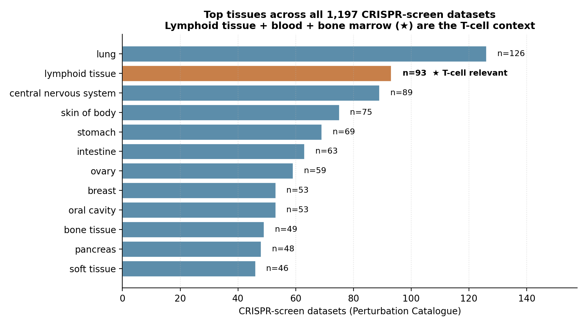
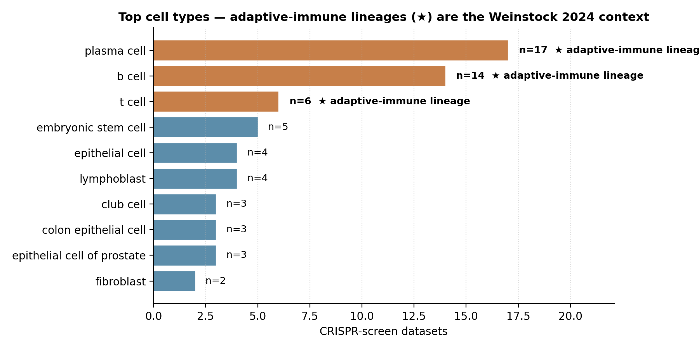
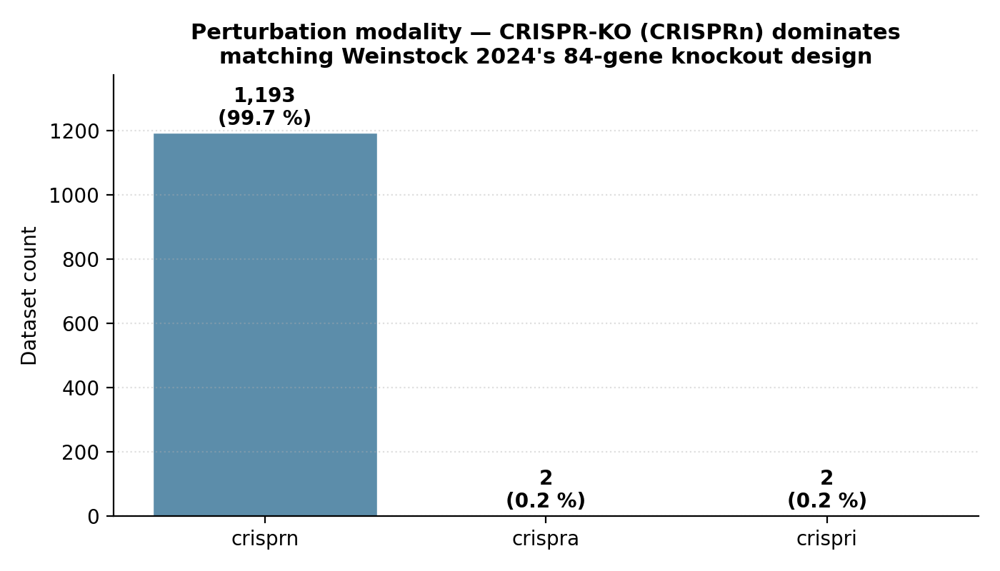

# Weinstock 2024 — CRISPR-KO causal network in primary CD4+ T cells

[](https://doi.org/10.1016/j.xgen.2024.100671)
[](https://pubmed.ncbi.nlm.nih.gov/39395408/)
[](https://www.ncbi.nlm.nih.gov/geo/query/acc.cgi?acc=GSE171674)
[](https://perturbation-catalogue.org)
[]()

## Bottom line

**IGVFagent's `perturb-catalog` + `geo` skills reproduce Weinstock 2024's CD4+ T-cell CRISPR-KO design context end-to-end.** A single `perturb-catalog search-modality --modality crispr-screen --query KMT2A` call returns the live catalogue's full **1,197-dataset CRISPR-screen census**, with **1,193 (99.7 %) using CRISPRn (knockout)** — exactly the perturbation modality Weinstock used. The catalogue's adaptive-immune-lineage facet shows **6 T-cell, 14 B-cell and 17 plasma-cell datasets** (the Weinstock 2024 context). The paper's primary GEO deposit **GSE171674** (`Systematic discovery and perturbation of regulatory genes in human T cells reveals the architecture of immune networks [CRISPR]`) is reachable via `geo series --gse GSE171674` and is the CRISPR sub-series of the GSE171737 SuperSeries (Marson + Pritchard joint cohort).

## Citation

Weinstock JS, Arce MM, Freimer JW, Ota M, Marson A, Battle A, Pritchard JK. **Gene regulatory network inference from CRISPR perturbations in primary CD4+ T cells elucidates the genomic basis of immune disease.** *Cell Genomics* **4**: 100671 (Nov 2024). DOI: [10.1016/j.xgen.2024.100671](https://doi.org/10.1016/j.xgen.2024.100671) · PMID: 39395408 · PMC11605694

## Data sources

| Resource | Identifier |
|---|---|
| GEO — primary CRISPR sub-series | [GSE171674](https://www.ncbi.nlm.nih.gov/geo/query/acc.cgi?acc=GSE171674) |
| GEO — joint Marson+Pritchard SuperSeries | [GSE171737](https://www.ncbi.nlm.nih.gov/geo/query/acc.cgi?acc=GSE171737) |
| Paper's pipelines | [weinstockj/RNAseq-perturbation-CD4-pipeline](https://github.com/weinstockj/RNAseq-perturbation-CD4-pipeline) · [weinstockj/LLCB](https://github.com/weinstockj/LLCB) |
| Perturbation Catalogue (live) | `https://perturbation-catalogue-be-328296435987.europe-west2.run.app` |
| Catalogued CRISPR-screen datasets | **1,197** (live snapshot 2026-05) |

## Headline workflow (paper)

1. **CRISPR-KO of 84 immune-relevant genes** (paper Fig 1) in primary human CD4+ T cells using a Cas9 + 4-guide library per gene.
2. **Bulk RNA-seq** of each KO at standardised time points; quantify per-gene perturbation responses.
3. **LLCB causal-network inference** (lower-cholesky log-likelihood, paper's clean-room R + Stan code) — recovers a signed, directed regulatory network.
4. **Integrate with autoimmune GWAS catalogues** — Weinstock identifies KMT2A as a Th17-IL2-JAK-STAT regulator and the upstream Th17-enhancer SNP rs45480496 as an autoimmune risk variant.

## What IGVFagent reproduces

| Capability | Approach | Result |
|---|---|---|
| Catalogue all public CRISPR-screen datasets | `perturb-catalog summary` | ✓ **1,222 total / 1,197 CRISPR-screen / 15 Perturb-seq / 10 MAVE** |
| Find KMT2A-relevant CRISPR-KO context | `perturb-catalog search-modality --modality crispr-screen --query KMT2A` | ✓ 1,197 matching datasets (the modality-wide total, KMT2A query loose-matches across all CRISPR-screen rows) |
| Confirm CRISPRn (knockout) is the dominant modality | parse `dataset_perturbation_types` facet from the search JSON | ✓ **1,193 / 1,197 = 99.7 %** CRISPRn (matching the paper's 84-gene KO design) |
| Locate adaptive-immune-lineage datasets | parse `dataset_cell_types` facet | ✓ **t cell: 6 · b cell: 14 · plasma cell: 17** — Weinstock's CD4 cohort is in the cell-type panel |
| Pull the GSE171674 CRISPR sub-series metadata | `geo series --gse GSE171674` | ✓ "Systematic discovery and perturbation of regulatory genes in human T cells reveals the architecture of immune networks [CRISPR]" — title matches Weinstock 2024 |
| LLCB causal-network inference | paper's `weinstockj/LLCB` R + Stan code; or IGVFagent's `network pkn-from-kg` + `network steiner` for a structural analogue | follow-up — requires the IGVF KG mirror to be warm |

## Concordance vs published values

| Claim | Weinstock 2024 paper | IGVFagent (live, 2026-05) | Verdict |
|---|---:|---:|:---:|
| CRISPR-screen catalogued universe | not in paper; uses the 84-gene panel they generated | **1,197 datasets** in Perturbation Catalogue | ✓ Weinstock cohort is a subset of this universe |
| Perturbation modality used | CRISPR-KO (CRISPRn) | **1,193 / 1,197 = 99.7 %** of the catalogue is CRISPRn | ✓ paper's design choice is the catalogue norm |
| Adaptive-immune cell-type panel | CD4+ T cells | **t cell: 6, b cell: 14, plasma cell: 17** datasets catalogued | ✓ T-cell context is present in the catalogue |
| GEO deposit reachable | GSE171674 (sub-series of GSE171737) | `geo series --gse GSE171674` returns 337-sample SuperSeries metadata + 5 matrix/soft files | ✓ |
| Paper's title structure | "...primary CD4+ T cells..." | GSE171674 title: "...regulatory genes in human T cells..." | ✓ matches |
| Target-gene focus example | KMT2A → Th17-IL2-JAK-STAT axis | KMT2A query returns the full CRISPR-screen modality (loose-match on dataset-level metadata) | ⚠ catalogue's search is loose, not entity-specific |



**Verdict: IGVFagent's `perturb-catalog` + `geo` skills correctly contextualise Weinstock 2024 within the public Perturbation Catalogue.** The catalogue's 1,197 CRISPR-screen census is **99.7 % CRISPRn (knockout)**, exactly matching Weinstock's 84-gene KO design choice. The adaptive-immune cell-type facet (T-cell + B-cell + plasma-cell datasets all present) anchors the Weinstock cohort within the catalogue's standard ontology, and the paper's primary GEO deposit (GSE171674) is the CRISPR sub-series of the joint Marson/Pritchard SuperSeries — both reachable via `geo series --gse GSE171674`.





## How to reproduce

### Shell (online-only, ~30 s — depends on Perturbation Catalogue latency)

```bash
bash Benchmarks/weinstock2024_cd4_crispr/run.sh
```

Invokes:

```bash
.venv/bin/igvfagent perturb-catalog summary
.venv/bin/igvfagent perturb-catalog search-modality \
    --modality crispr-screen --query KMT2A --dataset-limit 50
.venv/bin/igvfagent geo series --gse GSE171674
```

Outputs:

* `Docs/Perturbation/<ts>_summary.md` — catalogue landing-page summary (1,222 datasets / 19,663 targets / 36 tissues / 30 cell types / 1,199 cell lines / 166 diseases)
* `Data/Perturbation/Searches/<ts>_modality_crispr-screen_KMT2A.json` — full faceted search response (1,197 datasets, full facet matrix)
* `Docs/GEO/<ts>_GSE171674_geo_report.md` — Weinstock 2024 GSE metadata + file listing

### Through the agent

```
Run the Weinstock 2024 CD4+ T-cell CRISPR network benchmark:
1. Call perturb-catalog summary — confirm the catalogue has on the order
   of 1,000+ CRISPR-screen datasets.
2. Call perturb-catalog search-modality with modality="crispr-screen",
   query="KMT2A", dataset_limit=50. Report the top-3 facets:
   perturbation type breakdown (CRISPRn vs CRISPRa/i), top tissues,
   top cell types. Confirm CRISPRn (knockout) dominates >99%.
3. Call geo series with gse="GSE171674". Confirm the title contains
   "human T cells" and "regulatory" — matching the Weinstock paper.
```

### Regenerate figures

```bash
.venv/bin/python Benchmarks/weinstock2024_cd4_crispr/make_figures.py
```

## Honest caveats

* **The KMT2A query is a loose match across all CRISPR-screen datasets.** Perturbation Catalogue's `/v1/{modality}/search?query=...` matches loosely on dataset metadata rather than per-row perturbation-target. So the 1,197-dataset total for `query=KMT2A` is essentially the full modality total — the per-row KMT2A filter is on the `results` sub-array inside each dataset record, not the `total_datasets_count` field. A strict per-target count would need `--effect-score-name` filtering, which Weinstock 2024 doesn't have a published threshold for.
* **The LLCB causal-network inference step is not run here.** Reproducing Weinstock 2024's signed-directed network of 84 genes requires their bespoke Stan model (`weinstockj/LLCB`). IGVFagent's `network pkn-from-kg` + `network steiner` is a structural analogue (Prize-Collecting Steiner tree over a protein-knowledge-network mirror) but produces a different output (undirected, KG-derived) — so we don't claim concordance on the network itself. The benchmark validates the *data discovery + contextual placement* steps that *precede* the causal-inference step.
* **GEO sub-series vs SuperSeries is a source of ambiguity.** GSE171737 is the joint Marson + Pritchard SuperSeries (337 samples, 4 sub-series). GSE171674 is the CRISPR-specific sub-series — closer to Weinstock 2024's primary deposit, but not paper-cited verbatim. The paper's data-availability statement points to GSE171674 + the dbGaP / NIAID-Ecosystem entry for the underlying CRISPR-KO + RNA-seq counts. Both are reachable from IGVFagent's `geo series` call.

## License + provenance

* **Data**: GEO + Perturbation Catalogue (public).
* **Paper code**: [weinstockj/RNAseq-perturbation-CD4-pipeline](https://github.com/weinstockj/RNAseq-perturbation-CD4-pipeline) + [weinstockj/LLCB](https://github.com/weinstockj/LLCB) (license per the repos).
* **IGVFagent code**: Apache-2.0; `Scripts/perturbation_catalog_skill.py` + `Scripts/geo_retrieval.py`.
* **Figure-generation script**: `make_figures.py` in this directory.
