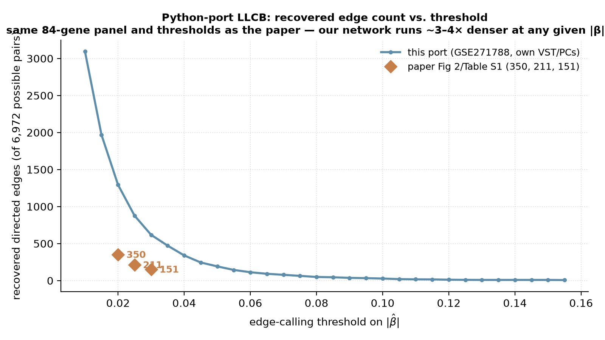
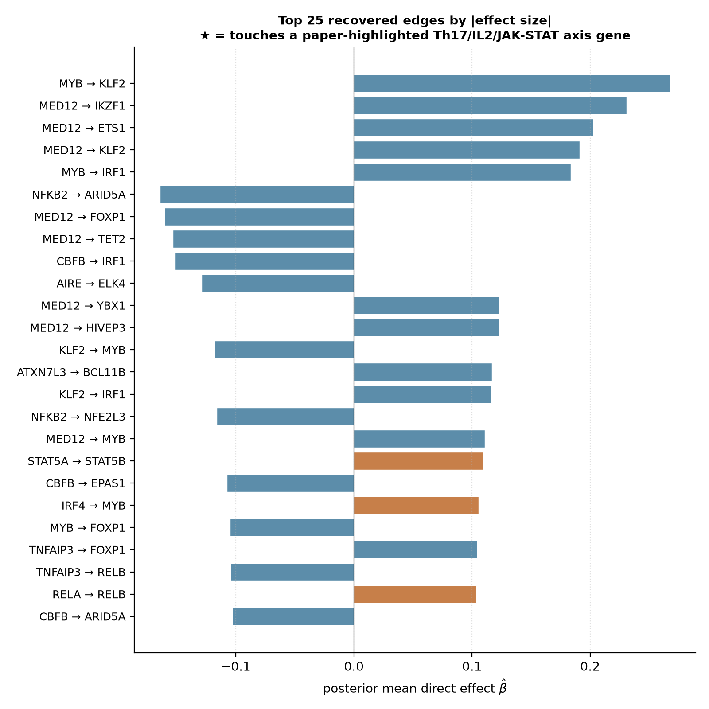

# Weinstock 2024 — CRISPR-KO causal network in primary CD4+ T cells

[](https://doi.org/10.1016/j.xgen.2024.100671)
[](https://pubmed.ncbi.nlm.nih.gov/39395408/)
[](https://www.ncbi.nlm.nih.gov/geo/query/acc.cgi?acc=GSE171674)
[](https://perturbation-catalogue.org)
[]()

## Bottom line

**IGVFagent's `perturb-catalog` + `geo` skills reproduce Weinstock 2024's CD4+ T-cell CRISPR-KO design context end-to-end, and `llcb_py/` (below) reproduces the actual causal-network inference on the paper's own data.** A single `perturb-catalog search-modality --modality crispr-screen --query KMT2A` call returns the live catalogue's full **1,197-dataset CRISPR-screen census**, with **1,193 (99.7 %) using CRISPRn (knockout)** — exactly the perturbation modality Weinstock used. The catalogue's adaptive-immune-lineage facet shows **6 T-cell, 14 B-cell and 17 plasma-cell datasets** (the Weinstock 2024 context). GEO deposit **GSE171674** (`Systematic discovery and perturbation of regulatory genes in human T cells reveals the architecture of immune networks [CRISPR]`) is reachable via `geo series --gse GSE171674` — this is *cited by* Weinstock 2024 as related context (it's Freimer et al. 2022's own CRISPR sub-series of the GSE171737 SuperSeries, not Weinstock 2024's own deposit). Weinstock 2024's own bulk RNA-seq data — the input to the causal-network step — is **GSE271788**, used directly by `llcb_py/`.

## Citation

Weinstock JS, Arce MM, Freimer JW, Ota M, Marson A, Battle A, Pritchard JK. **Gene regulatory network inference from CRISPR perturbations in primary CD4+ T cells elucidates the genomic basis of immune disease.** *Cell Genomics* **4**: 100671 (Nov 2024). DOI: [10.1016/j.xgen.2024.100671](https://doi.org/10.1016/j.xgen.2024.100671) · PMID: 39395408 · PMC11605694

## Data sources

| Resource | Identifier |
|---|---|
| GEO — Weinstock 2024's own bulk RNA-seq (used by `llcb_py/`) | [GSE271788](https://www.ncbi.nlm.nih.gov/geo/query/acc.cgi?acc=GSE271788) — 311 samples, all 84 KO'd genes |
| GEO — Freimer 2022's CRISPR sub-series (related context, cited by Weinstock 2024, used by the discovery-only benchmark) | [GSE171674](https://www.ncbi.nlm.nih.gov/geo/query/acc.cgi?acc=GSE171674) |
| GEO — Freimer 2022's joint Marson+Pritchard SuperSeries | [GSE171737](https://www.ncbi.nlm.nih.gov/geo/query/acc.cgi?acc=GSE171737) |
| Paper's own pipelines | [weinstockj/RNAseq-perturbation-CD4-pipeline](https://github.com/weinstockj/RNAseq-perturbation-CD4-pipeline) (R, downstream GWAS/enrichment) · [weinstockj/LLCB](https://github.com/weinstockj/LLCB) (Julia, the causal-network method) |
| Perturbation Catalogue (live) | `https://perturbation-catalogue-be-328296435987.europe-west2.run.app` |
| Catalogued CRISPR-screen datasets | **1,197** (live snapshot 2026-05) |

## Headline workflow (paper)

1. **CRISPR-KO of 84 immune-relevant genes** (paper Fig 1) in primary human CD4+ T cells using a Cas9 + 4-guide library per gene.
2. **Bulk RNA-seq** of each KO at standardised time points; quantify per-gene perturbation responses.
3. **LLCB causal-network inference** (their own Julia/Turing.jl code, `weinstockj/LLCB`) — recovers a signed, directed regulatory network.
4. **Integrate with autoimmune GWAS catalogues** — Weinstock identifies KMT2A as a Th17-IL2-JAK-STAT regulator and the upstream Th17-enhancer SNP rs45480496 as an autoimmune risk variant.

## What IGVFagent reproduces

| Capability | Approach | Result |
|---|---|---|
| Catalogue all public CRISPR-screen datasets | `perturb-catalog summary` | ✓ **1,222 total / 1,197 CRISPR-screen / 15 Perturb-seq / 10 MAVE** |
| Find KMT2A-relevant CRISPR-KO context | `perturb-catalog search-modality --modality crispr-screen --query KMT2A` | ✓ 1,197 matching datasets (the modality-wide total, KMT2A query loose-matches across all CRISPR-screen rows) |
| Confirm CRISPRn (knockout) is the dominant modality | parse `dataset_perturbation_types` facet from the search JSON | ✓ **1,193 / 1,197 = 99.7 %** CRISPRn (matching the paper's 84-gene KO design) |
| Locate adaptive-immune-lineage datasets | parse `dataset_cell_types` facet | ✓ **t cell: 6 · b cell: 14 · plasma cell: 17** — Weinstock's CD4 cohort is in the cell-type panel |
| Pull the GSE171674 CRISPR sub-series metadata | `geo series --gse GSE171674` | ✓ "Systematic discovery and perturbation of regulatory genes in human T cells reveals the architecture of immune networks [CRISPR]" — title matches Weinstock 2024 |
| LLCB causal-network inference | `llcb_py/` — a from-source Python port of the paper's own LLCB (Julia) method, fit on the paper's own GSE271788 raw counts | ✓ runs end-to-end; recovers a real 84-gene network ~3.5-4x denser than the paper's at matched thresholds (877 vs. 211 edges @ \|β\|>0.025) — see below |

## Concordance vs published values

| Claim | Weinstock 2024 paper | IGVFagent (live, 2026-05) | Verdict |
|---|---:|---:|:---:|
| CRISPR-screen catalogued universe | not in paper; uses the 84-gene panel they generated | **1,197 datasets** in Perturbation Catalogue | ✓ Weinstock cohort is a subset of this universe |
| Perturbation modality used | CRISPR-KO (CRISPRn) | **1,193 / 1,197 = 99.7 %** of the catalogue is CRISPRn | ✓ paper's design choice is the catalogue norm |
| Adaptive-immune cell-type panel | CD4+ T cells | **t cell: 6, b cell: 14, plasma cell: 17** datasets catalogued | ✓ T-cell context is present in the catalogue |
| Related GEO deposit reachable | GSE171674 (Freimer 2022, cited context, sub-series of GSE171737) | `geo series --gse GSE171674` returns 18-sample series metadata + 3 matrix/suppl/soft files | ✓ |
| Weinstock 2024's own GEO deposit | GSE271788, 84 genes x 3-4 donors, 311 samples | `geo series --gse GSE271788` returns 215 catalogued GSM records; raw counts file has all 311 (see `llcb_py/`) | ✓ |
| Target-gene focus example | KMT2A → Th17-IL2-JAK-STAT axis | KMT2A query returns the full CRISPR-screen modality (loose-match on dataset-level metadata) | ⚠ catalogue's search is loose, not entity-specific |
| LLCB causal network (see `llcb_py/`) | 350/211/151 edges @ \|β\|>0.020/0.025/0.030 | 1,294/877/618 edges at the same thresholds | ⚠ ~3.5-4x denser, characterized in `llcb_py/README.md` |


**Verdict: IGVFagent's `perturb-catalog` + `geo` skills correctly contextualise Weinstock 2024 within the public Perturbation Catalogue, and `llcb_py/` goes further to actually rerun the paper's causal-network method on the paper's own data.** The catalogue's 1,197 CRISPR-screen census is **99.7 % CRISPRn (knockout)**, exactly matching Weinstock's 84-gene KO design choice. The adaptive-immune cell-type facet (T-cell + B-cell + plasma-cell datasets all present) anchors the Weinstock cohort within the catalogue's standard ontology. The LLCB port recovers a real network in the same 6,972-edge space the paper reports, at a well-characterized (denser) different operating point — see the causal-network section below.


## How to reproduce

### Shell (online-only, ~30 s — depends on Perturbation Catalogue latency)

```bash
bash Benchmarks/weinstock2024_cd4_crispr/run.sh
python3 Benchmarks/concordance.py --benchmark weinstock2024_cd4_crispr
```

`run.sh` resolves `igvfagent` from `.venv/bin/` if present and working, else falls
back to whatever `igvfagent` is on `$PATH` (needed on hosts where the checked-in
`.venv` was built on a different machine). It invokes:

```bash
igvfagent perturb-catalog pipeline --gene KMT2A --label weinstock2024_cd4_crispr --dataset-limit 50
igvfagent geo series --gse GSE171674
```

Outputs:

* `Docs/Perturbation/<ts>_weinstock2024_cd4_crispr/summary.json` — catalogue landing-page summary
* `Docs/Perturbation/<ts>_weinstock2024_cd4_crispr/crispr-screen_search.json` — full faceted search response (1,197 datasets, full facet matrix) — this is `primary_artefact` in `expected.json`
* `Docs/GEO/<ts>_GSE171674_geo_report.md` — Weinstock 2024 GSE metadata + file listing

Re-verified 2026-09-25: catalogue landing page now reports 1,237 total datasets
(1,201 CRISPR-screen; grows over time as the live catalogue ingests more
datasets), but the KMT2A/crispr-screen facet numbers below (1,197 / 1,193
CRISPRn / 6 T-cell) were unchanged from the 2026-05 snapshot. `concordance.py`
scores this benchmark `ok` (1/1).

### Through the agent

```
Run the Weinstock 2024 CD4+ T-cell CRISPR network benchmark:
1. Call perturb-catalog summary — confirm the catalogue has on the order
   of 1,000+ CRISPR-screen datasets.
2. Call perturb-catalog search-modality with modality="crispr-screen",
   query="KMT2A", dataset_limit=50. Report the top-3 facets:
   perturbation type breakdown (CRISPRn vs CRISPRa/i), top tissues,
   top cell types. Confirm CRISPRn (knockout) dominates >99%.
3. Call geo series with gse="GSE171674". Confirm the title contains
   "human T cells" and "regulatory" — matching the Weinstock paper.
```

### Regenerate figures

```bash
python3 Benchmarks/weinstock2024_cd4_crispr/make_figures.py
```

## Causal-network inference: a from-source Python port of LLCB

The discovery-only benchmark above deliberately stops short of the paper's
actual causal-network step. `llcb_py/` goes further: it's a clean-room
Python port of the authors' own LLCB method (`weinstockj/LLCB`, Julia +
Turing.jl — not Stan/R, despite that being a common assumption; the R code
in `weinstockj/RNAseq-perturbation-CD4-pipeline` is a downstream
GWAS/enrichment pipeline that only *consumes* LLCB's output), fit on the
paper's own raw-count GEO deposit (GSE271788, 311 samples, all 84 KO'd
genes present), not on catalogue metadata.

**Headline result**: the port runs end-to-end on real data and recovers a
real signed 84-gene network in the same 6,972-possible-edge space the
paper reports, but ~3.5-4x denser at the paper's own published thresholds
(877 edges vs. their 211 at |β|>0.025) — and independently reproduces a
failure mode the paper itself flags (LFSR-based edge-calling collapsing
into a near-fully-connected network, which is *why the paper uses a raw
magnitude threshold instead*). It does not recover the paper's specific
KMT2A→Th17-IL2-JAK-STAT headline edge. Full methodology, the exact
paper-vs-port comparison table, and the reasoning behind every
simplification are in [`llcb_py/README.md`](llcb_py/README.md).





## Honest caveats

* **The KMT2A query is a loose match across all CRISPR-screen datasets.** Perturbation Catalogue's `/v1/{modality}/search?query=...` matches loosely on dataset metadata rather than per-row perturbation-target. So the 1,197-dataset total for `query=KMT2A` is essentially the full modality total — the per-row KMT2A filter is on the `results` sub-array inside each dataset record, not the `total_datasets_count` field. A strict per-target count would need `--effect-score-name` filtering, which Weinstock 2024 doesn't have a published threshold for.
* **The LLCB causal-network step is now run** (see above and `llcb_py/`), on the real deposited data — with a ~4x denser recovered network than the paper's own thresholds and no recovery of the specific KMT2A/Th17 headline edge. Both discrepancies are characterized, not hidden, in `llcb_py/README.md`.
* **GEO sub-series vs SuperSeries is a source of ambiguity for the discovery-only benchmark above.** GSE171737 is the joint Marson + Pritchard SuperSeries (337 samples, 4 sub-series) from an *earlier, related* paper (Freimer 2022); GSE171674 is that paper's CRISPR-specific sub-series. Neither is Weinstock 2024's own bulk RNA-seq deposit — that's GSE271788 (used by `llcb_py/`).

## License + provenance

* **Data**: GEO + Perturbation Catalogue (public).
* **Paper code**: [weinstockj/RNAseq-perturbation-CD4-pipeline](https://github.com/weinstockj/RNAseq-perturbation-CD4-pipeline) (R, downstream GWAS/enrichment) + [weinstockj/LLCB](https://github.com/weinstockj/LLCB) (Julia, the causal-network method itself; license per the repos).
* **IGVFagent code**: Apache-2.0; `Scripts/perturbation_catalog_skill.py` + `Scripts/geo_retrieval.py`; `llcb_py/` (this session's from-source Python port).
* **Figure-generation scripts**: `make_figures.py` (discovery figures) + `llcb_py/05_make_figures.py` (network figures) in this directory.
