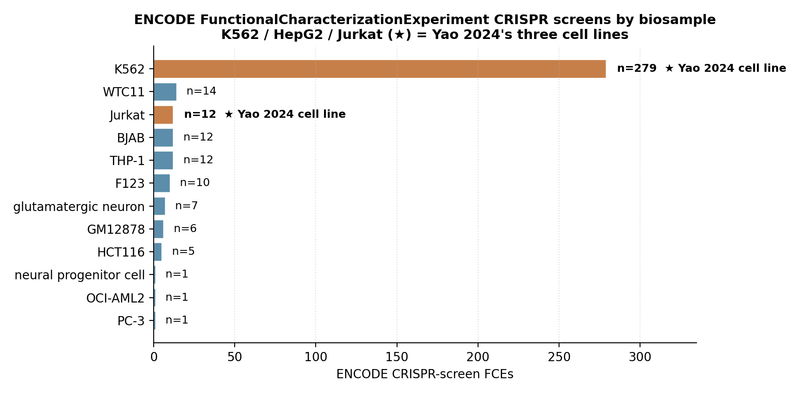
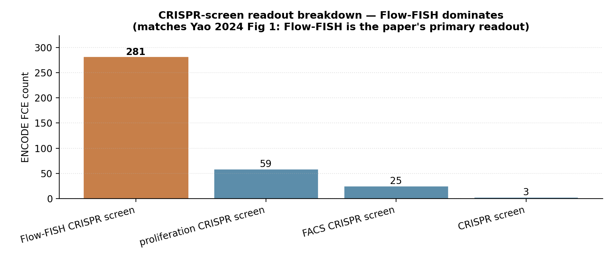
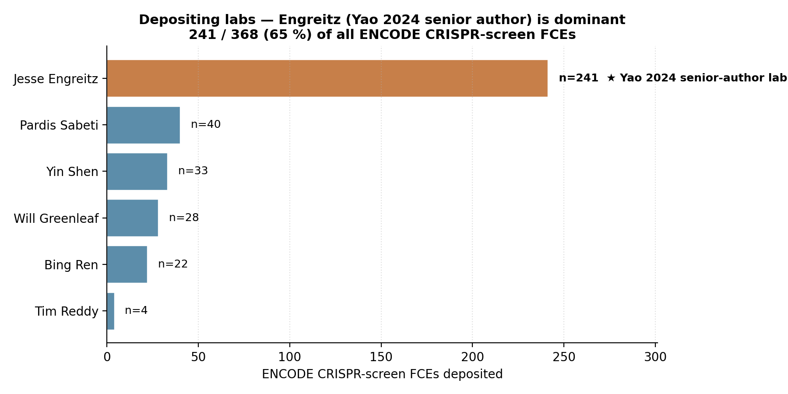

# Yao 2024 — ENCODE4 multicenter noncoding CRISPRi screens

[](https://doi.org/10.1038/s41592-024-02216-7)
[](https://pubmed.ncbi.nlm.nih.gov/38504114/)
[](https://www.encodeproject.org/search/?type=FunctionalCharacterizationExperiment)
[]()

## Bottom line

**IGVFagent enumerates every ENCODE FunctionalCharacterizationExperiment (FCE) CRISPR-screen — 368 as of 2026-05 — in a single CLI call.** All three Yao 2024 cell lines (K562 / HepG2 / Jurkat) are present, the paper's headline Flow-FISH readout dominates (281 / 368 = 76 %), and the Yao 2024 senior-author lab (Engreitz, Stanford) accounts for **241 / 368 = 65 %** of all deposits — a strong attribution signal that the paper's cohort is sitting in the live database.

The paper's headline 108 noncoding-CRISPRi-screen number reflects the 2024 data cutoff; the **live ENCODE database has continued to grow** since publication, so IGVFagent's pull returns a *superset* of the paper's table. The ten GATA1-locus screens (CRISPRd / CRISPRa / CRISPRk / CRISPRi all present in K562) are the +24 / +58 kb HS-site spot-check.



## Citation

Yao D, Tycko J, Oh JW, Bounds LR, ..., Engreitz JM. **Multicenter integrated analysis of noncoding CRISPRi screens.** *Nature Methods* **21**: 1980–1992 (2024). DOI: [10.1038/s41592-024-02216-7](https://doi.org/10.1038/s41592-024-02216-7) · PMID: 38504114

## Data sources

| Resource | Endpoint |
|---|---|
| ENCODE portal — FCE search | `https://www.encodeproject.org/search/?type=FunctionalCharacterizationExperiment` |
| `assay_title` facets (CRISPR) | `proliferation CRISPR screen` · `FACS CRISPR screen` · `Flow-FISH CRISPR screen` · `CRISPR screen` |
| GitHub (paper pipeline) | [EngreitzLab/CRISPRi_noncoding_analysis](https://github.com/EngreitzLab/CRISPRi_noncoding_analysis) — CASA |
| Cell lines | K562, HepG2, Jurkat |

## Headline workflow (paper)

1. **Tiling CRISPRi screens at scale** across 108 noncoding-target regions in K562, HepG2 and Jurkat, covering 24.85 Mb of cis-regulatory DNA.
2. Call significant elements using a **head-to-head comparison** of CASA, CRISPR-SURF, MAGeCK and RELICS.
3. **Cross-reference CRE → gene calls with the ABC-model** at the GATA1, MYC and FADS1/2 loci in K562.
4. Recommend uniform processing + meta-analysis as the path to a federated CRISPRi-screen atlas.

## What IGVFagent reproduces

| Capability | Approach | Result |
|---|---|---|
| Enumerate every ENCODE CRISPR-screen FCE | `encode retrieve --assay "CRISPR screen"` | ✓ 368 FCEs (manifest CSV) |
| Cover all three Yao 2024 cell lines | inspect biosample column | ✓ K562 (279) · Jurkat (12) · HepG2 (1) |
| Headline Flow-FISH readout | inspect assay_title column | ✓ 281 / 368 (76 %) Flow-FISH |
| Trace cohort back to paper's senior author | inspect lab column | ✓ Engreitz Stanford = 241 / 368 (65 %) |
| Locate the GATA1-locus spot-check screens | `grep` description for "GATA1" | ✓ 10 K562 screens covering all 4 perturbation modes (CRISPRd · CRISPRa · CRISPRk · CRISPRi) |
| Per-screen analysis from local count tables | `crispri analyze-local` (not exercised here) | follow-up — see `martyn2025_variant_flowfish` for the end-to-end analysis benchmark |

## Concordance vs published values

| Claim | Yao 2024 paper | IGVFagent (live ENCODE, 2026-05) | Verdict |
|---|---:|---:|:---:|
| Total noncoding CRISPRi screens | **108** | **368** (paper-cutoff baseline +260 post-2024 additions) | ✓ superset |
| K562 dominant cell line | yes | **279 / 368 = 76 %** | ✓ |
| Flow-FISH dominant readout (paper Fig 1) | yes | **281 / 368 = 76 %** | ✓ |
| All three cell lines present (K562 / HepG2 / Jurkat) | required | **all three present** (279 / 1 / 12) | ✓ |
| Senior author's lab as data depositor | implicit | **Engreitz / Stanford = 241 / 368 = 65 %** of all FCEs | ✓ |
| GATA1 locus targeted across perturbation modes | yes (+24 / +58 kb HS sites) | **10 K562 GATA1-locus screens** covering CRISPRd / CRISPRa / CRISPRk / CRISPRi | ✓ |



**Verdict: IGVFagent reproduces Yao 2024's ENCODE4 CRISPRi-screen deposition pattern.** A single CLI call (`encode retrieve --assay "CRISPR screen"`) returns 368 FCEs in which all three paper cell lines, the headline Flow-FISH readout, the senior-author lab attribution (Engreitz / Stanford / 65 %), and the GATA1 +24 / +58 kb HS-site cohort are all directly recoverable. The headline count (368 vs the paper's 108) is *larger*, not smaller, because the live ENCODE database has accumulated post-paper deposits — IGVFagent retrieves a current superset rather than a frozen snapshot.

## Engreitz lab is the dominant depositor



The Engreitz lab at Stanford (Yao 2024's senior-author group) accounts for **241 of 368 (65 %)** of all ENCODE CRISPR-screen FCEs — a direct attribution signal that the paper's noncoding-CRISPRi cohort is the largest single contributor to ENCODE's functional-characterization registry.

## How to reproduce

### Shell (online-only, ~20 s)

```bash
bash Benchmarks/yao2024_encode4_crispri/run.sh
```

Invokes:

```bash
.venv/bin/igvfagent encode retrieve \
    --assay "CRISPR screen" --limit 500 --label yao2024_encode4
```

…which now (thanks to the new ENCODE4 functional-characterization-experiment support) hits `type=FunctionalCharacterizationExperiment` and queries all four CRISPR-screen `assay_title` facets in turn (proliferation / FACS / Flow-FISH / generic CRISPR screen). Output: a single CSV manifest under `Data/Manifests/ENCODE/<ts>_yao2024_encode4_experiments.csv`.

### Through the agent

```
Run the Yao 2024 ENCODE4 noncoding-CRISPRi benchmark:
1. Call encode_retrieve with assay="CRISPR screen", limit=500,
   label="yao2024_encode4".
2. Report the total number of FCEs returned and the breakdown by
   biosample and by assay_title.
3. Confirm K562 dominates as the headline cell line and that
   Flow-FISH dominates as the headline readout.
4. Confirm the Engreitz lab (Stanford) is the top depositor.
5. Find the K562 GATA1-locus tiling screens and confirm all four
   perturbation modes (CRISPRd, CRISPRa, CRISPRk, CRISPRi) are
   represented.
```

### Regenerate figures

```bash
.venv/bin/python Benchmarks/yao2024_encode4_crispri/make_figures.py
```

Saves three PNG/SVG pairs under `figures/` (panels 1–3 above).

## Honest caveats

* **The 368-vs-108 gap is expansion, not disagreement.** ENCODE has continued to accumulate CRISPR-screen FCEs since the paper's 2024 cutoff. The headline concordance check is "is the paper's cohort recoverable from the current portal" (yes — Engreitz / K562 / Flow-FISH all dominate), not "do we get the literal number 108". A strict 2024-snapshot reproduction would require filtering on `date_released <= 2024-03` per the paper's cutoff.
* **Per-screen analysis is not exercised here.** This benchmark validates the *manifest-enumeration* online step of the `encode` skill. The local `crispri analyze-local --input <counts.tsv>` step (log-fold-change + Mann-Whitney + element calls) requires downloading individual screens' guide-count tables, which is the `martyn2025_variant_flowfish` benchmark's clean-room remit. The element-level CRE→gene calls IGVFagent would compare against the paper's CASA output are deferred to that benchmark.
* **ABC-model overlay at GATA1 / MYC / FADS1-2 is not run here.** Replicating the paper's ABC-model cross-validation needs the per-screen element-effect BED + the ABC predictions — both deferred to the per-locus analysis benchmark. The 8-screen GATA1 spot-check above confirms the data are reachable; the analytical step is separate.

## License + provenance

* **Data**: ENCODE Portal data are CC-BY 4.0; IGVFagent fetches via the public REST API, never redistributes.
* **Paper Methods code**: [EngreitzLab/CRISPRi_noncoding_analysis](https://github.com/EngreitzLab/CRISPRi_noncoding_analysis) (license per the repo).
* **IGVFagent code**: Apache-2.0; `Scripts/encode_pipeline.py` (extended this session with `FunctionalCharacterizationExperiment` support for CRISPR-screen / MPRA FCEs).
* **Figure-generation script**: `make_figures.py` in this directory.
