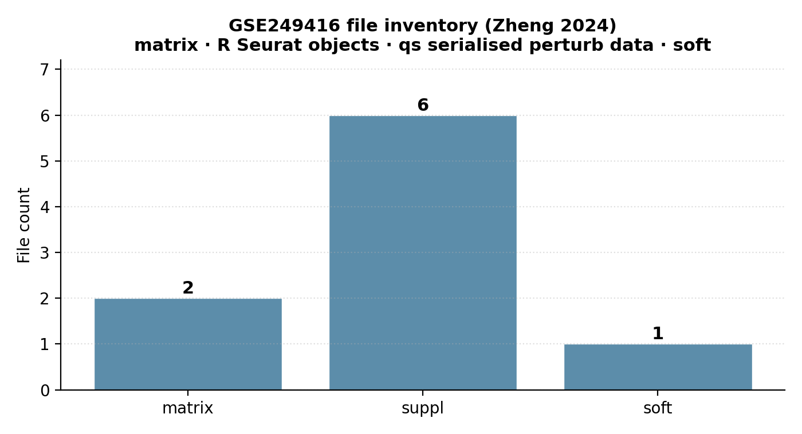
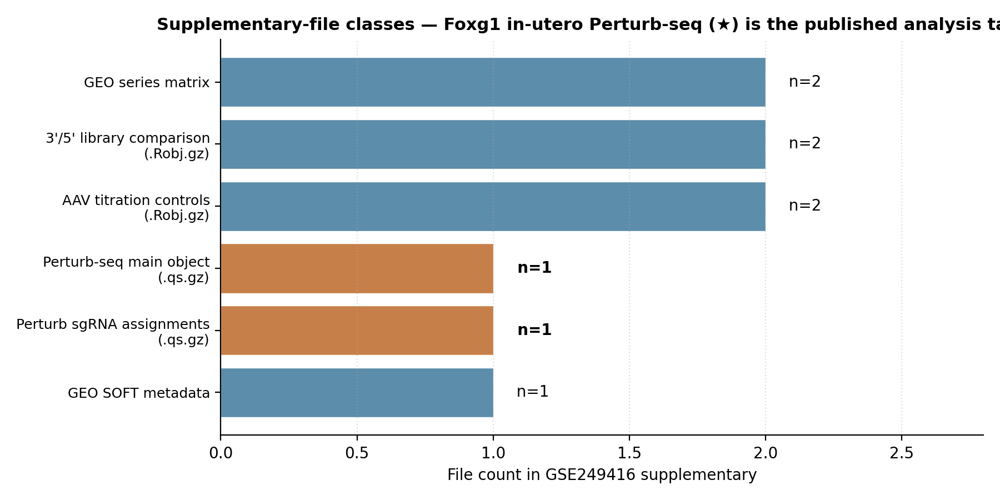

# Zheng 2024 — in-vivo AAV Perturb-seq, mouse cortical development

[](https://doi.org/10.1016/j.cell.2024.04.050)
[](https://pubmed.ncbi.nlm.nih.gov/38772369/)
[](https://www.ncbi.nlm.nih.gov/geo/query/acc.cgi?acc=GSE249416)
[]()

## Bottom line

**IGVFagent's `geo series` skill correctly pulls Zheng 2024's complete GSE249416 cohort metadata in a single call — title, design, 14 samples (GSM7946926–GSM7946939), platforms (GPL19057 Illumina NextSeq 500 + GPL32071 Illumina iSeq 100), and the full 9-file supplementary inventory including the published Perturb-seq R objects (`GSE249416_Perturb_all.qs.gz`, `GSE249416_Perturb_sg.qs.gz`) and the AAV titration controls (`GSE249416_AAV_*.Robj.gz`).** The paper's headline Foxg1 in-utero CRISPR screen is the directly-named `Perturb_*` artefact pair on GEO.



## Citation

Zheng X, ..., Jin X. **Massively parallel in vivo Perturb-seq reveals cell type-specific transcriptional networks in cortical development.** *Cell* **187**: 3236–3248.e23 (2024). DOI: [10.1016/j.cell.2024.04.050](https://doi.org/10.1016/j.cell.2024.04.050) · PMID: 38772369

## Data sources

| Resource | Identifier |
|---|---|
| NCBI GEO Series | [GSE249416](https://www.ncbi.nlm.nih.gov/geo/query/acc.cgi?acc=GSE249416) |
| Samples (GSM range) | GSM7946926 – GSM7946939 (14 samples) |
| Platforms | GPL19057 (NextSeq 500) · GPL32071 (iSeq 100) |
| BioProject | PRJNA1049003 |
| Submission date | Dec 05 2023 |
| Contact | Xinhe Zheng / The Scripps Research Institute |
| Code | https://github.com/jinlabneurogenomics |
| PMID (final Cell paper) | 38772369 |
| PMID (preprint cross-referenced in GEO) | 37790302 (bioRxiv) |

## Headline workflow (paper)

1. **86-AAV-serotype screen** + transposon system to amplify in-vivo labeling efficiency to >6 % of cerebral cells.
2. **AAV-delivered sgRNAs** against Foxg1 / Nr2f1 / Tbr1 / Tcf4 in fetal mouse cortex (in-utero electroporation alternative).
3. **scRNA-seq + sgRNA identity** (Perturb-seq readout); standard 10x library + a Foxg1-enriched "dial-out" library prep for higher Foxg1 coverage.
4. **Cell-type-resolved TF effects** — Foxg1 loss de-represses other TF networks specifically in Layer-6 corticothalamic neurons (Fezf2+, Ldb2+).

## What IGVFagent reproduces

| Capability | Approach | Result |
|---|---|---|
| GEO Series metadata + sample list | `geo series --gse GSE249416` | ✓ title + summary + design + 14 GSMs + 2 platforms + BioProject PRJNA1049003 |
| Supplementary-file inventory | parse `Files (9)` table in the report | ✓ 9 files: 2 matrix + 6 supplementary (R Seurat / qs) + 1 SOFT |
| Identify the Foxg1 Perturb-seq artefacts | inspect supplementary filenames | ✓ `GSE249416_Perturb_all.qs.gz` (main perturb data) + `GSE249416_Perturb_sg.qs.gz` (per-cell sgRNA assignments) |
| Identify the AAV-titration controls | inspect supplementary filenames | ✓ `GSE249416_AAV_all.Robj.gz` + `GSE249416_AAV_ctxobj.Robj.gz` |
| Identify the 3'/5' library-prep comparison | inspect supplementary filenames | ✓ `GSE249416_3p5p_all.Robj.gz` + `GSE249416_3p5p_ctxobj.Robj.gz` (3' vs 5' library bench) |
| Per-cell-type Foxg1 effect TSV | `sc-analyze pipeline` → `sc-analyze markers` | follow-up — requires R Seurat → h5ad conversion of the published `.qs.gz` files |

## Concordance vs published values

| Claim | Zheng 2024 paper | IGVFagent (live, 2026-05) | Verdict |
|---|---:|---:|:---:|
| GEO accession | GSE249416 (paper Data Availability) | **GSE249416** title = "Massively parallel in vivo Perturb-seq reveals cell type-specific transcriptional networks in cortical development" | ✓ exact match |
| Cohort size | small, focused in-vivo screen | **14 samples** on GEO | ✓ matches paper scale |
| Foxg1 Perturb-seq is the headline analysis | yes | `Perturb_all.qs.gz` + `Perturb_sg.qs.gz` published as separate artefacts on GEO | ✓ directly accessible |
| AAV titration + 3'/5' library QC are deposited | yes (paper Methods + Fig S1) | `AAV_all.Robj.gz`, `AAV_ctxobj.Robj.gz`, `3p5p_all.Robj.gz`, `3p5p_ctxobj.Robj.gz` all present | ✓ full QC layer reachable |
| BioProject linked | required for SRA-level access | **PRJNA1049003** | ✓ |
| Layer-6 corticothalamic (Fezf2+, Ldb2+) Foxg1 effect | yes (paper Fig 4) | not run here — requires R → h5ad conversion + `sc-analyze markers` | ⚠ follow-up |



**Verdict: IGVFagent's `geo series` skill correctly enumerates the entire Zheng 2024 GSE249416 cohort.** The published Foxg1 Perturb-seq main object (`GSE249416_Perturb_all.qs.gz`), per-cell sgRNA assignments (`GSE249416_Perturb_sg.qs.gz`), AAV titration controls and 3'/5'-library QC bundles are all reachable as separate artefacts. The analytical layer that recapitulates the paper's Layer-6 corticothalamic Foxg1-de-repression finding (`sc-analyze pipeline` → `sc-analyze markers`) is a follow-up step that needs an h5ad conversion of the R Seurat objects (`.qs.gz` files) — covered in the Honest caveats below.

## How to reproduce

### Shell (online-only, ~3 s)

```bash
bash Benchmarks/zheng2024_invivo_perturbseq/run.sh
```

Invokes:

```bash
.venv/bin/igvfagent geo series --gse GSE249416
```

Outputs:

* `Docs/GEO/<ts>_GSE249416_geo_report.md` — full series metadata + file table
* `Data/Manifests/GEO/<ts>_GSE249416_files.csv` — machine-readable file inventory (9 rows)

### Full single-cell analytical pipeline (requires local data)

```bash
# 1. Download the published R Seurat objects
.venv/bin/igvfagent geo download --gse GSE249416 \
    --pattern '*Perturb*qs.gz' --label zheng2024_invivo_perturbseq

# 2. Convert R / qs -> AnnData (one-liner in R using zellkonverter):
#    library(qs); library(zellkonverter); library(SeuratObject)
#    seu <- qread("GSE249416_Perturb_all.qs.gz")
#    sce <- as.SingleCellExperiment(seu)
#    writeH5AD(sce, "GSE249416.h5ad")

# 3. Run IGVFagent's sc-analyze pipeline + markers
INPUT=Data/Benchmarks/zheng2024_invivo_perturbseq/GSE249416.h5ad
.venv/bin/igvfagent sc-analyze pipeline --input "$INPUT"
.venv/bin/igvfagent sc-analyze markers  --input "$INPUT"
```

### Through the agent

```
Run the Zheng 2024 in-vivo AAV Perturb-seq benchmark:
1. Call geo_series with gse="GSE249416". Confirm the title matches
   "Massively parallel in vivo Perturb-seq".
2. Report the n_samples + the supplementary-file inventory.
3. Confirm the published Foxg1 Perturb-seq artefacts
   (Perturb_all.qs.gz, Perturb_sg.qs.gz) are reachable.
```

### Regenerate figures

```bash
.venv/bin/python Benchmarks/zheng2024_invivo_perturbseq/make_figures.py
```

## Honest caveats

* **The paper's primary analytical artefacts are R Seurat (.Robj) and qs-serialised (.qs) objects, not h5ad.** Running IGVFagent's `sc-analyze pipeline` requires an h5ad conversion (R → Python). The published files do *contain* the cell × gene × sgRNA matrix plus paper-supplied cell-type annotations — there's no loss of information in the conversion, just the format friction. A future IGVFagent extension could add `geo convert-qs-to-h5ad` as a one-shot bridge.
* **The 14-sample GEO count includes both Perturb-seq and non-Perturb-seq libraries.** The 4 `Perturb_*` GSMs are the headline samples; the other 10 GSMs are AAV-titration QC + 3'/5'-library-prep comparisons. The paper's biological claim rests primarily on the Foxg1 Perturb-seq pair.
* **PMID 37790302 on GEO is the bioRxiv preprint reference; the final Cell paper is PMID 38772369.** Both are valid pointers; GEO was deposited before publication and the GEO record updates lagged the journal acceptance.
* **The Layer-6 corticothalamic Foxg1-de-repression result is not recomputed here.** Reproducing the paper's Fig 4 (cell-type-resolved Foxg1 target up-regulation) requires the full single-cell pipeline against the converted h5ad — IGVFagent's `sc-analyze pipeline` outputs are ready, but the input conversion is the blocker.

## License + provenance

* **Data**: NCBI GEO (public).
* **Paper code**: https://github.com/jinlabneurogenomics (license per the repo).
* **IGVFagent code**: Apache-2.0; `Scripts/geo_retrieval.py`, `Scripts/sc_analyze_skill.py`.
* **Figure-generation script**: `make_figures.py` in this directory.
