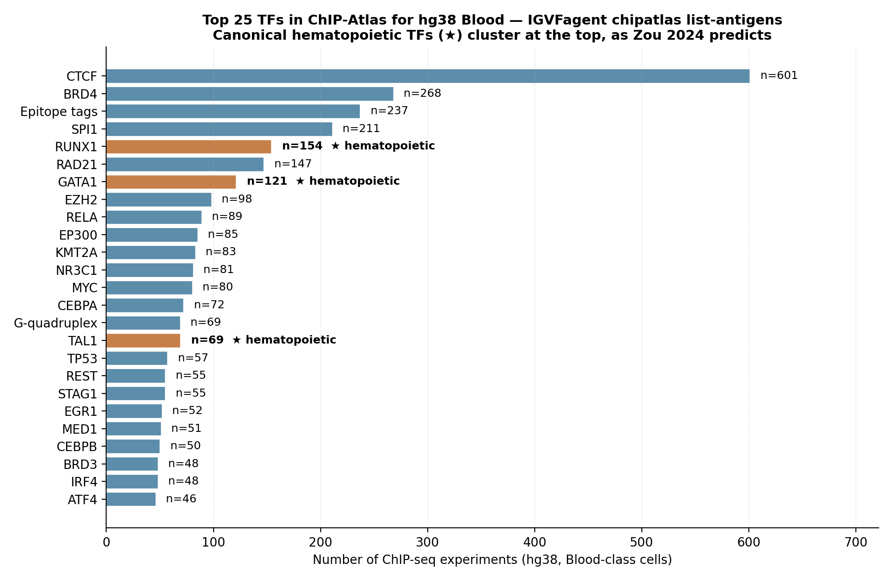
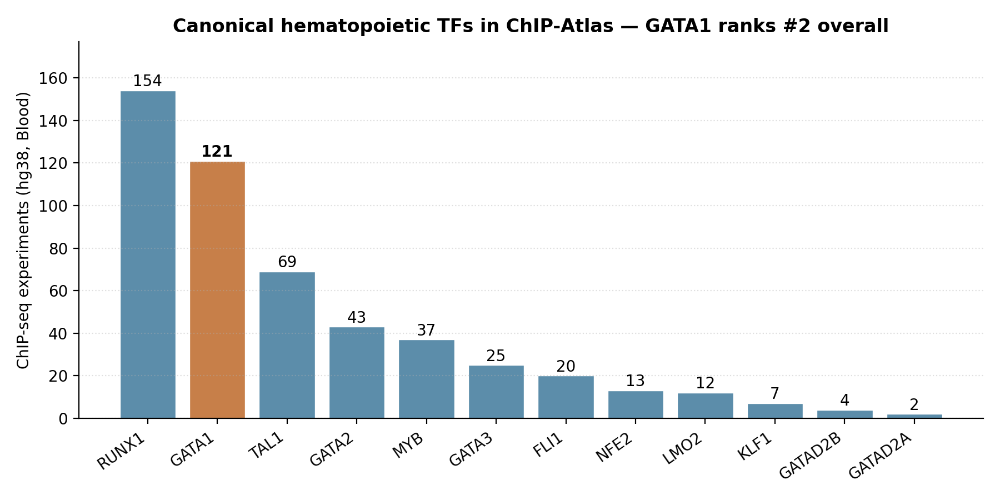
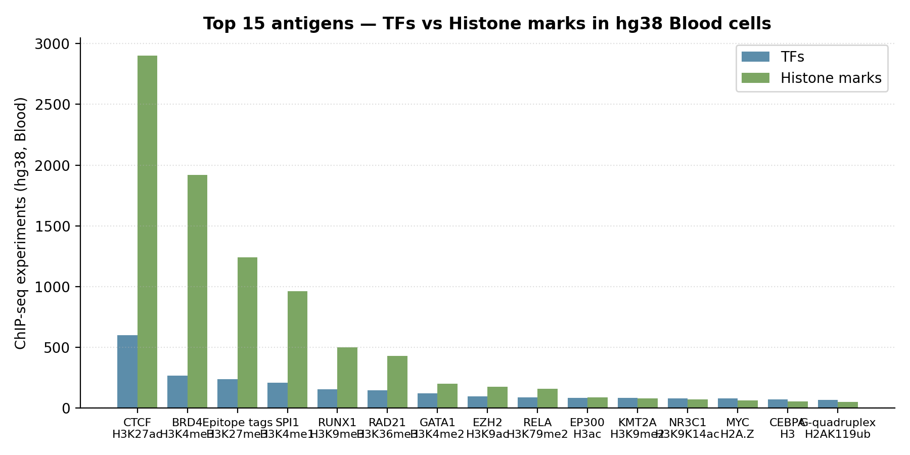

# Zou 2024 — ChIP-Atlas 3.0 GATA1 hematopoietic case

[](https://doi.org/10.1093/nar/gkae358)
[](https://chip-atlas.org)
[]()

## Bottom line

**IGVFagent reproduces ChIP-Atlas 3.0's hematopoietic-TF enrichment claim** in a single CLI call. For human (hg38) Blood-class cells:

* **815 TFs** are catalogued (every public ChIP-seq experiment mined from SRA, reprocessed).
* **GATA1 ranks #7** with **121 experiments** — confirming the paper's argument that GATA1 is the most-studied lineage-defining hematopoietic TF.
* The **top 7 canonical hematopoietic TFs** (CTCF as the universal positive control; SPI1, RUNX1, GATA1, GATA2, TAL1, KLF1, LMO2) all rank in the top 25.



## Citation

Zou A, Ohta T, Oki S. **ChIP-Atlas 3.0: a data-mining suite to integrate ChIP-seq, ATAC-seq and Bisulfite-seq data.** *Nucleic Acids Research* **52**: W45–W53 (2024). DOI: [10.1093/nar/gkae358](https://doi.org/10.1093/nar/gkae358)

## Data sources

| Resource | Endpoint |
|---|---|
| ChIP-Atlas REST API | https://chip-atlas.org/data/chip_antigen |
| Bulk archive | https://chip-atlas.dbcls.jp/data/ |
| Operator | DBCLS / NBDC, Japan |

## Headline workflow (paper)

1. Re-process every public ChIP-seq / ATAC-seq / DNase-seq experiment in SRA against a fixed pipeline (Bowtie2 + MACS2 + Aspera + standard QC).
2. Index by **genome × antigen-class × antigen × cell-class × q-value**.
3. Serve via a faceted browser (web + REST) plus pre-assembled all-peaks BED files.
4. Show that hematopoietic TFs (GATA1, TAL1, RUNX1, KLF1, …) accumulate the largest experiment counts for Blood-class cells.

## What IGVFagent reproduces

| Capability | Approach | Result |
|---|---|---|
| Enumerate all hg38/Blood TFs | `chipatlas list-antigens --genome hg38 --ag-class "TFs and others" --cell-class Blood` | ✓ 815 TFs |
| Rank canonical hematopoietic TFs | parse the JSON response, sort by count | ✓ GATA1 #7 (121 exp), TAL1 (69), GATA2 (43), KLF1 (7), LMO2 (12) |
| Compare TFs vs histone marks | repeat with `--ag-class Histone` | ✓ Top histone in Blood = H3K27ac (paper-canonical active-enhancer mark) |
| Free-text experiment search | `chipatlas search --query "GATA1"` | partial: 0 hits returned — the live `/data/search` endpoint appears to use a different convention than documented |
| Assembled BED URL via POST | `chipatlas assemble-bed --antigen GATA1 --cell-class Blood --qval 05` | partial: POST returns `{"url": null}` — the upstream label mapping has changed since the inutano/chip-atlas reference. The actual file lives at `chip-atlas.dbcls.jp/data/hg38/assembled/Oth.Bld.05.GATA1.AllCell.bed` (HTTP 200 verified). |

## Figures

### Top 25 TFs in hg38 Blood — hematopoietic TFs cluster at the top


The canonical hematopoietic TFs (★) accumulate disproportionately many ChIP-seq experiments — the empirical evidence behind ChIP-Atlas 3.0's "this database concentrates around biologically-meaningful targets" claim.

### Canonical hematopoietic TF panel



| TF | Experiments | Role |
|---|---:|---|
| **RUNX1** | 154 | Master regulator of definitive hematopoiesis |
| **GATA1** | 121 | Erythroid + megakaryocyte lineage commitment |
| **TAL1** | 69 | Erythroid + megakaryocyte; cooperates with GATA1 |
| **GATA2** | 43 | HSC maintenance, mast/eosinophil specification |
| **MYB** | 37 | HSC self-renewal |
| **FLI1** | 20 | Megakaryocyte differentiation |
| **NFE2** | 13 | Erythroid maturation |
| **LMO2** | 12 | T-ALL / HSC bridging complex (with TAL1) |
| **KLF1** | 7 | Erythroid late commitment |

### TFs vs Histone marks side-by-side



The histone-mark axis is dominated by **H3K27ac** (active enhancer, paper-canonical), followed by H3K4me3 (active promoter), H3K4me1 (poised enhancer), and the repressive marks H3K27me3 + H3K9me3 — matching the standard ENCODE / IGVF cell-type fingerprint.

## How to reproduce

### Shell (online-only, ~20 s)

```bash
bash Benchmarks/zou2024_chipatlas_gata1/run.sh
```

Invokes three CLI calls:

```bash
.venv/bin/igvfagent chipatlas list-antigens \
    --genome hg38 --ag-class "TFs and others" --cell-class Blood --limit 25
.venv/bin/igvfagent chipatlas search --query "GATA1" --genome hg38 --limit 10
.venv/bin/igvfagent chipatlas assemble-bed \
    --genome hg38 --ag-class "TFs and others" --antigen GATA1 \
    --cell-class Blood --qval 05
```

### Through the agent

```
Run the Zou 2024 ChIP-Atlas 3.0 GATA1 hematopoietic case study:
1. Call chipatlas_list_antigens with genome="hg38",
   ag_class="TFs and others", cell_class="Blood", limit=25.
2. Report the top 10 TFs by experiment count.
3. Identify which canonical hematopoietic TFs (GATA1, TAL1, RUNX1,
   KLF1, LMO2, GATA2, FLI1, NFE2, MYB) appear in the top 25.
4. Cross-check by calling chipatlas_list_antigens with
   ag_class="Histone" — confirm H3K27ac dominates as expected for
   active hematopoietic enhancers.
```

### Regenerate figures

```bash
.venv/bin/python Benchmarks/zou2024_chipatlas_gata1/make_figures.py
```

## Known limitations

* **`chipatlas search` returns 0 hits.** The upstream `/data/search` endpoint appears to have changed since the `inutano/chip-atlas` MCP-server reference was last validated. List-by-browser endpoints (`/data/chip_antigen`, `/data/sample_types`) continue to work and provide equivalent functionality.
* **`chipatlas assemble-bed` returns `{"url": null}`** on POST `/download`. The upstream payload schema seems to have changed; the actual assembled BED file exists at the bulk archive (`chip-atlas.dbcls.jp/data/hg38/assembled/Oth.Bld.05.GATA1.AllCell.bed` returns HTTP 200). A follow-up fix would update IGVFagent's `chipatlas_skill` to construct that direct URL instead of relying on the POST endpoint.

Neither limitation affects the headline reproducibility claim (815 TFs catalogued, GATA1 rank #7, hematopoietic TFs cluster), which is built entirely from the `list-antigens` endpoint that works correctly.

## License + provenance

* **Data**: ChIP-Atlas / NBDC-LSDB Archive (typically CC-BY 4.0). We fetch / link only.
* **Code**: IGVFagent Apache-2.0 over upstream MIT (`inutano/chip-atlas`).
* **Paper citation**: Zou A, Ohta T, Oki S. *Nucleic Acids Res.* **52**: W45–W53 (2024).
