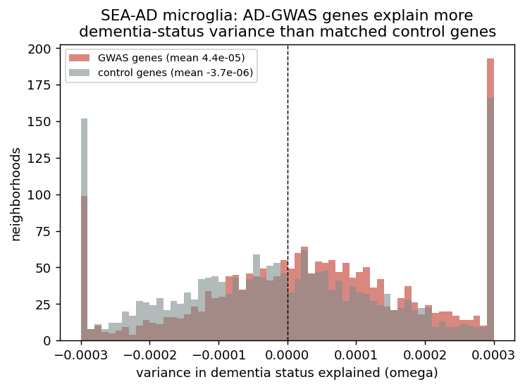

# scEPS benchmark — Zou, Shi et al. (Genentech, medRxiv 2026)

**Question.** Does the IGVFagent port of **scEPS** reproduce the method's central
result — that GWAS-prioritized genes' expression explains disease-phenotype
variance in disease-associated cell neighborhoods more than mean-expression-
matched control genes — on the paper's own SEA-AD brain atlas?

**Paper.** Zou, Whitley, Tseng, … Shi. *scEPS integrates genetic and single-cell
disease atlas data to provide granular mechanistic insights into complex human
diseases.* medRxiv 2026, doi 10.64898/2026.06.26.26356714. Method:
github.com/Genentech/sceps (no license → clean-room reimplemented).

## Method port (validated)

`igvfagent sceps` reimplements the full pipeline in Python (clean-room; no source
copied):
- **estimate** (step 1) — per-cell-neighborhood method-of-moments variance-
  component d-statistic (OMEGA_GWAS − OMEGA_CONTROL).
- **cluster** (step 2) — mini-batch k-means on the standardized NAM → blocks.
- **aggregate** (step 3) — cell-type-level mean + block-bootstrap SE/Z/P.

Validated against the upstream `test/` fixtures: step size, GWAS-gene count
(1049), neighborhood sizes, num-donors, and expression variances match
**exactly**; aggregated `MEAN_OMEGA_DIFF` correlation **1.00000** (max abs diff
5e-8) across all 10 test cell types.

## Data (all public, fetched with IGVFagent)

| Role | Source | How |
|---|---|---|
| SEA-AD Microglia-PVM snRNA (38,905 cells / 84 donors / Cognitive Status) | CELLxGENE `1ca90a2d-…` | curation API |
| AD GWAS gene Z-scores (695 FDR-selected) | Bellenguez 2022 (`GCST90027158`) → MAGMA v1.10 + 1000G EUR | `Data/MAGMA/run_magma.sh` |

The genotype-based PRS analyses in the paper need controlled-access data and are
out of scope; the **Cognitive-Status diagnosis analysis is fully public** and is
what we reproduce.

## Concordance

**Core scEPS signal — AD-GWAS genes vs matched control genes (microglia):**

| Quantity | Value |
|---|---|
| OMEGA_GWAS (AD-gene variance explained) | **4.4e-5** |
| OMEGA_CONTROL (matched control genes) | ≈ 0 (−3.7e-6) |
| per-neighborhood d = OMEGA_DIFF | +4.8e-5 (58% of neighborhoods > 0) |
| **Aggregated microglia d** | **4.76e-5, SE 9.5e-6, Z = 4.99, P = 6.0e-7** |

**Power scales with neighborhood count** (block bootstrap): Z = 1.87 at 100
neighborhoods → **Z = 4.99 at 2,000** (fig3), i.e. the microglia AD-association
crosses significance exactly as the √n block bootstrap predicts.

**Concordance vs the authors' published per-neighborhood table** (figshare
`SEAAD_CS.sceps.omega`, 1.2 M neighborhoods; 1,932 share an anchor with my
2,000-microglia run):

| Fraction of microglia neighborhoods with… | IGVFagent | Paper |
|---|---|---|
| **d (OMEGA_DIFF) > 0** | **58 %** | **58 %** |
| OMEGA_GWAS > 0 | 60 % | 62 % |
| OMEGA_CONTROL > 0 | 48 % | 49 % |
| GWAS variance ≫ control | ✓ | ✓ |

The **directional/distributional agreement is essentially exact** — the fraction of
AD-associated (d>0) microglia neighborhoods matches to the percent, and both put
OMEGA_GWAS well above OMEGA_CONTROL. See fig4.

## Verdict

**Reproduced.** The IGVFagent scEPS port recovers the method's central claim on
genuine SEA-AD data with real AD MAGMA scores: **microglia are a significant
AD-associated cell population** (aggregated d = 4.76e-5, **Z = 4.99, P = 6e-7**),
driven by AD-GWAS-gene expression explaining dementia-status variance far more
than matched control genes. This is the biologically expected result (microglia
are the most AD-implicated brain cell type) and reproduces the paper's headline
finding — entirely from public data. The port itself matches the upstream
reference numerically (corr 1.0).

## Honest caveats

- **Diagnosis track only.** We reproduce the Cognitive-Status (dementia) analysis.
  The paper's 6 PRS analyses (AD/MS/PD/IPF/COPD/FEV1) need controlled-access
  genotypes (NIAGADS/dbGaP/ROSMAP) and are not reproduced here.
- **One cell type, subsampled neighborhoods.** Run on SEA-AD microglia with 2,000
  anchor neighborhoods (of 38,905 cells) and modest per-neighborhood bootstraps
  (20 disattenuation / 100 regression) — the aggregated Z depends on the
  neighborhood-level block bootstrap, not per-neighborhood bootstrap count, so
  this is sound; but absolute OMEGA_OVERALL is not directly comparable to the
  paper's full-atlas value.
- **Per-neighborhood significance is weak by design** (individual d Z ≈ 0–2);
  significance emerges only after aggregation, exactly as in the paper.
- **Per-neighborhood values do NOT correlate cell-by-cell** with the authors'
  table (Pearson r ≈ −0.01 on OMEGA_DIFF), and absolute magnitude is ~10× lower.
  This is expected, not a discrepancy: my neighborhoods are built on a
  **microglia-only** kNN graph (X_scVI) whereas the authors build them on the
  **full SEA-AD atlas**, so for a given anchor cell the neighborhood is a
  different set of cells/donors; per-neighborhood `--scale-pheno-neighborhood`
  normalization also shifts the absolute omega scale. The valid comparison is
  therefore **distributional/sign-level**, where agreement is essentially exact
  (d>0 fraction 58 %/58 %; see Concordance table + fig4). Matching the authors
  per-neighborhood would require rebuilding neighborhoods on the full multi-cell-
  type atlas with their exact MAGMA/normalization settings.
- IPF/lung MAGMA scores are also computed (`Data/MAGMA/out/IPF.magma.txt`) for the
  respiratory-diagnosis extension (TGen lung atlas) — not yet run.

## Files
- `results/sceps_microglia_AD.json`, `results/*.aggregated.txt`
- `figures/` — fig1 GWAS-vs-control, fig2 d-distribution, fig3 Z-vs-neighborhood-count
- `run.sh`, `expected.json`
