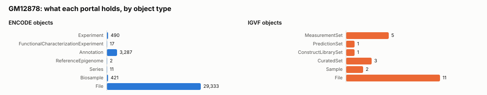
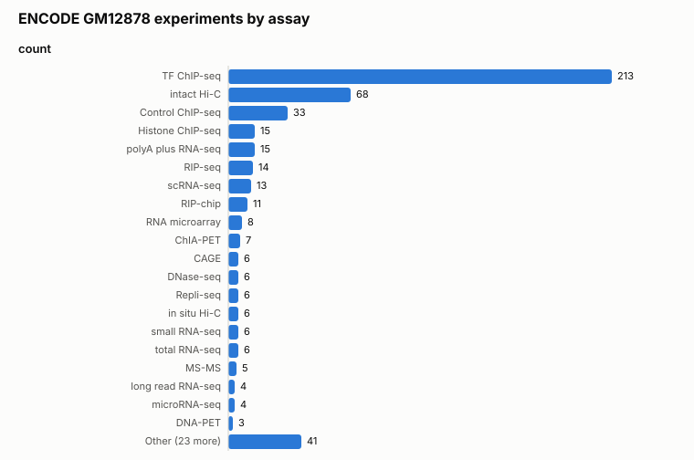
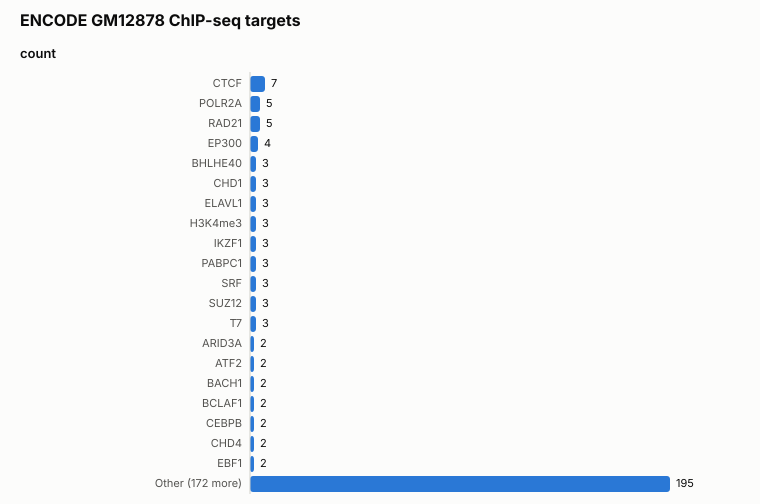
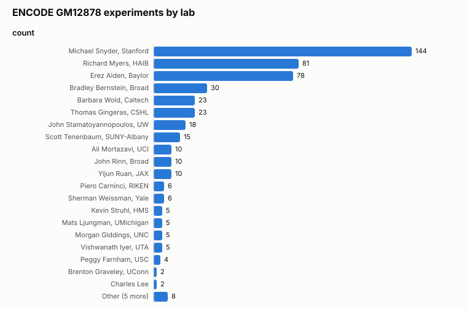
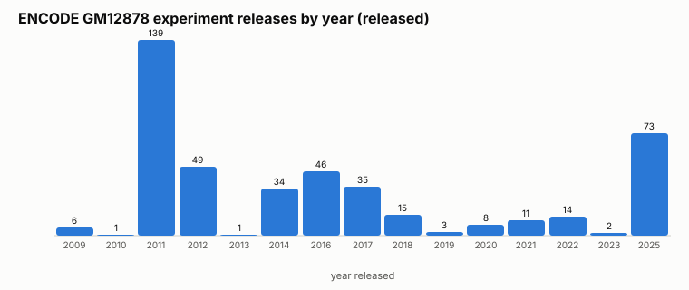
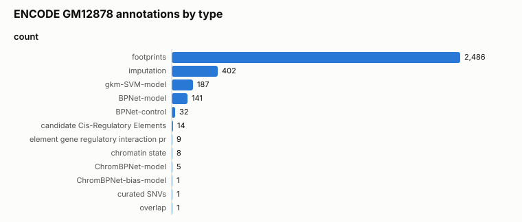
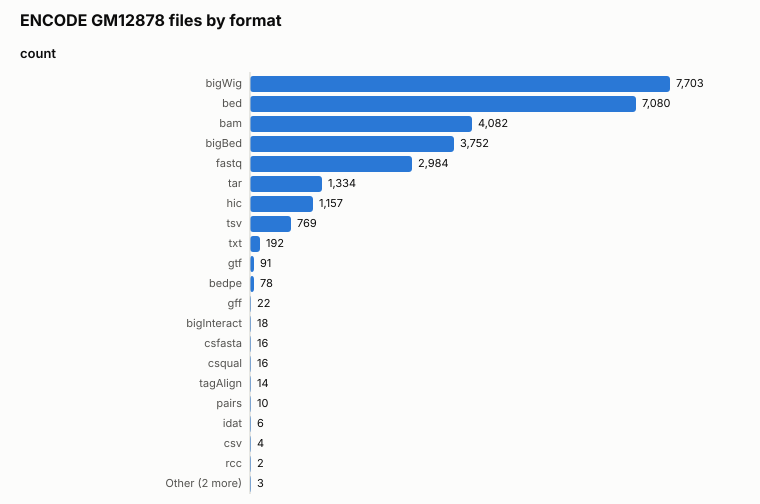
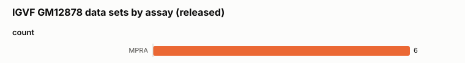
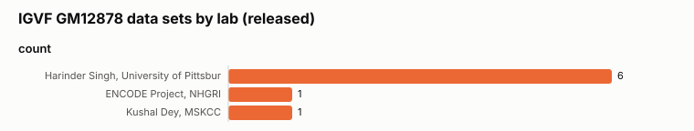
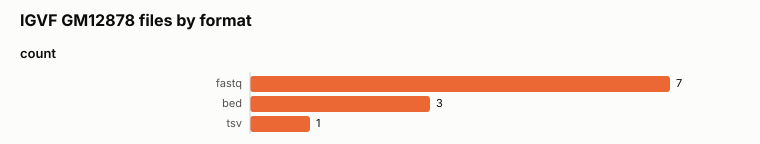

# Biosample census: GM12878

Generated 2026-09-21 18:13 by `igvfagent biosample-census`. Portals: ENCODE, IGVF. Item tables use status `released`; totals and facet counts cover all statuses.

## 1. Identity on each portal

| Portal | term_name used | term_id | classification | resolution |
|---|---|---|---|---|
| ENCODE | GM12878 | EFO:0002784 | cell line | matched ontology term |
| IGVF | GM12878 | EFO:0002784 | - | matched ontology term |

## 2. Totals by object type

Counts come from the portal's structured sample-term field (column *filter field*), not free-text search. A dash means the portal could not be reached for that type.

| Portal | Type | Total (all statuses) | Released | Filter field |
|---|---|---|---|---|
| ENCODE | Experiment | 490 | 437 | biosample_ontology.term_name |
| ENCODE | FunctionalCharacterizationExperiment | 17 | 17 | biosample_ontology.term_name |
| ENCODE | Annotation | 3,287 | 2,512 | biosample_ontology.term_name |
| ENCODE | ReferenceEpigenome | 2 | 1 | biosample_ontology.term_name |
| ENCODE | Series | 11 | 0 | biosample_ontology.term_name |
| ENCODE | Biosample | 421 | 417 | biosample_ontology.term_name |
| ENCODE | File | 29,333 | 24,328 | biosample_ontology.term_name |
| IGVF | MeasurementSet | 5 | 5 | samples.sample_terms.term_name |
| IGVF | AnalysisSet | 0 | 0 | samples.sample_terms.term_name |
| IGVF | AuxiliarySet | 0 | 0 | samples.sample_terms.term_name |
| IGVF | PredictionSet | 1 | 1 | samples.sample_terms.term_name |
| IGVF | ConstructLibrarySet | 1 | 1 | samples.sample_terms.term_name |
| IGVF | ModelSet | 0 | 0 | samples.sample_terms.term_name |
| IGVF | CuratedSet | 3 | 1 | samples.sample_terms.term_name |
| IGVF | Sample | 2 | 2 | sample_terms.term_name |
| IGVF | File | 11 | 10 | file_set.samples.sample_terms.term_name |

## 3. ENCODE experiments by assay

| assay_title | count |
|---|---|
| TF ChIP-seq | 213 |
| intact Hi-C | 68 |
| Control ChIP-seq | 33 |
| Histone ChIP-seq | 15 |
| polyA plus RNA-seq | 15 |
| RIP-seq | 14 |
| scRNA-seq | 13 |
| RIP-chip | 11 |
| RNA microarray | 8 |
| ChIA-PET | 7 |
| CAGE | 6 |
| DNase-seq | 6 |
| Repli-seq | 6 |
| in situ Hi-C | 6 |
| small RNA-seq | 6 |
| total RNA-seq | 6 |
| MS-MS | 5 |
| long read RNA-seq | 4 |
| microRNA-seq | 4 |
| DNA-PET | 3 |
| Other (23 more) | 41 |

## 4. ENCODE ChIP-seq targets

Targets are shown for experiments that have one (TF and histone ChIP-seq, eCLIP, etc.).

| target.label | count |
|---|---|
| CTCF | 7 |
| POLR2A | 5 |
| RAD21 | 5 |
| EP300 | 4 |
| BHLHE40 | 3 |
| CHD1 | 3 |
| ELAVL1 | 3 |
| H3K4me3 | 3 |
| IKZF1 | 3 |
| PABPC1 | 3 |
| SRF | 3 |
| SUZ12 | 3 |
| T7 | 3 |
| ARID3A | 2 |
| ATF2 | 2 |
| BACH1 | 2 |
| BCLAF1 | 2 |
| CEBPB | 2 |
| CHD4 | 2 |
| EBF1 | 2 |
| Other (172 more) | 195 |

## 5. ENCODE experiments by lab

| lab.title | count |
|---|---|
| Michael Snyder, Stanford | 144 |
| Richard Myers, HAIB | 81 |
| Erez Aiden, Baylor | 78 |
| Bradley Bernstein, Broad | 30 |
| Barbara Wold, Caltech | 23 |
| Thomas Gingeras, CSHL | 23 |
| John Stamatoyannopoulos, UW | 18 |
| Scott Tenenbaum, SUNY-Albany | 15 |
| Ali Mortazavi, UCI | 10 |
| John Rinn, Broad | 10 |
| Yijun Ruan, JAX | 10 |
| Piero Carninci, RIKEN | 6 |
| Sherman Weissman, Yale | 6 |
| Kevin Struhl, HMS | 5 |
| Mats Ljungman, UMichigan | 5 |
| Morgan Giddings, UNC | 5 |
| Vishwanath Iyer, UTA | 5 |
| Peggy Farnham, USC | 4 |
| Brenton Graveley, UConn | 2 |
| Charles Lee | 2 |
| Other (5 more) | 8 |

## 6. ENCODE experiments by assembly

| assembly | count |
|---|---|
| GRCh38 | 378 |
| hg19 | 308 |

## 7. ENCODE treatments

| replicates.library.biosample.treatments.treatment_term_name | count |
|---|---|
| tumor necrosis factor | 2 |
| NAI-N3 | 1 |
| dimethyl sulfoxide | 1 |
| irradiation | 1 |

## 8. ENCODE functional characterization experiments

| assay_title | count |
|---|---|
| MPRA | 9 |
| Flow-FISH CRISPR screen | 6 |
| perturbation followed by snATAC-seq | 1 |
| pooled clone sequencing | 1 |

## 9. ENCODE annotations by type

Annotations are derived products (cCREs, chromatin states, enhancer-gene links, ...) rather than experiments.

| annotation_type | count |
|---|---|
| footprints | 2,486 |
| imputation | 402 |
| gkm-SVM-model | 187 |
| BPNet-model | 141 |
| BPNet-control | 32 |
| candidate Cis-Regulatory Elements | 14 |
| element gene regulatory interaction predictions | 9 |
| chromatin state | 8 |
| ChromBPNet-model | 5 |
| ChromBPNet-bias-model | 1 |
| curated SNVs | 1 |
| overlap | 1 |

## 10. ENCODE files by format

| file_format | count |
|---|---|
| bigWig | 7,703 |
| bed | 7,080 |
| bam | 4,082 |
| bigBed | 3,752 |
| fastq | 2,984 |
| tar | 1,334 |
| hic | 1,157 |
| tsv | 769 |
| txt | 192 |
| gtf | 91 |
| bedpe | 78 |
| gff | 22 |
| bigInteract | 18 |
| csfasta | 16 |
| csqual | 16 |
| tagAlign | 14 |
| pairs | 10 |
| idat | 6 |
| csv | 4 |
| rcc | 2 |
| Other (2 more) | 3 |

## 11. ENCODE files by output type

| output_type | count |
|---|---|
| reads | 2,944 |
| footprints | 2,498 |
| alignments | 2,464 |
| signal p-value | 2,136 |
| peaks and background as input for IDR | 2,132 |
| fold change over control | 1,794 |
| unfiltered alignments | 1,448 |
| IDR thresholded peaks | 1,244 |
| conservative IDR thresholded peaks | 1,086 |
| optimal IDR thresholded peaks | 922 |
| peaks | 868 |
| IDR ranked peaks | 812 |
| mapping quality thresholded contact matrix | 623 |
| haplotype-specific contact matrix | 472 |
| haplotype-specific nuclease cleavage frequency | 472 |
| counts sequence contribution scores | 292 |
| profile sequence contribution scores | 292 |
| selected regions for predicted signal and sequence contribution scores | 292 |
| sequence motifs instances | 280 |
| gene quantifications | 263 |
| Other (112 more) | 5,999 |

## 12. ENCODE experiment releases by year

| year | experiments (released) |
|---|---|
| 2009 | 6 |
| 2010 | 1 |
| 2011 | 139 |
| 2012 | 49 |
| 2013 | 1 |
| 2014 | 34 |
| 2016 | 46 |
| 2017 | 35 |
| 2018 | 15 |
| 2019 | 3 |
| 2020 | 8 |
| 2021 | 11 |
| 2022 | 14 |
| 2023 | 2 |
| 2025 | 73 |

## 13. IGVF data sets (released)

| accession | type | assay / set type | lab | status | released | summary |
|---|---|---|---|---|---|---|
| IGVFDS7446JCCY | MeasurementSet | MPRA | Harinder Singh, University of Pittsburgh | released | 2025-12-19 | MPRA integrating a reporter library targeting accessible genome regions, TF binding sites genome-wide |
| IGVFDS5083RSLD | MeasurementSet | MPRA | Harinder Singh, University of Pittsburgh | released | 2025-12-19 | MPRA integrating a reporter library targeting accessible genome regions, TF binding sites genome-wide |
| IGVFDS6230NHQE | MeasurementSet | MPRA | Harinder Singh, University of Pittsburgh | released | 2025-12-19 | MPRA integrating a reporter library targeting accessible genome regions, TF binding sites genome-wide |
| IGVFDS2616NTKE | MeasurementSet | MPRA | Harinder Singh, University of Pittsburgh | released | 2025-12-19 | MPRA integrating a reporter library targeting accessible genome regions, TF binding sites genome-wide |
| IGVFDS6431ZPLN | MeasurementSet | MPRA | Harinder Singh, University of Pittsburgh | released | 2025-12-19 | MPRA integrating a reporter library targeting accessible genome regions, TF binding sites genome-wide |
| IGVFDS5377ANDH | PredictionSet | disease associations | Kushal Dey, MSKCC | released | 2025-07-17 | disease associations prediction on scope of genome-wide using cV2F v1.0.0 in virtual Homo sapiens GM12878 cell |
| IGVFDS2955VGJT | ConstructLibrarySet | MPRA | Harinder Singh, University of Pittsburgh | released | 2025-12-19 | reporter library targeting accessible genome regions, TF binding sites genome-wide |
| IGVFDS6949GFBF | CuratedSet | functional effect | ENCODE Project, NHGRI | released | 2025-09-22 | Homo sapiens GRCh38 functional effect |

## 14. IGVF measurement sets by assay

| preferred_assay_titles | count |
|---|---|
| MPRA | 5 |

## 15. IGVF measurement sets by lab

| lab.title | count |
|---|---|
| Harinder Singh, University of Pittsburgh | 5 |

## 16. IGVF files by format

| file_format | count |
|---|---|
| fastq | 7 |
| bed | 3 |
| tsv | 1 |

## 17. IGVF files by content type

| content_type | count |
|---|---|
| reads | 7 |
| element to gene interactions | 3 |
| variant functions | 1 |

## 18. IGVF samples (released)

| accession | classification | lab | status | summary |
|---|---|---|---|---|
| IGVFSM8486DOEQ | cell line | External Lab, Community | released | virtual Homo sapiens GM12878 cell line |
| IGVFSM9674YEMN | cell line | Harinder Singh, University of Pittsburgh | released | Homo sapiens (female, European) GM12878 cell line transfected with a reporter library targeting accessible gen |

IGVF file volume for this sample: 145.57 GB across 11 files (portal `file_size` facet).

## 19. Figures

- `fig1_totals_by_type.svg`
  
- `fig2_encode_assays.svg`
  
- `fig2_encode_assays.png`
- `fig3_encode_targets.svg`
  
- `fig3_encode_targets.png`
- `fig4_encode_labs.svg`
  
- `fig4_encode_labs.png`
- `fig5_encode_release_timeline.svg`
  
- `fig5_encode_release_timeline.png`
- `fig6_encode_annotation_types.svg`
  
- `fig6_encode_annotation_types.png`
- `fig7_encode_file_formats.svg`
  
- `fig7_encode_file_formats.png`
- `fig8_igvf_assays.svg`
  
- `fig8_igvf_assays.png`
- `fig9_igvf_labs.svg`
  
- `fig9_igvf_labs.png`
- `fig10_igvf_file_formats.svg`
  
- `fig10_igvf_file_formats.png`

## 20. Tables

- `totals_by_type.csv`
- `facet_counts.csv`
- `encode_experiment_items.csv`
- `encode_functionalcharacterizationexperiment_items.csv`
- `encode_annotation_items.csv`
- `encode_referenceepigenome_items.csv`
- `encode_series_items.csv`
- `igvf_measurementset_items.csv`
- `igvf_predictionset_items.csv`
- `igvf_constructlibraryset_items.csv`
- `igvf_curatedset_items.csv`
- `igvf_sample_items.csv`
- `igvf_file_items.csv`
- `table_encode_experiment_assay_title.csv`
- `table_encode_experiment_target_label.csv`
- `table_encode_experiment_lab_title.csv`
- `table_encode_experiment_status.csv`
- `table_encode_experiment_assembly.csv`
- `table_encode_experiment_award_rfa.csv`
- `table_encode_experiment_date_released.csv`
- `table_encode_experiment_replicates_library_biosample_treatments_treatment_term_name.csv`
- `table_encode_experiment_files_file_type.csv`
- `table_encode_functionalcharacterizationexperiment_assay_title.csv`
- `table_encode_functionalcharacterizationexperiment_lab_title.csv`
- `table_encode_functionalcharacterizationexperiment_status.csv`
- `table_encode_functionalcharacterizationexperiment_assembly.csv`
- `table_encode_annotation_annotation_type.csv`
- `table_encode_annotation_lab_title.csv`
- `table_encode_annotation_status.csv`
- `table_encode_annotation_assembly.csv`
- `table_encode_annotation_encyclopedia_version.csv`
- `table_encode_referenceepigenome_lab_title.csv`
- `table_encode_referenceepigenome_status.csv`
- `table_encode_series_type.csv`
- `table_encode_biosample_lab_title.csv`
- `table_encode_biosample_status.csv`
- `table_encode_biosample_treatments_treatment_term_name.csv`
- `table_encode_file_file_format.csv`
- `table_encode_file_output_type.csv`
- `table_encode_file_output_category.csv`
- `table_encode_file_assembly.csv`
- `table_encode_file_status.csv`
- `table_encode_file_lab_title.csv`
- `table_encode_file_file_type.csv`
- `table_igvf_measurementset_preferred_assay_titles.csv`
- `table_igvf_measurementset_assay_slims.csv`
- `table_igvf_measurementset_lab_title.csv`
- `table_igvf_measurementset_status.csv`
- `table_igvf_measurementset_files_file_format.csv`
- `table_igvf_measurementset_files_content_type.csv`
- `table_igvf_measurementset_samples_classifications.csv`
- `table_igvf_predictionset_file_set_type.csv`
- `table_igvf_predictionset_lab_title.csv`
- `table_igvf_predictionset_status.csv`
- `table_igvf_constructlibraryset_file_set_type.csv`
- `table_igvf_constructlibraryset_lab_title.csv`
- `table_igvf_constructlibraryset_status.csv`
- `table_igvf_curatedset_file_set_type.csv`
- `table_igvf_curatedset_lab_title.csv`
- `table_igvf_curatedset_status.csv`
- `table_igvf_sample_classifications.csv`
- `table_igvf_sample_lab_title.csv`
- `table_igvf_sample_status.csv`
- `table_igvf_file_file_format.csv`
- `table_igvf_file_content_type.csv`
- `table_igvf_file_assembly.csv`
- `table_igvf_file_status.csv`
- `table_igvf_file_lab_title.csv`
- `table_igvf_file_file_set_file_set_type.csv`
- `table_igvf_file_preferred_assay_titles.csv`

## 21. Method and caveats

- ENCODE base `https://www.encodeproject.org`; IGVF Portal API base `https://api.data.igvf.org`. Every request made, with its HTTP status and total, is in `census.json`.
- Both portals answer a search with no matches as HTTP 404 with `total: 0`; the census records that as zero.
- Free-text search is **not** used for counting: on the IGVF Portal `searchTerm=GM12878` matches thousands of unrelated sets, and on ENCODE it counts any record whose text mentions the line. Structured sample-term filters are exact.
- ENCODE `File` counts include every processed and raw file attached to the biosample's datasets; IGVF `File` counts are files whose file set has this sample.
- The IGVF Portal shows only released data without credentials; set `IGVF_ACCESS_KEY` / `IGVF_SECRET_ACCESS_KEY` to include in-progress sets you are entitled to see.
- Output directory: `/Users/hzhou/Research/Projects/Compute/IGVFagent/Docs/BiosampleCensus/20260921_181257_gm12878_census`
