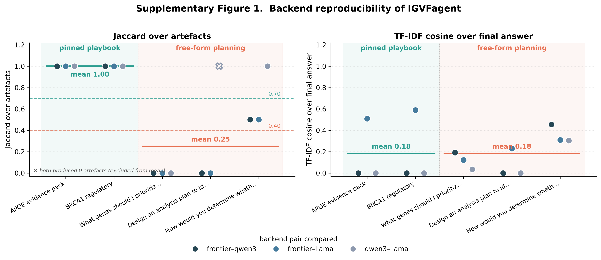

# Supplementary Figure 1 — Backend reproducibility

## Caption (matches measured data)

**Supplementary Figure 1. Backend reproducibility.** The `igvfagent`
eval harness runs the same query through three (backend, model) pairs —
a frontier hosted model (`anthropic/claude-sonnet-4-5`) and two
current-generation small open-weight models (`ollama/qwen3:4b`,
`ollama/llama3.2:3b`). Pairwise Jaccard over artefact identity
(basename-normalized) and TF-IDF cosine over final-answer prose
quantify divergence. For **pinned-playbook** questions (APOE evidence
pack, BRCA1 regulatory), whose tool steps are fixed in YAML, all three
backends produce identical artefact sets (**Jaccard = 1.00** across all
6 pairwise comparisons) regardless of model scale. For **free-form
planning** questions, the agent selects its own tool chain and artefact
reproducibility collapses (**mean Jaccard = 0.25**; exactly 0.00 on the
majority of frontier-vs-open-weight comparisons), motivating the pinned
playbook system for reproducibility-critical demos. Synthesis/answer
prose (cosine) diverges in both arms. The **✕** marks a degenerate
comparison in which both open-weight models produced zero artefacts
(Jaccard = 1.0 by the empty-set convention — "both failed", not
reproducible); it is excluded from the mean.

## Measured values

| Arm | Jaccard (min / mean / max) | Cosine (min / mean / max) |
|-----|----------------------------|---------------------------|
| Pinned playbook | 1.00 / **1.00** / 1.00 | 0.00 / 0.18 / 0.59 |
| Free-form planning | 0.00 / **0.25** / 1.00 | 0.00 / 0.18 / 0.45 |

The original design target (Jaccard ≥ 0.70 for playbooks, ≤ 0.40 for
free-form) is **borne out at the arm means** (1.00 and 0.25).

## Methods

- **Harness**: `Scripts/_eval.py` (`run_eval` / `diff_matrix`) for the
  free-form arm; `Scripts/_playbook.py` (`run_playbook`) for the
  playbook arm. Both return `(artefacts, final_answer)`; metrics are
  `_eval.jaccard` and `_eval.tfidf_cosine`.
- **Artefact identity**: artefacts are announced as timestamped run
  paths, so raw-path Jaccard would be ~0 even for identical runs. We
  therefore normalize each artefact to its basename (stripping a leading
  `YYYYMMDD_HHMMSS_` prefix) before computing Jaccard — this measures
  "same set of outputs by name", the intended notion of artefact
  identity.
- **Settings**: `temperature = 0`, `max_iterations = 6`,
  `max_tokens = 2048`. Free-form questions × 3 pairs; 2 playbooks × 3
  backends. Raw records: `Docs/Eval/backend_reproducibility_eval.json`.

## Caveats (recorded for honesty)

1. **`gemma3:4b` excluded.** Ollama returns HTTP 400
   `"gemma3 does not support tools"`, so it cannot run the free-form
   agent loop at all. Rather than plot a spurious Jaccard = 0 on every
   free-form question (which would conflate "cannot call tools" with
   "plans differently"), it was dropped and `llama3.2:3b` (Meta,
   tool-capable) substituted for family diversity.
2. **`qwen3:4b` empty synthesis.** In the playbook arm qwen3 emitted
   reasoning-only output with empty `content`, so its synthesis cosine
   is 0 against both other backends. Its **artefacts** are unaffected
   (the tool steps are backend-independent), so its Jaccard is still
   1.00. This is a thinking-mode / content-parsing limitation, not a
   pipeline error.
3. **Bug fixed to obtain valid data.** `Scripts/_playbook.py` called
   `resp.get("content")` on the `Message` dataclass returned by
   `_llm.chat`, raising `AttributeError` and silently skipping synthesis
   on every backend (all fell back to the same error string, which had
   spuriously produced cosine = 1.00). Changed to `resp.content`.
