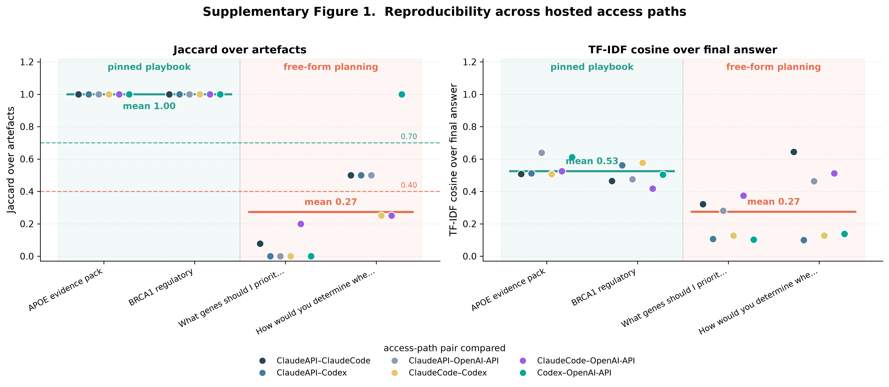

# Supplementary Figure 1 — Reproducibility across hosted access paths

## Caption (matches measured data)

**Supplementary Figure 1. Backend reproducibility across hosted access
paths.** The `igvfagent` eval harness runs the same query through the four
hosted access paths a user can pick in the UI — a 2×2 of provider ×
access-method: **Claude API** and **Claude Code CLI** (Anthropic, direct API
vs `claude` subprocess), **OpenAI API** and **Codex CLI** (OpenAI, direct API
vs `codex` subprocess). Pairwise Jaccard over artefact identity
(basename-normalized) and TF-IDF cosine over final-answer prose quantify
divergence across all six path pairs. For **pinned-playbook** questions
(APOE evidence pack, BRCA1 regulatory), whose tool steps are fixed in YAML,
all four paths produce **identical artefact sets (Jaccard = 1.00 across all 6
pairwise comparisons)** regardless of provider or access method — synthesis
prose still varies (cosine ≈ 0.53). For **free-form planning** questions,
where each path's LLM chooses its own tool chain, artefact reproducibility
collapses (**mean Jaccard = 0.27**, cosine ≈ 0.27). This motivates the pinned
playbook system for reproducibility-critical demos: the playbook pins the
tool sequence so the *artefacts a user consumes* are backend-independent,
while free-form planning is not portable across access paths.

## Measured values (real harness output, 0 errors)

| Arm | Jaccard (min / mean / max) | Cosine (min / mean / max) |
|-----|----------------------------|---------------------------|
| Pinned playbook | 1.00 / **1.00** / 1.00 | 0.42 / 0.53 / 0.64 |
| Free-form planning | 0.00 / **0.27** / 1.00 | 0.10 / 0.27 / 0.64 |

The design target (Jaccard ≥ 0.70 for playbooks, ≤ 0.40 for free-form) is
borne out at the arm means (1.00 and 0.27). The single free-form Jaccard = 1.00
point is OpenAI API vs Codex CLI on the rs429358 question, where both produced
the same one artefact (a genuine minimal agreement, not an empty-set artefact).

## Paths & models

| Path | Backend | Model |
|------|---------|-------|
| Claude API | `anthropic` | claude-sonnet-4-5 |
| Claude Code CLI | `claude_cli` | Claude Code default (subprocess) |
| OpenAI API | `openai` | gpt-4o-mini |
| Codex CLI | `codex_cli` | Codex default (subprocess, ChatGPT login) |

## Methods

- **Harness**: `Scripts/_eval.py` (free-form arm, full agent loop per path);
  `Scripts/_playbook.py` (playbook arm, fixed tool steps + one synthesis call
  per path). Metrics: `_eval.jaccard`, `_eval.tfidf_cosine`.
- **Artefact identity**: artefacts are announced as timestamped run paths;
  raw-path Jaccard would be ~0 even for identical runs, so each is normalized
  to its basename (leading `YYYYMMDD_HHMMSS_` stripped) before Jaccard —
  measuring "same set of outputs by name".
- **Settings**: `temperature = 0`, free-form `max_iterations = 4`,
  `max_tokens = 2048`; 2 playbooks × 4 paths, 2 free-form × 4 paths. Raw
  records: `Docs/Eval/hosted_backend_reproducibility_eval.json`.

## Notes

- All four paths ran to completion with **no errors** in this run; Codex CLI
  produced 0 artefacts on the Alzheimer free-form question (it answered
  without calling tools), which correctly reads as low free-form
  reproducibility rather than a crash.
- This is the hosted-path counterpart to the open-weight figure
  (`Supplementary_Figure_1_backend_reproducibility.png`), which compared a
  frontier hosted model against small open-weight models.
