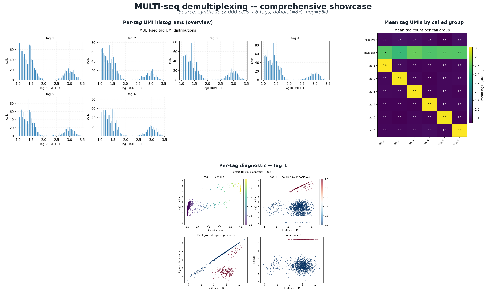

# MULTI-seq demultiplexing -- showcase report

Generated: 20260520_221136
Source: synthetic (2,000 cells x 6 tags, doublet=8%, neg=5%)
Cells x Tags: **2,000 x 6**
Total UMIs: **2,319,923**

## Classification breakdown

| Type | Count | % of cells |
|---|---:|---:|
| singlet | 1,740 | 87.0% |
| multiplet | 160 | 8.0% |
| negative | 100 | 5.0% |

## Accuracy vs ground truth

- Total cells with truth labels: **2,000**
- Singlet recovery rate: **87.00%**
- Doublet recovery rate: **8.00%**
- Negative recovery rate: **5.00%**

## Figure suite

### Individual panels

- `Plots/tag_histogram.png` -- log-scale UMI histogram per tag
- `Plots/tag_heatmap.png` -- mean tag UMI by called droplet group
- `Plots/diagnostics_tag_1.png` -- per-tag posterior / residual diagnostic for `tag_1`
- `Plots/diagnostics_tag_2.png` -- per-tag posterior / residual diagnostic for `tag_2`
- `Plots/diagnostics_tag_3.png` -- per-tag posterior / residual diagnostic for `tag_3`
- `Plots/diagnostics_tag_4.png` -- per-tag posterior / residual diagnostic for `tag_4`
- `Plots/diagnostics_tag_5.png` -- per-tag posterior / residual diagnostic for `tag_5`
- `Plots/diagnostics_tag_6.png` -- per-tag posterior / residual diagnostic for `tag_6`

## How to read the figure suite

1. **Tag histograms** should be bimodal -- low-UMI peak (negative) vs high-UMI peak (positive). NB-GLM fits the cross-over.
2. **Tag heatmap** shows a strong diagonal in a clean run (each called group has high UMI for exactly its own tag).
3. **Per-tag diagnostics** -- well-fit NB models give RQR residuals approximately N(0, 1).
4. **Accuracy** -- when ground truth is available, singlet recovery > 95%, doublet recovery > 70% is typical.

All artefacts under: `/Users/bidetime/Research/projects/IGVFagent/.claude/worktrees/festive-volhard-60dea7/Docs/MultiSeq/20260520_221128_smoke_demo`