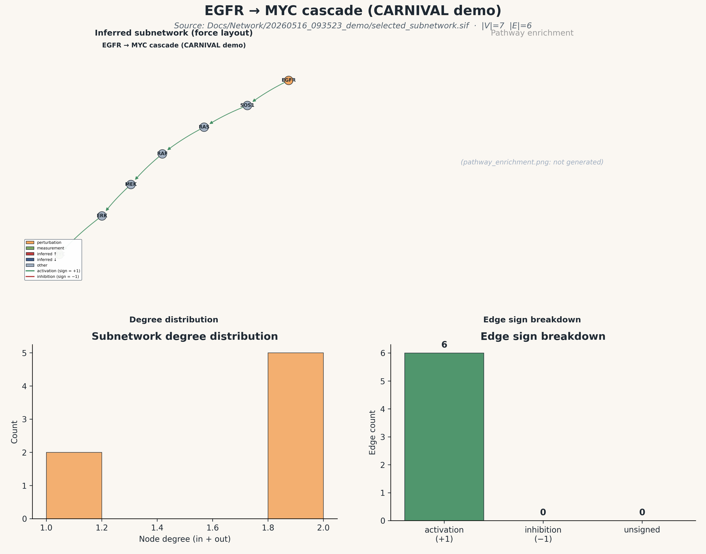

# Network visualization — egfr_demo

Generated: 2026-05-21 09:46:18 EDT
Source SIF: `Docs/Network/20260516_093523_demo/selected_subnetwork.sif`
|V| = **7**  ·  |E| = **6** (+1: 6, −1: 0, unsigned: 0)

## Publication composite figure

## Individual panels

- `Plots/graph_force.png` — force-directed signed graph
- `Plots/degree_histogram.png` — degree distribution
- `Plots/edge_breakdown.png` — edge-sign counts
- `graph_interactive.html` — interactive vis.js HTML (double-click to open in a browser)
- `node_summary.csv` — per-node degree / prize / role table

## Top hubs (by total degree)

| node | in | out | total |
|---|---:|---:|---:|
| `SOS1` | 1 | 1 | 2 |
| `RAS` | 1 | 1 | 2 |
| `RAF` | 1 | 1 | 2 |
| `MEK` | 1 | 1 | 2 |
| `ERK` | 1 | 1 | 2 |

**Perturbation nodes:** EGFR
**Measurement nodes:** MYC