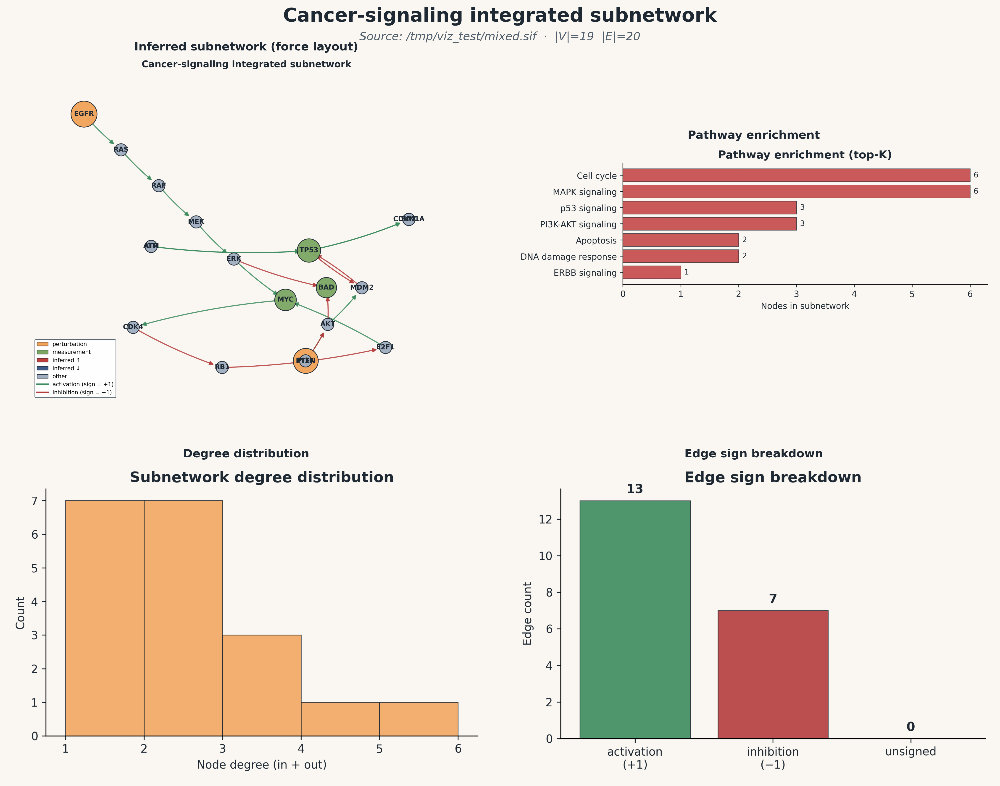

# Network visualization — cancer_mixed

Generated: 2026-05-21 09:47:10 EDT
Source SIF: `/tmp/viz_test/mixed.sif`
|V| = **19**  ·  |E| = **20** (+1: 13, −1: 7, unsigned: 0)

## Publication composite figure

## Individual panels

- `Plots/graph_force.png` — force-directed signed graph
- `Plots/degree_histogram.png` — degree distribution
- `Plots/edge_breakdown.png` — edge-sign counts
- `Plots/pathway_enrichment.png` — top enriched pathways
- `graph_interactive.html` — interactive vis.js HTML (double-click to open in a browser)
- `node_summary.csv` — per-node degree / prize / role table

## Top hubs (by total degree)

| node | in | out | total |
|---|---:|---:|---:|
| `TP53` | 3 | 3 | 6 |
| `AKT` | 2 | 2 | 4 |
| `MDM2` | 2 | 1 | 3 |
| `ERK` | 1 | 2 | 3 |
| `MYC` | 2 | 1 | 3 |

**Perturbation nodes:** EGFR, PTEN
**Measurement nodes:** TP53, MYC, BAD