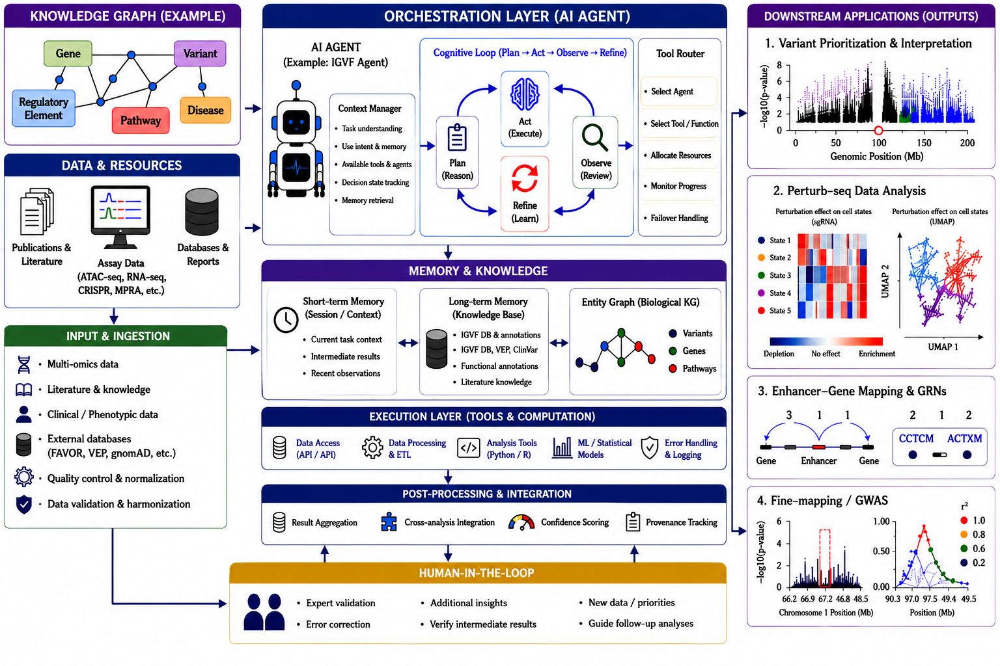
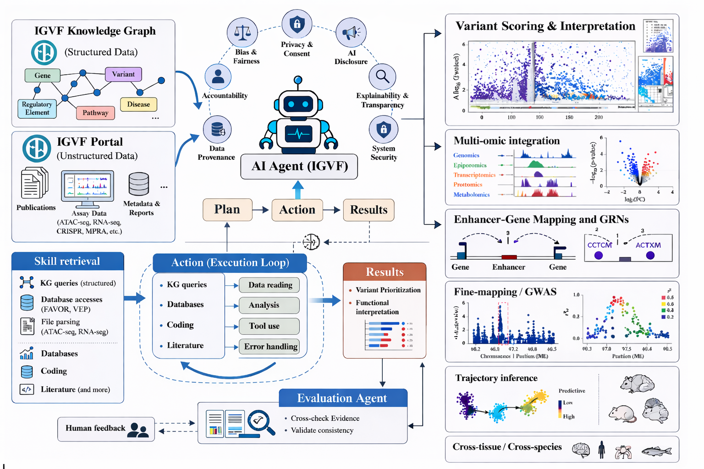

# IGVF Agent

A local, auditable AI agent for discovering, retrieving, and analyzing data
from the [IGVF](https://igvf.org/) ecosystem (Portal, Catalog, Knowledge
Graph) and related public resources (ENCODE, FAVOR), with a built-in
**Plan → Action → Results → Evaluation** orchestration loop.



_End-to-end view: a knowledge graph and multi-omics data resources feed an orchestration-layer AI agent (Plan → Act → Observe → Refine) backed by short/long-term memory, an execution layer, post-processing, and human-in-the-loop review — producing downstream outputs such as variant prioritization, perturb-seq analysis, enhancer–gene mapping, and fine-mapping._



_Detailed five-layer architecture: user entry points (terminal, NL agent, browser UI) → agent runtime & tool dispatch → 30+ skills grouped by domain → local persistence (filesystem + DuckDB warehouses) → upstream services. The `network` skill (highlighted) is the apex of the skill DAG — a clean-room MILP reimplementation of CORNETO that reads from the Silver + Bronze warehouses and writes inferred subnetworks back._

### 🎬 Video demos

| | |
|---|---|
| [](https://www.youtube.com/watch?v=EQVwIEa-gVg) | [](https://www.youtube.com/watch?v=c-CyIEArEK8) |
| ▶ <https://www.youtube.com/watch?v=EQVwIEa-gVg> | ▶ <https://www.youtube.com/watch?v=c-CyIEArEK8> |

## Architecture at a glance

IGVFagent ships **its own internal orchestrator** — a Plan → Action → Results
loop with an Evaluation Agent that cross-checks discoveries against the
literature, plus an explicit *skill retrieval* layer that selects the right
capability for each task. The agent is not just a bag of CLI tools; it
combines:

- **Inputs** — the IGVF Knowledge Graph (structured: genes, variants,
  regulatory elements, diseases, pathways) and the IGVF Portal (unstructured:
  publications, assay data from ATAC-seq / RNA-seq / CRISPRi / MPRA / 10x
  multiome / Parse SPLiT-seq, metadata, reports).
- **Skill retrieval** — KG queries, database accesses (FAVOR, VEP), file
  parsing (ATAC, RNA), coding tools, and a literature skill that pulls from
  PubMed / bioRxiv / arXiv / Semantic Scholar / OpenAlex.
- **Action execution loop** — KG queries, database calls, coding, and
  literature retrieval feed *data reading*, *analysis*, *tool use*, and
  *error handling* steps.
- **Evaluation Agent** — cross-checks evidence and validates consistency,
  with an optional human-feedback channel.
- **Outputs** — variant scoring & interpretation, multi-omic integration,
  enhancer-gene mapping & GRNs, fine-mapping / GWAS, trajectory inference,
  and cross-tissue / cross-species analyses.
- **Responsible-AI guardrails** — accountability, data provenance, bias &
  fairness review, privacy & consent, AI disclosure, explainability &
  transparency, and system security are first-class citizens of the design.

The agent is also **CLI-first** at the skill layer: every capability exposes
shell-runnable subcommands so the same skills can also be driven by an
external orchestrator (Codex, Claude Code, Ollama-served Qwen, or any
LLM that can invoke `python3 Scripts/...` and read files). Reads, writes,
caches, and logs all stay inside the repository folder for auditability.

In short — **two ways to drive every skill, one shared contract**:

| Mode | Who drives the loop | Best for |
|---|---|---|
| Internal orchestrator | IGVFagent's Plan→Action→Results→Evaluation runner (in-process) | Multi-step integrative analyses with branching and cross-evidence checks |
| External orchestrator | Codex / Claude Code / Ollama / your own harness | Day-to-day shell-level use, scripted pipelines, and CI |

## Table of contents

- [Capabilities](#capabilities)
- [Repository layout](#repository-layout)
- [Quick start](#quick-start)
- [Configuration](#configuration)
- [Smoke test](#smoke-test)
- [Skill catalog and usage](#skill-catalog-and-usage)
  - [IGVF / ENCODE / Knowledge Graph client](#igvf--encode--knowledge-graph-client)
  - [Catalog / Portal / ENCODE overviews](#catalog--portal--encode-overviews)
  - [Variant annotation](#variant-annotation)
  - [Advanced variant analysis](#advanced-variant-analysis)
  - [Single-cell, multiome, specialized assays](#single-cell-multiome-specialized-assays)
  - [Cross-source multiome survey](#cross-source-multiome-survey)
  - [Parse SPLiT-seq pipeline](#parse-splitseq-pipeline)
  - [Enhancer–gene linkage](#enhancergene-linkage)
  - [MPRA / STARR / BlueSTARR](#mpra--starr--bluestarr)
  - [CRISPRi / CRISPR-FACS / Perturb-seq](#crispri--crispr-facs--perturb-seq)
  - [cCRE, FAVOR, IGV-style browser views](#ccre-favor-igv-style-browser-views)
  - [Data illustration and interpretation](#data-illustration-and-interpretation)
  - [Reference skill (literature retrieval, validation, design)](#reference-skill-literature-retrieval-validation-design)
  - [Knowledge Graph traversal](#knowledge-graph-traversal)
  - [Portal → local KG ETL](#portal--local-kg-etl)
  - [ENCODE bulk-genomics pipeline](#encode-bulk-genomics-pipeline)
  - [Super-enhancer → target-gene pipeline](#super-enhancer--target-gene-pipeline)
  - [GEO retrieval](#geo-retrieval)
  - [Bulk RNA-seq analysis](#bulk-rna-seq-analysis)
  - [Proteomics & PPI knowledge graph](#proteomics--ppi-knowledge-graph)
  - [Single-cell analysis (UMAP / t-SNE / Leiden / markers)](#single-cell-analysis-umap--t-sne--leiden--markers)
  - [Perturbation Catalogue retrieval](#perturbation-catalogue-retrieval)
  - [MULTI-seq / Cell Hashing demultiplexing](#multi-seq--cell-hashing-demultiplexing)
  - [Integrated data warehouse (DuckDB Silver tier)](#integrated-data-warehouse-duckdb-silver-tier)
  - [Network integration (clean-room MILP — CARNIVAL + Steiner)](#network-integration-clean-room-milp--carnival--steiner)
  - [ChIP-Atlas reprocessed peak archive](#chip-atlas-reprocessed-peak-archive)
  - [MaveDB mapping (incl. SGE cDNA path)](#mavedb-mapping-incl-sge-cdna-path)
  - [Synapse / Sage Bionetworks retrieval](#synapse--sage-bionetworks-retrieval)
- [Reproducibility benchmark suite](#reproducibility-benchmark-suite)
- [Deployment with LLM agents](#deployment-with-llm-agents)
  - [Codex API](#codex-api)
  - [Claude API](#claude-api)
  - [Ollama local models](#ollama-local-models)
- [Variant lists and your own data](#variant-lists-and-your-own-data)
- [Workstation notes](#workstation-notes)
- [Security](#security)
- [License](#license)

## Capabilities

- IGVF Portal, IGVF Catalog API, IGVF Knowledge Graph (ArangoDB) access.
- ENCODE Portal metadata search and file download.
- Variant annotation against IGVF Catalog evidence (CADD, QTL, phenotypes,
  regulatory elements, predictions).
- **Advanced variant analysis**: integrates Catalog + ENCODE cCRE evidence
  with optional user experimental tables (CRISPRi / MPRA / GWAS), fits
  logistic models, and produces volcano / Miami / evidence-overlap plots
  plus a research-grade markdown report.
- Single-cell RNA-seq, single-cell ATAC-seq, Perturb-seq, and 10x Multiome
  metadata-first workflows.
- Enhancer–gene linkage retrieval and comparison (ABC, rE2G, ENCODE-rE2G,
  catalog-based predictions, eQTL-based linkage).
- MPRA / STARR / BlueSTARR retrieval, summary statistics, and plotting.
- CRISPRi / CRISPR-FACS / Perturb-seq evidence integration with functional
  annotation.
- cCRE (SCREEN) discovery and FAVOR-based variant annotation, plus IGV-like
  browser views.
- Data illustration and interpretation across IGVF and ENCODE search URLs.
- **ChIP-Atlas (Ohta/Oki) reprocessed peak archive** — browse/search/download
  ChIP-seq / ATAC-seq / DNase-seq / Bisulfite peaks across 10 genomes, fetch
  pre-computed Target-Genes tables, and submit TF-enrichment jobs.
- **MaveDB → genomic-coordinate mapping**, including a dedicated **SGE
  (Saturation Genome Editing) cDNA-coordinate path** that handles the full
  HGVS-c grammar (CDS / intronic / 5′UTR / 3′UTR) used by SGE scoresets.
- **Synapse / Sage Bionetworks retrieval** — anonymous metadata walk + search
  and PAT-authenticated download for controlled-access deposits (PsychENCODE,
  AMP-AD/PD, ROSMAP) that IGVF distributes off-Portal.
- **Reproducibility benchmark suite** — twelve recent Nature / Cell / Science /
  Nat Genet / Nat Methods / Nat Commun papers reproduced directly from public
  data, each scored against machine-readable ground-truth checks
  (see [`Benchmarks/`](Benchmarks/README.md)).

## Repository layout

```
IGVFagent/
├── README.md                            ← you are here
├── LICENSE
├── pyproject.toml                       ← installable package (`pip install -e .[all]`)
├── requirements.txt                     ← minimal pip-only fallback
├── Dockerfile  docker-compose.yml  .dockerignore
├── .env.example                         ← copy to .env and edit locally
├── .gitignore                           ← excludes Data/, Docs/<skill>/2*, .env, caches
│
├── Scripts/                             ← CLI skills + shared runtime
│   ├── cli.py                           ← unified `igvfagent <skill> <subcommand>` dispatcher
│   ├── _agent.py                        ← in-process Plan→Action→Results→Evaluation runtime
│   ├── _llm.py                          ← multi-backend LLM router (Anthropic / OpenAI /
│   │                                       Codex / Ollama / vLLM / TGI / Groq / Together /
│   │                                       DeepInfra / HuggingFace / claude_cli / codex_cli)
│   ├── _tools.py                        ← curated tool registry the runtime exposes
│   ├── _endpoints.py                    ← endpoint resolver (env-overridable)
│   ├── streamlit_app.py                 ← LM-Studio-style browser UI (`igvfagent ui`)
│   │
│   ├── igvf_client.py                   ← Portal / Catalog / KG / ENCODE HTTP client
│   ├── igvf_data_skills.py              ← Catalog / Portal / ENCODE overview + smoke summaries
│   ├── igvf_frontpage_summary.py        ← refresh front-page Portal + KG stats
│   ├── igvf_specialized_data_skills.py  ← specialized assay catalog
│   │
│   ├── annotate_variant_list.py         ← variant-list annotation against Catalog evidence
│   ├── advanced_variant_analysis.py     ← integrated variant scoring + logistic + report
│   │
│   ├── single_cell_data_skills.py       ← scRNA / scATAC discovery + example analysis
│   ├── singlecell_analysis.py           ← Scanpy pipeline: QC, PCA, UMAP, t-SNE,
│   │                                       Leiden, markers, publication figures
│   ├── multiome_10x_pipeline.py         ← 10x Multiome retrieval pipeline
│   ├── multiome_research_demo.py
│   ├── multiome_survey.py               ← cross-source survey: IGVF + ENCODE + GEO +
│   │                                       CELLxGENE + HCA + Zenodo, unified manifest + downloader
│   ├── portal_multiome.py  portal_scrna_10.py
│   ├── putamen_multiome_demo_analysis.py
│   ├── splitseq_pipeline.py             ← Parse SPLiT-seq end-to-end pipeline
│   │
│   ├── ccre_linkage_annotation_skills.py
│   ├── enhancer_gene_linkage_skills.py
│   ├── open4gene_skill.py               ← Open4Gene peak→gene hurdle-model linkage
│   │                                       (clean-room port of hbliu/Open4Gene)
│   ├── sceps_skill.py                   ← scEPS GWAS × single-cell neighborhood
│   │                                       d-statistic (clean-room port of Genentech/sceps)
│   ├── mpra_data_skills.py              ← MPRA / STARR / BlueSTARR
│   ├── crispri_data_skills.py           ← CRISPRi / CRISPR-FACS / Perturb-seq
│   ├── encode_pipeline.py               ← ChIP/ATAC/DNase/Hi-C/ChIA-PET pipeline
│   ├── se_target_pipeline.py            ← super-enhancer → target-gene pipeline
│   │
│   ├── kg_traversal_skill.py            ← IGVF Knowledge Graph multi-hop traversal
│   ├── portal_to_kg_skill.py            ← Portal → local KG ETL (SQLite mirror)
│   │
│   ├── geo_retrieval_skill.py           ← NCBI GEO retrieval (search / metadata / download)
│   ├── figshare_skill.py                ← figshare retrieval (article / files / download /
│   │                                       search; id, DOI, URL, or private /s/ token)
│   ├── rnaseq_analysis_skill.py         ← bulk RNA-seq QC / PCA / DEG / DEG→cCRE linkage
│   ├── proteomics_skill.py              ← BioGRID/IntAct/HuRI/Reactome/KEGG + IGVF protein
│   │                                       PPI knowledge graph + per-assay viz + lit survey
│   ├── perturbation_catalog_skill.py    ← Perturbation Catalogue: MAVE / CRISPR-screen /
│   │                                       Perturb-seq retrieval + per-gene pipeline
│   ├── multiseq_analysis_skill.py       ← MULTI-seq / Cell Hashing demultiplexing
│   │                                       (Python port of deMULTIplex2)
│   ├── warehouse_skill.py               ← central DuckDB warehouse (Silver tier
│   │                                       of the integrated data layer)
│   ├── network_integration_skill.py     ← Network integration: clean-room
│   │                                       cvxpy MILP for CARNIVAL +
│   │                                       prize-collecting Steiner
│   │
│   ├── enrichment_skill.py              ← GO / pathway ORA + preranked GSEA (gseapy)
│   ├── chipatlas_skill.py              ← ChIP-Atlas reprocessed peak archive client
│   ├── mavedb_mapping_skill.py         ← MaveDB → genomic coords (+ SGE cDNA path)
│   ├── synapse_skill.py                ← Synapse / Sage Bionetworks retrieval
│   │                                       (anonymous walk/search + PAT download)
│   ├── reference_skill.py               ← literature retrieval / validation / study design
│   └── data_illustration_interpretation.py
│
├── Benchmarks/                          ← 12-paper reproducibility suite
│   ├── README.md                        ← suite dashboard + per-paper results
│   ├── OPERATIONS_GUIDE.md  run_all.sh  concordance.py
│   └── <paper-id>/                       ← run.sh + expected.json + figures + README
│
├── Data/                                ← inputs + cached responses (gitignored)
│   ├── Input/VariantList/example_variants.csv
│   ├── Manifests/   Cache/   KG/        ← ETL outputs (gitignored)
│   └── Proteomics/  ← _versions.json + Sources/<src>/  + KG/proteomics.sqlite (gitignored)
│
└── Docs/
    ├── PROJECT_SCOPE.md                 ← what the agent is and isn't
    ├── DEPLOYMENT.md                    ← legacy deploy notes (this README supersedes)
    ├── IGVF_PORTAL_DATA_OVERVIEW.md     IGVF_CATALOG_SMOKE_ANALYSIS.md
    ├── IGVF_FRONT_PAGE_DATA_SUMMARY.md
    ├── ENCODE_DATA_OVERVIEW.md          ENCODE_SMOKE_ANALYSIS.md
    ├── Figures/                         ← architecture diagram, etc.
    ├── CRISPRi/CRISPRI_BIOINFORMATICS_APPLICATIONS.md
    ├── SingleCell/{Multiome10_survey.md, Portal10_survey.md}
    ├── Skills/                          ← per-skill playbooks (one per CLI module)
    │   ├── ADVANCED_VARIANT_ANALYSIS_SKILLS.md
    │   ├── IGVF_PORTAL_DATA_ANALYSIS.md         IGVF_FRONT_PAGE_SUMMARY_SKILLS.md
    │   ├── IGVF_SPECIALIZED_DATA_SKILLS.md      IGVF_KG_TRAVERSAL_SKILLS.md
    │   ├── PORTAL_TO_KG_SKILLS.md
    │   ├── 10X_MULTIOME_SKILLS.md               SINGLE_CELL_ANALYSIS_SKILLS.md
    │   ├── SPLITSEQ_SKILLS.md
    │   ├── ENHANCER_GENE_LINKAGE_SKILLS.md      CCRE_LINKAGE_FAVOR_SKILLS.md
    │   ├── MPRA_ANALYSIS_SKILLS.md              CRISPRI_ANALYSIS_SKILLS.md
    │   ├── ENCODE_PIPELINE_SKILLS.md            SE_TARGET_PIPELINE_SKILLS.md
    │   ├── GEO_RETRIEVAL_SKILLS.md              RNASEQ_ANALYSIS_SKILLS.md
    │   ├── PROTEOMICS_SKILLS.md
    │   ├── PERTURBATION_CATALOG_SKILLS.md
    │   ├── MULTISEQ_ANALYSIS_SKILLS.md
    │   ├── WAREHOUSE_SKILLS.md
    │   ├── NETWORK_INTEGRATION_SKILLS.md
    │   ├── SINGLECELL_ANALYSIS_SKILLS.md
    │   ├── REFERENCE_SKILLS.md
    │   └── DATA_ILLUSTRATION_INTERPRETATION_SKILLS.md
    ├── Logs/                            ← runtime logs (gitignored)
    └── <skill>/<timestamp>_<label>/     ← per-run outputs from every skill (gitignored)
```

Generated outputs (timestamped folders under `Docs/<Skill>/`, manifests under
`Data/Manifests/`, source dumps under `Data/Proteomics/Sources/`, the local
KG mirrors under `Data/KG/` and `Data/Proteomics/KG/`, and caches under
`Data/Cache/`) are gitignored. When a new skill ships, three things must
update together: the script in `Scripts/`, its playbook in `Docs/Skills/`,
and this Repository layout block.

## Quick start

**Recommended — native pip install in a virtual env (best for local LLMs):**

```bash
git clone https://github.com/zhouhufeng/IGVFagent.git
cd IGVFagent
python3 -m venv .venv && source .venv/bin/activate
python3 -m pip install --upgrade pip
python3 -m pip install -e '.[ui,llm,analysis]'   # core + UI + LLM SDKs + scanpy stack
# python3 -m pip install -e '.[all]'             # also adds [hic] + [motif] extras

igvfagent --version
igvfagent --help

# Optional: configure credentials / overrides locally (.env is gitignored)
cp .env.example .env
```

Then:

```bash
igvfagent ui                # browser UI at http://127.0.0.1:8501
igvfagent ask "Pull the comprehensive APOE evidence pack."
igvfagent kg gene APOE      # direct CLI to a single skill, no LLM in the loop
```

This is the right path if you already have Ollama running natively
(`ollama serve`) — IGVFagent reaches it at `http://localhost:11434/v1`
and gets full access to your host's RAM and any models you've already
pulled.

**Alternative — `pipx` for a global `igvfagent` (no venv activation):**

```bash
pipx install 'git+https://github.com/zhouhufeng/IGVFagent.git'
pipx inject igvfagent 'igvfagent[analysis,ui,llm]'
igvfagent --help        # works from any directory
```

**Alternative — Docker Compose (self-contained stack, includes Ollama in a container):**

Picks up Ollama-in-a-container by default. Useful for a clean demo
machine with no Python or Ollama set up; **less ideal** if you already
run Ollama natively (the in-container Ollama can't see the host's
models, and Docker Desktop's default 8 GB memory cap is too small for
30B+ models). Requires Docker Desktop running.

```bash
git clone https://github.com/zhouhufeng/IGVFagent.git
cd IGVFagent

# Option A: in-container Ollama (default)
docker compose up -d                          # build agent + start ollama service
docker compose --profile bootstrap up         # one-time: pull qwen3:8b into the container

# Option B: reach back to your host's Ollama (recommended if you already have it)
echo 'OLLAMA_HOST_BASE=http://host.docker.internal:11434/v1' >> .env
echo 'IGVF_LLM_MODEL=qwen3.6:35b-a3b-coding-bf16'           >> .env
docker compose up -d agent                    # only the agent, host Ollama supplies the LLM

open http://127.0.0.1:8501                    # browser UI
docker compose run --rm agent kg gene APOE    # one-shot skill from CLI
docker compose down                           # stop (volumes preserved)
```

`./Data` and `./Docs` are mounted into the container so analyses persist
across restarts. Cloud LLM keys (`ANTHROPIC_API_KEY`, `OPENAI_API_KEY`,
`GROQ_API_KEY`, `TOGETHER_API_KEY`, `DEEPINFRA_API_KEY`, `HF_TOKEN`)
plus the IGVF-specific `IGVF_PORTAL_COOKIE` and
`IGVF_ARANGO_PASSWORD` are forwarded from `.env` automatically.

After installing, the `igvfagent` console command gives you four ways to
drive the same skills:

```bash
# 1) Browser UI — chat input, streaming progress, inline plot rendering
pip install 'igvfagent[ui]'
igvfagent ui                      # opens http://127.0.0.1:8501

# 2) Natural-language CLI — same agent, terminal output
igvfagent ask "Give me the comprehensive APOE evidence pack including\
  literature corroboration, single-cell datasets, and FAVOR annotations."

# 3) Direct skills — every tool addressable as a subcommand
igvfagent kg gene APOE --depth 2 --call-singlecell --call-literature
igvfagent splitseq retrieve --limit 50
igvfagent ref design --data-type parse_split_seq
igvfagent portal-kg pull --tissue macrophage --limit 100

# 4) Introspection
igvfagent backends            # registered LLM providers
igvfagent tools               # the tool catalog the agent runtime sees
igvfagent --help              # full skill list
```

The Streamlit UI exposes the **same** ReAct agent as `igvfagent ask`,
with an interactive sidebar for backend / model / tool-subset selection,
a streaming progress trace as the agent plans and calls tools, and inline
rendering of any artefacts the tools produce.

Supported artefact viewers (rendered directly in the chat, no terminal
round-trip):

- **PNG / JPG / SVG / GIF** — inline gallery (UMAP, dot-plot, volcano, IGV-style snapshots).
- **CSV / TSV** — first 400 rows as a sortable `st.dataframe`, plus a download button.
- **PDF** — embedded base64 iframe (FAVOR / cCRE reports, advanced-variant exports).
- **Markdown reports** — rendered in place; backtick-quoted file paths inside the body are auto-followed so the underlying CSV / JSONL / PDF / PNG that the report references each get their own inline viewer.
- **JSONL** — first 50 records normalized into a DataFrame, falls back to raw JSON.
- **JSON** — pretty-printed up to 200KB.
- **HTML** — sandboxed `st.components.v1.html` embed.
- **TXT / LOG** — first 50KB in a code block.
- Anything else — download button.

When the **Claude Code CLI** backend is selected, the model picker is
restricted to the three current Claude 4.x tiers (`claude-opus-4-7`,
`claude-sonnet-4-6`, `claude-haiku-4-5-20251001`) plus a `(custom...)`
escape hatch — picking a retired model id is no longer possible from
the dropdown.

The legacy `python3 Scripts/<skill>.py …` invocations documented later
in this README continue to work unchanged.

## Choosing an LLM backend

IGVFagent runs the same skills regardless of which model drives the
plan-act loop. Pick the backend that matches your goal:

| Goal | Pick this | How |
|---|---|---|
| Fast Streamlit UI, willing to manage one API key | **Anthropic Claude API** | `export ANTHROPIC_API_KEY=…` then sidebar `Backend = anthropic` |
| Already happy with Claude Code, want analysis-from-chat | **Claude Code as the orchestrator** | `cd IGVFagent && source .venv/bin/activate && claude` — ask in the chat |
| Offline / private / free | **Local Ollama (Qwen / Gemma)** | `ollama pull qwen3:8b && export IGVF_LLM_MODEL=qwen3:8b` |
| Best of both worlds | **Cloud for UI, local for batch** | Anthropic for the UI, Ollama for nightly `igvfagent ask` jobs |

Side-by-side trade-offs:

| | Local Ollama (Qwen / Gemma) | Anthropic Claude API | Claude Code CLI |
|---|---|---|---|
| Cost | free | ~$0.001 – $0.01 / query (Haiku → Sonnet) | covered by your Claude Code plan |
| Latency | 30 – 90s (35B bf16) / 8 – 20s (gemma4:31b) / 2 – 5s (qwen3:8b) | 2 – 10s | 5 – 15s (CLI subprocess + auth) |
| Privacy | data never leaves your machine | prompts go to Anthropic | prompts go to Anthropic via Claude Code |
| Tool-call quality | strong on Qwen 3.6 35B / Gemma 4 31B; weak on < 7B | best-in-class (native function calling) | best-in-class (Claude Code drives natively) |
| Setup effort | install Ollama + pull a model | one env var, one sidebar click | already installed if you use Claude Code |
| Multi-turn context | full | full | reset per `claude -p` call |
| Best for | offline / private analyses, batch jobs | day-to-day exploratory queries in the UI | mixed coding + analysis sessions |

Backend resolution rules (so the same env / sidebar settings work
everywhere):

1. Sidebar selection (UI) or `--backend` flag (CLI) wins.
2. Else `IGVF_LLM_BACKEND` env var.
3. Else inferred from the model name (`claude-*` → Anthropic;
   `gpt-*` / `o1-*` / `o3-*` → OpenAI; `qwen*` / `gemma*` / `llama*` /
   `mistral*` → Ollama).
4. Otherwise default: **Ollama with Qwen 3 8B**.

Same logic for the model: explicit `--model` > `IGVF_LLM_MODEL` env >
backend's compiled-in default.

### Local LLM (free, private, offline)

The agent's default backend is **Ollama with Qwen 3 8B** — no API key
required. After installing Ollama:

```bash
ollama serve &              # background daemon
ollama pull qwen3:8b
pip install 'igvfagent[llm]'   # adds the openai SDK (Ollama speaks OpenAI's wire format)
igvfagent ask "Walk the IGVF Knowledge Graph for APOE and return all
   regulatory elements plus the matching IGVF single-cell datasets."
```

`igvfagent models` introspects the local Ollama daemon and lists every
installed model + size, so you can pick one for `--model`:

```bash
igvfagent models           # lists installed Ollama models
igvfagent models --json    # machine-readable
```

Bigger / coding-tuned local models work well too — backend inference is
substring-based, so anything with `qwen` / `gemma` / `llama` / `mistral`
/ `phi` / `deepseek` / `yi` / `command` in the tag auto-routes to Ollama:

```bash
# 35B Qwen 3.6 coding tune (e.g. via Ollama):
igvfagent ask --model qwen3.6:35b-a3b-coding-bf16 \
   "Comprehensive APOE evidence pack with literature corroboration."

# 31B Gemma 4 coding tune:
igvfagent ask --model gemma4:31b-coding-mtp-bf16 \
   "Discover Parse SPLiT-seq AnalysisSets profiling macrophages."

# Pin the model globally so you don't repeat --model:
export IGVF_LLM_BACKEND=ollama
export IGVF_LLM_MODEL=qwen3.6:35b-a3b-coding-bf16
igvfagent ask "..."
```

The same `IGVF_LLM_MODEL` env var is forwarded by the Compose stack —
drop it in a local `.env` and the containerized agent picks it up.

For higher-quality answers, point the agent at Anthropic Claude or OpenAI:

```bash
export ANTHROPIC_API_KEY=...
igvfagent ask --backend anthropic --model claude-sonnet-4-5 \
   "Compare DRD1 and DRD2 striatal MSN evidence in the local KG."

export OPENAI_API_KEY=...
igvfagent ask --backend openai --model gpt-4o-mini "..."
```

Every run is persisted under `Docs/Agent/<timestamp>_<label>/` (transcript
JSON + markdown report + artefact paths from each tool call).

**Optional dependency groups** (declared in `pyproject.toml`):

| Extra | Adds | When you need it |
|---|---|---|
| `analysis` | pandas, numpy, scipy, matplotlib, pyarrow, anndata, scanpy, seaborn | Single-cell pipelines, advanced variant analysis, plotting |
| `ui` | streamlit | Browser UI (lands in step 4 of the shipping plan) |
| `llm` | anthropic, openai | Native SDKs for the LLM-driven `igvfagent ask` runner (coming) |
| `all` | analysis + ui + llm | Everything |
| `dev` | pytest, ruff, build | Developer tooling |

## Configuration

The agent reads endpoints and credentials from environment variables. Copy
`.env.example` to `.env` and fill in the values you have access to; `.env`
is gitignored.

Public, read-only endpoints have sensible defaults baked into the scripts —
most reads work without any configuration. Authenticated workflows (for
example unreleased datasets, or knowledge-graph queries that require an
account) need credentials you supply locally. Never commit `.env`, cookies,
tokens, or any other authenticated session material.

Set `IGVF_PROJECT_ROOT` if you want to run the scripts from outside the
repository directory.

## Consistent results across LLM backends

IGVFagent is designed so the **same query resolves to the same plan and the
same substantive answer no matter which model drives the loop** — Claude Code,
the Anthropic/OpenAI APIs, Codex, or a local Qwen/Gemma via Ollama. Four
mechanisms make this hold:

1. **Identical tool set on every backend.** The runtime exposes one canonical,
   deterministically-ordered set of ≤128 tools to *all* backends (previously
   OpenAI-family models were silently trimmed to 128 while others saw more, so
   the same query could pick a tool that didn't exist elsewhere). Override the
   cap with `IGVF_LLM_MAX_TOOLS`.
2. **Deterministic decoding.** Temperature defaults to 0 and a decoding `seed`
   (`IGVF_LLM_SEED`, default 0) is forwarded to every OpenAI-compatible backend
   (Ollama / vLLM / OpenAI …).
3. **Deterministic router.** Unambiguous query shapes bypass LLM tool-choice
   entirely and run a fixed first tool: a bare gene symbol → `kg_gene`, an rsID
   → `kg_variant`, an IGVF/ENCODE accession or URL → `explain_dataset`, a
   `chrN:start-end` region → `kg_region`.
4. **Templated answer synthesis.** The final answer wraps the model's prose in a
   backend-independent skeleton (tools run + arguments + artefacts produced), so
   the substantive content is identical across models; only the narrative varies.

Every run records a **consistency fingerprint** (system-prompt hash + seed +
tool-set hash) in its transcript. Verify consistency yourself:

```bash
igvfagent consistency                         # offline invariants (no API key)
igvfagent consistency --backends anthropic,ollama   # diff tool-call traces across backends
```

Disable the router or templating with `IGVF_ROUTER=0` / `IGVF_TEMPLATED_ANSWER=0`.

## The growing local knowledge graph + database

Every time IGVFagent **downloads data or analyzes/processes raw data**, a little
more of a *local* knowledge graph and database accumulates — so the agent gets
faster and more self-contained the more you use it, and repeat queries can be
answered from local data. This is the **core default mechanism**, wired into
both the agent loop (every tool call) and the CLI (every direct skill run
auto-harvests its new outputs).

- **Knowledge Graph** — `Data/KG/local_kg.sqlite` (`nodes` + `edges`: genes,
  variants, regions, datasets, studies, analyses, and the relations between
  them — the same graph the `portal-kg` skill builds).
- **Database** — the DuckDB warehouse at `Data/Warehouse/igvf.duckdb`.

```bash
igvfagent localstore stats      # nodes / edges / downloads / analyses logged
igvfagent localstore harvest    # scan Docs/ + downloads and ingest anything new
```

Growth is idempotent (deterministic upserts + a harvest ledger) and safe under
concurrent agent/CLI writers (WAL + busy-timeout). Disable with
`IGVF_LOCALSTORE=0`.

## Smoke test

After `cp .env.example .env` and (optionally) editing it, verify the install:

```bash
python3 Scripts/igvf_client.py check
python3 Scripts/igvf_client.py catalog-api /
python3 Scripts/igvf_data_skills.py overview --limit 5
python3 Scripts/igvf_data_skills.py encode-overview --limit 5
python3 Scripts/ccre_linkage_annotation_skills.py screen-manifest
```

Expected output locations:

- runtime logs in `Docs/Logs/`
- cached API responses in `Data/`
- manifests in `Data/Manifests/`
- reports in `Docs/<skill>/`

## Skill catalog and usage

`Scripts/README.md` has the complete command list. Quick reference below.

### IGVF / ENCODE / Knowledge Graph client

The thin client behind every skill — direct HTTP calls and AQL.

```bash
python3 Scripts/igvf_client.py check
python3 Scripts/igvf_client.py catalog-api /
python3 Scripts/igvf_client.py catalog-files --limit 25
python3 Scripts/igvf_client.py gene TP53 --limit 10
python3 Scripts/igvf_client.py variant rs58658771 --limit 10
python3 Scripts/igvf_client.py encode-search --type Experiment --param assay_title=ATAC-seq
python3 Scripts/igvf_client.py aql "FOR doc IN genes LIMIT 5 RETURN doc"
```

### Catalog / Portal / ENCODE overviews

High-level inventory and smoke summaries.

```bash
python3 Scripts/igvf_data_skills.py catalog-smoke --limit 10
python3 Scripts/igvf_data_skills.py overview --limit 25
python3 Scripts/igvf_data_skills.py encode-overview --limit 25
python3 Scripts/igvf_data_skills.py encode-smoke --limit 10
python3 Scripts/igvf_data_skills.py encode-export-csv --type Experiment --param assay_title=ATAC-seq
python3 Scripts/igvf_frontpage_summary.py refresh --update-readme
```

### Variant annotation

Annotate any user variant CSV against IGVF Catalog evidence (CADD, QTL,
phenotypes, regulatory elements, predictions). Provide your own variant list;
a tiny illustrative example is shipped at
`Data/Input/VariantList/example_variants.csv`.

```bash
python3 Scripts/annotate_variant_list.py \
  --input Data/Input/VariantList/example_variants.csv \
  --max-rows 10
python3 Scripts/ccre_linkage_annotation_skills.py annotate-variants \
  --input Data/Input/VariantList/example_variants.csv \
  --max-rows 10
```

### Advanced variant analysis

End-to-end pipeline that combines IGVF Catalog evidence, ENCODE cCRE class,
predicted-functional composites, optional user experimental data, logistic
models, and per-gene Miami / volcano / overlap plots into a research report.
See `Docs/Skills/ADVANCED_VARIANT_ANALYSIS_SKILLS.md` for full details.

```bash
# Annotation + composite + plots only (no experimental data)
python3 Scripts/advanced_variant_analysis.py run \
  --input Data/Input/VariantList/example_variants.csv \
  --label example_locus

# Joining a user CRISPRi/MPRA/GWAS table and modeling an outcome
python3 Scripts/advanced_variant_analysis.py run \
  --input Data/Input/VariantList/my_variants.csv \
  --experimental Data/Input/Experimental/my_crispri.csv \
  --outcome BEAN_pval_lt_.05 \
  --gene-list LDLR,PCSK9,APOE \
  --label my_crispri_v1

python3 Scripts/advanced_variant_analysis.py write-playbook
```

Outputs land in `Docs/AdvancedVariantAnalysis/` (annotated CSV, summary stats,
logistic model JSON, markdown report) and `Docs/AdvancedVariantAnalysis/Plots/`
(SVG plots).

### Single-cell, multiome, specialized assays

```bash
python3 Scripts/single_cell_data_skills.py smoke --skill all --source encode --limit 5
python3 Scripts/single_cell_data_skills.py manifest --skill scrna --source both --limit 25
python3 Scripts/single_cell_data_skills.py download-examples
python3 Scripts/single_cell_data_skills.py analyze-examples --max-cells 12000
python3 Scripts/single_cell_data_skills.py write-playbook

python3 Scripts/multiome_10x_pipeline.py retrieve --count 20 --fetch-file-details
python3 Scripts/multiome_10x_pipeline.py retrieve \
  --count 20 --fetch-file-details --download-policy all --max-download-gb 30
python3 Scripts/multiome_10x_pipeline.py process-local \
  --file-manifest Data/Manifests/Multiome10x/<files.csv> \
  --download-manifest Data/Manifests/Multiome10x/<download_manifest.csv>
python3 Scripts/multiome_10x_pipeline.py write-playbook
python3 Scripts/multiome_research_demo.py

python3 Scripts/igvf_specialized_data_skills.py smoke --skill all --limit 5
python3 Scripts/igvf_specialized_data_skills.py manifest --skill all --limit 25
python3 Scripts/igvf_specialized_data_skills.py download-plan --skill all --limit 25
python3 Scripts/igvf_specialized_data_skills.py write-playbook
```

### Cross-source multiome survey

Surveys six independent public sources for single-cell multiome data
(10x Multiome / SHARE-seq / single-nucleus multiome / SNARE-seq /
Paired-Tag), classifies every file by a training-relevant `kind`
(`matrix_rna`, `matrix_atac`, `fragments`, `peaks`, `annotations`,
`alignments`, `index`, `raw_reads`, `other`), and produces a unified
manifest with a size-capped downloader.

| source        | what it covers                                                       |
|---------------|----------------------------------------------------------------------|
| **IGVF**      | IGVF Portal AnalysisSets/MeasurementSets (10x multiome + SHARE-seq). |
| **ENCODE**    | ENCODE Experiments + Series tagged 10x multiome / SHARE-seq.          |
| **GEO**       | NCBI Gene Expression Omnibus Series via E-utilities + FTP listing.    |
| **CELLxGENE** | CZI CELLxGENE Discover curated H5AD collections.                      |
| **HCA**       | Human Cell Atlas Data Portal projects (Azul `/index/projects`).        |
| **Zenodo**    | Zenodo records with multiome keywords in title / description / files. |

```bash
# Run all six sources in one shot, then build the unified manifest
python3 Scripts/multiome_survey.py survey-all --limit 30 --fetch-files
python3 Scripts/multiome_survey.py manifest --label v1

# Training-relevant slice only (RNA + ATAC + fragments + annotations), 20 GB cap
python3 Scripts/multiome_survey.py download \
    --only matrix_rna,matrix_atac,fragments,annotations \
    --max-download-gb 20

# Per-source surveys
python3 Scripts/multiome_survey.py survey-igvf      --fetch-files
python3 Scripts/multiome_survey.py survey-encode    --fetch-files
python3 Scripts/multiome_survey.py survey-geo       --limit 50 --fetch-files
python3 Scripts/multiome_survey.py survey-cellxgene --fetch-files
python3 Scripts/multiome_survey.py survey-hca       --fetch-files
python3 Scripts/multiome_survey.py survey-zenodo    --per-query 25 --fetch-files

# Inventory on-disk downloads + skill / overview docs
python3 Scripts/multiome_survey.py inventory
python3 Scripts/multiome_survey.py write-playbook
python3 Scripts/multiome_survey.py write-overview
```

A live `survey-all` (May 2026) indexed **401 datasets / 3,837 files /
14.19 TB total** across the six sources; the digest is committed at
`Docs/MultiomeSurvey/LATEST_RUN_SUMMARY.md`. The companion
`Docs/MultiomeSurvey/SOURCES_OVERVIEW.md` covers what each source offers
and points to additional repositories (Allen Brain Cell Atlas, Broad
Single Cell Portal, Synapse, dbGaP, EGA, ArrayExpress, NeMO Archive,
figshare, DDBJ, Terra) where multiome data also lives but isn't
auto-queried by the skill.

### Parse SPLiT-seq pipeline

End-to-end pipeline for Parse-Biosciences combinatorial-barcoding snRNA-seq
(SPLiT-seq) datasets. Handles the SPLiT-seq quirks that generic single-cell
skills don't: multiplexed sub-pools, tens of donors per pool, MatrixMarket
tarball delivery, and per-strain analytical comparisons (the value of the
Mortazavi 8-cube founder atlas in IGVF).

```bash
# Discover SPLiT-seq AnalysisSets in the IGVF Portal
python3 Scripts/splitseq_pipeline.py retrieve --limit 50 --label splitseq_corpus

# Per-pool / per-donor manifest for one or more accessions
python3 Scripts/splitseq_pipeline.py manifest \
  --accessions IGVFDS3222WCZH,IGVFDS6290WNNH --label demo

# Pull files under a size cap, then load into AnnData
python3 Scripts/splitseq_pipeline.py download \
  --manifest Data/Manifests/SPLiTseq/<files_per_pool.csv> --max-download-gb 5
python3 Scripts/splitseq_pipeline.py process-local --label demo

# Full pipeline: QC -> normalize -> Harmony integrate -> UMAP -> Leiden ->
# auto-annotate against bundled mouse marker panels
python3 Scripts/splitseq_pipeline.py analyze \
  --input Data/Cache/SPLiTseq/demo.h5ad --tissue gonad --label demo
python3 Scripts/splitseq_pipeline.py plot \
  --input Data/Cache/SPLiTseq/demo_processed.h5ad --tissue gonad --label demo

# Per-cell-type strain DEG (after donor demultiplexing)
python3 Scripts/splitseq_pipeline.py compare-strains \
  --input Data/Cache/SPLiTseq/demo_processed.h5ad --label 8cube_strain_DEG

# Scaffold a souporcell or vireo demultiplexing run (the agent emits the
# shell script; the demultiplexer itself runs locally)
python3 Scripts/splitseq_pipeline.py demux-script --tool souporcell --n-donors 8
python3 Scripts/splitseq_pipeline.py write-playbook
```

Bundled mouse marker panels: `gonad`, `adrenal`, `brain`, `liver`, `heart`,
`kidney`, `muscle` — covers the full Mortazavi 8-cube founder atlas tissues.

### Enhancer–gene linkage

```bash
python3 Scripts/enhancer_gene_linkage_skills.py overview --source catalog --limit 10
python3 Scripts/enhancer_gene_linkage_skills.py overview --source encode --limit 10
python3 Scripts/enhancer_gene_linkage_skills.py pull-sets \
  --region chr1:903900-904900 --gene SAMD11 --limit 10
python3 Scripts/enhancer_gene_linkage_skills.py compare-sets \
  --include-local-catalog --demo-if-empty
python3 Scripts/enhancer_gene_linkage_skills.py write-playbook
```

### MPRA / STARR / BlueSTARR

```bash
python3 Scripts/mpra_data_skills.py pull --source catalog --limit 25
python3 Scripts/mpra_data_skills.py portal-manifest --limit 100 --label igvf_portal_mpra_many
python3 Scripts/mpra_data_skills.py analyze-local \
  --input Data/Input/VariantList/example_variants.csv --label my_locus_mpra
python3 Scripts/mpra_data_skills.py literature-demo \
  --input Data/Input/VariantList/example_variants.csv --label my_locus_mpra_literature_demo
python3 Scripts/mpra_data_skills.py write-playbook
```

### CRISPRi / CRISPR-FACS / Perturb-seq

```bash
python3 Scripts/crispri_data_skills.py pull --source catalog --limit 25
python3 Scripts/crispri_data_skills.py analyze-local \
  --input Data/Input/VariantList/example_variants.csv --label my_locus_crispri
python3 Scripts/crispri_data_skills.py write-playbook
```

### SHARE-seq joint scATAC + scRNA QC

Clean-room reimplementation of the QC algorithms in
[broadinstitute/epi-SHARE-seq-pipeline](https://github.com/broadinstitute/epi-SHARE-seq-pipeline)
(MIT, 2021). Consumes IGVF Portal SHARE-seq AnalysisSet deposits
(`fragments.bed[.gz]` + `h5ad`) directly. See
[`Docs/Skills/SHARESEQ_ANALYSIS_SKILLS.md`](Docs/Skills/SHARESEQ_ANALYSIS_SKILLS.md).

```bash
# Discover IGVF Portal SHARE-seq datasets
igvfagent share pull-portal --limit 50 --label survey

# Round-1/2/3 24-mer barcode demultiplex on a gz FASTQ
igvfagent share demultiplex-bcs --fastq R2.fastq.gz \
    --whitelist whitelist_24mer.txt --out R2.tagged.fastq.gz \
    --shift-correct --label demo

# Per-barcode ATAC QC (TSS enrichment, FRIP)
igvfagent share fragment-qc --fragments fragments.bed.gz \
    --tss-bed tss.bed --peaks-bed peaks.bed --label demo

# Per-barcode RNA QC (UMIs, genes, %MT) from h5ad
igvfagent share rna-qc --h5ad rna.h5ad --label demo

# Joint cell call (Ma 2020 thresholds)
igvfagent share joint-qc --rna-qc <ts>_demo_rna_qc.tsv \
    --atac-qc <ts>_demo_atac_qc.tsv --label demo

# Jaccard multiplet detection
igvfagent share multiplet-detect --fragments fragments.bed.gz --label demo
```

### STARR-seq allelic test

Clean-room rewrite of
[gaochengwen/STARR-seq-Data-Analysis](https://github.com/gaochengwen/STARR-seq-Data-Analysis)
(no LICENSE — every line is paraphrased from the published `mpra::mpralm`
methods). Implements TPM counts QC + RLE + Spearman D-stat, per-(SNP,
Allele) aggregation, log activity, and the moderated allelic test with
Smyth-2004 trigamma-inversion eBayes + BH-FDR. See
[`Docs/Skills/STARRSEQ_ANALYSIS_SKILLS.md`](Docs/Skills/STARRSEQ_ANALYSIS_SKILLS.md).

```bash
# Discover IGVF Portal STARR-seq MeasurementSets
igvfagent starrseq pull-portal --limit 50 --label survey

# TPM QC: filter low-expression fragments, RLE matrix, outlier samples
igvfagent starrseq qc --input counts.tsv --label run1

# Collapse barcode-level counts to per-(SNP, Allele)
igvfagent starrseq aggregate --input barcode_counts.tsv --label run1

# Per-fragment log activity + per-SNP allelic skew (descriptive)
igvfagent starrseq activity --input aggregated.tsv --label run1

# mpralm-style allelic test (OLS + eBayes + BH-FDR)
igvfagent starrseq allelic-test --input aggregated.tsv --label run1
```

### CRISPRi Flow-FISH screen

Clean-room rewrite of
[EngreitzLab/CRISPRi-FlowFISH-pipeline](https://github.com/EngreitzLab/CRISPRi-FlowFISH-pipeline)
(MIT, Engreitz Lab 2021), following the published methods in
**Fulco 2019** *Nat Genet* and **Nasser 2021** *Nature*. Per-guide
log-normal MLE on bin counts with EM treatment of an "outside" overflow
bin, real-space conversion, per-element Mann-Whitney + Welch t-test +
BH-FDR. See
[`Docs/Skills/FLOWFISH_CRISPR_SKILLS.md`](Docs/Skills/FLOWFISH_CRISPR_SKILLS.md).

```bash
# Discover IGVF Portal CRISPRi-FlowFISH MeasurementSets
igvfagent flowfish pull-portal --limit 50 --label survey

# Generate a synthetic screen for smoke testing
igvfagent flowfish simulate --out-dir /tmp/ff_smoke \
    --n-elements 60 --guides-per-element 8 --knockdown-frac 0.30 \
    --cells-per-guide 800 --seed 11

# Per-guide log-normal MLE on bin counts
igvfagent flowfish estimate-effects \
    --counts /tmp/ff_smoke/counts.tsv \
    --sortparams /tmp/ff_smoke/sortparams.tsv --label demo

# Real-space + null normalization
igvfagent flowfish real-space \
    --input <ts>_demo_raw_effects.tsv \
    --target-col target --negative-label negative_control \
    --clamp 5 --label demo

# Per-element collapse + significance (MWU + Welch + BH-FDR)
igvfagent flowfish score-elements \
    --effects <ts>_demo_real_space.tsv \
    --target-col target --element-col ElementName \
    --negative-label negative_control \
    --min-guides 5 --fdr 0.05 --min-effect 0.10 --label demo
```

### cCRE, FAVOR, IGV-style browser views

```bash
python3 Scripts/ccre_linkage_annotation_skills.py screen-manifest
python3 Scripts/ccre_linkage_annotation_skills.py screen-download \
  --only PLS --download --max-download-gb 1
python3 Scripts/ccre_linkage_annotation_skills.py linkage-manifest \
  --source all --limit 100 --hydrate-limit 50
python3 Scripts/ccre_linkage_annotation_skills.py linkage-download \
  --manifest Data/Manifests/cCRELinkage/<manifest.csv> --only rE2G --download
python3 Scripts/ccre_linkage_annotation_skills.py cosmic-from-favor \
  --region chr19:44851820-44908922
python3 Scripts/ccre_linkage_annotation_skills.py browser-demo \
  --region chr19:44850000-44910000
python3 Scripts/ccre_linkage_annotation_skills.py write-playbook
```

Always run a `*-manifest` command before `*-download`. Full SCREEN cCRE,
rE2G, and single-cell linkage corpora can be many gigabytes.

### Data illustration and interpretation

```bash
python3 Scripts/data_illustration_interpretation.py explain \
  '<igvf-portal-url>/curated-sets/IGVFDS2544COZH/'
python3 Scripts/data_illustration_interpretation.py explain \
  '<encode-portal-url>/search/?type=Annotation&searchTerm=encode-re2g&status!=archived'
python3 Scripts/data_illustration_interpretation.py explain IGVFDS2544COZH \
  --download --max-download-gb 2
python3 Scripts/data_illustration_interpretation.py write-playbook
```

### Reference skill (literature retrieval, validation, design)

The Reference Skill is the literature arm of the agent: it pulls publications
across PubMed / PMC, bioRxiv, medRxiv, arXiv, Semantic Scholar, and OpenAlex,
weights top-tier journals (Nature / Cell / Science families, NEJM, NAR,
Bioinformatics, Genome Biology / Research, eLife, PNAS), and feeds three
distinct functions used by the internal orchestrator's Evaluation Agent.

```bash
# 1) learn — what does the field do for this topic / assay / biosample?
python3 Scripts/reference_skill.py learn \
  --topic '10x multiome human putamen' --limit 30 --top 15

# 2) validate — has anyone seen these genes / variants / regulatory elements
#               before? cross-check IGVFagent discoveries against literature
python3 Scripts/reference_skill.py validate \
  --input Docs/AdvancedVariantAnalysis/<run>/<label>_summary_stats.csv \
  --context 'putamen Parkinson' --limit-per-item 5

# 3) design — given an IGVF data type, recommend a workflow + cognate studies
#             + matching IGVF Portal AnalysisSets
python3 Scripts/reference_skill.py design \
  --data-type parse_split_seq --assay-title 'Parse SPLiT-seq'

# generic multi-source search and playbook
python3 Scripts/reference_skill.py search --query 'enhancer-gene linkage rE2G ABC' --top 20
python3 Scripts/reference_skill.py write-playbook
```

All API responses are cached under `Data/Cache/References/<source>/` with a
14-day TTL; re-querying is free. Reports under
`Docs/References/<timestamp>_<subcommand>_<label>/`.

### Local IGVF KG mirror (Arango → DuckDB)

The full IGVF Catalog Knowledge Graph in Arango is ~2 TB across 58
collections (25 document + 33 edge). The `kg-mirror` skill streams every
collection except the two planet-scale `variants` tables and the two wide-doc
`genes_coding_variants_scores*` tables (which embed ~80 MB per-variant
score matrices that consistently time out the AQL cursor). Streams via
the read-only AQL cursor API, persists each as zstd-compressed Parquet
shards, then registers a DuckDB warehouse with one view per collection. Lets `igvfagent kg ...` and the
downstream skills run offline against the cached copy. See
[`Docs/Skills/KG_MIRROR_SKILL.md`](Docs/Skills/KG_MIRROR_SKILL.md).

```bash
# Requires Arango read credentials in .env:
#   IGVF_ARANGO_USER=guest
#   IGVF_ARANGO_PASSWORD=guestigvfcatalog

# 1. Inventory the upstream KG
igvfagent kg-mirror inventory

# 2. Mirror everything except the two planet-scale variants tables (default)
igvfagent kg-mirror pull-all

# 3. Or pull one collection at a time (resumable — state on disk)
igvfagent kg-mirror pull --collection genes
igvfagent kg-mirror pull --collection coding_variants --batch-size 10000

# 4. Cap to small/medium collections only (≤ 10 GB each)
igvfagent kg-mirror pull-all --max-collection-bytes 10000000000

# 5. Register Parquet shards as DuckDB views
igvfagent kg-mirror register
igvfagent kg-mirror verify
```

Storage layout:
- `Data/Warehouse/KG/<collection>/<NNNN>.parquet` — ZSTD-compressed shards
- `Data/Warehouse/KG/_state/<collection>.json` — resume cursor
- `Data/Warehouse/igvf_kg_mirror.duckdb` — one `kg_<collection>` view each

### Knowledge Graph traversal

The orchestrator-friendly **comprehensive context** tool. Starts from a
single entity (gene, variant, or genomic region) and iteratively walks the
IGVF Catalog Knowledge Graph (`api.catalogkg.igvf.org` + the underlying
ArangoDB at `db.catalog.igvf.org`), assembling a unified evidence pack that
includes direct neighbors, second-degree relations, and optional cross-skill
enrichment (FAVOR, enhancer-gene linkage, IGVF single-cell datasets, prior
literature). One CLI call → per-relation manifests + JSON evidence pack +
markdown report.

```bash
# Comprehensive APOE traversal — variants, cCREs, transcripts, proteins,
# diseases, pathways, plus enhancer-gene linkage, candidate single-cell
# datasets (matched via the gene's eQTL biological contexts), and prior
# literature
python3 Scripts/kg_traversal_skill.py gene APOE \
  --depth 2 --limit 50 --max-variants 25 --subvariant-limit 10 \
  --call-favor --call-linkage --call-singlecell --call-literature \
  --literature-context Alzheimer cardiovascular --label apoe_full

# Variant-centric: one rsID -> linked genes, cCREs, phenotypes, predictions
python3 Scripts/kg_traversal_skill.py variant rs429358 \
  --call-favor --call-literature --label apoe_e4_variant

# Region-centric: genes + cCREs + linkage in window
python3 Scripts/kg_traversal_skill.py region chr19:44903000-44912000 \
  --call-favor --label apoe_locus

# Direct AQL pass-through
python3 Scripts/kg_traversal_skill.py aql \
  'FOR g IN genes FILTER g.name == "APOE" RETURN g'
python3 Scripts/kg_traversal_skill.py write-playbook
```

Outputs land under `Docs/KGTraversal/<timestamp>_<label>/` — a markdown
report with sectioned evidence per relation type, a complete
`evidence_pack.json`, and one CSV per relation under `Manifests/`. The
manifest CSVs feed directly into the variant-annotation, advanced
variant-analysis, single-cell, SPLiT-seq, and reference skills, which is
exactly the cross-skill composition that the internal Plan → Action →
Results → Evaluation orchestrator chains together.

### Portal → local KG ETL

A persistence and indexing layer that ingests unstructured IGVF Portal
entities (AnalysisSets, MeasurementSets, Samples, Donors, Files,
FileSets, Documents) into a **local SQLite-backed knowledge graph** that
mirrors the IGVF Catalog ArangoDB schema (nodes + edges + properties +
provenance). The local KG can be queried, annotated, enriched from the
remote Catalog, and later exported as `arangoimport`-compatible JSONL for
a future push to the IGVF Catalog. Endpoint URLs and credentials are
resolved through `_endpoints.py` env-var overrides — nothing sensitive is
written to source.

```bash
# 1. Pull a tissue / assay / lab corpus from the Portal (one hop expansion)
python3 Scripts/portal_to_kg_skill.py pull \
  --type AnalysisSet --tissue macrophage --limit 100 --depth 1
python3 Scripts/portal_to_kg_skill.py pull \
  --type AnalysisSet --assay 'Parse SPLiT-seq' --limit 100 --depth 1
python3 Scripts/portal_to_kg_skill.py pull \
  --type AnalysisSet --gene APOE --limit 25 --depth 1

# 2. Text-mine for gene + variant mentions, confirm against the Catalog
python3 Scripts/portal_to_kg_skill.py annotate

# 3. Hydrate confirmed genes from the Catalog (variants, cCREs, diseases…)
python3 Scripts/portal_to_kg_skill.py enrich --symbols APOE,TREM2,LDLR --limit 25

# 4. Read the local KG
python3 Scripts/portal_to_kg_skill.py stats
python3 Scripts/portal_to_kg_skill.py query --gene APOE --limit 50
python3 Scripts/portal_to_kg_skill.py query --node-id analysis_sets/IGVFDS3222WCZH

# 5. Export to ArangoDB-compatible JSONL for an eventual Catalog push
python3 Scripts/portal_to_kg_skill.py export-aql
python3 Scripts/portal_to_kg_skill.py export-cytoscape --limit 500
python3 Scripts/portal_to_kg_skill.py write-playbook
```

Local store: `Data/KG/local_kg.sqlite` (gitignored under `Data/*`).
Exports: `Data/KG/Export/<timestamp>/nodes_<collection>.jsonl` plus
`edges.jsonl`, ready for `arangoimport --type jsonl …`.

### ENCODE bulk-genomics pipeline

End-to-end retrieval, description, peak QC, super-enhancer calling,
SCREEN cCRE integration, and IGV-style browser-SVG visualization for
the major ENCODE bulk assays — ChIP-seq (TF + Histone), ATAC-seq,
DNase-seq, Hi-C, capture Hi-C, ChIA-PET, plus RNA-seq / MNase-seq /
FAIRE-seq / CAGE / RAMPAGE for retrieval & description.

```bash
# 1) Discover experiments by assay × biosample × target
igvfagent encode retrieve --assay 'Histone ChIP-seq' \
  --target H3K27ac --biosample K562 --assembly GRCh38 --limit 50

# 2) Per-file inventory for one or more accessions
igvfagent encode manifest --accessions ENCSR000AKP --label k562_h3k27ac

# 3) Pull files under a size cap, filter by file format
igvfagent encode download \
  --manifest Data/Manifests/ENCODE/<files.csv> \
  --max-download-gb 5 --formats bed bigWig

# 4) Plain-language description of one experiment
igvfagent encode describe --accession ENCSR000AKP

# 5) Peak QC (count, width, score, per-chromosome) from a BED file
igvfagent encode analyze-peaks --bed peaks.bed.gz

# 6) ROSE-style super-enhancer call (H3K27ac / BRD4 / MED1 / P300)
igvfagent encode super-enhancers --bed h3k27ac_peaks.bed \
  --stitching-distance 12500 --tss-bed tss.bed --tss-distance 2000

# 7) Overlay peaks with SCREEN cCRE classes (PLS / pELS / dELS / CTCF)
igvfagent encode integrate-ccre --bed peaks.bed

# 8) IGV-style multi-track SVG browser view
igvfagent encode browser --region chr19:44903000-44912000 \
  --track 'H3K27ac peaks:peaks.bed' \
  --track 'ATAC peaks:atac_peaks.bed' \
  --with-ccre --label apoe_locus
```

The agent runtime exposes `encode_retrieve`, `encode_describe`,
`encode_super_enhancers`, `encode_integrate_ccre`, and `encode_browser`
as tools, so a single `igvfagent ask` can drive the full pipeline:

```bash
igvfagent ask "Find K562 H3K27ac ChIP-seq experiments on GRCh38, pick \
  the highest-quality one, describe it, and call super-enhancers from \
  its peak BED. Then overlay the super-enhancers against SCREEN cCREs \
  and produce a browser view of the APOE locus."
```

### Super-enhancer → target-gene pipeline

End-to-end discovery of H3K27ac/BRD4/MED1/P300 ChIP-seq experiments,
ROSE-style super-enhancer calling, ranked-signal "hockey-stick" plots,
multi-track browser views of top SEs, and SE → target-gene linkage via
four parallel streams: Hi-C / ChIA-PET loops, IGVF Catalog rE2G
predictions, TSS proximity windows, and constituent cCRE composition.
Optional motif enrichment (CTCF, AP-1, GATA1, ETS, NFkB, STAT1, FOXA1,
TP53, MYC, SP1) and SE↔cCRE-density correlation. Playbook:
[`Docs/Skills/SE_TARGET_PIPELINE_SKILLS.md`](Docs/Skills/SE_TARGET_PIPELINE_SKILLS.md).

```bash
# 1) One-shot discovery → SE call → linkage → plots → optional motifs
igvfagent se-targets pipeline --biosample GM12878 --assembly GRCh38 \
  --label gm12878_h3k27ac --max-experiments 1 --top-n 10 \
  --genome /path/to/GRCh38.fa  # motif enrichment is optional

# 2) Just the discovery half (lists candidate SE-driver experiments)
igvfagent se-targets discover --biosample K562 --assembly GRCh38 \
  --target H3K27ac

# 3) Re-run linkage on an existing SE table (skip discovery & calling)
igvfagent se-targets link-targets \
  --se-bed Docs/SETargets/<run>/super_enhancers.bed \
  --label gm12878_relinked --max-ses 100
```

The pipeline is bounded: per-Catalog-call timeouts default to 20 s and
linkage stops after 3 consecutive failures so a slow Catalog endpoint
can never hang the run. Outputs land in `Docs/SETargets/<timestamp>_<label>/`
with `super_enhancers.bed`, ranked SE → target-gene CSVs, the
hockey-stick/Top-SE browser PNGs, and a markdown report.

### GEO retrieval

Search NCBI GEO Series, parse SOFT metadata, list FTP file inventories,
download supplementary files, and produce a tidy sample sheet for any
downstream RNA-seq / ATAC / ChIP analysis. Pure stdlib + `requests` — no
Bioconductor dependency. Playbook:
[`Docs/Skills/GEO_RETRIEVAL_SKILLS.md`](Docs/Skills/GEO_RETRIEVAL_SKILLS.md).

```bash
# 1) Keyword search → top GSEs (title, organism, summary, n samples)
igvfagent geo search --query "GM12878 RNA-seq" --max-results 10

# 2) Pull the SOFT family file and parse series + sample metadata
igvfagent geo series --gse GSE9574 --label nci_breast

# 3) List supplementary files on the GEO FTP site for one Series
igvfagent geo list-files --gse GSE9574

# 4) Download chosen supplementary files (size-capped)
igvfagent geo download --gse GSE9574 --max-download-gb 5 \
  --extensions .txt.gz .tsv.gz .csv.gz

# 5) Write a tidy sample sheet (one row per GSM, condition columns)
igvfagent geo sample-sheet --gse GSE9574 --label nci_breast
```

Outputs land in `Docs/GEO/<timestamp>_<label>/` with the SOFT-derived
metadata JSON, file inventory CSV, sample sheet CSV, and a
human-readable summary. The agent runtime exposes `geo_search`,
`geo_series`, and `geo_download` as tools.

### Bulk RNA-seq analysis

Counts QC, sample PCA + correlation heatmap, differential expression
(pyDESeq2 when available, Welch's t-test on log-CPM with BH FDR
fallback), volcano + MA + top-DEG z-scored heatmap, and DEG → cCRE
linkage via the IGVF Catalog `/api/genes/genomic-elements` endpoint.
Playbook:
[`Docs/Skills/RNASEQ_ANALYSIS_SKILLS.md`](Docs/Skills/RNASEQ_ANALYSIS_SKILLS.md).

```bash
# 1) Counts QC (library size, gene detection, mito %, top genes)
igvfagent rnaseq qc --counts counts.tsv --label k562_vs_gm12878

# 2) PCA + sample correlation heatmap
igvfagent rnaseq pca --counts counts.tsv --sample-sheet samples.csv \
  --label k562_vs_gm12878

# 3) Differential expression (uses pyDESeq2 if installed, else Welch + BH)
igvfagent rnaseq deg --counts counts.tsv --sample-sheet samples.csv \
  --condition-col condition --treated K562 --control GM12878 \
  --label k562_vs_gm12878

# 4) Link significant DEGs to controlling cCREs via IGVF Catalog
igvfagent rnaseq link-cre \
  --deg Docs/RNAseq/<run>/k562_vs_gm12878_deg.csv \
  --label k562_vs_gm12878 --padj-threshold 0.05 --max-genes 200

# 5) End-to-end QC → PCA → DEG → cCRE linkage in one call
igvfagent rnaseq pipeline --counts counts.tsv --sample-sheet samples.csv \
  --condition-col condition --treated K562 --control GM12878 \
  --label k562_vs_gm12878
```

Outputs include `<label>_deg.csv`, `<label>_deg_to_cre.csv`, the
volcano/MA/heatmap/PCA PNGs, and a markdown report under
`Docs/RNAseq/<timestamp>_<label>/`. Chains naturally with `geo` (pull
counts) and `se-targets` (cross-reference up-regulated genes against
SE-driven targets).

### Proteomics & PPI knowledge graph

End-to-end protein/PPI skill: pulls and version-tracks
**BioGRID**, **IntAct**, **HuRI**, **Reactome**, **KEGG**, **UniProt
id-mapping**, and **all 214 IGVF Portal protein-slim MeasurementSets**
(plus the 14 PPI-score files, the DUAL-IPA fluorescence file, and the
UniProt / protein-language-model reference files). Integrates everything
into a local SQLite knowledge graph (`Data/Proteomics/KG/proteomics.sqlite`)
with deduplicated edges keyed on `(id_a, id_b, source, source_id)`.
Provides summary stats, network visualizations, per-IGVF-assay example
figures from real Portal files, and a literature survey for the IGVF
protein assays via the Reference skill. Playbook:
[`Docs/Skills/PROTEOMICS_SKILLS.md`](Docs/Skills/PROTEOMICS_SKILLS.md).

```bash
# 1) Download (only sources that changed upstream)
igvfagent proteomics download --source all
# Or one at a time:
igvfagent proteomics download --source biogrid
igvfagent proteomics download --source intact
igvfagent proteomics download --source huri
igvfagent proteomics download --source reactome
igvfagent proteomics download --source kegg --kegg-max-pathways 400

# 2) Version manifest (local + upstream probe)
igvfagent proteomics versions

# 3) Pull all IGVF Portal protein assays + actual files (semi-qY2H,
#    DUAL-IPA, VAMP-seq, MAVE) from the public S3 bucket
igvfagent proteomics igvf-protein

# 4) Build the integrated PPI-KG (SQLite)
igvfagent proteomics build-kg --sources all

# 5) Summary statistics (per source / evidence type / detection method,
#    top-30 hubs)
igvfagent proteomics kg-stats --label initial

# 6) Network visualizations (degree distribution, top-30 hubs,
#    per-source breakdown, ego graph for a query gene)
igvfagent proteomics kg-visualize --gene TP53 --label tp53

# 7) Literature survey for IGVF protein assays — restricted to the
#    Nature/Cell/Science journal family
igvfagent proteomics assay-survey --label may2026

# 8) Per-assay example histograms generated from real IGVF Portal files
#    (semi-qY2H v1/v2/v3, DUAL-IPA, plus VAMP-seq family / MAVE if
#    those Portal files are pulled)
igvfagent proteomics assay-figures --label demos

# 9) End-to-end orchestrator
igvfagent proteomics pipeline --label may2026 --gene TP53 \
  --sources biogrid,intact,huri,reactome,kegg,igvf

# 10) VAMP-seq deep analysis — pull canonical MaveDB scoresets, run the
#     full Matreyek/Suiter/Clausen/Coyote-Maestas analysis pipeline,
#     and inventory the IGVF Portal raw VAMP-seq experiments
igvfagent proteomics vampseq-pull              # PTEN, TPMT, VKOR, PRKN,
                                               # CYP2C9, NUDT15 from MaveDB
igvfagent proteomics vampseq-analyze --gene PTEN --label pten_deep
igvfagent proteomics vampseq-analyze           # all 6 catalogued targets
igvfagent proteomics vampseq-inventory --label igvf_f9
```

The skill maintains a `Data/Proteomics/_versions.json` manifest with
URL, sha256, and record count per source. `update` only re-fetches
sources where the upstream version differs from the local one. KEGG
calls are throttled (default 0.4 s/req) to respect their TOS; IntAct
defaults to the smaller `intact-micluster.txt` rather than the full
~700 MB `intact.zip`. HuRI uses Ensembl gene IDs; run
`proteomics download --source uniprot` to populate the `id_map` table
for UniProt ↔ Ensembl ↔ Symbol harmonization.

The `vampseq-analyze` subcommand follows the canonical pipeline
distilled from Matreyek *Nat Genet* 2018, Suiter *eLife* 2020, Clausen
*Nat Commun* 2024, and Coyote-Maestas *Nat Commun* 2024 (MultiSTEP) —
producing six publication-grade plots per gene: score distribution,
residue × AA heatmap (the iconic VAMP-seq view), per-residue mean ±
IQR with a domain track, replicate concordance scatter with Pearson
*r*, abundance-class breakdown, and a cumulative ranked-variant curve.
Domain tracks are pre-curated for PTEN (PIP4-bind / Phosphatase / C2 /
C-tail), TPMT, VKOR, PRKN (Ubl / Linker / RING0 / RING1 / IBR / RING2),
CYP2C9, and NUDT15.

The `vampseq-inventory` subcommand decodes the alias scheme on the
IGVF Portal MeasurementSets (`<lab>:<GENE>-DMS-<antibody>-Tile<i>-Replicate<j>-Bin<k>`)
into per-gene coverage matrices: the 144 MultiSTEP sets resolve to
**F9 (Coagulation Factor IX)** across 3 tiles × 4 bins × 4 replicates ×
5 antibody readouts (Light-chain, Heavy-chain, Strep-II-tag, and two
carboxylation-sensitive Gla-domain antibodies); the 36 plain VAMP-seq
sets cover **CYP2C19** and **G6PD**.

### Single-cell analysis (UMAP / t-SNE / Leiden / markers)

End-to-end Scanpy-driven single-cell workflow: **QC → normalize → HVG
→ PCA → k-NN → UMAP → t-SNE → Leiden clustering → marker-gene DE →
publication figures.** Closes the gap where IGVFagent could discover
and download counts matrices but had to hand off to "use Scanpy or
Seurat" for the actual visualization. Auto-detects input format
(`.h5ad`, 10x `.h5`, 10x `.mtx`, CSV/TSV). Playbook:
[`Docs/Skills/SINGLECELL_ANALYSIS_SKILLS.md`](Docs/Skills/SINGLECELL_ANALYSIS_SKILLS.md).

```bash
# 1) Full pipeline — one shot, all stages
igvfagent sc-analyze pipeline --input counts.h5ad --label demo \
    --min-genes 200 --min-cells 3 --max-mito 20 \
    --n-hvg 2000 --n-pcs 50 --resolution 1.0 \
    --sample-col sample \
    --highlight-genes CD3D,CD8A,MS4A1,LYZ

# 2) Granular steps — each saves a checkpoint processed.h5ad so the
#    next step can resume from any prior output
igvfagent sc-analyze qc        --input counts.h5ad --label k562 \
    --min-genes 200 --max-mito 20
igvfagent sc-analyze normalize --input processed.h5ad --n-hvg 2000
igvfagent sc-analyze pca       --input processed.h5ad --n-pcs 50
igvfagent sc-analyze umap      --input processed.h5ad --n-neighbors 15
igvfagent sc-analyze tsne      --input processed.h5ad
igvfagent sc-analyze cluster   --input processed.h5ad --resolution 1.0
igvfagent sc-analyze markers   --input processed.h5ad --n-top 25

# 3) Re-render any embedding coloured by a gene or metadata column
igvfagent sc-analyze plot-embedding --input processed.h5ad \
    --embedding umap --color leiden,APOE,TREM2,LDLR
```

Outputs land under `Docs/SingleCell/<timestamp>_<label>/` with the
resumable `processed.h5ad`, `markers.csv`, a markdown report, and
PNGs (QC violins, PCA scree, UMAP and t-SNE coloured by Leiden
cluster / sample / auto-picked top markers, top-3 marker heatmap).
The agent runtime exposes `sc_pipeline`, `sc_qc`, `sc_umap`,
`sc_cluster`, and `sc_plot_embedding` as tools so a single
`igvfagent ask "give me a UMAP of GSE131907 with NK markers"` will
drive the full chain. Live smoke test on the Scanpy PBMC3k tutorial
dataset finishes in ~20 s on 2,700 cells × 32,738 genes and recovers
the canonical T-cell / B-cell / monocyte clusters.

### Perturbation Catalogue retrieval

Pulls metadata and per-row perturbation effects from the public
**Perturbation Catalogue** Search API, which indexes ~1,222 datasets
across MAVE (DMS / VAMP-seq family), CRISPR screens (DepMap, Project
Score, Project Achilles, etc.), and Perturb-seq (Replogle 2022,
Nadig 2025, X-Atlas/Orion 2025). Playbook:
[`Docs/Skills/PERTURBATION_CATALOG_SKILLS.md`](Docs/Skills/PERTURBATION_CATALOG_SKILLS.md).

```bash
# 1) Catalogue-wide summary
igvfagent perturb-catalog summary

# 2) Global gene search (one row per perturbed gene, all modalities)
igvfagent perturb-catalog search --query BRCA1 --size 10

# 3) Modality-scoped search with filters
igvfagent perturb-catalog search-modality --modality mave \
    --perturbation-gene-name TP53 \
    --perturbation-position 100_300 \
    --effect-score-name vamp_score \
    --effect-score-value 0.5_1.0 \
    --dataset-limit 25
igvfagent perturb-catalog search-modality --modality crispr-screen \
    --perturbation-gene-name BRCA1 --dataset-limit 25
igvfagent perturb-catalog search-modality --modality perturb-seq \
    --query "lung cancer" --dataset-limit 10

# 4) Full dataset record + paginated per-perturbation rows
igvfagent perturb-catalog dataset --dataset-id replogle_2022_k562_essential_normalized
igvfagent perturb-catalog dataset-rows --modality perturb-seq \
    --dataset-id replogle_2022_k562_essential_normalized \
    --limit 500 --offset 0

# 5) Perturb-seq GSEA hallmark/pathway table
igvfagent perturb-catalog gsea --query BRCA1 --size 50

# 6) Bulk dataset download (auto-detects .csv.gz / .json / .zip)
igvfagent perturb-catalog download --modality perturb-seq \
    --dataset-id replogle_2022_k562_essential_normalized

# 7) End-to-end gene-centric pipeline (the headline command for
#    "what perturbation data exists for gene X?")
igvfagent perturb-catalog pipeline --gene BRCA1 --dataset-limit 10
```

The agent runtime registers `perturb_catalog_summary`,
`perturb_catalog_search`, `perturb_catalog_search_modality`,
`perturb_catalog_dataset`, `perturb_catalog_dataset_rows`,
`perturb_catalog_gsea`, and `perturb_catalog_pipeline` as tools.
Live smoke test on `--gene BRCA1` returns **1,191 CRISPR-screen
datasets** (509 significant), **7 Perturb-seq datasets**, and the
canonical BRCA1 GSEA signature (`HALLMARK_E2F_TARGETS`,
`HALLMARK_G2M_CHECKPOINT`, `HALLMARK_MYC_TARGETS_V1`). Outputs land
under `Docs/Perturbation/<timestamp>_<gene>/` with one JSON per
modality plus a markdown report; bulk downloads go to
`Data/Perturbation/Downloads/<modality>/`.

### MULTI-seq / Cell Hashing demultiplexing

Python port of **deMULTIplex2** (Zhu et al., *Nat Methods* 2024 —
[Gartner-Lab/deMULTIplex2](https://github.com/Gartner-Lab/deMULTIplex2)),
the v2 classifier for **MULTI-seq** ([McGinnis et al., *Nat Methods*
2019](https://www.nature.com/articles/s41592-019-0433-8) — the
original method using lipid-tagged 8-nt sample barcodes anchored in
the cell or nuclear membrane via two LMOs;
[Sigma-Aldrich technical
article](https://www.sigmaaldrich.com/US/en/technical-documents/technical-article/genomics/sequencing/multi-seq-sample-multiplexing-single-cell-analysis-sequencing)
covers the LMO001 reagent kit and protocol). Assigns every cell in a
multiplexed scRNA-seq run to a sample of origin, flags doublets, and
flags negatives — the missing piece between `sc-analyze` (counts →
clusters) and downstream sample-stratified analysis. Playbook:
[`Docs/Skills/MULTISEQ_ANALYSIS_SKILLS.md`](Docs/Skills/MULTISEQ_ANALYSIS_SKILLS.md).

```bash
# 1) Generate a synthetic 2,000-cell × 6-tag matrix for smoke testing
igvfagent multiseq simulate --n-cells 2000 --n-tags 6 \
    --doublet-rate 0.08 --negative-rate 0.05 --label smoke

# 2) Demultiplex any tag-count matrix (.h5ad / 10x .h5 / .csv / .tsv)
igvfagent multiseq demultiplex --input tag_counts.csv \
    --label demo --prob-cut 0.5 --residual-type rqr

# 3) Standalone diagnostics
igvfagent multiseq histogram --input tag_counts.csv
igvfagent multiseq heatmap   --input tag_counts.csv \
    --calls classifications.csv

# 4) End-to-end with optional accuracy table vs ground truth
igvfagent multiseq pipeline --input tag_counts.csv \
    --ground-truth ground_truth.csv --label end_to_end
```

The algorithm fits, for each sample tag *j* independently, a
two-component negative-binomial mixture via EM:

  * `fit0`  `bc_umi ~ log(tt_umi)`                (off-target background)
  * `fit1`  `(tt_umi - bc_umi) ~ log(tt_umi)`     (background tags in positives)

where `bc_umi` is the focal-tag count and `tt_umi` is the per-cell
total tag UMI. EM is initialized from a cosine-similarity cut, fit
via `statsmodels` NB2 (matching `MASS::glm.nb`), and iterates until
the log-likelihood is stable (≤ 10 iter, tol 1e-3). Cells with
posterior `P(positive) > 0.5` for one tag are **singlets**; ≥2 →
**multiplets**; 0 → **negatives**. Randomized quantile residuals
(Dunn & Smyth 1996) are returned per tag for downstream QC.

The agent runtime exposes `multiseq_demultiplex`, `multiseq_pipeline`,
and `multiseq_simulate` as tools. Outputs go to
`Docs/MultiSeq/<timestamp>_<label>/` with `classifications.csv`,
`posteriors.csv`, `residuals.csv`, `tag_coefficients.csv`, and PNGs
(faceted log-x histograms, mean-tag-count heatmap by call group,
per-tag 4-panel scatter diagnostics). **Live smoke test** on
2,000 simulated cells × 6 tags with 8% doublets + 5% negatives:
**99.85% overall accuracy**, all 159 multiplets correctly flagged,
all 98 negatives correctly flagged. FASTQ → tag-count alignment
(the R package's `readTags` / `alignTags` step) is **not** ported —
hand this skill a count matrix produced by Cell Ranger's Feature
Barcoding workflow or the original `deMULTIplex` aligner.

### Integrated data warehouse (DuckDB Silver tier)

The central data warehouse — the "Silver tier" of the integrated
data layer described in
[`Docs/Architecture/INTEGRATED_DATA_LAYER.md`](Docs/Architecture/INTEGRATED_DATA_LAYER.md).
Every other IGVFagent skill becomes a producer that lands QC'd rows
into canonical entity / edge / measurement tables in a single
**DuckDB** database at `Data/Warehouse/igvf.duckdb`, ready to feed
downstream embedding extraction + foundation-model training.
Playbook:
[`Docs/Skills/WAREHOUSE_SKILLS.md`](Docs/Skills/WAREHOUSE_SKILLS.md).

```bash
# 1) Initialise the schema (entities + edges + measurements + provenance)
igvfagent warehouse init

# 2) Pull every available producer into the warehouse
igvfagent warehouse ingest --source all
# or one at a time:
igvfagent warehouse ingest --source proteomics-kg
igvfagent warehouse ingest --source perturb-catalog
igvfagent warehouse ingest --source multiseq
igvfagent warehouse ingest --source mavedb-vampseq

# 3) Stats and cross-skill SQL queries
igvfagent warehouse stats
igvfagent warehouse query \
    "SELECT gene_id, COUNT(*) AS n, AVG(score) FROM vampseq_scores GROUP BY gene_id"
```

DuckDB is chosen over SQLite / Postgres / BigQuery because it is
embedded (no server), columnar (10–100× faster on the analytical
joins this workload runs), reads / writes Parquet natively (so the
Gold-tier embedding tables stay first-class), and ships with vector
functions. Live smoke test (laptop, ~6 s): **32K PPI edges**,
**102K MULTI-seq cells**, **24K VAMP-seq scores**, **28 IGVF
protein-evidence datasets** ingested from five producers. Bulk
`posteriors.csv` etc. are auto-excluded; the tracked outputs are
intentionally lightweight (~14 MB on disk).

### Network integration (clean-room MILP — CARNIVAL + Steiner)

The **integration layer** of the IGVF data warehouse. Implements two
context-specific-subnetwork methods from scratch in cvxpy:

  * **CARNIVAL** — given a signed prior-knowledge graph plus signed
    perturbations + signed measurements, find the minimum-cost
    upstream subnetwork whose vertex signs match the data.
  * **Prize-collecting Steiner** — given per-gene prizes and a PPI,
    find the connected subgraph maximising (prizes − edge costs).

The math is the **CORNETO formulation** ([Rodriguez-Mier et al., *Nat
Mach Intell* 2025](https://www.nature.com/articles/s42256-025-01069-9))
re-implemented in original Apache-2 cvxpy — **no CORNETO source is
imported or vendored.** Algorithms are not copyrightable; source code
is. The full algorithm specification, attribution, and citation list
live in
[`Docs/Architecture/INTEGRATION_LAYER_REFERENCE.md`](Docs/Architecture/INTEGRATION_LAYER_REFERENCE.md).
Playbook:
[`Docs/Skills/NETWORK_INTEGRATION_SKILLS.md`](Docs/Skills/NETWORK_INTEGRATION_SKILLS.md).

```bash
pip install 'igvfagent[network]'    # cvxpy + SCIP (free MILP)

# 1) End-to-end self-test: synthetic EGFR → SOS1 → … → MYC cascade
igvfagent network demo --beta 0.05 --solver SCIP
# → CARNIVAL recovers all 6 cascade edges and writes them to the
#   warehouse with upstream='network:demo'.

# 2) Materialise a signed PKN from the proteomics KG
igvfagent network pkn-from-kg --label reactome_pkn

# 3) CARNIVAL on Perturb-seq-style inputs
#    perts.csv: gene,sign   (sign ∈ {-1,+1})
#    degs.csv:  gene,score  (signed log2 fold-change)
igvfagent network carnival \
    --perturbations perts.csv \
    --measurements  degs.csv \
    --pkn-limit 5000 --solver SCIP --label perturb_seq_demo

# 4) Prize-collecting Steiner tree (VAMP-seq abundance prizes on PPI)
igvfagent network steiner --terminals vamp_prizes.csv \
    --pkn-limit 5000 --edge-cost 1.0
```

License boundary: **Apache-2 throughout**. No GPL runtime dependencies.

### ChIP-Atlas reprocessed peak archive

Browse and pull from the [ChIP-Atlas](https://chip-atlas.org) (Ohta/Oki/DBCLS)
reprocessed archive of public ChIP-seq / ATAC-seq / DNase-seq / Bisulfite-seq
peaks — a clean-room, stdlib-only client over the public HTTP surface. Ten
genomes, four −log10(q) thresholds, per-experiment BigWig/BigBed/BED, assembled
all-peaks BEDs, pre-computed Target-Genes tables, and queued TF-enrichment jobs.
Playbook: [`Docs/Skills/CHIPATLAS_SKILL.md`](Docs/Skills/CHIPATLAS_SKILL.md).

```bash
igvfagent chipatlas list-antigens   --genome hg38 --cell-type Blood
igvfagent chipatlas search          --genome hg38 --antigen GATA1 --cell-type Blood
igvfagent chipatlas target-genes    --antigen H3K4me3 --distance 5000
igvfagent chipatlas submit-enrichment --genes my_genes.txt --genome hg38
```

### MaveDB mapping (incl. SGE cDNA path)

Map [MaveDB](https://www.mavedb.org) multiplexed-assay scoresets to genomic
coordinates via the Ensembl REST API (no UTA / SeqRepo / BLAT dependency). In
addition to the protein-coordinate VAMP-seq path, a dedicated **SGE (Saturation
Genome Editing) path** parses the full HGVS-c grammar used by SGE scoresets
(CDS, intronic, 5′UTR, 3′UTR) and emits VCF-4.2 with score-bearing INFO fields.
This is the path the **Waters 2024 BAP1** and **Buckley 2024 VHL** benchmarks
exercise. Playbook: [`Docs/Skills/MAVEDB_MAPPING_SKILL.md`](Docs/Skills/MAVEDB_MAPPING_SKILL.md).

```bash
igvfagent mavedb map-scoreset --urn urn:mavedb:00000097-0-1   # PTEN VAMP-seq
igvfagent mavedb map-scoreset --urn <BAP1-SGE-urn> --sge      # SGE cDNA path
```

### Synapse / Sage Bionetworks retrieval

Discover and download from [Synapse](https://www.synapse.org) — a clean-room
client over the public REST API (no `synapseclient` dependency). Anonymous read
of entity metadata, child listing, recursive walks, and full-text search; PAT-
authenticated download (`SYNAPSE_AUTH_TOKEN`) for controlled-access deposits
(PsychENCODE, AMP-AD/PD, ROSMAP) that IGVF distributes off-Portal. This skill
powers the **Deng 2024 cortex lentiMPRA** benchmark. Playbook:
[`Docs/Skills/SYNAPSE_RETRIEVAL_SKILLS.md`](Docs/Skills/SYNAPSE_RETRIEVAL_SKILLS.md).

```bash
igvfagent synapse entity   --syn syn21392931                 # metadata (anon)
igvfagent synapse walk     --syn syn21392931 --max-depth 3   # recursive walk
igvfagent synapse search   --query "lentiMPRA cortex" --limit 20
igvfagent synapse download --syn synXXXXXXXX --out-dir Data/Input   # needs PAT
```

## Reproducibility benchmark suite

IGVFagent ships a **12-paper reproducibility benchmark suite** in
[`Benchmarks/`](Benchmarks/README.md): recent Nature / Cell / Science /
Nat Genet / Nat Methods / Nat Commun papers whose published analyses IGVFagent
reproduces **directly from public data**. Each benchmark is a self-contained
directory — data sources, a deterministic `run.sh`, machine-readable
`expected.json` checks, regenerable figures, and a paper-vs-IGVFagent
`README.md` with a *Concordance / Verdict / Honest caveats* structure. A
stdlib-only scorer (`concordance.py`) turns each run into pass/fail checks.

| # | Paper | Skill exercised | Headline result |
|---|---|---|---|
| ⭐ | **Matreyek 2018** PTEN VAMP-seq *Nat Genet* | `mavedb` | 4/4 concordance checks pass (8,000 variants) |
| 1 | **Waters 2024** BAP1 SGE *Nat Genet* | `mavedb` (SGE path) | LOF +1.1 %, GOF +7.7 % vs paper |
| 2 | **Buckley 2024** VHL SGE *Nat Genet* | `mavedb` (SGE path) | 2,268 / 2,268 variants recovered |
| 3 | **Zou 2024** ChIP-Atlas 3.0 *Nucleic Acids Res* | `chipatlas` | 815 TFs catalogued; GATA1 rank #7 |
| 4 | **Agarwal 2025** lentiMPRA *Nature* | `mpra` | 3/3 discovery artefacts written |
| 5 | **Yao 2024** ENCODE4 CRISPRi *Nat Methods* | `encode` (FCE path) | 368 CRISPR-screen FCEs enumerated |
| 6 | **Mitra 2024** SCARlink multiome *Nat Genet* | `multiome` | 505 multiome AnalysisSets; 4/4 content types |
| 7 | **Weinstock 2024** CD4 CRISPR *Cell Genomics* | `perturb-catalog` + `geo` | 1,197 CRISPR-screen datasets; 99.7 % CRISPRn |
| 8 | **Zheng 2024** in-vivo Perturb-seq *Cell* | `geo` + `sc-analyze` | GSE249416 metadata + 9-file inventory |
| 9 | **Martyn 2025** Variant-FlowFISH *Cell* | `flowfish` | end-to-end chain: 20 elements → 7 Significant |
| 10 | **Joung 2025** TF Perturb-seq *Nat Genet* | `perturb-catalog` | modality scale confirmed (15 datasets) |
| 11 | **Deng 2024** cortex lentiMPRA *Science* | `mpra` + `synapse` | 166-node Synapse walk; 12/12 annotations recovered |

Nine of the eleven primary benchmarks run end-to-end as pure online calls;
**Zheng 2024** and **Deng 2024** have working online steps but need a
user-fetched local file (a GEO `.qs` conversion and a PsychENCODE Synapse
deposit, respectively) to complete their analytical chains.

```bash
# Verify the suite works (~60 s)
bash Benchmarks/matreyek2018_pten_vampseq/run.sh
.venv/bin/python Benchmarks/concordance.py --benchmark matreyek2018_pten_vampseq

# Run all online benchmarks and score them
bash Benchmarks/run_all.sh --online-only
.venv/bin/python Benchmarks/concordance.py --all
```
SCIP (PicoMILP backend) is BSD-style, free for any use. Selected
subnetworks flow back into the central DuckDB warehouse as `edges`
rows tagged with `upstream='network:carnival:<label>'` or
`upstream='network:steiner:<label>'` so downstream embedding / 
foundation-model training treats them like any other evidence stream.
Three agent tools registered: `network_demo`, `network_carnival`,
`network_steiner`.

## Deployment with LLM agents

Every skill is a CLI tool, so any orchestration layer that can run shell
commands and read files can drive the agent.

### Codex API

Use Codex as the coding/data agent layer and give it this repository as the
workspace root. Recommended runtime instruction:

```text
Use /path/to/IGVFagent as the project root. Put scripts in Scripts, data in
Data, and logs/reports in Docs/Logs or Docs. Use the local CLI skills
before writing new one-off code.
```

### Claude API

Use Claude with a tool runner that exposes shell commands inside the repo.
Restrict file access to the IGVFagent folder and call the scripts as tools.
Sample tool targets:

```bash
python3 Scripts/igvf_client.py check
python3 Scripts/annotate_variant_list.py --max-rows 10
python3 Scripts/advanced_variant_analysis.py run --input <csv> --label <run-id>
python3 Scripts/ccre_linkage_annotation_skills.py screen-manifest
```

### Ollama local models

Install Ollama and pull a coding model:

```bash
ollama pull qwen3
ollama pull llama3.1
ollama serve     # starts http://localhost:11434
```

Then connect your preferred local agent runner to the Ollama endpoint. For
workstation use, Qwen-class coding models are useful for command planning and
report drafting; the Python skills do the deterministic data access and
annotation.

## Variant lists and your own data

The variant-annotation skills accept any user-provided CSV via `--input`.
Recognized identifier columns (case-insensitive):

- `rsid` / `rsID` / `dbSNP` — e.g. `rs58658771`
- `chrom`, `pos`, `ref`, `alt` — GRCh38 coordinates and alleles
- `spdi` — NCBI SPDI string
- `hgvs` — e.g. `NC_000019.10:g.44908822C>T`

Additional user columns (locus name, phenotype, prior, notes, experimental
effect, p-value) are preserved through annotation and used by
`advanced_variant_analysis.py` when you pass `--experimental`/`--outcome`.

A minimal `Data/Input/VariantList/example_variants.csv` is included for
smoke testing. Replace it with your own list — the `.gitignore` excludes
everything in this folder except the README and the example CSV.

**Do not commit confidential or pre-publication variant lists.**

## Workstation notes

- Keep large downloads on a disk with enough space. Full cCRE, rE2G, and
  single-cell linkage corpora can be many gigabytes.
- Prefer `*-manifest` commands before `*-download` commands.
- Use `--max-rows` / `--limit` for smoke tests before launching full runs.
- Commit scripts and docs, but do not commit large downloaded data unless
  the project policy explicitly allows it.
- For reproducibility, preserve the generated manifest CSVs and Markdown
  reports under `Data/Manifests/` and `Docs/`.
- Set `IGVF_PROJECT_ROOT` if you want to run the scripts from a directory
  other than the repo, or if the repo lives on an external volume.

## Security

- The repository ships with an aggressive `.gitignore` that excludes runtime
  outputs, caches, logs, and any `.env` / cookie / token files.
- All credentials are read from environment variables; nothing is hardcoded.
- Logs record request URLs and HTTP status codes only — never credential
  headers.
- Never commit `.env`, browser cookie exports, OAuth tokens, API keys, or
  unreleased / pre-publication data.

## References

IGVFagent's analytical skills are clean-room reimplementations that learn
from a number of public reference pipelines and methods papers. Algorithms
are paraphrased from published descriptions and supplementary methods —
no source code is copied verbatim — but every skill below is built on the
shoulders of the work in these repositories. We thank the authors and
maintainers for releasing their code openly.

### Reference GitHub repositories

| IGVFagent skill | Reference repository | License | What we absorb |
|---|---|---|---|
| **SHARE-seq** joint scATAC + scRNA QC (`share`) | [broadinstitute/epi-SHARE-seq-pipeline](https://github.com/broadinstitute/epi-SHARE-seq-pipeline) | MIT (Broad Institute, 2021) | Round-1/2/3 24-mer barcode demultiplex (1-Hamming + ±1 bp shift), `bam_to_fragments` Tn5 +4/−4 shift, TSS enrichment (Ma 2020 formula with 0.2 floor), per-barcode FRIP, joint cell calling thresholds, Jaccard multiplet detection. |
| **STARR-seq** allelic test (`starrseq`) | [gaochengwen/STARR-seq-Data-Analysis](https://github.com/gaochengwen/STARR-seq-Data-Analysis) | No LICENSE (treated as default copyright) — every line is a clean-room rewrite. | TPM-style counts QC, Spearman D-stat outlier flagging, per-(SNP, Allele) aggregation, log activity = log(RNA/DNA), and the `mpra::mpralm`-style allelic test (paraphrased from the underlying limma + voom + eBayes methods). |
| **CRISPRi Flow-FISH** screen (`flowfish`) | [EngreitzLab/CRISPRi-FlowFISH-pipeline](https://github.com/EngreitzLab/CRISPRi-FlowFISH-pipeline) | MIT (Engreitz Lab, 2021) | Per-guide log-normal MLE on bin-multinomial counts with EM treatment of an "outside" overflow bin, real-space conversion + negative-control rescaling, Mann-Whitney U + Welch t-test per element, BH-FDR, `Significant` / `Regulated` output convention. |
| **MPRA** allelic activity + skew (`mpra`) | [tewhey-lab/MPRASuite](https://github.com/tewhey-lab/MPRASuite) | Apache-2.0 (Tewhey Lab) | DESeq2 NB GLM Wald test (via `pydeseq2`), summit-shift size-factor renormalization (MPRAmodel), allelic-skew paired t-test of per-replicate log2(RNA/DNA) with BH-FDR. |
| **MPRA** QC + counts handling (`mpra`) | [WangLabTHU/esMPRA](https://github.com/WangLabTHU/esMPRA) | Ambiguous (no clean SPDX) — treated as clean-room. | Count-based replicate concordance Pearson r matrix, barcodes-per-oligo and counts-per-oligo histograms. |
| **10x Multiome** analytics (`multiome qc-atac / joint-qc / lsi / wnn / peak2gene / showcase`) | [10XGenomics/analysis_guides](https://github.com/10XGenomics/analysis_guides) (10x Genomics, no LICENSE) + [stuart-lab/signac](https://github.com/stuart-lab/signac) (Stuart Lab, MIT) | Repo has no LICENSE → clean-room; Signac MIT is OK to cite. | Per-barcode TSS enrichment (Signac `TSSEnrichment` ±100 bp center / ±900-1000 bp flank formula), nucleosome signal (mono / NFR length ratio), FRIP from fragments TSV, Signac-convention joint QC thresholds (RNA UMI 1k-25k, ATAC frag 1.8k-100k, TSS>1, nuc<2, FRIP>0.15), TF-IDF + truncated SVD with depth-dim drop (Signac `RunSVD` + `DepthCor`), WNN joint embedding (Seurat 5 / Hao 2021, via `muon`), peak-to-gene correlation. |
| **10x Multiome** Python extensions (`multiome da-peaks / atac-spectral / chromvar / css / multivi`) | [quadbio/scMultiome_analysis_python_vignette](https://github.com/quadbio/scMultiome_analysis_python_vignette) (Treutlein Lab ETH, no LICENSE) | clean-room — algorithms re-implemented from published descriptions only; no source copied | Differential accessibility on TF-IDF peaks (Wilcoxon), snapATAC2-style Jaccard-Laplacian spectral embedding (alternative to LSI), chromVAR-style TF motif deviations with K=50 GC-matched background motif sets, Cluster Similarity Spectrum (He 2020 Genome Biol) batch correction as a BSD-3-friendly alternative to GPL Harmony, optional MultiVI (Ashuach 2023) deep joint VAE via scvi-tools (BSD-3, optional install). SCENIC+ / pycisTopic (academic non-commercial) are documented as external workflows only. |
| **VAMP-seq** abundance scoresets (`proteomics vampseq-analyze`) | [FowlerLab/VAMPseq](https://github.com/FowlerLab/VAMPseq) | MIT (Fowler Lab) | Score-density distribution, residue×AA heatmap, per-residue mean (± IQR) AND per-residue median + 3-residue moving average, N×N replicate concordance matrix, abundance-class bar, nonsense-by-position QC scatter, PyMOL `.pml` overlay. |
| **MaveDB → genomic coords** (`mavedb map-scoreset / showcase`) | [ave-dcd/dcd_mapping](https://github.com/ave-dcd/dcd_mapping) (AVE consortium, MIT) | clean-room reimpl using Ensembl REST API instead of UTA + SeqRepo + BLAT | HGVSp parsing, Ensembl-canonical-transcript lookup, protein-position → genomic-codon mapping via `/map/translation/{ENSP}`, codon validation against the genomic reference, single-nt-change enumeration with ambiguity flags, VCF-4.2 emission with INFO fields (AA_REF/AA_ALT/AA_POS/TRANSCRIPT/SCORE/AMBIG). |
| **MULTI-seq / Cell Hashing** demultiplex (`multiseq`) | [Gartner-Lab/deMULTIplex2](https://github.com/Gartner-Lab/deMULTIplex2) | MIT (Gartner Lab) | NB-GLM tag classifier with randomized-quantile residuals, cosine-based normalization, per-tag histograms + call heatmaps. |
| **MULTI-seq** original method | — (paper: [McGinnis 2019 *Nat Methods*](https://www.nature.com/articles/s41592-019-0433-8)) | n/a | Lipid-modified oligo (LMO) sample barcoding inspiration; used as the upstream context for our demultiplexer. |
| **Network integration** (`network carnival`, `network steiner`) | [saezlab/CORNETO](https://github.com/saezlab/corneto) | GPL (CORNETO) — **runtime dep avoided.** Clean-room MILP reimplementation in pure `cvxpy`. | CARNIVAL signed-perturbation → signed-measurement MILP, Prize-Collecting Steiner-Tree formulation. |
| **SPLiT-seq / Parse** pipeline (`splitseq`) | [Chipeyown/SPLiT-seq-Data-Analysis_Toolkit](https://github.com/Chipeyown/SPLiT-seq-Data-Analysis_Toolkit) | MIT (Chipeyown) | Vendored Rd1/Rd2/Rd3 96-well barcode whitelists, knee-plot cell calling, pre/post QC violins, per-Rd1-well summary heatmap, optional Scrublet doublet detection. |
| **Genotype demultiplexing** (referenced in `multiseq`) | [single-cell-genetics/vireo](https://github.com/single-cell-genetics/vireo) · [wheaton5/souporcell](https://github.com/wheaton5/souporcell) | Apache-2.0 / MIT | Documented alternatives when natural genotype variation is available instead of barcoded tags. |
| **Codex / agent runtime** | [openai/codex](https://github.com/openai/codex) | Apache-2.0 | Reference agent runtime; `cli.py` follows its tool-dispatch pattern. |
| **Local IGVF KG mirror** (`kg-mirror`) | [arangodb/arangodb](https://github.com/arangodb/arangodb) (Arango DB hosting the upstream KG) + [duckdb/duckdb](https://github.com/duckdb/duckdb) (local mirror) | Apache-2.0 (Arango community) + MIT (DuckDB) | Read-only AQL cursor streaming of every collection except `variants` + `variants_variants`; persist as ZSTD-Parquet shards under `Data/Warehouse/KG/`; register as DuckDB views in `Data/Warehouse/igvf_kg_mirror.duckdb` for offline querying. |
| **GO + Pathway enrichment validation** (`enrich ora / gsea / go / pathways / showcase`) | [zqfang/GSEApy](https://github.com/zqfang/GSEApy) | BSD-3-Clause (Z. Fang) | Enrichr-proxy ORA over GO_BP/MF/CC + Reactome 2022 + KEGG 2021 Human + WikiPathways 2024 Human + MSigDB Hallmark 2020 (hypergeometric + BH within library); Subramanian-style preranked GSEA (weighted-KS, permutation FDR) for ranked gene-score tables. Used as the validation layer over DEGs, CRISPR hits, and the gene-side of enhancer-gene linkages. |
| **IGVF Portal canonical-query layer** (`portal search / get / schema / list-types / endpoint-params / facets / report / batch-download`) | [IGVF-DACC/igvf-portal-mcp](https://github.com/IGVF-DACC/igvf-portal-mcp) (IGVF DACC, MIT) | clean-room reimpl, stdlib-only — no `igvf-client` PyPI pin | DACC-blessed `/search/` faceted query patterns with the field-filter DSL (dotted embeds, negation, range ops, list values); HTTP Basic auth via `IGVF_ACCESS_KEY`/`IGVF_SECRET_ACCESS_KEY`; `/report.tsv` TSV export; `/batch-download/` manifest of pre-signed S3 URLs (with optional `--fetch`); JSON-schema introspection via `/profiles/<Type>.json`; endpoint-param ↔ search-field map (the DACC UX trick) for any collection. |
| **IGVF Catalog (Knowledge Graph) canonical-query layer** (`catalog get-entity / search-region / find-associations / find-ld / resolve-id / list-sources`) | [IGVF-DACC/igvf-catalog-mcp](https://github.com/IGVF-DACC/igvf-catalog-mcp) (IGVF DACC, MIT) | clean-room reimpl, stdlib-only — no `httpx` / `mcp` / `pydantic` runtime dep | Universal `get-entity` with 20+ ID auto-detection (rsID / SPDI / HGVS / CA / ENSG / HGNC / Entrez / ENSP / UniProt / MONDO / EFO / GO / HPO / DOID / UBERON / CL / CHEBI / OBA / DB / CHEMBL / CPX / R-HSA / GCST); `search-region` parallel fan-out over genes + variants + genomic-elements with K/M/G suffix region parser; `find-associations` by semantic category (genetic / regulatory / physical / functional / pharmacological / ld / coding / transcription) walking 18 edge endpoints; `find-ld` with r²/D'/ancestry buckets; `resolve-id` cross-reference projection; `list-sources` with per-endpoint source/method introspection; filter DSL with automatic `p_value=lte:5e-8` → `log10pvalue=gte:7.301` translation. |
| **Claude Code prompt-skill suite** (`.claude/skills/igvf-portal-facet-filter`, `igvf-catalog-variant-report`, `igvf-catalog-gene-dossier`, `igvf-catalog-dissect-locus`, `igvf-catalog-regulatory-landscape`, `igvf-catalog-disease-genes`, `igvf-catalog-ld-compare`) | [IGVF-DACC/igvf-portal-mcp](https://github.com/IGVF-DACC/igvf-portal-mcp) + [IGVF-DACC/igvf-catalog-mcp](https://github.com/IGVF-DACC/igvf-catalog-mcp) (IGVF DACC, MIT) | clean-room paraphrase, retargeted at IGVFagent's `portal` + `catalog` CLI surface | Seven workflow prompt skills (1 portal + 6 catalog) auto-loaded by Claude Code when the user's prompt matches the description. Each is a structured multi-step procedure (resolve identifiers → fan-out per semantic relationship → cross-reference → compile a sectioned report) wired to IGVFagent's CLI commands rather than the upstream MCP tools. Cross-references between skills point downstream to IGVFagent-only follow-ups (`network steiner`, `enrich pathways`, `ccre`, `enhancer`). See `Docs/Skills/PROMPT_SKILLS_INDEX.md` for the suite-level index. |
| **ChIP-Atlas (Ohta/Oki) reprocessed peak archive** (`chipatlas list-genomes / list-qvalues / list-experiment-types / list-antigens / list-cell-types / search / get-experiment / download-experiment / assemble-bed / download-all-peaks / target-genes / submit-enrichment / poll-enrichment / showcase`) | [inutano/chip-atlas](https://github.com/inutano/chip-atlas) (Tazro Inutano Ohta / Shinya Oki / DBCLS, MIT) | clean-room reimpl of the public HTTP surface; stdlib-only (no `httpx`/`mcp`/`pydantic`) | Anonymous polite-1-rps client over three indirected hosts (`chip-atlas.org` JSON browse/search/POST-download, `chip-atlas.dbcls.jp/data` bulk static archive, `dtn1.ddbj.nig.ac.jp/wabi/chipatlas` WABI Enrichment/Diff queue). 10 supported genomes; 4 -log10(q) thresholds (05/10/20/50); browse antigens × cell-class with experiment counts; pull per-experiment BigWig/BigBed/BED; POST a `(genome × ag × cellClass × qval)` tuple to get an assembled all-peaks BED URL; HEAD-probe or stream the bulk `allPeaks_light.{genome}.{qval}.bed.gz` archive; discover and fetch pre-computed Target-Genes tables (e.g. `H3K4me3.5000.tsv` at ±5 kb TSS-proximity); submit + poll WABI Enrichment Analysis jobs for gene-list / BED-region TF over-representation. Cites Zou/Ohta/Oki *Nucleic Acids Res.* 2024 (doi:10.1093/nar/gkae358) and Oki *EMBO Rep.* 2018 (doi:10.15252/embr.201846255). Code MIT-compatible; data NBDC/DBCLS-licensed — we only fetch / link, never redistribute. |
| **Synapse / Sage Bionetworks retrieval** (`synapse entity / children / walk / search / download / write-playbook`) | [Sage-Bionetworks/synapsePythonClient](https://github.com/Sage-Bionetworks/synapsePythonClient) (Sage Bionetworks, Apache-2.0) | clean-room reimpl over the public REST API (`rest-docs.synapse.org`); pure `urllib` + `json`, no `synapseclient` runtime dep | Anonymous-read of entity metadata + annotations + child-listing for projects/folders; depth-capped recursive `walk`; full-text `search`; PAT-authenticated (`SYNAPSE_AUTH_TOKEN`) file download via the `fileHandle` → pre-signed-URL flow for controlled-access deposits (PsychENCODE, AMP-AD/PD, ROSMAP, BrainSpan). Data stays under upstream consortium DUAs — we only fetch with the user's own token, never redistribute. |
| **Open4Gene** peak→gene linkage (`open4gene link`) | [hbliu/Open4Gene](https://github.com/hbliu/Open4Gene) (Liu et al. *Science* 2025, PMID 39913582; **no LICENSE**) | clean-room Python reimpl — no source copied; upstream is R/`pscl::hurdle` | Two-component hurdle model per peak-gene pair: logistic zero component `I(RNA>0) ~ ATAC + covariates` + zero-truncated negative-binomial count component `RNA|RNA>0 ~ ATAC + covariates`, via statsmodels `Logit` + `TruncatedLFNegativeBinomialP`; per-cell-type / All / Each modes; Spearman; AIC/BIC. **Validated vs the R `pscl::hurdle` reference: zero-component β correlation 1.0, max abs Δ 0.0.** |
| **scEPS** GWAS × single-cell neighborhood d-statistic (`sceps estimate`) | [Genentech/sceps](https://github.com/Genentech/sceps) (Zou/Shi et al. medRxiv 2026; **no LICENSE**) | clean-room Python reimpl — no source copied | Random-walk NAM neighborhood diffusion, per-donor pseudobulk, method-of-moments variance-component model decomposing disease variance into GWAS-gene / mean-expression-matched-control / rest components; per-neighborhood d-statistic (OMEGA_GWAS − OMEGA_CONTROL) with bootstrap disattenuation + delta-method SEs. **Validated vs upstream `test/` fixtures: step size, GWAS-gene count, neighborhood sizes, num-donors, expression variances all match exactly.** |
| **figshare** data retrieval (`figshare article / files / download / search`) | [figshare API v2](https://docs.figshare.com) (Zenodo-style research-data deposit) | clean-room, urllib + json only | Resolve an article from numeric id, DOI, article URL, or private `/s/<token>` share link; list files (size + md5); md5-verified downloads (single file or whole article); public full-text article search. The general-purpose counterpart to the `synapse` skill for author-deposited supplementary data. |

### Methods papers cited in the skills

- **Ma S et al. (2020)** "Chromatin potential identified by shared single-cell profiling of RNA and chromatin." *Cell* 183:1103–1116. doi:[10.1016/j.cell.2020.09.056](https://doi.org/10.1016/j.cell.2020.09.056) — SHARE-seq method.
- **Fulco CP et al. (2019)** "Activity-by-contact model of enhancer-promoter regulation from thousands of CRISPR perturbations." *Nature Genetics* 51:1664–1669. doi:[10.1038/s41588-019-0538-0](https://doi.org/10.1038/s41588-019-0538-0) — Flow-FISH log-normal bin-MLE method.
- **Nasser J et al. (2021)** "Genome-wide enhancer maps link risk variants to disease genes." *Nature* 593:238–243. doi:[10.1038/s41586-021-03446-x](https://doi.org/10.1038/s41586-021-03446-x) — Flow-FISH at scale + `Significant` / `Regulated` output convention.
- **Arnold CD et al. (2013)** "Genome-wide quantitative enhancer activity maps identified by STARR-seq." *Science* 339:1074–1077. doi:[10.1126/science.1232542](https://doi.org/10.1126/science.1232542) — STARR-seq method.
- **Tewhey R et al. (2016)** "Direct identification of hundreds of expression-modulating variants using a multiplexed reporter assay." *Cell* 165:1519–1529. doi:[10.1016/j.cell.2016.04.027](https://doi.org/10.1016/j.cell.2016.04.027) — Tewhey-lab MPRA method.
- **Smyth GK (2004)** "Linear models and empirical Bayes methods for assessing differential expression in microarray experiments." *Stat Appl Genet Mol Biol* 3:Article 3. doi:[10.2202/1544-6115.1027](https://doi.org/10.2202/1544-6115.1027) — eBayes moderation reused in STARR-seq allelic test.
- **Law CW et al. (2014)** "voom: precision weights unlock linear model analysis tools for RNA-seq read counts." *Genome Biol* 15:R29. doi:[10.1186/gb-2014-15-2-r29](https://doi.org/10.1186/gb-2014-15-2-r29) — voom mean-variance methodology.
- **Love MI et al. (2014)** "Moderated estimation of fold change and dispersion for RNA-seq data with DESeq2." *Genome Biol* 15:550. doi:[10.1186/s13059-014-0550-8](https://doi.org/10.1186/s13059-014-0550-8) — DESeq2 NB GLM in MPRA activity + via `pydeseq2`.
- **McGinnis CS et al. (2019)** "MULTI-seq: sample multiplexing for single-cell RNA sequencing using lipid-tagged indices." *Nat Methods* 16:619–626. doi:[10.1038/s41592-019-0433-8](https://doi.org/10.1038/s41592-019-0433-8).
- **Zhu Q et al. (2024)** "deMULTIplex2: robust sample demultiplexing for scRNA-seq." *Nat Methods*. — deMULTIplex2.
- **Subramanian A et al. (2005)** "Gene set enrichment analysis: a knowledge-based approach for interpreting genome-wide expression profiles." *PNAS* 102:15545–15550. doi:[10.1073/pnas.0506580102](https://doi.org/10.1073/pnas.0506580102) — preranked GSEA backing `enrich gsea`.
- **Ashburner M et al. (2000)** "Gene ontology: tool for the unification of biology." *Nat Genet* 25:25–29. doi:[10.1038/75556](https://doi.org/10.1038/75556) — Gene Ontology Consortium; underlying ontology for `enrich go`.
- **Fabregat A et al. (2018)** "The Reactome Pathway Knowledgebase." *Nucleic Acids Res* 46:D649–D655. doi:[10.1093/nar/gkx1132](https://doi.org/10.1093/nar/gkx1132) — Reactome library used in `enrich pathways`.
- **Kanehisa M & Goto S (2000)** "KEGG: Kyoto Encyclopedia of Genes and Genomes." *Nucleic Acids Res* 28:27–30. doi:[10.1093/nar/28.1.27](https://doi.org/10.1093/nar/28.1.27) — KEGG library used in `enrich pathways`.
- **Slenter DN et al. (2018)** "WikiPathways: a multifaceted pathway database bridging metabolomics to other omics research." *Nucleic Acids Res* 46:D661–D667. doi:[10.1093/nar/gkx1064](https://doi.org/10.1093/nar/gkx1064) — WikiPathways library used in `enrich pathways`.
- **Liberzon A et al. (2015)** "The Molecular Signatures Database (MSigDB) hallmark gene set collection." *Cell Syst* 1:417–425. doi:[10.1016/j.cels.2015.12.004](https://doi.org/10.1016/j.cels.2015.12.004) — MSigDB Hallmark library used in `enrich pathways`.
- **Kuleshov MV et al. (2016)** "Enrichr: a comprehensive gene set enrichment analysis web server 2016 update." *Nucleic Acids Res* 44:W90–W97. doi:[10.1093/nar/gkw377](https://doi.org/10.1093/nar/gkw377) — Enrichr proxy backing `enrich ora`.
- **Fang Z, Liu X, Peltz G (2023)** "GSEApy: a comprehensive package for performing gene set enrichment analysis in Python." *Bioinformatics* 39:btac757. doi:[10.1093/bioinformatics/btac757](https://doi.org/10.1093/bioinformatics/btac757) — gseapy library powering `enrich`.

### License & attribution policy

- IGVFagent is **Apache-2.0** end-to-end (see [LICENSE](LICENSE)). We accept
  inbound code under MIT, BSD-2, BSD-3, ISC, and Python licenses; we do
  not redistribute GPL or AGPL source at runtime.
- For each absorbed pipeline, the skill source file's docstring names the
  reference repo, the upstream license, and a one-line summary of how the
  algorithm was paraphrased.
- If you spot a method we should attribute differently or a citation we
  missed, please open an issue or PR — we will fix it immediately.

## License

Licensed under the Apache License, Version 2.0 — see [LICENSE](LICENSE).
Copyright 2026 Hufeng Zhou.
