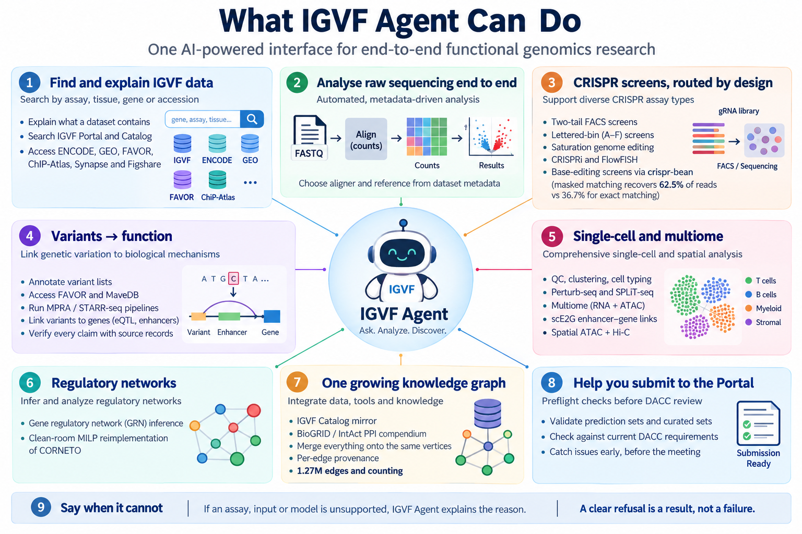

[](https://github.com/zhouhufeng/IGVFagent/actions/workflows/tests.yml)
[](LICENSE)
[](pyproject.toml)
[](Docs/Guide/skills/README.md)
[](Docs/Guide/skills/README.md)
[](Benchmarks/README.md)
[](https://igvfagent.genohub.org)
[](Docs/Guide/README.md)
[](https://github.com/zhouhufeng/IGVFagent/commits/main)
[](https://igvf.org/)

An **auditable, local-execution** AI agent for discovering, retrieving and
analysing data from the [IGVF](https://igvf.org/) ecosystem (Portal, Catalog,
Knowledge Graph) and related public resources (ENCODE, GEO, FAVOR and more),
with a built-in **Plan → Action → Results → Evaluation** loop.

> **"Local" means tool execution, not inference.** Skills run as subprocesses
> on your machine and all files stay in the project folder. With a hosted model
> backend the prompt, including tool output the agent has read, still goes to
> the provider, and data access contacts public archives under every backend.
> See [`Docs/THREAT_MODEL.md`](Docs/THREAT_MODEL.md).


**Contents:** [What it can do](#what-igvf-agent-can-do) ·
[Try it online](#-try-it-online--no-install-required) ·
[Quick start](#quick-start) · [How it works](#how-it-works) ·
[Skills](#skills) · [Documentation](#documentation) ·
[What's new](Docs/Guide/whats-new.md) · [Citing and licence](#citing-and-licence)

## What IGVF Agent can do

**Ask in plain language; it picks the method, runs it, and shows its
working.** 121 skills and 614 typed tools, hosted or installed locally.



- **Find and explain IGVF data** — search the Portal and Catalog by assay,
  tissue, gene or accession; say what a dataset actually contains before you
  download it; pull ENCODE, GEO, FAVOR, ChIP-Atlas, Synapse and Figshare too.
  Given an accession, it first walks the Portal's links to the processed
  results and QC that already exist, and returns to raw reads only when they
  are missing.
- **Analyse raw sequencing end to end** — FASTQ → counts → result, with the
  aligner and reference chosen from the dataset's own metadata rather than
  assumed.
- **CRISPR screens, routed by design not by title** — two-tail FACS screens,
  lettered-bin (A–F) screens, saturation genome editing, CRISPRi, FlowFISH,
  and **base-editing screens** via [crispr-bean](https://github.com/pinellolab/crispr-bean)'s
  masked matching (which recovers **62.5%** of reads where exact matching gets
  36.7%), handing off to the real `bean` binary for its Bayesian model.
- **Variants → function** — annotate lists, reach FAVOR and MaveDB, run
  MPRA/STARR-seq pipelines, link variants to genes through eQTL and enhancer
  evidence, and verify every claim against the record it came from.
- **Single-cell and multiome** — QC, clustering, cell typing, perturb-seq,
  SPLiT-seq, multiome, scE2G enhancer–gene links, spatial ATAC + Hi-C.
- **Enhancer–gene linkage** — ABC, ENCODE-rE2G and scE2G, benchmarked
  against CRISPR, eQTL and GWAS gold standards, with QC and Portal submission.
- **Regulatory networks** — GRN inference and a clean-room MILP
  reimplementation of CORNETO over the local warehouses.
- **One growing knowledge graph** — the IGVF Catalog mirror, a
  BioGRID/IntAct protein-interaction compendium and everything a session
  learns, merged onto the **same** vertices with per-edge provenance:
  about **2M edges** on the hosted instance and counting.
- **Help you submit to the Portal** — preflight your prediction sets and
  curated sets against the checks the monthly DACC meetings keep raising,
  before the meeting does.
- **Say when it cannot** — an unsupported assay, a revoked input, a model
  that needs a field IGVF does not publish. Refusing with a reason is treated
  as a result, not a failure.

Every run writes its files to the project folder, records which tool produced
what, and reports failed tool calls.

**Video demos:**
[1](https://www.youtube.com/watch?v=EQVwIEa-gVg) ·
[2](https://www.youtube.com/watch?v=c-CyIEArEK8) ·
[3](https://youtu.be/DXmzSbrZC7E) ·
[4](https://youtu.be/OnZuOhwh4Qc)

| | |
|---|---|
| [](https://www.youtube.com/watch?v=EQVwIEa-gVg) | [](https://www.youtube.com/watch?v=c-CyIEArEK8) |
| [](https://youtu.be/DXmzSbrZC7E) | [](https://youtu.be/OnZuOhwh4Qc) |

## 🌐 Try it online — no install required

**<https://igvfagent.genohub.org>**

A hosted IGVFagent runs on the project's
[Hcloud](https://github.com/zhouhufeng/HCloud) allocation and API key: no
install and no API key of your own. Sign in with a
[Genohub community forum](https://discussion.genohub.org/) account; access
needs approval, so email
[hufengzhou@g.harvard.edu](mailto:hufengzhou@g.harvard.edu) to request it.

| | Hosted | Local install |
|---|---|---|
| Setup | none | `pip install -e '.[all]'` |
| LLM cost | paid by the project | your own API key, or free via Ollama |
| Model | Claude Opus 5.5 by default; Sonnet 5, Haiku 4.5 and Fable 5.1 selectable | any backend: Anthropic, OpenAI, Ollama, vLLM, … |
| Run length | capped per turn | uncapped |
| Chat history | private to your account | private to you |
| Knowledge graph | shared: grows from everyone's work | yours |
| Your own data | not for anything unpublished or sensitive | stays on your machine |

> 🔒 **Your chat history is private to your account.** Only you can see,
> search or recall your past questions and answers, and the data viewers show
> only runs from your own sessions (or from projects someone shares with you).
> What everyone shares is the **IGVF integrated knowledge graph**: facts drawn
> from public sources accumulate there for all users.
>
> ⚠️ The server is still one machine with one disk, and the agent's
> file-reading tool is not yet limited per account, so do not upload
> unpublished or sensitive data; install locally for private work. Details:
> [The browser UI, accounts and history](Docs/Guide/web-ui.md#projects-and-permanent-history).

Heavy or long-running analyses (full multiome pipelines, large downloads) are
better run locally; see [Quick start](#quick-start). Operators: deployment
details are in [`Deploy/README.md`](Deploy/README.md) and
[Operating the hosted deployment](Docs/Guide/deployment.md).

## Quick start

```bash
git clone https://github.com/zhouhufeng/IGVFagent.git
cd IGVFagent
python3 -m venv .venv && source .venv/bin/activate
python3 -m pip install -e '.[ui,llm,analysis]'
cp .env.example .env              # optional: credentials and overrides

igvfagent ui                                        # browser UI at http://127.0.0.1:8501
igvfagent ask "What has IGVF already computed for IGVFDS9875NBZW?"
igvfagent kg gene APOE                              # one skill directly, no LLM
```

Without an API key the agent uses a local Ollama model; set
`ANTHROPIC_API_KEY` (or another provider's key) for a hosted model.
pipx and Docker installs, configuration and the smoke test:
[Installation and first run](Docs/Guide/installation.md). Choosing a model:
[LLM backends](Docs/Guide/llm-backends.md).

## How it works

IGVFagent has its **own orchestrator**, a Plan → Action → Results loop with an
Evaluation step that cross-checks findings, and it is **CLI-first**: every
capability is an `igvfagent <skill> <subcommand>` command that writes files
and prints their paths. So there are two ways to drive the same skills:

| Mode | Who drives the loop | Best for |
|---|---|---|
| Internal orchestrator | IGVFagent's own agent (`igvfagent ask`, the web UI) | multi-step analyses with branching and evidence checks |
| External orchestrator | Claude Code, Codex, your own harness, or a shell script | scripted pipelines, CI, day-to-day shell use |

More: [Architecture](Docs/Guide/architecture.md), including the
[repository layout](Docs/Guide/architecture.md#repository-layout).

## Skills

| Area | Examples |
|---|---|
| [Finding and retrieving data](Docs/Guide/skills/portal-and-data-access.md) | `processed lineage`, `explain`, `portal`, `catalog`, `geo`, `synapse`, `chipatlas`, `ref` |
| [Variants and variant effects](Docs/Guide/skills/variants.md) | `variant-list`, `advanced-variant`, `ccre`, `mavedb`, `sge`, `calibrate` |
| [Single-cell, multiome and spatial](Docs/Guide/skills/single-cell.md) | `sc-analyze`, `multiome`, `splitseq`, `share`, `igvf-sc-pipeline`, `spatial-hic` |
| [CRISPR screens and Perturb-seq](Docs/Guide/skills/crispr-and-perturbation.md) | `crispr-screen`, `bean`, `flowfish`, `crispr-pipeline`, `sceptre-igvf`, `tf-perturb` |
| [Enhancer–gene linkage (E2G)](Docs/Guide/skills/enhancer-gene.md) | `abc-pipeline`, `encode-re2g`, `sce2g-pipeline`, `eqtl-enrich`, `gwas-e2g`, `e2g-qc-predictions` |
| [MPRA and STARR-seq](Docs/Guide/skills/mpra-starr.md) | `oligo`, `mpraflow`, `mpralib`, `starrseq`, `scqers` |
| [Bulk genomics, RNA-seq and proteomics](Docs/Guide/skills/bulk-genomics-proteomics.md) | `encode`, `rnaseq`, `proteomics` |
| [Knowledge graph, warehouse and networks](Docs/Guide/skills/knowledge-graph.md) | `kg`, `kg-mirror`, `kg-integrate`, `warehouse`, `network` |

Every skill with a one-line description: the [skill index](Docs/Guide/skills/README.md#all-skills).
Add your own without touching the core: [Extending IGVFagent](Docs/Guide/extending.md).

**Validated against published results.** A [reproducibility benchmark
suite](Docs/Guide/benchmarks.md) re-runs analyses from more than twenty-five
recent papers on their public data and scores each against machine-readable
checks ([dashboard](Benchmarks/README.md)).

## Documentation

| | |
|---|---|
| **Use it** | [Installation](Docs/Guide/installation.md) · [Browser UI, accounts and history](Docs/Guide/web-ui.md) · [Long-running jobs](Docs/Guide/jobs.md) · [Reproducing a paper](Docs/Guide/paper-reproduction.md) · [LLM backends](Docs/Guide/llm-backends.md) · [Skills](Docs/Guide/skills/README.md) |
| **Understand it** | [Architecture](Docs/Guide/architecture.md) · [Benchmarks](Docs/Guide/benchmarks.md) · [Security](Docs/Guide/security.md) · [Threat model](Docs/THREAT_MODEL.md) · [Evaluation](Docs/EVALUATION.md) |
| **Extend or run it** | [Extending IGVFagent](Docs/Guide/extending.md) · [Operating the hosted deployment](Docs/Guide/deployment.md) · [Server setup](Deploy/README.md) · [Accounts and sign-in](Docs/AUTH.md) |
| **Provenance** | [References and attribution](Docs/Guide/references.md) · [Pinned upstream projects](Docs/Guide/references.md#pinned-upstream-projects) · [What's new](Docs/Guide/whats-new.md) |

The full index is [`Docs/Guide/README.md`](Docs/Guide/README.md).

## Citing and licence

IGVFagent builds on many open pipelines and methods papers. Each ported skill
names its source repository, licence and pinned commit; see
[References and attribution](Docs/Guide/references.md). If you spot a missing
or incorrect attribution, please open an issue.

Questions and bug reports: [discussion.genohub.org](https://discussion.genohub.org/).

Licensed under the Apache License, Version 2.0; see [LICENSE](LICENSE).
Copyright 2026 Hufeng Zhou.
